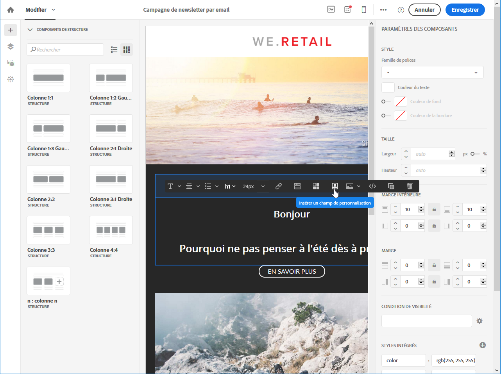
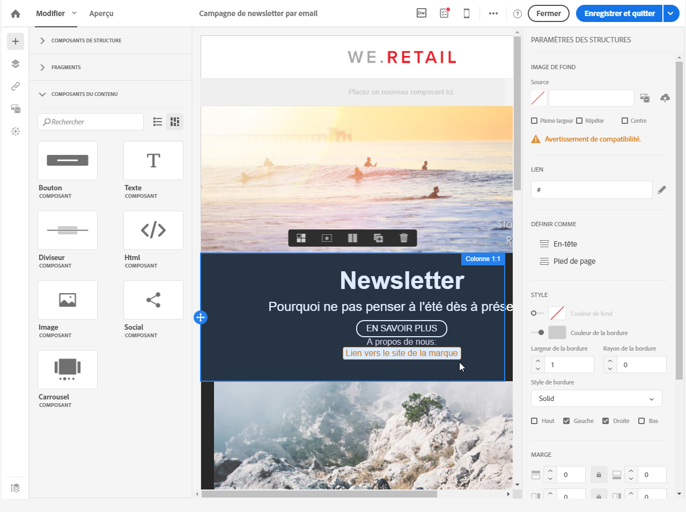
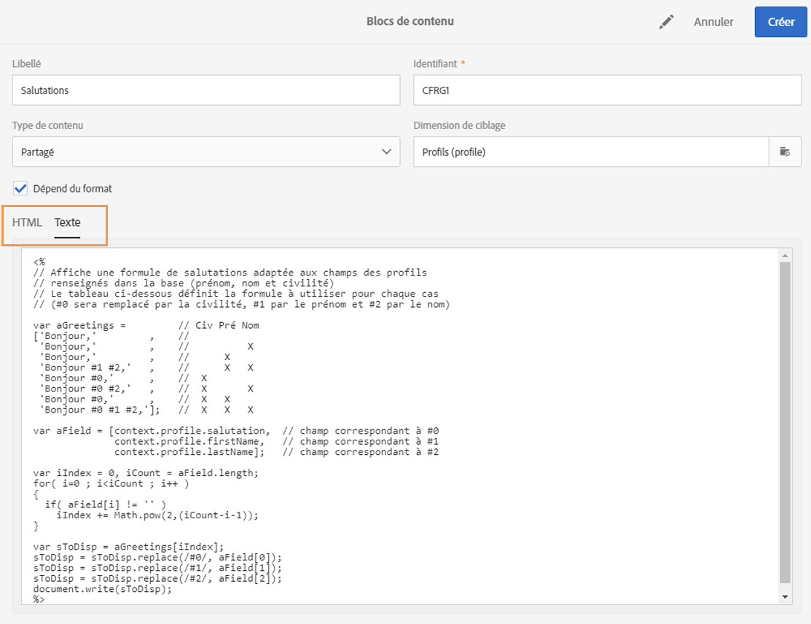
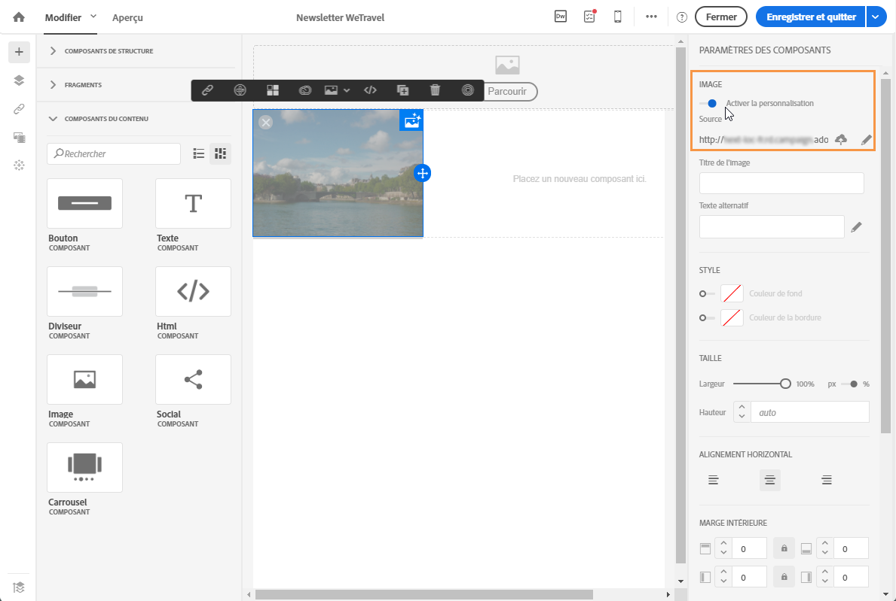
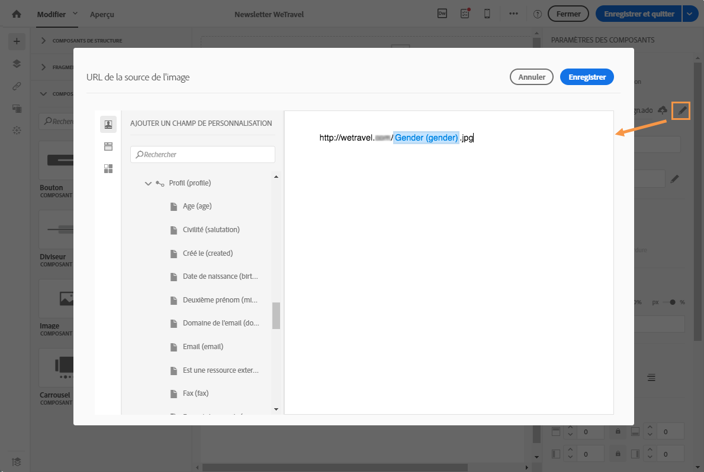
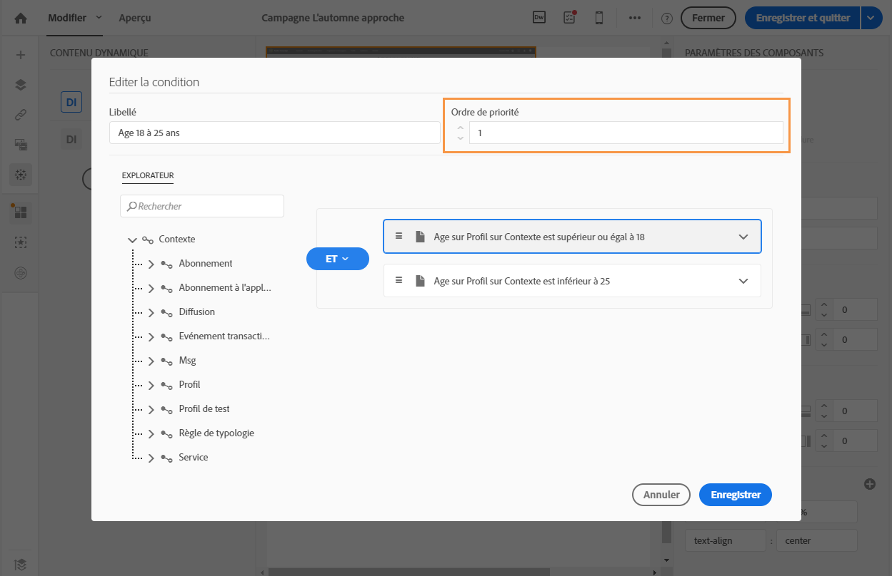
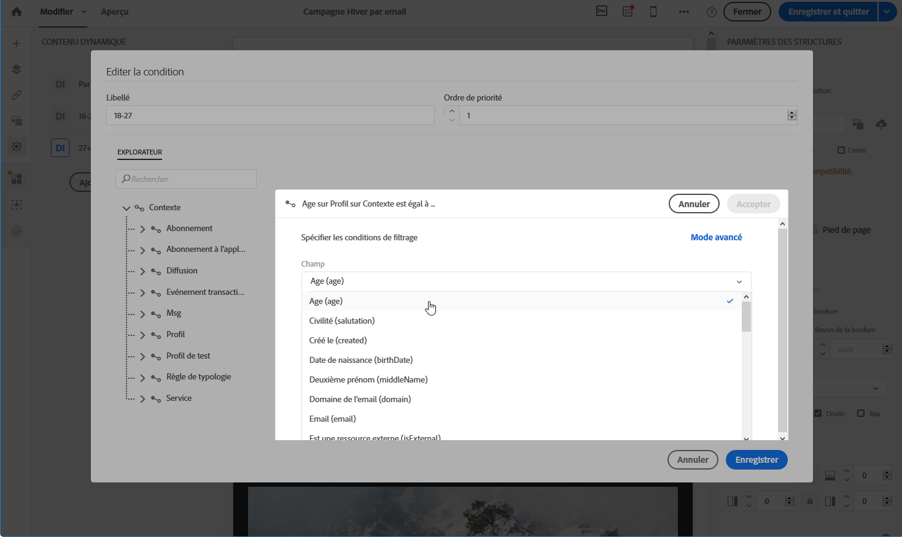
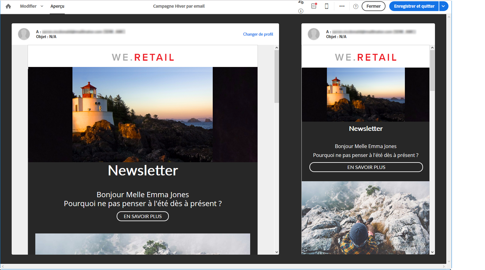

# Personnalisation du contenu des courriers électroniques {#personalization}

Le contenu et l'affichage des messages diffusés par Adobe Campaign peuvent être personnalisés de plusieurs façons différentes. Celles-ci peuvent être combinées selon des critères qui sont fonction des profils. En général, Adobe Campaign vous permet d’effectuer les opérations suivantes :

* Insérer des champs de personnalisation dynamiques. See [Inserting a personalization field](#inserting-a-personalization-field).
* Insérer des blocs de personnalisation prédéfinis. See [Adding a content block](#adding-a-content-block).
* Personnaliser l'expéditeur d'un email. See [Personalizing the sender](#personalizing-the-sender).
* Personnaliser l'objet d'un email. See [Personalizing the subject line of an email](../../designing/using/subject-line.md#defining-the-subject-line-of-an-email).
* Créer du contenu conditionnel. Voir [Définir du contenu dynamique dans un email](#defining-dynamic-content-in-an-email)

## Personnaliser l'expéditeur {#personalizing-the-sender}

Pour définir le nom de l'expéditeur qui apparaîtra dans l'en-tête des messages, accédez à l'onglet **[!UICONTROL Propriétés]** de la page d'accueil du Concepteur d'email (accessible par le biais de l'icône Accueil). Voir à ce sujet [Définition de l'expéditeur d'un email](../../designing/using/subject-line.md#email-sender)

Vous pouvez modifier le nom de l’expéditeur en cliquant sur le bloc du nom **de l’** expéditeur. Le champ devient alors modifiable et vous pouvez entrer le nom que vous souhaitez utiliser.

Ce champ peut être personnalisé. Pour ce faire, vous pouvez ajouter des champs de personnalisation, des blocs de contenu et du contenu dynamique en cliquant sur les icônes sous le nom de l’expéditeur.

>[!NOTE]
>
>Les paramètres d’en-tête ne doivent pas être vides. L'adresse de l'expéditeur est obligatoire pour permettre l'envoi d'un email (norme RFC). Adobe Campaign effectue une vérification syntaxique des adresses email saisies.

## Personnaliser une URL{#personalizing-urls}

Adobe Campaign vous permet de personnaliser une ou plusieurs URL dans votre message, en insérant des champs de personnalisation, des blocs de contenu ou du contenu dynamique à la suite de celles-ci. Pour cela :

1. Insérez une URL externe et spécifiez ses paramètres. See [Inserting a link](../../designing/using/links.md#inserting-a-link).
1. S’il n’est pas affiché, cliquez sur le crayon en regard de l’URL sélectionnée dans le volet Paramètres pour accéder aux options de personnalisation.
1. Ajoutez les champs de personnalisation, les blocs de contenu et le contenu dynamique que vous souhaitez utiliser.

   

1. Enregistrez vos modifications.

>[!NOTE]
>
>Les URL personnalisées ne peuvent pas être appliquées au nom de domaine ni à l’extension d’URL. Un message d'erreur s'affiche lors de l'analyse du message si la personnalisation n'est pas correcte. Lors de la sélection d’un bloc de contenu, vous n’êtes pas autorisé à sélectionner des éléments tels que **Lien vers la page** miroir. Ce type de blocs est interdit dans un lien.

## Insertion d'un champ de personnalisation{#inserting-a-personalization-field}

Adobe Campaign vous permet d’insérer dans votre page un champ de la base de données, tel que le prénom du profil.

>[!NOTE]
>
>Les images ci-dessous montrent comment insérer un champ de personnalisation à l’aide du Concepteur [de](../../designing/using/overview.md) messagerie pour un courrier électronique.

Pour ajouter un champ de personnalisation au contenu :

1. Cliquez dans un bloc de texte. Cliquez ensuite sur l'icône **[!UICONTROL Personnaliser]** dans la barre d'outils contextuelle et sélectionnez **[!UICONTROL Insérer un champ de personnalisation]**. Pour plus d’informations sur l’interface de Designer d’e-mail, voir [cette section](../../designing/using/overview.md#email-designer-interface).

   

1. Sélectionnez le champ à insérer dans le contenu de votre page.

   

1. Cliquez sur **[!UICONTROL Confirmer]**.

Le nom du champ s’affiche dans l’éditeur et est mis en surbrillance.

Une fois la personnalisation générée (lors de la prévisualisation et de la préparation du courrier électronique, par exemple), ce champ est remplacé par la valeur correspondant au profil ciblé.

>[!NOTE]
>
>Si l'email est créé depuis un workflow, les données additionnelles calculées dans le workflow sont aussi disponibles dans les champs de personnalisation. Pour plus d’informations sur l’ajout de données supplémentaires à partir d’un processus, voir la section [Enrichissement des données](../../automating/using/targeting-data.md#enriching-data) .

## Ajouter un bloc de contenu{#adding-a-content-block}

Adobe Campaign propose une liste de blocs de contenu préconfigurés. Ces blocs de contenu sont dynamiques, personnalisés et présentent un rendu spécifique. Par exemple, vous pouvez ajouter un message de bienvenue ou un lien vers la page miroir.

>[!NOTE]
>
>Les images ci-dessous montrent comment insérer un bloc de contenu à l’aide du Concepteur [de](../../designing/using/overview.md) messagerie pour un courrier électronique.

Pour ajouter un bloc de contenu :

1. Cliquez dans un bloc de texte. Cliquez ensuite sur l'icône **[!UICONTROL Personnaliser]** dans la barre d'outils contextuelle et sélectionnez **[!UICONTROL Insérer un bloc de contenu]**. Pour plus d’informations sur l’interface de Designer d’e-mail, voir [cette section](../../designing/using/overview.md#email-designer-interface).

   

1. Sélectionnez le bloc de contenu à insérer. Les blocs disponibles varient selon le contexte (courriel ou page d’entrée).

   

1. Cliquez sur **[!UICONTROL Enregistrer]**.

Le nom du bloc de contenu s’affiche dans l’éditeur et est surligné en jaune. Il s’adapte automatiquement au profil lorsque la personnalisation est générée.

Les blocs de contenu prêts à l’emploi sont les suivants :

* **[!UICONTROL URL de base dans les emails (EmailUrlBase)]** : ce bloc de contenu ne peut être utilisé que dans une **diffusion**.
* **[!UICONTROL URL de la page miroir (MirrorPageUrl)]** : ce bloc de contenu ne peut être utilisé que dans une **diffusion**.
* **[!UICONTROL Lien vers la page miroir (MirrorPage)]** : ce bloc de contenu ne peut être utilisé que dans une **diffusion**.
* **[!UICONTROL Salutations (Greetings)]**
* **[!UICONTROL Lien de désabonnement (UnsubscriptionLink)]** : ce bloc de contenu ne peut être utilisé que dans une **diffusion**.
* **[!UICONTROL Liens de partage vers réseaux sociaux (LandingPageViralLinks)]** : ce bloc de contenu ne peut être utilisé que dans une **landing page**.
* **[!UICONTROL Nom de l'expéditeur par défaut (DefaultSenderName)]** : ce bloc de contenu ne peut être utilisé que dans une **diffusion**.
* **[!UICONTROL Nom de l'adresse email de réponse par défaut (DefaultReplyName)]** : ce bloc de contenu ne peut être utilisé que dans une **diffusion**.
* **[!UICONTROL Adresse email de l'expéditeur par défaut (DefaultSenderAddress)]** : ce bloc de contenu ne peut être utilisé que dans une **diffusion**.
* **[!UICONTROL Adresse email des erreurs par défaut (DefaultErrorAddress)]** : ce bloc de contenu ne peut être utilisé que dans une **diffusion**.
* **[!UICONTROL Adresse email de réponse par défaut (DefaultReplyAddress)]** : ce bloc de contenu ne peut être utilisé que dans une **diffusion**.
* **[!UICONTROL Nom de la marque (BrandingUsualName)]**
* **[!UICONTROL Lien vers le site de la marque (BrandingWebSiteLink)]**
* **[!UICONTROL Logo de la marque (BrandingLogo)]**
* **[!UICONTROL Style de notification (notificationStyle)]**

### Créer des blocs de contenu personnalisés {#creating-custom-content-blocks}

Vous pouvez définir de nouveaux blocs de contenu qui seront insérés dans un message ou une page d’entrée.

Pour créer un bloc de contenu, respectez les étapes suivantes :

1. Cliquez sur **[!UICONTROL Ressources &gt; Blocs de contenu]** depuis le menu avancé pour accéder à la liste des blocs de contenu.
1. Cliquez sur le bouton **[!UICONTROL Créer]** ou dupliquez un bloc de contenu déjà existant.

   

1. Saisissez un libellé.
1. Choisissez le **[!UICONTROL Type de contenu du bloc]**. Trois options sont disponibles :

   * **[!UICONTROL Partagé]** : le bloc de contenu peut être utilisé dans une diffusion ou une landing page.
   * **[!UICONTROL Diffusion]** : le bloc de contenu ne peut être utilisé que dans une diffusion.
   * **[!UICONTROL Landing page]** : le bloc de contenu ne peut être utilisé que dans une landing page.
   

1. Vous pouvez sélectionner une **[!UICONTROL Dimension de ciblage]**. Voir à ce propos la section [A propos de la dimension de ciblage](#about-targeting-dimension).

   

1. Sélectionnez éventuellement l'option **[!UICONTROL Dépend du format]** pour définir deux blocs distincts : un pour les emails au format HTML et un autre pour les emails au format texte. Deux onglets seront alors affichés dans la section inférieure de cet éditeur (HTML et Texte) pour définir les contenus correspondants.

   

1. Saisissez le contenu du ou des blocs de contenu, et cliquez sur le bouton **[!UICONTROL Créer]**.

Votre bloc de contenu est désormais utilisable dans l'éditeur de contenu d'un message ou d'une landing page.

>[!CAUTION]
>
>Lorsque vous éditez le contenu d'un bloc, vérifiez qu'aucun espace blanc ne se trouve entre le début et la fin de vos instructions *if*. Dans le code HTML, les espaces blancs s'affichent à l'écran ; ils auront donc un impact sur la présentation de votre contenu.

### A propos de la dimension de ciblage {#about-targeting-dimension}

La dimension de ciblage permet de définir dans quel type de message vous pouvez utiliser le bloc de contenu. Cela permet d’éviter d’utiliser des blocs inappropriés dans un message, ce qui peut entraîner des erreurs.

En effet, lorsque vous modifiez un message, vous ne pouvez sélectionner que des blocs de contenu avec une dimension de ciblage compatible avec la dimension de ciblage de ce message.

Par exemple, la dimension de ciblage du bloc **[!UICONTROL Lien de désabonnement]** est **[!UICONTROL Profils]**, car elle contient des champs de personnalisation spécifiques à la ressource **[!UICONTROL Profils]**. Par conséquent, vous ne pouvez pas utiliser de bloc **[!UICONTROL Lien de désabonnement]** dans un [message transactionnel basé sur un événement](../../channels/using/event-transactional-messages.md), car la dimension de ciblage de ce type de message est **[!UICONTROL Evénements temps réel]**. Vous pouvez toutefois utiliser un bloc **Lien de désabonnement** dans un [message transactionnel basé sur un profil](../../channels/using/profile-transactional-messages.md), car la dimension de ciblage de ce type de message est **Profils**. Enfin, le bloc **[!UICONTROL Lien vers la page miroir]** ne comporte pas de dimension de ciblage. Vous pouvez donc l'utiliser dans n'importe quel message.

Si vous laissez ce champ vide, le bloc de contenu sera compatible avec tous les messages, quelle que soit la dimension de ciblage. Si vous définissez une dimension de ciblage, ce bloc sera uniquement compatible avec les messages qui ont la même dimension de ciblage.

Voir à ce sujet [Dimensions de ciblage et ressources](../../automating/using/query.md#targeting-dimensions-and-resources).

**Rubriques connexes :**

* [Insertion d'un champ de personnalisation](#inserting-a-personalization-field)
* [Ajouter un bloc de contenu](#adding-a-content-block)
* [Définir du contenu dynamique dans un email](#defining-dynamic-content-in-an-email)

## Personnaliser la source d'une image{#personalizing-an-image-source}

Adobe Campaign vous permet de personnaliser une ou plusieurs images de votre message selon un critère particulier ou d’utiliser le suivi. Pour ce faire, vous devez insérer des champs de personnalisation, des blocs de contenu ou du contenu dynamique dans la source d’image. Pour cela :

1. Insérez une image dans le contenu de votre message ou sélectionnez une image déjà présente.
1. Dans la palette des propriétés de l'image, cochez l'option **[!UICONTROL Activer la personnalisation]**.

   

   Le champ **[!UICONTROL Source]** s'affiche et l'image sélectionnée est indiquée comme **personnalisée** dans l'éditeur.

1. Cliquez sur le crayon situé en regard du bouton du champ **[!UICONTROL Source]** pour accéder aux options de personnalisation.
1. Après avoir ajouté la source d’image, ajoutez les champs de personnalisation, les blocs de contenu et le contenu dynamique que vous souhaitez.

   

   >[!NOTE]
   >
   >Le nom de domaine (http://mydomain.com) ne peut pas être personnalisé, il doit être saisi manuellement. Le reste de l’URL peut être personnalisé. par exemple http://mydomain.com/`[Gender]`.jpg

1. Validez vos modifications.

## Contenu conditionnel {#conditional-content}

### Définir une condition de visibilité{#defining-a-visibility-condition}

Vous pouvez spécifier une condition de visibilité sur n'importe quel élément. Cet élément ne sera visible que si la condition de visibilité est respectée.

Pour ajouter une condition de visibilité, sélectionnez un bloc et saisissez la condition à remplir dans le champ **[!UICONTROL Condition de visibilité]** de ses paramètres.

Cette option est disponible uniquement pour les éléments suivants : ADRESSE, BLOCKQUOTE, CENTER, DIR, DIV, DL, FIELDSET, FORM, H1, H2, H3, H4, H5, H6, NOSCRIPT, OL, P, PRE, UL, TR, TD.

L’éditeur d’expression est présenté dans la section Modification [des expressions](../../automating/using/editing-queries.md#about-query-editor) avancées.

Ces conditions adoptent la syntaxe des expressions XTK (par ex : **context.profile.email !=''** ou **context.profile.status='0'**). Par défaut, tous les champs sont visibles.

>[!NOTE]
>
>Une condition ne peut pas être définie pour un bloc qui contient déjà un sous-élément avec un contenu dynamique ou un bloc qui constitue déjà un contenu dynamique. Les blocs dynamiques non visibles tels que les listes déroulantes ne peuvent pas être modifiés.

### Définir du contenu dynamique dans un email{#defining-dynamic-content-in-an-email}

Dans un email, vous pouvez définir différents contenus qui s'afficheront de manière dynamique aux destinataires selon les conditions définies au moyen de l'éditeur d'expression. Par exemple, à partir d’un même courrier électronique, vous pouvez vous assurer que chaque profil reçoit un message différent selon son âge.

La définition du contenu dynamique diffère de la [définition des conditions](#defining-a-visibility-condition)de visibilité.

1. Sélectionnez un fragment, un composant ou un élément. Dans cet exemple, sélectionnez une image.
1. Cliquez sur l'icône **[!UICONTROL Contenu dynamique]** dans la barre d'outils contextuelle.

   

   La section **[!UICONTROL Contenu dynamique]** s'affiche dans la palette de gauche.

   

   Par défaut, cette section contient deux éléments : la variante par défaut et une nouvelle variante.

   >[!NOTE]
   >
   >Le contenu doit toujours comporter une variante par défaut. Vous ne pouvez pas le supprimer.

1. Cliquez sur le bouton **[!UICONTROL Editer]** pour définir les conditions d'affichage de la première variante.

   

1. Indiquez un libellé et sélectionnez les champs que vous souhaitez définir comme conditions. Par exemple, dans le nœud **[!UICONTROL Général]**, sélectionnez le champ **]Age[!UICONTROL **.

   

1. Définissez les conditions de filtrage. Par exemple, vous souhaitez qu’un contenu différent s’affiche pour les personnes âgées de 18 à 25 ans.

   

1. Une fois toutes les conditions définies, définissez l’ordre de priorité dans lequel la condition sera appliquée et enregistrez vos modifications.

   

   Les contenus s'affichent par ordre de priorité dans la palette, de haut en bas. For more on priorities, refer to [this section](#defining-dynamic-content-in-an-email).

1. Téléchargez une nouvelle image pour la variante que vous venez de définir.

   

   Les destinataires âgés de 18 à 25 ans verront la nouvelle image.

   

1. Cliquez sur **[!UICONTROL Ajouter une condition]** pour ajouter un nouveau contenu et sa règle associée.

   

   Par exemple, vous pouvez ajouter une image différente à afficher pour les personnes âgées de 26 à 35 ans.

1. Procédez de la même manière pour tout autre élément de votre email que vous souhaitez afficher de manière dynamique. Il peut s’agir de texte, de bouton, de fragment, etc. Enregistrez vos modifications.

>[!CAUTION]
>
>Une fois votre message préparé, testez-le à l'aide d'un bon à tirer avant de l'envoyer. Si vous ne le faites pas, il se peut que certaines erreurs ne soient pas détectées et que le courrier électronique ne soit pas envoyé.

**Rubriques connexes :**

* [Envoyer un bon à tirer](../../sending/using/managing-test-profiles-and-sending-proofs.md#sending-proofs)
* [Edition avancée d'expressions](../../automating/using/editing-queries.md#about-query-editor)

### Ordre de priorité {#order-of-priority}

Lorsque vous définissez un contenu dynamique dans l'éditeur d'expression, l'ordre de priorité est défini de la manière suivante :

1. Vous définissez deux contenus dynamiques différents avec **deux conditions** différentes, par exemple :

   **** Condition 1 : le sexe du profil est masculin,

   **** Condition 2 : le profil a entre 20 et 30 ans.

   

   Certains profils de votre base de données correspondent aux deux conditions, mais un seul courrier électronique avec un contenu dynamique peut être envoyé.

1. Vous devez donc définir la priorité du contenu dynamique. Une condition avec un ordre de priorité de **1** (et donc le contenu dynamique correspondant) sera envoyée à un profil même si une autre condition dont l’ordre de priorité est **2** ou **3** est également satisfaite par ce profil.

   

Vous ne pouvez définir qu’un seul ordre de priorité par contenu dynamique.

## Exemple : personnalisation d'un email{#example-email-personalization}

Dans cet exemple, un membre de l’équipe du service marketing a créé un courrier électronique pour informer certains de ses clients qu’une offre spéciale leur est réservée. Le membre de l'équipe a décidé de personnaliser le courriel selon l'âge des clients. Les clients âgés de 18 à 27 ans recevront un e-mail contenant une image et un slogan différents à ceux des clients âgés de plus de 27 ans.

Le courrier électronique est créé comme suit :

* Le contenu dynamique est appliqué à l’image et ces contenus dynamiques sont configurés selon la tranche d’âge.

   

   L’ajout et la configuration de contenu dynamique sont détaillés dans la section [Définition de contenu dynamique d’un courrier électronique](#defining-dynamic-content-in-an-email) .

* Les champs de personnalisation et le contenu dynamique sont appliqués au texte. Selon la tranche d’âge du profil, le courrier électronique commence par le prénom du profil ou par le titre et le nom du profil.

   

   L'ajout et le paramétrage de champs de personnalisation sont présentés dans la section [Insertion d'un champ de personnalisation](#inserting-a-personalization-field).

### Paramétrer les illustrations {#configuring-images}

Dans cet exemple, le contenu dynamique appliqué aux images est configuré comme suit :

**Pour cibler les jeunes de 18 à 27 ans :**

1. Sélectionnez le contenu dynamique dans la palette **[!UICONTROL Propriétés]** et cliquez sur le bouton **[!UICONTROL Editer]**.

   

1. Editez son libellé puis sélectionnez le champ **[!UICONTROL Age]** depuis le nœud **[!UICONTROL Profil]**.

   

1. Sélectionnez l'opérateur **Supérieur ou égal à** puis entrez **18** pour créer l'expression **égal ou plus de 18 ans**.

   

1. Ajoutez une nouvelle condition **[!UICONTROL Age]**.

   Sélectionnez l’opérateur **Inférieur ou égal à** suivi de 27 dans le champ de valeur pour créer l’expression **inférieure à 27** .

   

1. Validez vos modifications.

**Pour cibler les profils de 27 ans et plus :**

1. Sélectionnez le contenu dynamique dans la palette et modifiez-le.
1. Editez son libellé puis sélectionnez le champ **[!UICONTROL Age]** depuis le nœud **[!UICONTROL Profil]**.
1. Ajoutez l’opérateur **Supérieur à** suivi de 27 dans le champ de valeur pour créer l’expression **Supérieur à 27** .

   

1. Validez vos modifications.

Votre contenu dynamique est correctement configuré.

### Paramétrer le texte {#configuring-text}

Dans cet exemple, le contenu dynamique appliqué aux textes est configuré comme suit :

**Pour cibler des profils âgés de 18 à 27 ans :**

1. Sélectionnez le composant de structure souhaité et ajoutez un contenu dynamique.
1. Modifiez le contenu dynamique et configurez les expressions de ciblage. Reportez-vous à [Configuration des images](#configuring-images).
1. Dans le composant de structure, à l'emplacement désiré, cliquez sur l'icône **[!UICONTROL Personnaliser]** depuis la barre d'outils contextuelle et sélectionnez **[!UICONTROL Insérer un champ de personnalisation]**.

   

1. Dans la liste qui s'affiche à l'écran, sélectionnez le champ **[!UICONTROL Prénom]** et validez.

   

1. Votre champ de personnalisation est parfaitement inséré dans le contenu dynamique sélectionné.

**Pour cibler les profils de 27 ans et plus :**

1. Sélectionnez le composant de structure souhaité et ajoutez un contenu dynamique.
1. Modifiez le contenu dynamique et configurez les expressions de ciblage. Reportez-vous à [Configuration des images](#configuring-images).
1. Dans le composant de structure, à l'emplacement désiré, cliquez sur l'icône **[!UICONTROL Personnaliser]** depuis la barre d'outils contextuelle et sélectionnez **[!UICONTROL Insérer un champ de personnalisation]**.
1. Dans la liste déroulante, sélectionnez le champ **[!UICONTROL Civilité]**.
1. Procédez de la même manière pour ajouter le champ **[!UICONTROL Nom]**.

   

Vos champs de personnalisation sont correctement insérés dans le contenu dynamique choisi.

### Prévisualiser l'email {#previewing-emails}

La prévisualisation permet de vérifier que les champs de personnalisation et les contenus dynamiques sont paramétrés correctement avant d'envoyer les **[!UICONTROL Bons à tirer]**. Pendant l’aperçu, vous pouvez sélectionner différents profils de test correspondant aux cibles de courrier électronique.

Sans profils de test, le courrier électronique qui s’affiche par défaut est :

Le slogan ne contient pas de champs de personnalisation dans le courrier électronique et l’image par défaut est utilisée.

Le premier profil de test correspond à un client âgé de 18 à 27 ans. En sélectionnant ce profil, le courrier électronique suivant s’affiche :

Le champ de personnalisation correspondant à l’expression de 18 à 27 ans, en particulier le prénom du profil, est correctement configuré et l’image a également changé en fonction du profil.

Le deuxième profil correspond à un client âgé de plus de 27 ans et génère le courrier électronique suivant :

L'image a changé grâce au contenu dynamique, et le slogan qui apparaît est le slogan plus formel défini pour ce public ciblé.

**Rubriques connexes :**

* [Création d'une audience](../../audiences/using/creating-audiences.md)
* [Préparer l'envoi](../../sending/using/preparing-the-send.md)

