# Personnalisation du contenu des emails {#personalization}

Le contenu et l&#39;affichage des messages diffusés par Adobe Campaign peuvent être personnalisés de plusieurs façons différentes. Celles-ci peuvent être combinées selon des critères qui sont fonction des profils. En règle générale, Adobe Campaign permet d&#39;effectuer les opérations suivantes :

* Insérer des champs de personnalisation dynamiques. Voir [Insertion d&#39;un champ de personnalisation](#inserting-a-personalization-field).
* Insérer des blocs de personnalisation prédéfinis. Voir [Ajouter un bloc de contenu](#adding-a-content-block).
* Personnaliser l&#39;expéditeur d&#39;un email. Voir [Personnaliser l&#39;expéditeur](#personalizing-the-sender).
* Personnaliser l&#39;objet d&#39;un email. Voir [Personnaliser l’objet d’un email](../../designing/using/subject-line.md#subject-line).
* Créer du contenu conditionnel. Voir [Définir du contenu dynamique dans un email](#defining-dynamic-content-in-an-email).

## Personnaliser l&#39;expéditeur {#personalizing-the-sender}

Pour définir le nom de l&#39;expéditeur qui apparaîtra dans l&#39;en-tête des messages, accédez à l&#39;onglet **[!UICONTROL Propriétés]** de la page d&#39;accueil du Concepteur d&#39;email (accessible par le biais de l&#39;icône Accueil). Voir à ce sujet [Définition de l&#39;expéditeur d&#39;un email](../../designing/using/subject-line.md#email-sender).

Vous pouvez changer le nom de l’expéditeur en cliquant sur le bloc **Nom de l’expéditeur**. Le champ devient éditable et vous pouvez y inscrire le nom que vous souhaitez.

Le champ peut être personnalisé. Pour cela, vous pouvez ajouter des champs de personnalisation, des blocs de contenu et du contenu dynamique en cliquant sur les icônes situées sous le nom de l’expéditeur.

>[!NOTE]
>
>Les paramètres d’en-tête ne doivent pas être vides. L’adresse de l’expéditeur est obligatoire pour permettre l’envoi d’un email (norme RFC). Adobe Campaign effectue une vérification syntaxique des adresses email saisies.

## Personnaliser une URL{#personalizing-urls}

Adobe Campaign vous permet de personnaliser une ou plusieurs URL dans votre message, en insérant des champs de personnalisation, des blocs de contenu ou du contenu dynamique à la suite de celles-ci. Pour cela :

1. Insérez une URL externe et renseignez ses paramètres. Voir [Insérer un lien](../../designing/using/links.md#inserting-a-link).
1. S&#39;ils ne s&#39;affichent pas, cliquez sur le crayon en regard de l&#39;URL sélectionnée dans le volet Paramètres pour accéder aux options de personnalisation.
1. Ajoutez les champs de personnalisation, blocs de contenus et contenus dynamiques souhaités.

   

1. Enregistrez vos modifications.

>[!NOTE]
>
>La personnalisation des URL ne peut se faire ni sur le nom de domaine, ni sur l&#39;extension. Un message d&#39;erreur s&#39;affiche lors de l&#39;analyse du message si la personnalisation n&#39;est pas correcte. Lorsque vous sélectionnez un bloc de contenu, vous n&#39;êtes pas autorisé à sélectionner des éléments comme **Lien vers la page miroir**. Ce type de bloc est interdit dans un lien.

## Insertion d&#39;un champ de personnalisation{#inserting-a-personalization-field}

Adobe Campaign vous permet d&#39;insérer dans votre page un champ provenant de la base de données, par exemple le prénom du profil.

>[!NOTE]
>
>Les images ci-après illustrent l&#39;insertion d&#39;un champ de personnalisation à l&#39;aide du [Concepteur d&#39;email](../../designing/using/designing-content-in-adobe-campaign.md).

Pour ajouter un champ de personnalisation au contenu :

1. Cliquez dans un bloc de texte. Cliquez ensuite sur l&#39;icône **[!UICONTROL Personnaliser]** dans la barre d&#39;outils contextuelle et sélectionnez **[!UICONTROL Insérer un champ de personnalisation]**. Pour plus d&#39;informations sur l&#39;interface du Concepteur d&#39;email, consultez [cette section](../../designing/using/designing-content-in-adobe-campaign.md#email-designer-interface).

   

1. Sélectionnez le champ à insérer dans le contenu de votre page.

   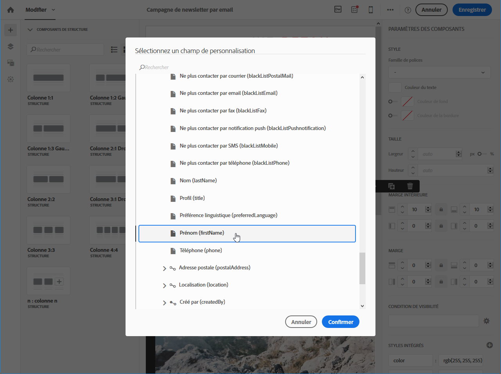

1. Cliquez sur **[!UICONTROL Confirmer]**.

Le nom du champ apparaît dans l&#39;éditeur et est surligné.

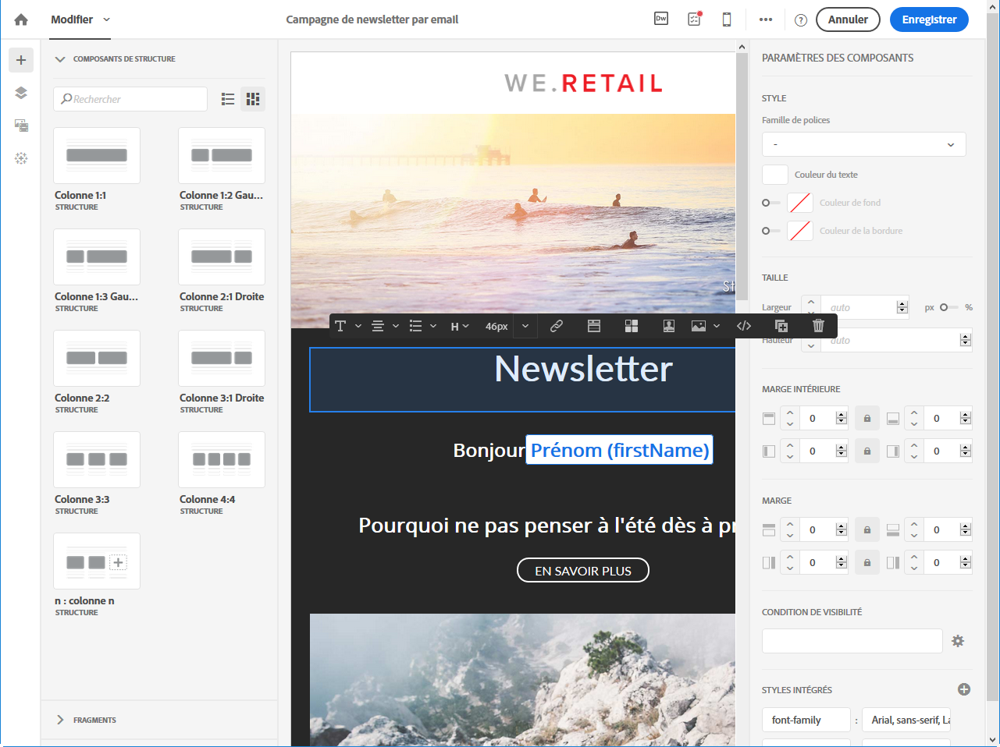

Une fois la personnalisation générée (lors de la prévisualisation et de la préparation de l&#39;email, par exemple), ce champ est remplacé par la valeur qui correspond au profil ciblé.

>[!NOTE]
>
>Si l&#39;email est créé depuis un workflow, les données additionnelles calculées dans le workflow sont aussi disponibles dans les champs de personnalisation. Pour plus d&#39;informations sur l&#39;ajout de données additionnelles depuis un workflow, consultez la section [Enrichir les données](../../automating/using/about-targeting-activities.md#enriching-data).

## Ajouter un bloc de contenu{#adding-a-content-block}

Adobe Campaign propose une liste de blocs de contenus pré-paramétrés. Ces blocs de contenu sont dynamiques, personnalisés et possèdent un rendu spécifique. Vous pouvez par exemple ajouter un message de salutations ou un lien vers la page miroir.

>[!NOTE]
>
>Les images ci-après illustrent l&#39;insertion d&#39;un bloc de contenu à l&#39;aide du [Concepteur d&#39;email](../../designing/using/designing-content-in-adobe-campaign.md).

Pour ajouter un bloc de contenu :

1. Cliquez dans un bloc de texte. Cliquez ensuite sur l&#39;icône **[!UICONTROL Personnaliser]** dans la barre d&#39;outils contextuelle et sélectionnez **[!UICONTROL Insérer un bloc de contenu]**. Pour plus d&#39;informations sur l&#39;interface du Concepteur d&#39;email, consultez [cette section](../../designing/using/designing-content-in-adobe-campaign.md#email-designer-interface).

   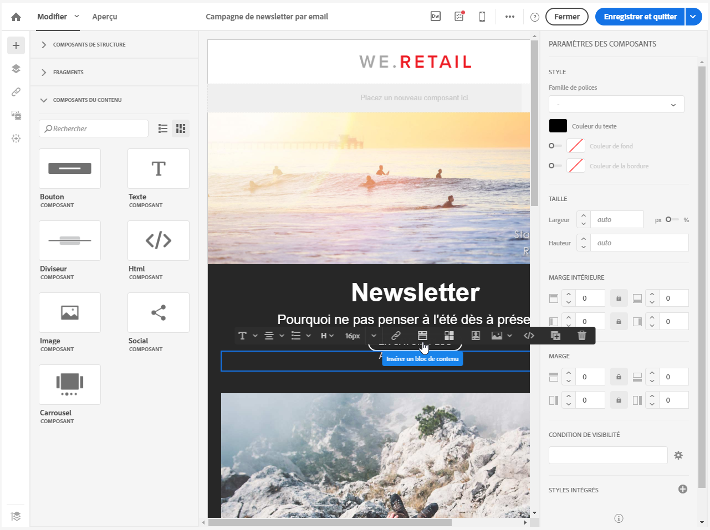

1. Sélectionnez le bloc de contenu que vous souhaitez insérer. Les blocs disponibles varient en fonction du contexte (email ou landing page).

   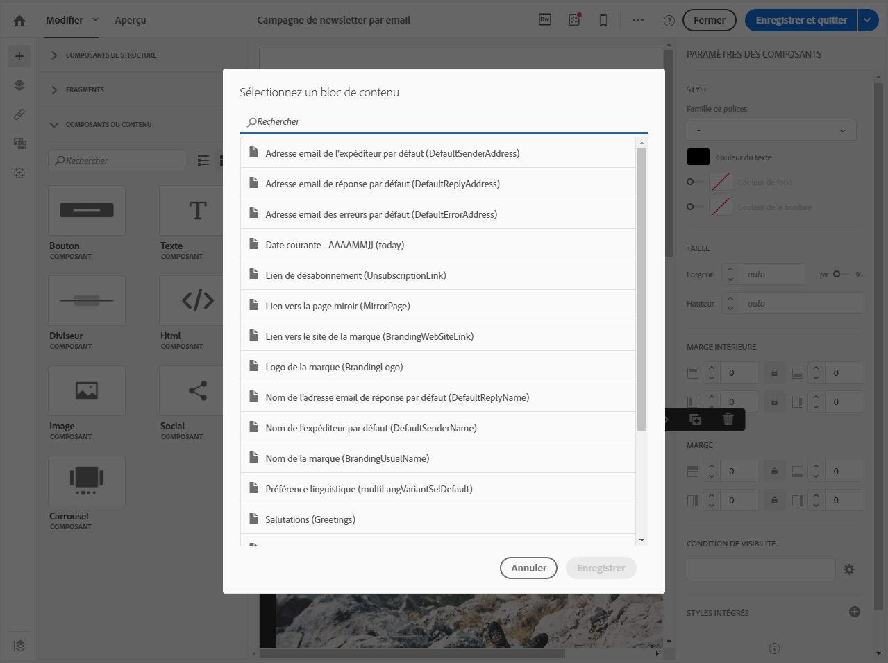

1. Cliquez sur **[!UICONTROL Enregistrer]**.

Le nom du bloc de contenu apparaît dans l&#39;éditeur. Celui-ci est surligné en jaune. Il sera automatiquement adapté au profil lors de la génération de la personnalisation.

Les blocs de contenu d&#39;usine sont les suivants :

* **[!UICONTROL URL de base dans les emails (EmailUrlBase)]** : ce bloc de contenu ne peut être utilisé que dans une **diffusion**.
* **[!UICONTROL URL de la page miroir (MirrorPageUrl)]** : ce bloc de contenu ne peut être utilisé que dans une **diffusion**.
* **[!UICONTROL Lien vers la page miroir (MirrorPage)]** : ce bloc de contenu ne peut être utilisé que dans une **diffusion**.
* **[!UICONTROL Salutations (Greetings)]**
* **[!UICONTROL Lien de désabonnement (UnsubscriptionLink)]** : ce bloc de contenu ne peut être utilisé que dans une **diffusion**.
* **[!UICONTROL Liens de partage vers réseaux sociaux (LandingPageViralLinks)]** : ce bloc de contenu ne peut être utilisé que dans une **landing page**.
* **[!UICONTROL Nom de l&#39;expéditeur par défaut (DefaultSenderName)]** : ce bloc de contenu ne peut être utilisé que dans une **diffusion**.
* **[!UICONTROL Nom de l&#39;adresse email de réponse par défaut (DefaultReplyName)]** : ce bloc de contenu ne peut être utilisé que dans une **diffusion**.
* **[!UICONTROL Adresse email de l&#39;expéditeur par défaut (DefaultSenderAddress)]** : ce bloc de contenu ne peut être utilisé que dans une **diffusion**.
* **[!UICONTROL Adresse email des erreurs par défaut (DefaultErrorAddress)]** : ce bloc de contenu ne peut être utilisé que dans une **diffusion**.
* **[!UICONTROL Adresse email de réponse par défaut (DefaultReplyAddress)]** : ce bloc de contenu ne peut être utilisé que dans une **diffusion**.
* **[!UICONTROL Nom de la marque (BrandingUsualName)]**
* **[!UICONTROL Lien vers le site de la marque (BrandingWebSiteLink)]**
* **[!UICONTROL Logo de la marque (BrandingLogo)]**
* **[!UICONTROL Style de notification (notificationStyle)]**

### Créer des blocs de contenu personnalisés {#creating-custom-content-blocks}

Vous pouvez définir de nouveaux blocs de contenu qui pourront être insérés dans un message ou une landing page.

Pour créer un bloc de contenu, respectez les étapes suivantes :

1. Cliquez sur **[!UICONTROL Ressources > Blocs de contenu]** depuis le menu avancé pour accéder à la liste des blocs de contenu.
1. Cliquez sur le bouton **[!UICONTROL Créer]** ou dupliquez un bloc de contenu déjà existant.

   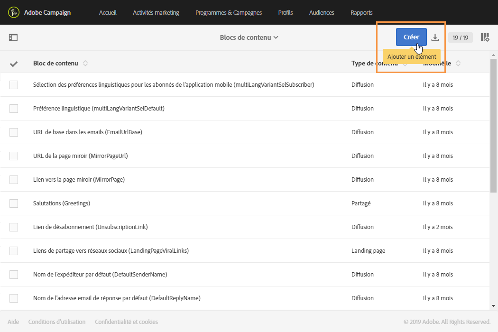

1. Saisissez un libellé.
1. Choisissez le **[!UICONTROL Type de contenu du bloc]**. Trois options sont disponibles :

   * **[!UICONTROL Partagé]** : le bloc de contenu peut être utilisé dans une diffusion ou une landing page.
   * **[!UICONTROL Diffusion]** : le bloc de contenu ne peut être utilisé que dans une diffusion.
   * **[!UICONTROL Landing page]** : le bloc de contenu ne peut être utilisé que dans une landing page.

   

1. Vous pouvez sélectionner une **[!UICONTROL Dimension de ciblage]**. Voir à ce propos la section [A propos de la dimension de ciblage](#about-targeting-dimension).

   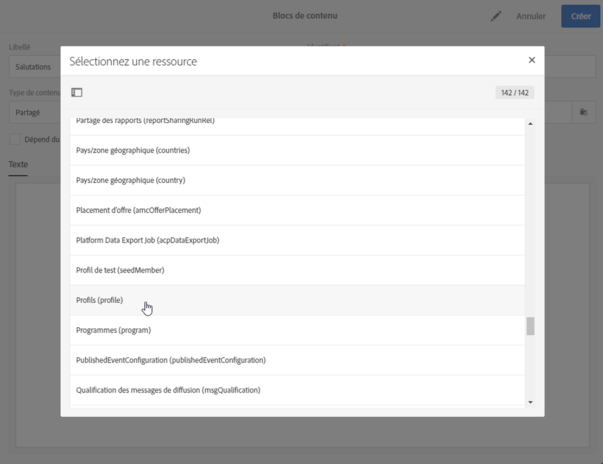

1. Sélectionnez éventuellement l&#39;option **[!UICONTROL Dépend du format]** pour définir deux blocs distincts : un pour les emails au format HTML et un autre pour les emails au format texte. Deux onglets seront alors affichés dans la section inférieure de cet éditeur (HTML et Texte) pour définir les contenus correspondants.

   

1. Saisissez le contenu du ou des blocs de contenu, et cliquez sur le bouton **[!UICONTROL Créer]**.

Votre bloc de contenu est désormais utilisable dans l&#39;éditeur de contenu d&#39;un message ou d&#39;une landing page.

>[!CAUTION]
>
>Lorsque vous éditez le contenu d&#39;un bloc, vérifiez qu&#39;aucun espace blanc ne se trouve entre le début et la fin de vos instructions *if*. Dans le code HTML, les espaces blancs s&#39;affichent à l&#39;écran ; ils auront donc un impact sur la présentation de votre contenu.

### A propos de la dimension de ciblage          {#about-targeting-dimension}

La dimension de ciblage permet de définir dans quel type de message vous pouvez utiliser le bloc de contenu. Cela permet d&#39;éviter d&#39;utiliser des blocs inadéquats dans un message, ce qui peut entraîner des erreurs.

En effet, lors de l&#39;édition d&#39;un message, vous ne pouvez sélectionner que des blocs de contenu avec une dimension de ciblage compatible avec celle du message.

Par exemple, la dimension de ciblage du bloc **[!UICONTROL Lien de désabonnement]** est **[!UICONTROL Profils]**, car elle contient des champs de personnalisation spécifiques à la ressource **[!UICONTROL Profils]**. Par conséquent, vous ne pouvez pas utiliser de bloc **[!UICONTROL Lien de désabonnement]** dans un [message transactionnel basé sur un événement](../../channels/using/getting-started-with-transactional-msg.md#transactional-message-types), car la dimension de ciblage de ce type de message est **[!UICONTROL Evénements temps réel]**. Vous pouvez toutefois utiliser un bloc **Lien de désabonnement** dans un [message transactionnel basé sur un profil](../../channels/using/getting-started-with-transactional-msg.md#transactional-message-types), car la dimension de ciblage de ce type de message est **Profils**. Enfin, le bloc **[!UICONTROL Lien vers la page miroir]** ne comporte pas de dimension de ciblage. Vous pouvez donc l&#39;utiliser dans n&#39;importe quel message.

Si vous laissez ce champ vide, le bloc de contenu sera compatible avec tous les messages, quelle que soit la dimension de ciblage. Si vous définissez une dimension de ciblage, ce bloc ne sera compatible qu&#39;avec les messages ayant la même dimension de ciblage.

Voir à ce sujet [Dimensions de ciblage et ressources](../../automating/using/query.md#targeting-dimensions-and-resources).

**Rubriques connexes :**

* [Insertion d’un champ de personnalisation](#inserting-a-personalization-field)
* [Ajouter un bloc de contenu](#adding-a-content-block)
* [Définir du contenu dynamique dans un email](#defining-dynamic-content-in-an-email)

## Personnaliser la source d&#39;une image{#personalizing-an-image-source}

Adobe Campaign vous permet de personnaliser une ou plusieurs images dans votre message en fonction d&#39;un critère particulier, ou afin d&#39;utiliser le tracking, en insérant des champs de personnalisation, des blocs de contenu ou du contenu dynamique dans la source de l&#39;image. Pour cela :

1. Insérez une image dans le contenu de votre message, ou sélectionnez une image déjà présente.
1. Dans la palette des propriétés de l&#39;image, cochez l&#39;option **[!UICONTROL Activer la personnalisation]**.

   

   Le champ **[!UICONTROL Source]** s&#39;affiche et l&#39;image sélectionnée est indiquée comme **personnalisée** dans l&#39;éditeur.

1. Cliquez sur le crayon situé en regard du bouton du champ **[!UICONTROL Source]** pour accéder aux options de personnalisation.
1. Ajoutez les champs de personnalisation, blocs de contenu et contenus dynamiques souhaités, à la suite de la source de l&#39;image.

   

   >[!NOTE]
   >
   >Le nom de domaine (http://mondomaine.com) ne peut pas être personnalisé ; il doit être saisi manuellement. Le reste de l&#39;URL est personnalisable, par exemple http://mydomain.com/`[Gender]`.jpg

1. Validez vos modifications.

## Contenu conditionnel {#conditional-content}

### Définir une condition de visibilité{#defining-a-visibility-condition}

Vous pouvez spécifier une condition de visibilité sur n&#39;importe quel élément. Cet élément ne sera visible que si la condition de visibilité est respectée.

Pour ajouter une condition de visibilité, sélectionnez un bloc et saisissez la condition à remplir dans le champ **[!UICONTROL Condition de visibilité]** de ses paramètres.

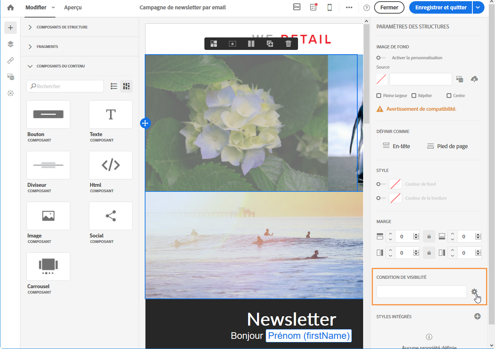

Cette option est uniquement proposée pour les éléments suivants : ADDRESS, BLOCKQUOTE, CENTER, DIR, DIV, DL, FIELDSET, FORM, H1, H2, H3, H4, H5, H6, NOSCRIPT, OL, P, PRE, UL, TR, TD.

L&#39;éditeur d&#39;expression est présenté dans la section [Edition avancée d&#39;expressions](../../automating/using/editing-queries.md#about-query-editor).

Ces conditions adoptent la syntaxe des expressions XTK (par ex : **context.profile.email !=&#39;&#39;** ou **context.profile.status=&#39;0&#39;**). Par défaut, tous les champs sont visibles.

>[!NOTE]
>
>Il n&#39;est pas possible de définir une condition pour un bloc comprenant déjà un sous-élément avec un contenu dynamique ou un bloc faisant déjà partie d&#39;un contenu dynamique. Les blocs dynamiques non visibles, tels que les menus déroulants, ne peuvent être édités.

### Définir du contenu dynamique dans un email{#defining-dynamic-content-in-an-email}

>[!CONTEXTUALHELP]
>id="ac_dynamic_content"
>title="Définir un contenu dynamique"
>abstract="Définissez différents contenus qui seront affichés pour certains profils uniquement en fonction des conditions que vous définirez."

Dans un email, vous pouvez définir différents contenus qui s&#39;afficheront de manière dynamique aux destinataires selon les conditions définies au moyen de l&#39;éditeur d&#39;expression. Vous pouvez par exemple, à partir du même email, faire en sorte que chaque profil reçoive un message différent selon sa tranche d&#39;âge.

La définition du contenu dynamique est différente de la [définition des conditions de visibilité](#defining-a-visibility-condition).

1. Sélectionnez un fragment, un composant ou un élément. Dans cet exemple, sélectionnez une image.
1. Cliquez sur l&#39;icône **[!UICONTROL Contenu dynamique]** dans la barre d&#39;outils contextuelle.

   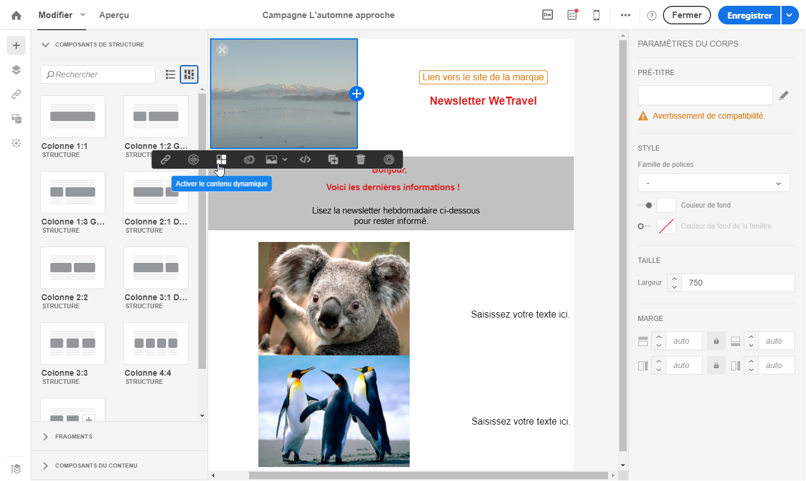

   La section **[!UICONTROL Contenu dynamique]** s&#39;affiche dans la palette de gauche.

   

   Par défaut, cette section contient deux éléments : la variante par défaut et une nouvelle variante.

   >[!NOTE]
   >
   >Le contenu doit être toujours associé à une variante par défaut. Vous ne pouvez pas la supprimer.

1. Cliquez sur le bouton **[!UICONTROL Editer]** pour définir les conditions d&#39;affichage de la première variante.

   

1. Indiquez un libellé et sélectionnez les champs que vous souhaitez définir comme conditions. Par exemple, dans le nœud **[!UICONTROL Général]**, sélectionnez le champ **** Age.

   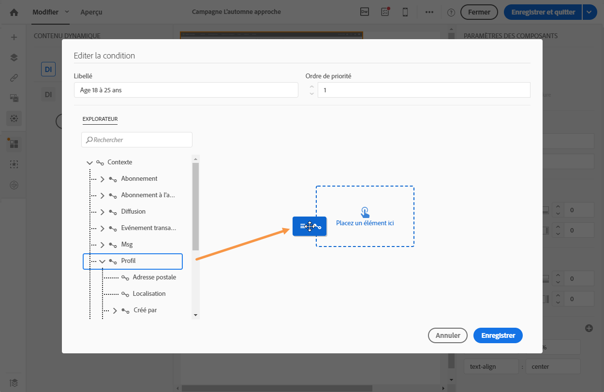

1. Définissez les conditions de filtrage. Par exemple, vous souhaitez qu&#39;un contenu différent soit affiché pour les personnes de 18 à 25 ans.

   

1. Une fois que toutes les conditions sont définies, définissez l&#39;ordre de priorité dans lequel la condition sera appliquée et enregistrez vos modifications.

   

   Les contenus s&#39;affichent par ordre de priorité dans la palette, de haut en bas. Pour plus d&#39;informations sur les priorités, consultez [cette section](#defining-dynamic-content-in-an-email).

1. Téléchargez une nouvelle image pour la variante que vous venez de définir.

   

   Les destinataires âgés de 18 à 25 ans verront la nouvelle image.

   

1. Cliquez sur **[!UICONTROL Ajouter une condition]** pour ajouter un nouveau contenu et sa règle associée.

   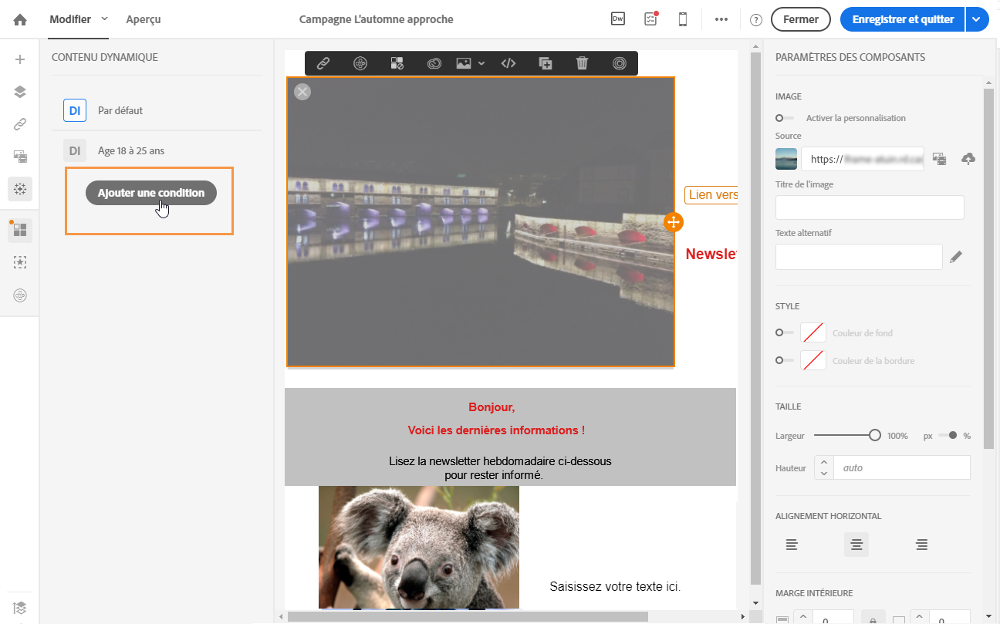

   Par exemple, vous ajouter une image différente qui sera affichée pour les personnes de 26 à 35 ans.

1. Procédez de la même manière pour tout autre élément de votre email que vous souhaitez afficher de manière dynamique. Il peut s&#39;agir d&#39;un texte, d&#39;un bouton, d&#39;un fragment, etc. Enregistrez vos modifications.

>[!CAUTION]
>
>Une fois votre message préparé, testez-le à l&#39;aide d&#39;un bon à tirer avant de l&#39;envoyer. Si vous ne le faites pas, certaines erreurs risquent de ne pas être détectées et l&#39;email pourrait ne pas être envoyé.

**Rubriques connexes :**

* [Envoyer un bon à tirer](../../sending/using/sending-proofs.md)
* [Edition avancée d&#39;expressions](../../automating/using/editing-queries.md#about-query-editor)

### Ordre de priorité          {#order-of-priority}

Lorsque vous définissez un contenu dynamique dans l&#39;éditeur d&#39;expression, l&#39;ordre de priorité est défini de la manière suivante :

1. Vous définissez deux contenus dynamiques différents avec **deux conditions différentes**, comme par exemple :

   **Condition 1 :** le genre du profil est masculin,

   **Condition 2 :** le profil a entre 20 et 30 ans.

   

   Des profils de votre base de données seront éligibles aux deux conditions mais un seul email avec un seul contenu dynamique peut être envoyé.

1. Vous devez donc définir la priorité des contenus dynamiques. Une condition avec un ordre de priorité **1** (et donc le contenu dynamique correspondant) sera envoyée à un profil même si ce dernier est en adéquation avec une condition dont l&#39;ordre de priorité est **2** ou **3**.

   

Vous ne pouvez définir qu&#39;un ordre de priorité par contenu dynamique.

## Exemple : personnalisation d&#39;un email{#example-email-personalization}

Dans cet exemple, une personne du service marketing a créé un email pour faire part à certains de ses clients qu&#39;une offre promotionnelle leur est destinée. Il a été décidé de personnaliser l&#39;email en fonction de l&#39;âge des clients. Entre 18 et 27 ans, ils recevront un email contenant une illustration et une accroche différentes des clients âgés de plus de 27 ans.

L&#39;email est donc créé comme suit :

* des contenus dynamiques sont appliqués sur l&#39;illustration et paramétrés en fonction de l&#39;âge.

   

   L&#39;insertion et le paramétrage des contenus dynamiques sont décrits dans la section [Définir le contenu dynamique dans un email](#defining-dynamic-content-in-an-email).

* des champs de personnalisation et des contenus dynamiques sont appliqués sur le texte. En fonction de l&#39;âge, l&#39;email commence par le prénom du profil, ou par sa civilité et son nom.

   

   L&#39;ajout et le paramétrage de champs de personnalisation sont présentés dans la section [Insertion d&#39;un champ de personnalisation](#inserting-a-personalization-field).

### Paramétrer les illustrations {#configuring-images}

>[!CONTEXTUALHELP]
>id="ac_dynamic_image"
>title="Gestion des images dynamiques"
>abstract="Personnalisez votre email avec des images dynamiques selon les conditions que vous définirez."

Dans cet exemple, les contenus dynamiques appliqués aux illustrations sont paramétrés comme suit :

**Pour cibler les 18-27 ans :**

1. Sélectionnez le contenu dynamique dans la palette **[!UICONTROL Propriétés]** et cliquez sur le bouton **[!UICONTROL Editer]**.

   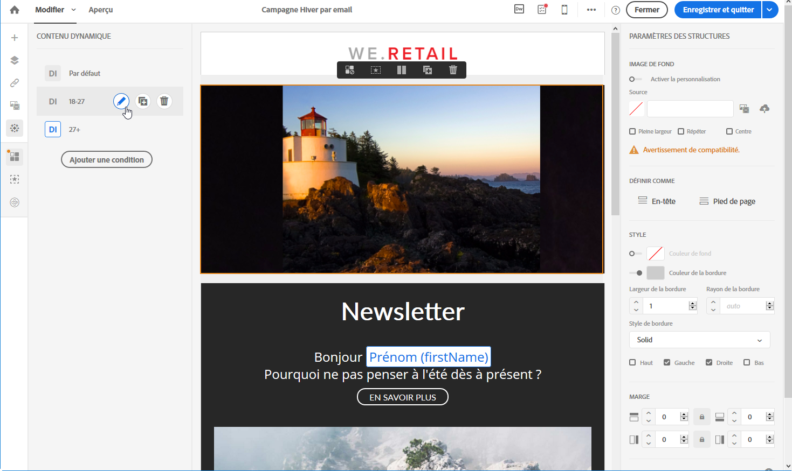

1. Modifiez son libellé puis sélectionnez le champ **[!UICONTROL Age]** depuis le nœud **[!UICONTROL Profil]**.

   

1. Sélectionnez l&#39;opérateur **Supérieur ou égal à** puis entrez **18** pour créer l&#39;expression **égal ou plus de 18 ans**.

   

1. Ajoutez une nouvelle condition **[!UICONTROL Age]**.

   Sélectionnez l&#39;opérateur **Inférieur ou égal** puis 27 pour créer l&#39;expression **égal ou moins de 27 ans**.

   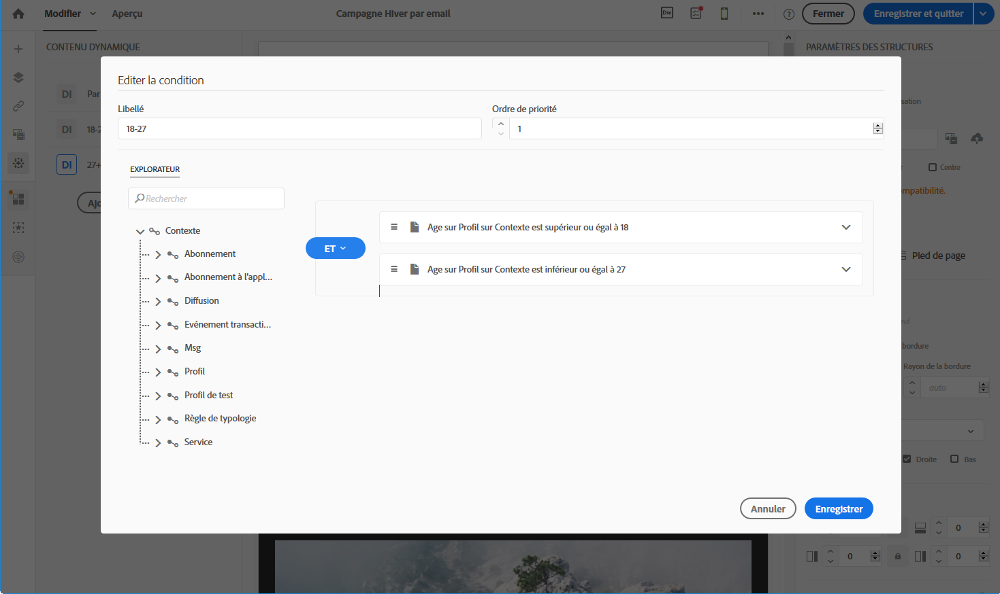

1. Validez vos modifications.

**Pour cibler les profils de plus de 27 ans :**

1. Sélectionnez le contenu dynamique depuis la palette et éditez-le.
1. Modifiez son libellé puis sélectionnez le champ **[!UICONTROL Age]** depuis le nœud **[!UICONTROL Profil]**.
1. Ajoutez l&#39;opérateur **Supérieur à** puis 27 pour créer l&#39;expression **plus de 27 ans**.

   

1. Validez vos modifications.

Vos contenus dynamiques sont correctement paramétrés.

### Paramétrer le texte          {#configuring-text}

Dans cet exemple, les contenus dynamiques appliqués aux textes sont paramétrés comme suit :

**Pour cibler les profils qui ont entre 18 et 27 ans :**

1. Sélectionnez le composant de structure voulu et ajoutez un contenu dynamique.
1. Modifiez le contenu dynamique et paramétrez les expressions de ciblage. Voir [Paramétrer les illustrations](#configuring-images).
1. Dans le composant de structure, à l&#39;emplacement désiré, cliquez sur l&#39;icône **[!UICONTROL Personnaliser]** depuis la barre d&#39;outils contextuelle et sélectionnez **[!UICONTROL Insérer un champ de personnalisation]**.

   

1. Dans la liste qui s&#39;affiche à l&#39;écran, sélectionnez le champ **[!UICONTROL Prénom]** et validez.

   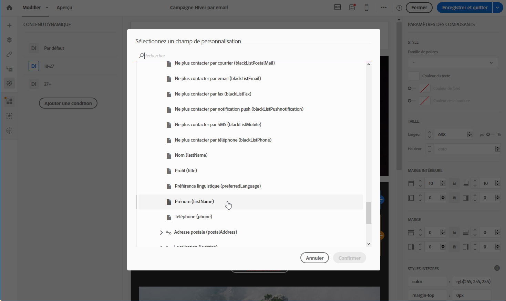

1. Votre champ de personnalisation est parfaitement inséré dans le contenu dynamique sélectionné.

**Pour cibler les profils de plus de 27 ans :**

1. Sélectionnez le composant de structure voulu et ajoutez un contenu dynamique.
1. Modifiez le contenu dynamique et paramétrez les expressions de ciblage. Voir [Paramétrer les illustrations](#configuring-images).
1. Dans le composant de structure, à l&#39;emplacement désiré, cliquez sur l&#39;icône **[!UICONTROL Personnaliser]** depuis la barre d&#39;outils contextuelle et sélectionnez **[!UICONTROL Insérer un champ de personnalisation]**.
1. Dans la liste déroulante, sélectionnez le champ **[!UICONTROL Civilité]**.
1. Procédez de la même manière pour ajouter le champ **[!UICONTROL Nom]**.

   

Vos champs de personnalisation sont correctement insérés dans le contenu dynamique choisi.

### Prévisualiser l&#39;email          {#previewing-emails}

La prévisualisation permet de vérifier que les champs de personnalisation et les contenus dynamiques sont paramétrés correctement avant d&#39;envoyer les **[!UICONTROL Bons à tirer]**. Différents profils de test qui correspondent aux cibles de l&#39;email peuvent être sélectionnés lors de la prévisualisation.

Sans profil de test, l&#39;email qui apparaît par défaut est le suivant :

L&#39;email ne propose pas de champs de personnalisation dans le texte d&#39;accroche, et l&#39;image est celle définie par défaut.

Un premier profil de test correspond aux 18-27 ans. En sélectionnant ce profil, l&#39;email suivant apparaît :

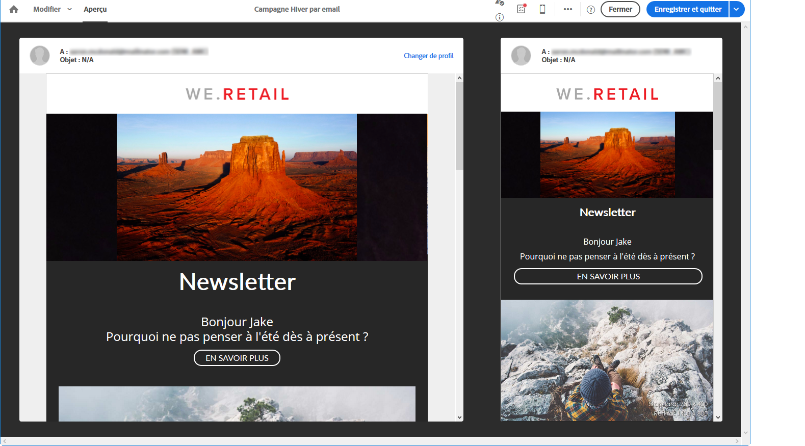

Le champ de personnalisation qui correspond aux 18-27 ans (le prénom du profil) est correctement paramétré, et l&#39;image est elle aussi modifiée en fonction du profil.

Un deuxième profil correspond aux plus de 27 ans génère l&#39;email suivant :

L&#39;image est modifiée grâce au contenu dynamique, et le texte accroche correspond à celui paramétré pour le public ciblé.

**Rubriques connexes :**

* [Création d&#39;une audience](../../audiences/using/creating-audiences.md)
* [Préparer l&#39;envoi](../../sending/using/preparing-the-send.md)

