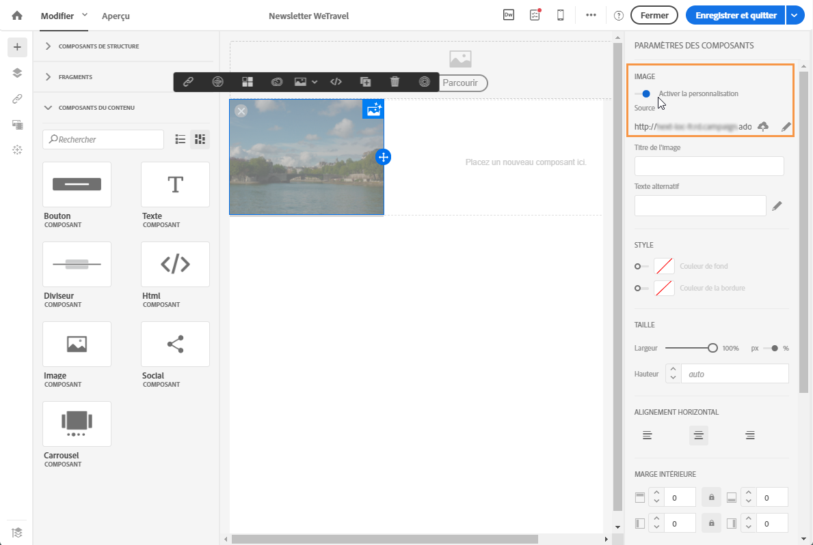
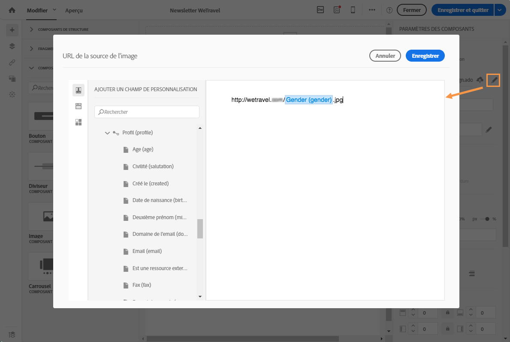

# Personnaliser la source d'une image{#personalizing-an-image-source}

Adobe Campaign vous permet de personnaliser une ou plusieurs images dans votre message en fonction d'un critère particulier, ou afin d'utiliser le tracking, en insérant des champs de personnalisation, des blocs de contenu ou du contenu dynamique dans la source de l'image. Pour cela :

1. Insérez une image dans le contenu de votre message, ou sélectionnez une image déjà présente.
1. Dans la palette des propriétés de l'image, cochez l'option **[!UICONTROL Activer la personnalisation].**

   

   Le champ **[!UICONTROL Source]** s'affiche et l'image sélectionnée est indiquée comme **personnalisée** dans l'éditeur.

1. Cliquez sur le crayon situé en regard du bouton du champ **[!UICONTROL Source]pour accéder aux options de personnalisation.**
1. Ajoutez les champs de personnalisation, blocs de contenu et contenus dynamiques souhaités, à la suite de la source de l'image.

   

   >[!NOTE]
   >
   >Le nom de domaine (http://mondomaine.com) ne peut pas être personnalisé ; il doit être saisi manuellement. Le reste de l'URL est personnalisable, For example: http://mydomain.com/`[Gender]`.jpg

1. Validez vos modifications.

