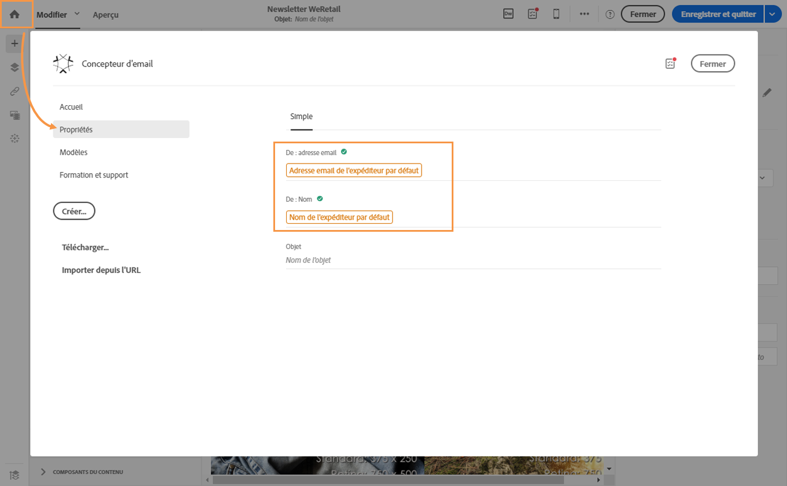

# Personnaliser l'expéditeur{#personalizing-the-sender}

## Expéditeur des emails {#email-sender}

Pour définir le nom de l'expéditeur qui apparaîtra dans l'en-tête des messages, accédez à l'onglet **[!UICONTROL Propriétés]** de la page d'accueil du Concepteur d'email (accessible par le biais de l'icône Accueil).

* Le champ **[!UICONTROL De : nom]** permet de saisir le nom de l'expéditeur. Par défaut, le bloc **Nom de l'expéditeur** par défaut est automatiquement inscrit dans le champ. Adobe Campaign se réfère à la configuration du canal email (depuis le menu avancé **[!UICONTROL Administration &gt; Canaux &gt; Email &gt; Comptes emails]** via le logo Adobe Campaign) pour désigner cet expéditeur.

   Vous pouvez changer le nom de l'expéditeur en cliquant sur le bloc **Nom de l'expéditeur**. Le champ devient éditable et vous pouvez y inscrire le nom que vous souhaitez.

   Le champ peut être personnalisé. Pour cela, vous pouvez ajouter des champs de personnalisation, des blocs de contenu et du contenu dynamique en cliquant sur les icônes situées sous le nom de l'expéditeur.

* Le champ **[!UICONTROL De : adresse email]** n'est pas éditable depuis cette section. Vous pouvez le modifier en éditant les propriétés de l'email depuis son tableau de bord. Voir à ce propos la section [Liste des paramètres avancés des emails](../../administration/using/configuring-email-channel.md#advanced-parameters).

>[!NOTE]
>
>Les paramètres d'en-tête ne doivent pas être vides. L'adresse de l'expéditeur est obligatoire pour permettre l'envoi d'un email (norme RFC). Adobe Campaign effectue une vérification syntaxique des adresses email saisies.

**Rubriques connexes :**

* [Insertion d'un champ de personnalisation](../../designing/using/inserting-a-personalization-field.md)
* [Ajouter un bloc de contenu](../../designing/using/adding-a-content-block.md)
* [Définir du contenu dynamique dans un email](../../designing/using/defining-dynamic-content-in-an-email.md)

## Expéditeur des SMS {#sms-sender}

Vous pouvez personnaliser le nom de l'expéditeur du SMS. Pour en savoir plus, consultez la section [Configuration des SMS](../../administration/using/configuring-sms-channel.md#configuring-sms-properties).
