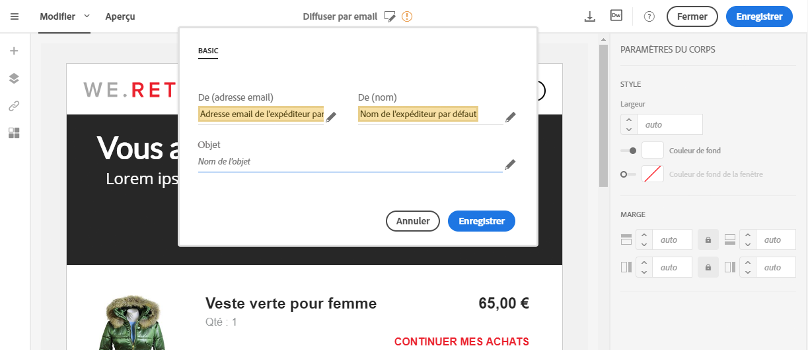
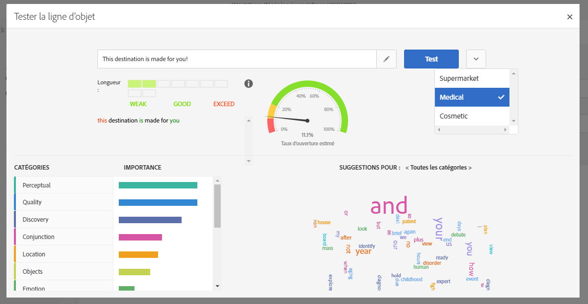

# Personnaliser l'objet d'un email{#personalizing-the-subject-line-of-an-email}

## Personnaliser l'objet d'un email {#personalizing-an-email-subject}

L'objet de l'email est obligatoire pour préparer et envoyer le message.

>[!NOTE]
>
>Si l'objet est vide, un avertissement apparaît dans le dashboard du message ainsi que dans le Concepteur d'email.

Pour configurer l'objet de l'email, accédez à l'onglet **[!UICONTROL Propriétés]** de la page d'accueil du Concepteur d'email (accessible via l'icône de maison) et remplissez la section **Objet[!UICONTROL .]**

Vous pouvez également ajouter des champs de personnalisation, des blocs de contenu et du contenu dynamique à la ligne d'objet en cliquant sur les icônes correspondantes.

**Rubriques connexes :**

* [Insertion d'un champ de personnalisation](../../designing/using/inserting-a-personalization-field.md)
* [Ajouter un bloc de contenu](../../designing/using/adding-a-content-block.md)
* [Définir du contenu dynamique dans un email](../../designing/using/defining-dynamic-content-in-an-email.md)

## Optimisation prédictive de l'objet {#predictive-subject-line}

Lors de l'édition d'un email, vous pouvez tester différents objets et obtenir une estimation de son taux d'ouverture avant l'envoi.

Cette fonctionnalité est désactivée par défaut. Elle est activée lors de l'import d'un premier modèle. Un modèle est créé à partir de jeux de données d'apprentissage spécifiques à un secteur d'activité donné. Les modèles permettent au système d'estimer le taux d'ouverture d'un email lorsqu'un nouvel objet est soumis.

>[!NOTE]
>
>Cette fonctionnalité est disponible pour les emails et les bases de données dont le contenu est en anglais uniquement. Si votre instance contient des emails dans d'autres langues, le modèle entraîné sera incohérent et donnera des résultats erronés. L'option permettant de tester un objet n'est visible que si un modèle est disponible dans votre instance.

### Tester un objet {#testing-a-subject}

Pour tester un objet, procédez comme suit :

1. Créez un email ou ouvrez un email existant.
1. Ouvrez le contenu et saisissez l'objet de l'email dans le champ de saisie prévu à cet effet.
1. Cliquez sur le bouton **[!UICONTROL Tester l'objet]** pour afficher la fenêtre **Tester la ligne d'objet.** Vous pouvez toujours éditer l'objet dans cette fenêtre.
1. Choisissez le bon modèle à prendre en compte pour la prédiction du taux d'ouverture. Plusieurs modèles sont disponibles. Chacun d'entre eux correspond à un secteur d'activité spécifique.
1. Cliquez sur **[!UICONTROL Tester]**.

Votre objet est alors analysé.

>[!NOTE]
>
>Si l'objet est trop court, il ne peut pas être analysé et un message d'erreur s'affiche.

Plusieurs indicateurs sont calculés et un ensemble d'outils s'affiche en vue de vous aider :

* **Taux d'ouverture estimé** : ce graphique donne une idée du taux d'ouverture escompté de l'email avec l'objet actuellement testé.
* **Longueur de l'objet** : cet indicateur permet de déterminer si la longueur actuelle de l'objet est correcte ou si elle doit être allongée ou raccourcie.
* **Mots en couleur** : lors du test de l'objet, les mots surlignés en vert correspondent à ceux qui contribuent le plus à l'augmentation de la prédiction du taux d'ouverture. Les mots surlignés en rouge, quant à eux, correspondent à ceux qui contribuent le moins à l'augmentation de la prédiction du taux d'ouverture. Si vous ajoutez ou supprimez des mots de l'objet, les mots surlignés changent.
* **Catégories et suggestions de mots** : la partie inférieure de la fenêtre contient plusieurs catégories pertinentes pour le modèle sélectionné. Ces catégories, triées par ordre d'importance, permettent de déterminer si l'objet contient des mots qui leur sont associés grâce à une coche. Chaque catégorie contient un ensemble de mots proposés qui peuvent être utilisés dans votre objet afin de le rendre plus pertinent et augmenter le taux d'ouverture. Ces mots correspondent à ceux qui sont le plus souvent utilisés dans une catégorie donnée.

>[!NOTE]
>
>Les champs de personnalisation et les signes de ponctuation ne sont pas pris en compte dans l'analyse de l'objet. Pour les textes dynamiques/conditionnels, toutes les variantes sont traitées comme un seul objet.

### Importer des modèles {#importing-models}

Par défaut, aucun modèle n'est exécuté sur le serveur Adobe Campaign. Deux méthodes permettent d'obtenir un modèle et d'activer la fonctionnalité :

* Vous pouvez entraîner un modèle local à partir des données des emails envoyés :

   * Si vous utilisez déjà Adobe Campaign, le modèle local sera automatiquement entraîné avec les messages que vous avez déjà envoyés.
   * Si vous utilisez Adobe Campaign pour la première fois, vous pouvez extraire de votre précédent système/fournisseur de services de messagerie un fichier CSV contenant 4 colonnes : date, subject, sent, opens. To do that, go to **[!UICONTROL Administration]** &gt; **[!UICONTROL Channels]** &gt; **[!UICONTROL Email]** &gt; **[!UICONTROL Subject Line Import]** and follow the instructions provided on the successive screens. Lorsque le téléchargement des objets est terminé, importez un modèle local en suivant la procédure qui est décrite ci-après. Le modèle local est automatiquement entraîné avec les données que vous avez téléchargées.
   * Si vous utilisez Adobe Campaign pour la première fois et si vous ne pouvez pas obtenir de fichier CSV comme décrit plus haut, vous pouvez utiliser un modèle pré-entraîné ou attendre que le système dispose de suffisamment de données de diffusion pour entraîner un modèle local. Le système détermine automatiquement si le jeu de données actuel contient suffisamment de données pour reconnaître des constantes et entraîner le modèle.

      >[!NOTE]
      >
      >Il n'y a pas de nombre défini d'objets requis pour entraîner votre propre modèle. Pour l'entraîner, les objets doivent être variés et ne pas présenter de doublons. Si les données à traiter ne sont pas suffisantes, le système ne sera pas en mesure d'entraîner le modèle. Votre instance ne peut contenir qu'un seul modèle entraîné.
   Pour entraîner un modèle local, téléchargez le fichier subjectLineTraining.xml depuis [cet emplacement](https://support.neolane.net/webApp/downloadCenter?__userConfig=psaDownloadCenter) et utilisez la fonctionnalité d'[import de package](../../automating/using/managing-packages.md) pour le charger dans votre instance Adobe Campaign. Un workflow technique entraînera automatiquement le modèle.

   The first time you want to train a model, an administrator can force the **[!UICONTROL SubjectLine Training workflow]** to start from the **[!UICONTROL Administration]** &gt; **[!UICONTROL Application settings]** &gt; **[!UICONTROL Workflows]** menu.

   Une fois un modèle téléchargé et entraîné, la fonctionnalité est automatiquement activée. Une nouvelle option apparaît alors en regard de l'objet de vos messages.

   Le workflow technique continue ensuite l'apprentissage du modèle toutes les semaines.

* Vous pouvez importer des modèles pré-entraînés qui sont spécifiques à certains secteurs d'activité (médical, etc.) à l'aide de la fonctionnalité d'[import de package](../../automating/using/managing-packages.md) Ces modèles sont disponibles [ici](https://support.neolane.net/webApp/downloadCenter?__userConfig=psaDownloadCenter) et ne peuvent pas faire l'objet d'un apprentissage.

   Une fois un modèle téléchargé, la fonctionnalité est automatiquement activée. Une nouvelle option apparaît alors en regard de l'objet de vos messages.

>[!NOTE]
>
>L'import et la génération de modèles entraînés peuvent être uniquement effectués par un administrateur.

Les modèles disponibles sont les suivants :

* Secteur cosmétique : subjectInsightCosmetic.xml
* Secteur alimentaire : subjectInsightSupermarket.xml
* Secteur médical : subjectInsightMedical.xml
* Modèle à entraîner : subjectlineTraining.xml.

