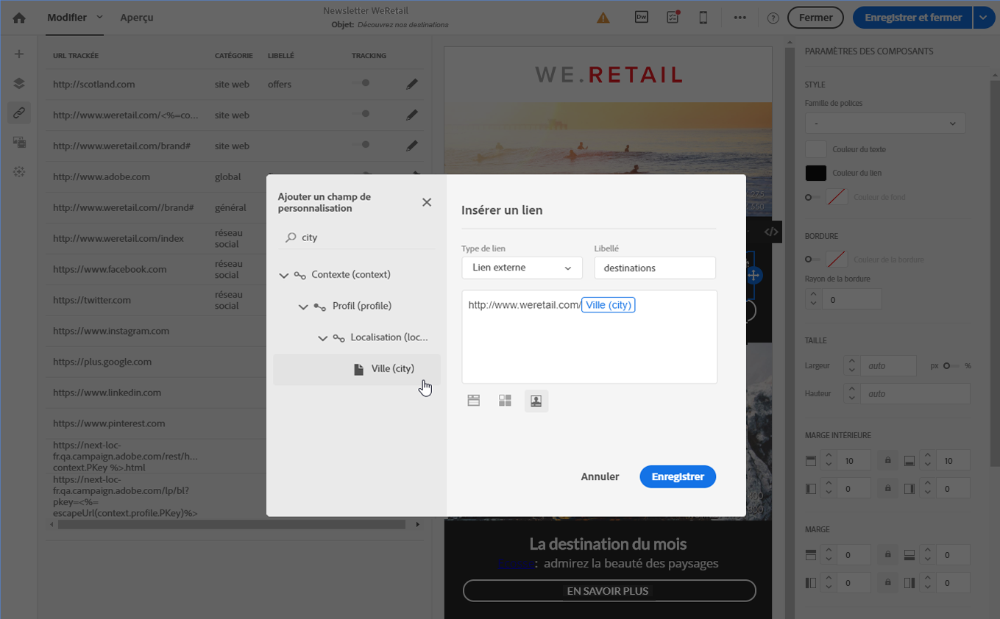

# Personnaliser une URL{#personalizing-urls}

Adobe Campaign vous permet de personnaliser une ou plusieurs URL dans votre message, en insérant des champs de personnalisation, des blocs de contenu ou du contenu dynamique à la suite de celles-ci. Pour cela :

1. Insérez une URL externe et renseignez ses paramètres. Voir [Insérer un lien](../../designing/using/inserting-a-link.md).
1. S'ils ne s'affichent pas, cliquez sur le crayon en regard de l'URL sélectionnée dans le volet Paramètres pour accéder aux options de personnalisation.
1. Ajoutez les champs de personnalisation, blocs de contenus et contenus dynamiques souhaités.

   

1. Enregistrez vos modifications.

>[!NOTE]
>
>La personnalisation des URL ne peut se faire ni sur le nom de domaine, ni sur l'extension. Un message d'erreur s'affiche lors de l'analyse du message si la personnalisation n'est pas correcte. Lorsque vous sélectionnez un bloc de contenu, vous n'êtes pas autorisé à sélectionner des éléments comme **Lien vers la page miroir**. Ce type de bloc est interdit dans un lien.

**Rubriques connexes** :

* [Insertion d'un champ de personnalisation](../../designing/using/inserting-a-personalization-field.md)
* [Ajouter un bloc de contenu](../../designing/using/adding-a-content-block.md)
* [Définir un contenu dynamique](../../designing/using/defining-dynamic-content-in-an-email.md)

