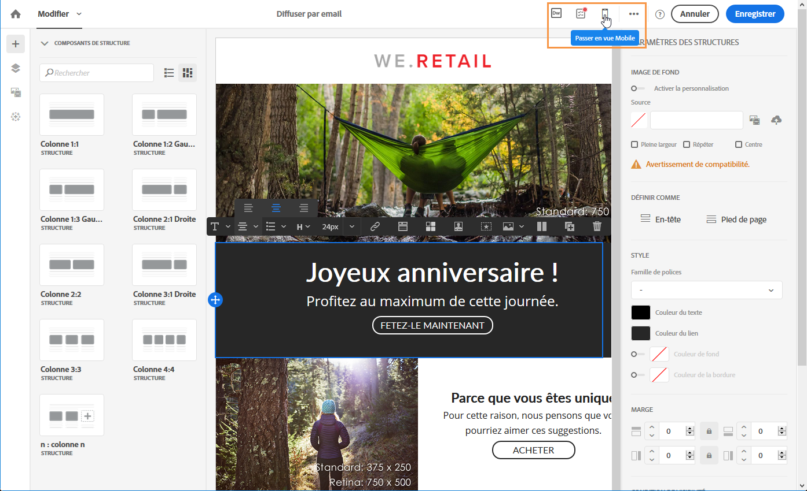
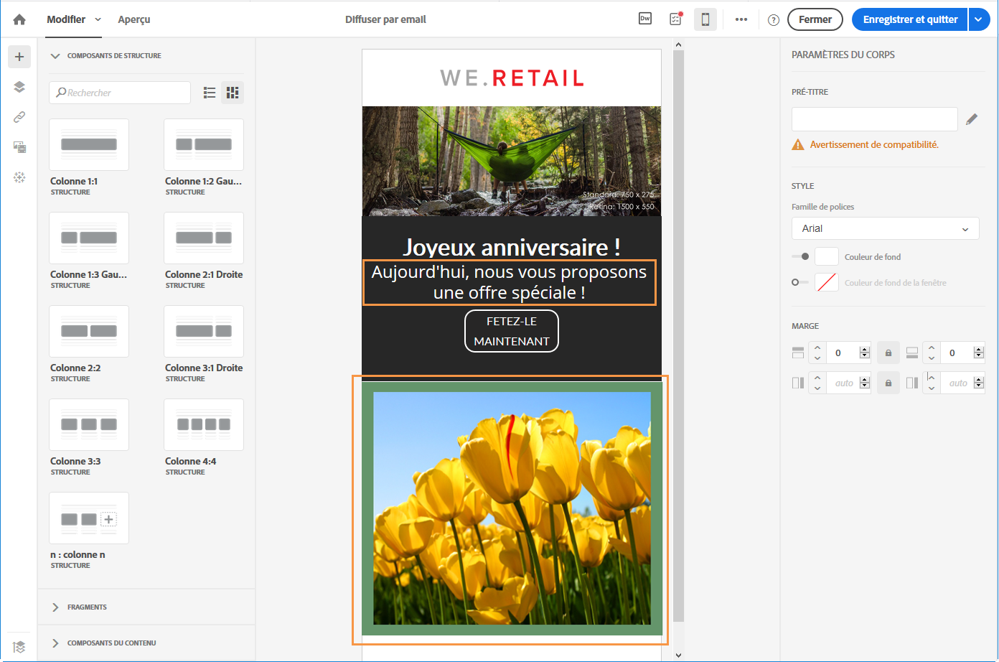
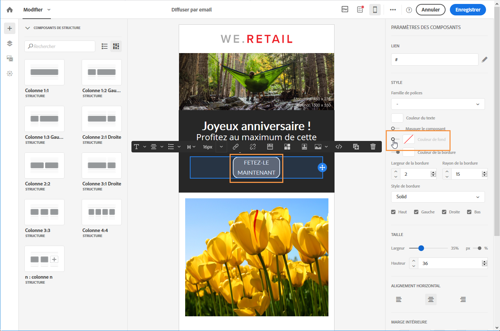

# Modification des formats de texte brut, HTML et de courrier électronique mobile {#plain-text-and-html-modes}

Le concepteur de courrier électronique vous permet de modifier plusieurs rendus de vos courriers électroniques. Vous pouvez générer une version textuelle de votre courrier électronique, modifier la source HTML d’un courrier électronique et concevoir des courriers électroniques pour une vue mobile.

## Générer une version texte de l'email {#generating-a-text-version-of-the-email}

Par défaut, la version **[!UICONTROL Texte simple]** de votre email est automatiquement générée et synchronisée avec la version **[!UICONTROL Edition]**.

Les champs de personnalisation et les blocs de contenu ajoutés à la version HTML sont également synchronisés avec la version en texte brut.

>[!NOTE]
>
>Pour utiliser des blocs de contenu en texte brut, assurez-vous qu’ils ne contiennent pas de code HTML.

Pour disposer d'une version en texte brut différente de la version HTML, vous pouvez désactiver cette synchronisation en cliquant sur le sélecteur **[!UICONTROL Synchroniser avec le code HTML]** dans la vue **[!UICONTROL Texte brut]** de votre email.

Vous pouvez ensuite éditer la version en texte brut comme vous le souhaitez.

>[!NOTE]
>
>Si vous éditez la version **[!UICONTROL Texte brut]** alors que la synchronisation est désactivée, la prochaine fois que vous activerez l'option **[!UICONTROL Synchroniser avec le code HTML]**, toutes les modifications que vous avez apportées à la version en texte brut seront remplacées par la version HTML. Les modifications effectuées dans la vue **[!UICONTROL Texte brut]** ne peuvent pas être reflétées dans la vue **[!UICONTROL HTML]**.

## Editer la source de contenu en HTML d'un email {#editing-an-email-content-source-in-html}

Pour les utilisateurs et le débogage les plus avancés, vous pouvez afficher et modifier le contenu du courrier électronique directement en HTML.

Vous pouvez modifier la version HTML du courrier électronique de deux manières :

* Sélectionnez **[!UICONTROL Edition]** &gt; **[!UICONTROL HTML]** pour ouvrir la version HTML de l'ensemble de l'email.

   

* Dans l'interface WYSIWYG, sélectionnez un élément et cliquez sur l'icône **[!UICONTROL Code source]**.

   Seule la source de l'élément sélectionné s'affiche. Vous pouvez éditer le code source si l'élément sélectionné est un composant de contenu **[!UICONTROL HTML]**. D'autres composants sont en lecture seule, mais peuvent toujours être édités dans la version HTML complète de l'email.

   

Si vous modifiez le code HTML, la réactivité de l'email peut être altérée. Veillez à le tester à l'aide du bouton **[!UICONTROL Prévisualiser]**. Voir [Prévisualiser le message](../../sending/using/previewing-messages.md).

## Conception de courriers électroniques pour le rendu mobile {#switching-to-mobile-view}

Vous pouvez affiner le responsive design d'un email en éditant séparément toutes les options de style pour l'affichage mobile. Par exemple, vous pouvez adapter les marges et le remplissage, utiliser des tailles de police plus petites ou plus grandes, modifier les boutons ou appliquer différentes couleurs d’arrière-plan spécifiques à la version mobile de votre courrier électronique.

Toutes les options de style sont disponibles dans la vue mobile. Les paramètres de style du concepteur de courrier électronique sont présentés précédemment sur cette page.

1. Créez un email et commencez à éditer le contenu. Pour plus d’informations, voir [Conception d’un contenu de courrier électronique à partir de zéro](../../designing/using/designing-from-scratch.md#designing-an-email-content-from-scratch).
1. Pour accéder à la vue mobile dédiée, cliquez sur le bouton **[!UICONTROL Passer en vue Mobile]**.

   

   La version mobile du courrier électronique s’affiche. Il contient tous les composants et styles définis dans la vue Bureau.

1. Modifiez indépendamment tous les paramètres de style, tels que la couleur d’arrière-plan, l’alignement, le remplissage, la marge, la famille de polices, la couleur du texte, etc.

   

1. Lors de la modification d’un paramètre de style dans la vue mobile, les modifications sont appliquées uniquement à l’affichage mobile.

   Par exemple, réduisez la taille d’une image, ajoutez un arrière-plan vert et modifiez le remplissage dans la vue mobile.

   

1. Vous pouvez masquer un composant lorsqu'il est affiché sur un appareil mobile. Pour cela, sélectionnez **[!UICONTROL Afficher uniquement sur les postes de travail]** dans les **[!UICONTROL Options d'affichage]**.

   Vous pouvez également choisir de masquer ce composant sur les postes de travail. Il ne s'affichera donc plus que sur les appareils mobiles. Pour cela, sélectionnez **[!UICONTROL Afficher uniquement sur les appareils mobiles]**.

   Par exemple, cette option vous permet d'afficher une image spécifique sur les appareils mobiles et une autre image sur les postes de travail.

   Vous pouvez définir cette option à partir de la vue mobile ou de poste de travail.

   

1. Cliquez de nouveau sur le bouton **[!UICONTROL Passer en vue Mobile]** pour retourner à la vue de poste de travail standard. Les changements de style que vous venez d'effectuer ne sont pas pris en compte.

   

   >[!NOTE]
   >
   >La seule exception concerne les paramètres de **[!UICONTROL style intégré]**. Toute modification des paramètres de style intégré est également appliquée à la vue de poste de travail standard.

1. Toute autre modification apportée à la structure ou au contenu de l'email, telle que des modifications de texte, le téléchargement d'une nouvelle image, l'ajout d'un nouveau composant, etc. est également appliquée à la vue standard.

   Par exemple, revenez à la vue mobile, modifiez du texte et remplacez une image.

   

   Cliquez de nouveau sur le bouton **[!UICONTROL Passer en vue Mobile]** pour retourner à la vue de poste de travail standard. Les modifications sont reflétées.

   

1. La suppression d’un style dans la vue mobile vous ramène au style appliqué en mode Bureau.

   Par exemple, dans la vue mobile, appliquez une couleur d’arrière-plan verte à un bouton.

   

1. Passez en mode Bureau et appliquez un arrière-plan gris au même bouton.

   

1. Passez de nouveau en vue mobile, puis désactivez le paramètre **[!UICONTROL Couleur de fond]**.

   

   La couleur de fond définie dans la vue de poste de travail est maintenant appliquée : elle devient grise (non vide).

   La seule exception concerne le paramètre **[!UICONTROL Couleur de bordure]**. Lorsqu'il est désactivé dans la vue mobile, aucune bordure n'est plus appliquée, même si une couleur de bordure est définie dans la vue de poste de travail.

>[!NOTE]
>
>La vue mobile n'est pas disponible dans les [fragments](../../designing/using/using-reusable-content.md#about-fragments).
