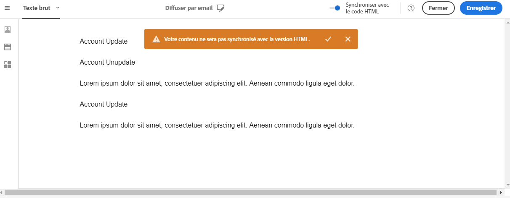
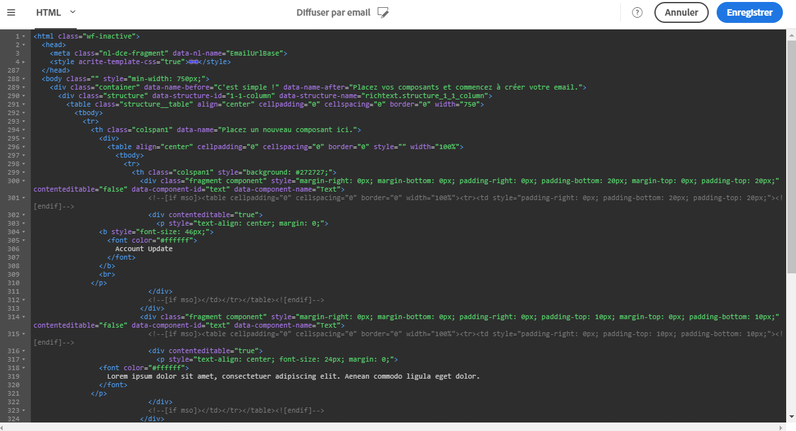
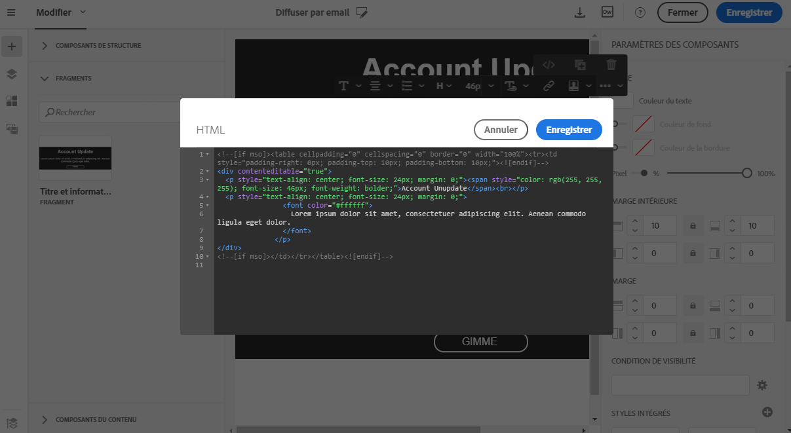

# Texte simple et modes HTML   {#plain-text-and-html-modes}

## Générer une version texte de l'email {#generating-a-text-version-of-the-email}

Par défaut, la version **[!UICONTROL Texte simple]** de votre email est automatiquement générée et synchronisée avec la version **[!UICONTROL Edition]**.

Les champs de personnalisation et les blocs de contenu ajoutés à la version HTML sont également synchronisés avec la version en texte brut.

>[!NOTE]
>
>Pour utiliser des blocs de contenu dans la version en texte brut, assurez-vous qu'ils ne contiennent pas de code HTML.

Pour disposer d'une version en texte brut différente de la version HTML, vous pouvez désactiver cette synchronisation en cliquant sur le sélecteur **[!UICONTROL Synchroniser avec le code HTML]** dans la vue **[!UICONTROL Texte brut]** de votre email.

Vous pouvez ensuite éditer la version en texte brut comme vous le souhaitez.

>[!NOTE]
>
>Si vous éditez la version **[!UICONTROL Texte brut]** alors que la synchronisation est désactivée, la prochaine fois que vous activerez l'option **[!UICONTROL Synchroniser avec le code HTML]**, toutes les modifications que vous avez apportées à la version en texte brut seront remplacées par la version HTML. Les modifications effectuées dans la vue **[!UICONTROL Texte brut]** ne peuvent pas être reflétées dans la vue **[!UICONTROL HTML]**.

## Editer la source de contenu en HTML d'un email {#editing-an-email-content-source-in-html}

Pour les utilisateurs les plus expérimentés et pour des raisons de débogage, vous pouvez afficher et éditer le contenu de l'email directement dans la version HTML.

Vous pouvez éditer la version HTML de l'email de deux façons différentes :

* Sélectionnez **[!UICONTROL Edition]** &gt; **[!UICONTROL HTML]** pour ouvrir la version HTML de l'ensemble de l'email.

   

* Dans l'interface WYSIWYG, sélectionnez un élément et cliquez sur l'icône **[!UICONTROL Code source]**.

   Seule la source de l'élément sélectionné s'affiche. Vous pouvez éditer le code source si l'élément sélectionné est un composant de contenu **[!UICONTROL HTML]**. D'autres composants sont en lecture seule, mais peuvent toujours être édités dans la version HTML complète de l'email.

   

Si vous modifiez le code HTML, la réactivité de l'email peut être altérée. Veillez à le tester à l'aide du bouton **[!UICONTROL Prévisualiser]**. Voir [Prévisualiser le message](../../sending/using/previewing-messages.md).
