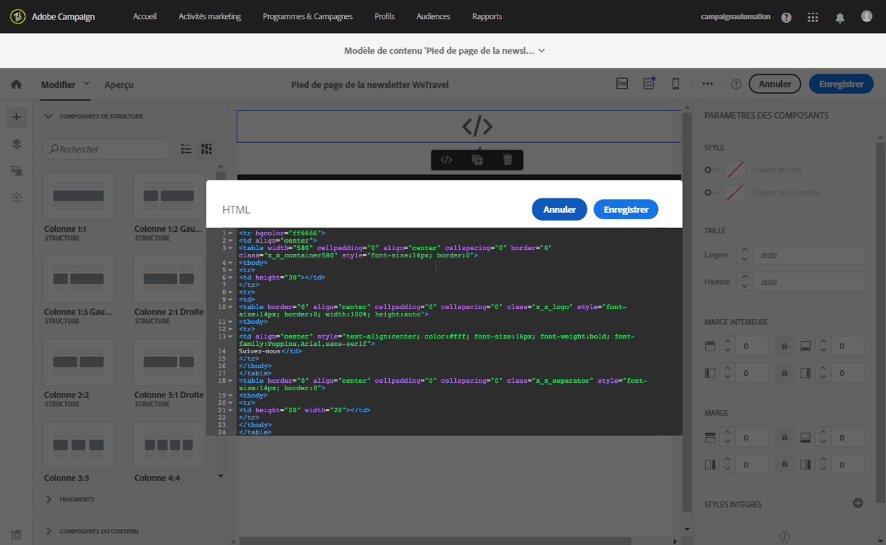

# Commencer avec le concepteur de courrier électronique {#quick-start}

Le Concepteur d&#39;email propose quatre méthodes pour créer des emails.

Vous pouvez créer un courrier électronique [à partir de zéro dans le Concepteur](#without-existing-content)de messagerie :

* Vous pouvez créer un email à partir d&#39;un canevas vierge en ajoutant facilement la structure et les composants de contenu et en personnalisant leur contenu pour envoyer rapidement une diffusion. Vous pouvez également gérer entièrement les éléments de style. Pour plus d&#39;informations, consultez la [documentation de prise en main rapide](#from-scratch-email) ou la [documentation complète](../../designing/using/designing-from-scratch.md#designing-an-email-content-from-scratch).

* Vous pouvez créer un email à partir d&#39;un modèle d&#39;usine. Pour ce faire, sélectionnez un modèle et créez votre contenu d&#39;email à partir de celui-ci. [En savoir plus](#building-content-from-an-out-of-the-box-template)

You can also create an email [with existing content](#with-existing-content):

* Vous pouvez convertir du contenu HTML existant (créé en externe ou dans l&#39;ancien éditeur). [En savoir plus](#converting-an-html-content)
* Vous pouvez importer du contenu HTML existant directement en mode de compatibilité. [En savoir plus](#compatibility-mode)

| Sans contenu | Avec contenu |
|---|---|
| [Création d&#39;un email à partir de zéro](#from-scratch-email) | [Conversion d’un contenu HTML existant](#converting-an-html-content) |
| [Créer du contenu à partir d&#39;un modèle d&#39;usine ](#building-content-from-an-out-of-the-box-template) | [Importation d’un code HTML existant](#compatibility-mode) |

## Conception de courriers électroniques avec l’éditeur {#without-existing-content}

>[!NOTE]
>
>Dans les deux stratégies de création, il est essentiel de remplir l’objet avant d’envoyer votre courriel. Découvrez comment [ajouter une ligne](#add-a-subject-line)d’objet.

### Création d&#39;un email à partir de zéro {#from-scratch-email}

Vous pouvez facilement créer un email, ajouter des composants et personnaliser leur contenu pour envoyer rapidement une diffusion. Vous pouvez adapter les options de style à votre contenu, si nécessaire. Pour plus d&#39;informations sur la gestion des paramètres de style et les attributs intégrés, voir [Editer les styles d&#39;un email](../../designing/using/styles.md).

1. Créez un email.
1. Fermez la page d&#39;accueil.

### Ajout d&#39;un objet {#add-a-subject-line}

Les objets sont obligatoires lors de l&#39;envoi d&#39;un email. Pour plus d&#39;informations, voir [Définition de l&#39;objet d&#39;un email](../../designing/using/subject-line.md).

1. Accédez à l&#39;onglet **[!UICONTROL Propriétés]**de la page d&#39;accueil du Concepteur d&#39;email (accessible par le biais de l&#39;icône Accueil) et renseignez la section**[!UICONTROL  Objet.]**


### Ajout de composants de structure {#add-structure-components}

Les composants de structure définiront la disposition de votre email. Pour plus d&#39;informations, voir [Définition de la structure d&#39;un email](../../designing/using/designing-from-scratch.md#defining-the-email-structure).

Dans les composants Structure, faites glisser et déposez les composants de la disposition que vous souhaitez utiliser.

>[!NOTE]
>
>Vous pouvez sélectionner différentes dispositions de contenu qui s&#39;ajouteront à votre email.


### Ajout de composants de contenu {#add-content-components}

Vous pouvez ajouter plusieurs composants de contenu à votre email, tels que des images, du texte et des boutons. Pour plus d&#39;informations, voir [Composants du contenu](../../designing/using/designing-from-scratch.md#about-content-components).

* **Image**

1. Dans **Composants du contenu**, faites glisser et déposez l&#39;image dans l&#39;un de vos composants de structure.
1. Cliquez sur **Parcourir**.
1. Sélectionnez votre fichier image sur votre ordinateur.


* **Texte avec personnalisation**

1. Dans **Composants du contenu**, faites glisser et déposez le texte dans l&#39;un de vos composants de structure.
1. Cliquez sur le composant et saisissez votre texte.
1. Pour ajouter un champ de personnalisation, cliquez sur **Insérer un champ de personnalisation** dans la barre d&#39;outils.
1. Sélectionnez le champ dont vous avez besoin, tel que Prénom.


* **HTML**

1. Dans **Composants du contenu**, faites glisser et déposez le code HTML dans l&#39;un de vos composants de structure.
1. Cliquez sur **Afficher le code source**.
1. Saisissez votre contenu HTML.
1. Cliquez sur **Enregistrer**.


Si vous maîtrisez le langage HTML, vous pouvez copier-coller le code HTML du pied de page d&#39;origine à l&#39;aide du composant de contenu **[!UICONTROL Html]**. Voir à ce propos la section[A propos des composants de contenu](../../designing/using/designing-from-scratch.md#about-content-components).



### Application d&#39;un style à votre composant d&#39;email

Vous pouvez ajuster le style de votre email, par exemple en modifiant la marge intérieure d&#39;un composant. Pour plus d&#39;informations sur la gestion des paramètres de style et les attributs intégrés, voir [Editer les styles d&#39;un email](../../designing/using/styles.md).

1. Cliquez sur votre **composant de texte**.
1. Sur la droite, dans la palette, accédez à **Marge intérieure**.
1. Cliquez sur l&#39;icône représentant un verrou pour interrompre la synchronisation entre les paramètres supérieur et inférieur ou droit et gauche.
1. Ajustez la **marge intérieure** selon vos besoins.
1. Cliquez sur **Enregistrer**.


Vous pouvez maintenant enregistrer et envoyer votre email.

### Créer du contenu à partir d&#39;un modèle d&#39;usine {#building-content-from-an-out-of-the-box-template}

Vous pouvez créer un email à partir de modèles d&#39;usine, tels que des messages d&#39;accueil de client, des newsletters et des emails de réengagement, puis les personnaliser.

1. Créez un email et ouvrez son contenu. Voir à ce propos [Créer un email](../../channels/using/creating-an-email.md).
1. Cliquez sur l&#39;icône Accueil pour accéder à la page d&#39;accueil du **[!UICONTROL Concepteur d&#39;email]**.
1. Cliquez sur l&#39;onglet **[!UICONTROL Modèles]**.
1. Choisissez un modèle HTML d&#39;usine.
Les différents modèles présentent de multiples combinaisons de plusieurs types d&#39;éléments. Par exemple, les modèles &#39;Contour progressif&#39; possèdent des marges, tandis que les modèles &#39;Astro&#39; en sont dépourvus. Voir à ce propos la section [Modèles de contenu](../../designing/using/using-reusable-content.md#content-templates).
1. Accédez à l&#39;onglet **[!UICONTROL Propriétés]**de la page d&#39;accueil du Concepteur d&#39;email (accessible par le biais de l&#39;icône Accueil) et renseignez la section**[!UICONTROL  Objet.]**
1. Vous pouvez associer ces éléments afin de créer plusieurs variantes d&#39;emails. Par exemple, vous pouvez dupliquer une section d&#39;email en sélectionnant un composant de structure et en cliquant sur **[!UICONTROL Dupliquer]**dans la barre d&#39;outils contextuelle.
1. Vous pouvez déplacer les éléments au moyen de la flèche bleue située à gauche de façon à faire glisser un composant de structure au-dessus ou en dessous d&#39;un autre. Voir à ce propos la section [Editer la structure de l&#39;email](../../designing/using/designing-from-scratch.md#defining-the-email-structure).
1. Vous pouvez également déplacer des composants afin de modifier l&#39;organisation de chaque élément de structure. Voir à ce propos la section [Ajouter des fragments et des composants de contenu](../../designing/using/designing-from-scratch.md#defining-the-email-structure).
1. Modifiez le contenu de chaque élément selon vos besoins : images, texte et liens.
1. Adaptez les options de style à votre contenu, si nécessaire. Voir à ce propos la section [Editer les styles d&#39;un email](../../designing/using/styles.md).

## Utilisation d’un contenu de courrier électronique existant {#with-existing-content}

Si vous voulez créer un framework de fragments et de modèles modulaires qui peuvent être associés afin d&#39;être réutilisés dans plusieurs emails, vous devriez envisager de convertir le code HTML de votre email en modèle de Concepteur d&#39;email.

### Convertir un contenu HTML {#converting-an-html-content}

Ce cas pratique présente comment convertir rapidement le code HTML d&#39;un email en composants du Concepteur d&#39;email.

>[!CAUTION]
>
>Cette section est destinée aux utilisateurs qui maîtrisent le code HTML.

>[!NOTE]
>
>De la même manière que le mode de compatibilité, un composant HTML est éditable avec des options limitées : vous pouvez uniquement effectuer l&#39;édition locale.

En dehors du Concepteur d&#39;email, veillez à ce que le code HTML d&#39;origine soit divisé en sections réutilisables.

1. Ouvrez le Concepteur d&#39;email pour créer un contenu d&#39;email vide.
1. Définissez les attributs au niveau du corps : les couleurs de fond, la largeur, etc. Voir à ce propos la section [Editer les styles d&#39;un email](../../designing/using/styles.md).

Si tel n&#39;est pas le cas, divisez les différents blocs de votre code HTML. Par exemple, voici une section clairement identifiée :

```
<!-- 3 COLUMN w/CTA (SCALED) -->
<table width="100%" align="center" cellspacing="0" cellpadding="0" border="0" role="presentation" style="max-width:680px;">
<tbody>
<tr>
<td class="padh10" align="center" valign="top" style="padding:0 5px 20px 5px;">
<table width="100%" cellspacing="0" cellpadding="0" border="0" role="presentation">
<tbody>
<tr>
...
</tr>
</tbody>
</table>
</td>
</tr>
</tbody>
</table>
<!-- //3 COLUMN w/CTA (SCALED) -->
```

Une fois tous vos blocs identifiés, répétez la procédure suivante dans le Concepteur d&#39;email pour chaque section de votre email existant :

1. Ajoutez un composant de structure. Voir à ce propos la section [Editer la structure de l&#39;email](../../designing/using/designing-from-scratch.md#defining-the-email-structure).
1. Ajoutez un composant HTML. Voir à ce propos la section [Ajouter des fragments et des composants de contenu](../../designing/using/designing-from-scratch.md#defining-the-email-structure).
1. Copiez votre code HTML et collez-le dans ce composant.
1. Passer en vue Mobile. Voir à ce propos [cette section](../../designing/using/plain-text-html-modes.md#switching-to-mobile-view).

   La vue en responsive design est endommagée, car il manque votre CSS.

1. Pour résoudre cela, passez en mode de code source, copiez votre section de style et collez-la dans une nouvelle section de style. Par exemple :

   ```
   <style type="text/css">
   a {text-decoration:none;}
   body {min-width:100% !important; margin:0 auto !important; padding:0 !important;}
   img {line-height:100%; text-decoration:none; -ms-interpolation-mode:bicubic;}
   ...
   </style>
   ```

   >[!NOTE]
   >
   >Veillez à ajouter votre style après cette opération dans une autre balise de style personnalisée.
   >
   >Ne modifiez pas le CSS généré par le Concepteur d&#39;email :
   >
   >* `<style data-name="default" type="text/css">(##)</style>`
   >* `<style data-name="supportIOS10" type="text/css">(##)</style>`
   >* `<style data-name="mediaIOS8" type="text/css">(##)</style>`
   >* `<style data-name="media-default-max-width-500px" type="text/css">(##)</style>`
   >* `<style data-name="media-default--webkit-min-device-pixel-ratio-0" type="text/css">(##)</style>`


1. Revenez à la vue mobile pour vérifier que votre contenu s&#39;affiche correctement et enregistrez vos modifications.

### Import et édition d&#39;un email HTML {#compatibility-mode}

Lorsque vous téléchargez un contenu, il doit contenir des balises spécifiques pour être entièrement compatible et éditable à l&#39;aide de l&#39;éditeur WYSIWYG du Concepteur d&#39;email.

Si tout ou partie du code HTML téléchargé n&#39;est pas conforme avec le balisage attendu, le contenu est alors chargé en &quot;mode de compatibilité&quot;, ce qui limite les possibilités d&#39;édition via l&#39;interface utilisateur.

Lorsqu&#39;un contenu est chargé en mode de compatibilité, vous pouvez toujours effectuer les modifications suivantes via l&#39;interface utilisateur (les actions indisponibles sont masquées) :

* changer le texte ou changer une image,
* insérer des liens et des champs de personnalisation,
* éditer quelques options de style dans le bloc HTML sélectionné
* Définir du contenu conditionnel


D&#39;autres modifications telles que l&#39;ajout de nouvelles sections à votre email ou des styles sophistiqués doivent être effectuées directement dans le code source de l&#39;email via le mode HTML.
Bien que le mode de compatibilité ne vous permette pas d&#39;utiliser la fonction de glisser-déposer, il garantit les mêmes fonctionnalités que l&#39;ancien éditeur.

Pour plus d&#39;informations sur la conversion d&#39;un email existant en email compatible avec le Concepteur d&#39;email, voir [cette section](../../designing/using/using-existing-content.md).
