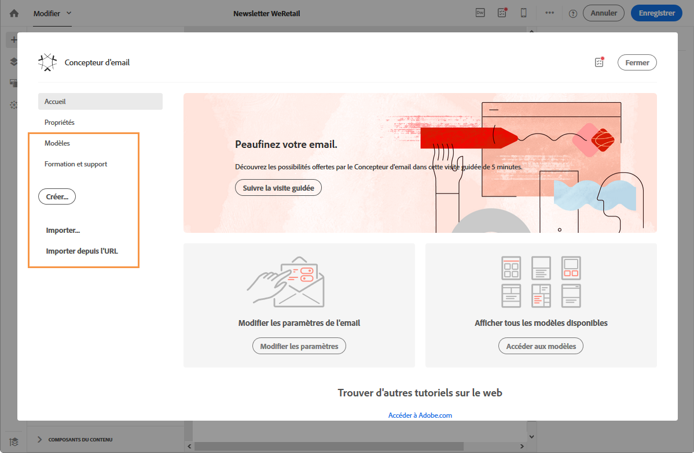

# Sélectionner un contenu existant{#selecting-an-existing-content}

Un ensemble de contenus prédéfinis est fourni avec Adobe Campaign. Vous pouvez utiliser un de ces contenus ou, si le contenu du message que vous devez envoyer est préparé hors d'Adobe Campaign, vous pouvez l'importer depuis votre ordinateur ou une URL.

Lorsque vous créez un email ou une landing page, vous pouvez choisir de charger un contenu existant à partir d'une autre source.

>[!NOTE]
>
>Les images ci-après illustrent le chargement d'un contenu existant à l'aide du [Concepteur d'email](../../designing/using/about-email-content-design.md#about-the-email-designer).

1. Après la création de l'email ou de la landing page, ouvrez son contenu.
1. Cliquez sur l'icône Accueil pour accéder à la page d'accueil du **[!UICONTROL Concepteur d'email]**.

   

1. Sélectionnez la source du contenu à charger :

   * [Modèles de contenu](../../start/using/about-templates.md#content-templates) : cliquez sur l'onglet **[!UICONTROL Modèles]**.
   * [Contenu entièrement nouveau](../../designing/using/about-email-content-design.md#designing-an-email-content-from-scratch) : cliquez sur le bouton **[!UICONTROL Créer]**.
   * [Contenu depuis votre ordinateur sous la forme d'un fichier ZIP ou HTML](../../designing/using/importing-content-from-a-file.md) : cliquez sur le bouton **[!UICONTROL Télécharger]**.
   * [Contenu depuis une URL existante](../../designing/using/importing-content-from-a-url.md) (uniquement pour les emails) : cliquez sur le bouton **[!UICONTROL Importer depuis l'URL]**.
   

1. Chargez le contenu. Le contenu sélectionné remplace le contenu actuel.

   Une fois importé, le contenu peut être édité et personnalisé.

   >[!NOTE]
   >
   >Le [Concepteur d'email](../../designing/using/about-email-content-design.md#about-the-email-designer) utilise un balisage spécifique. Le contenu HTML standard téléchargé dans Campaign doit correspondre au balisage attendu pour être entièrement compatible et éditable dans le Concepteur d'email. S'il ne correspond pas, votre contenu est téléchargé en [mode de compatibilité](../../designing/using/about-email-content-design.md#email-designer-compatibility-mode). Pour rendre compatibles les contenus existants, reportez-vous à [cette section](../../designing/using/editing-existing-contents-with-the-email-designer.md).

**Rubriques connexes :**

* [Créer un email](../../channels/using/creating-an-email.md)
* [Gestion des landing pages](../../channels/using/about-landing-pages.md)

