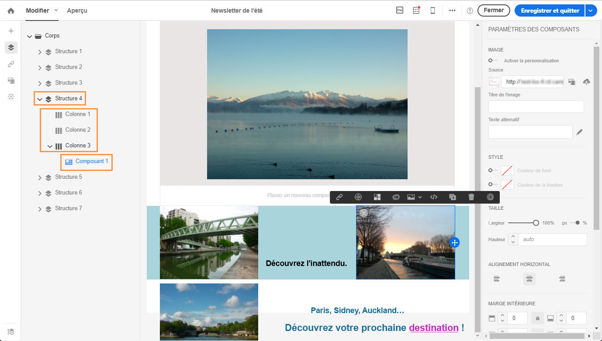
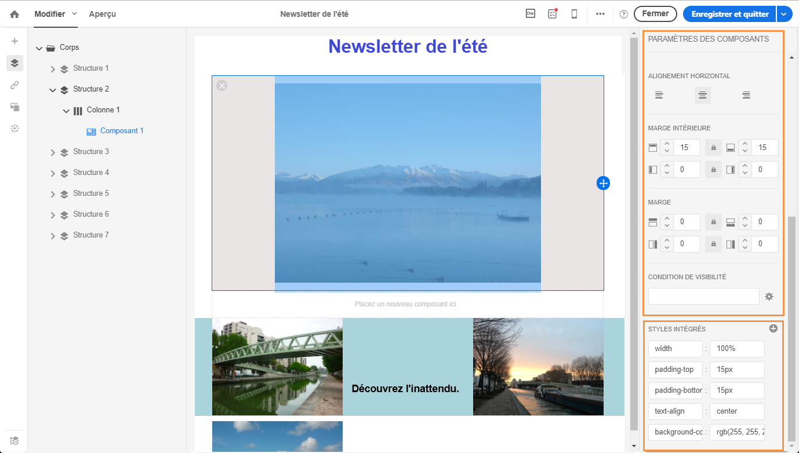
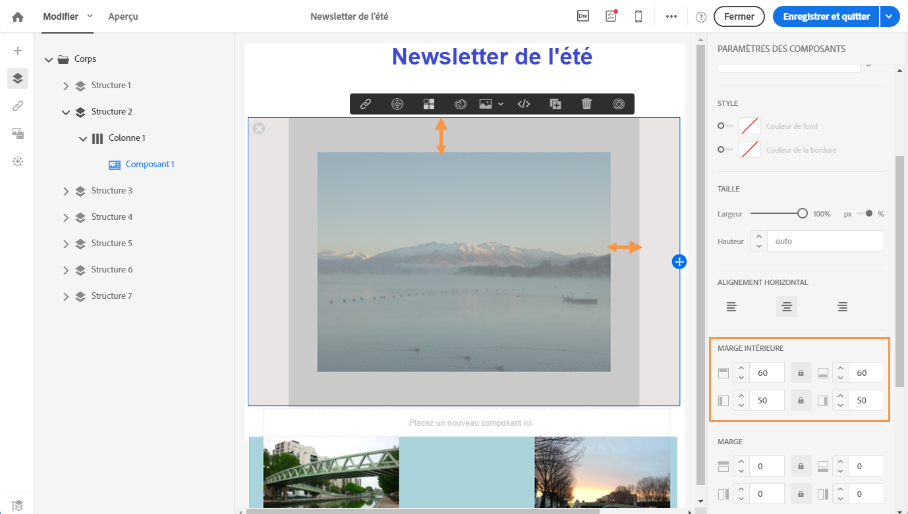
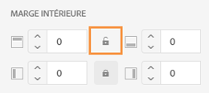
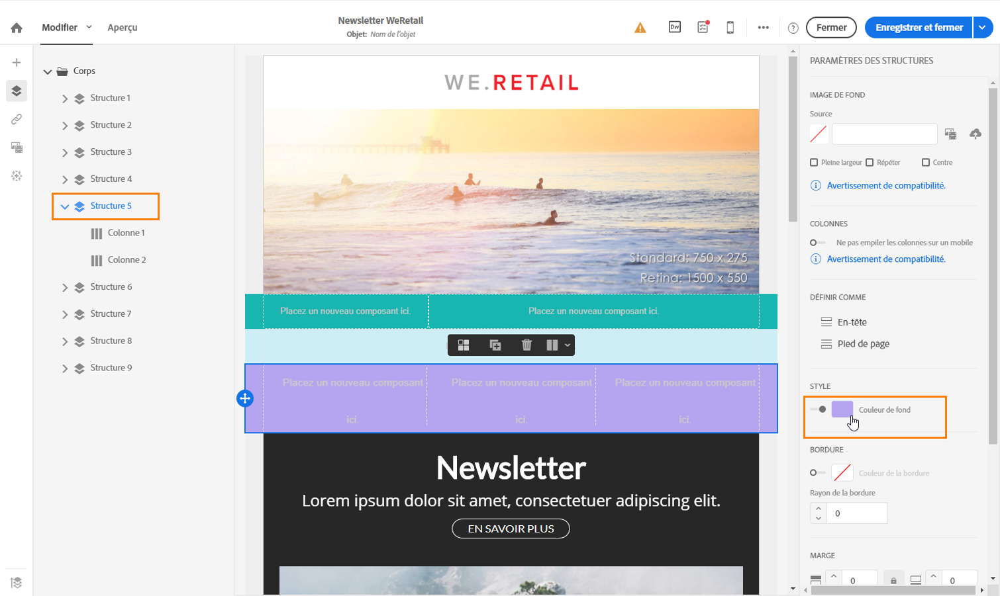
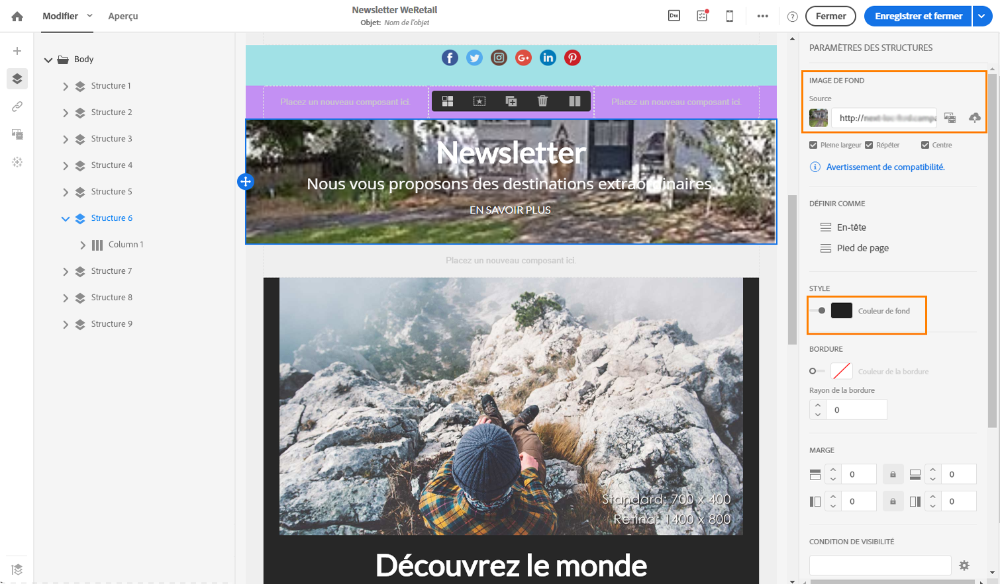
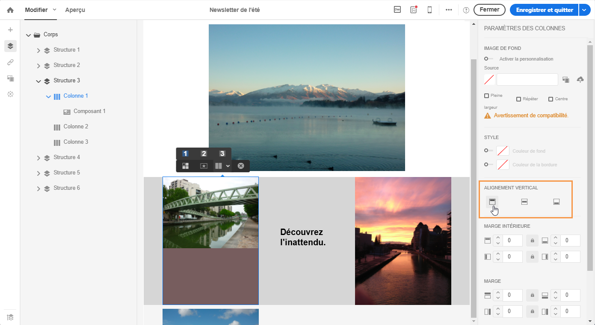
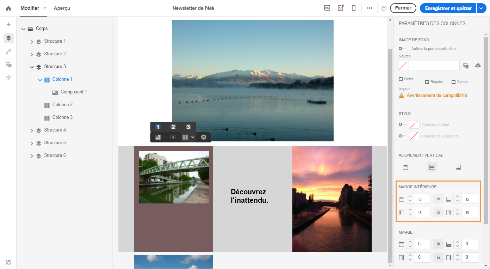
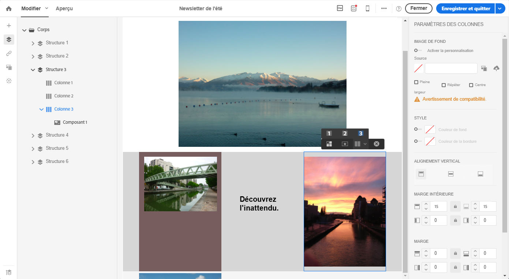
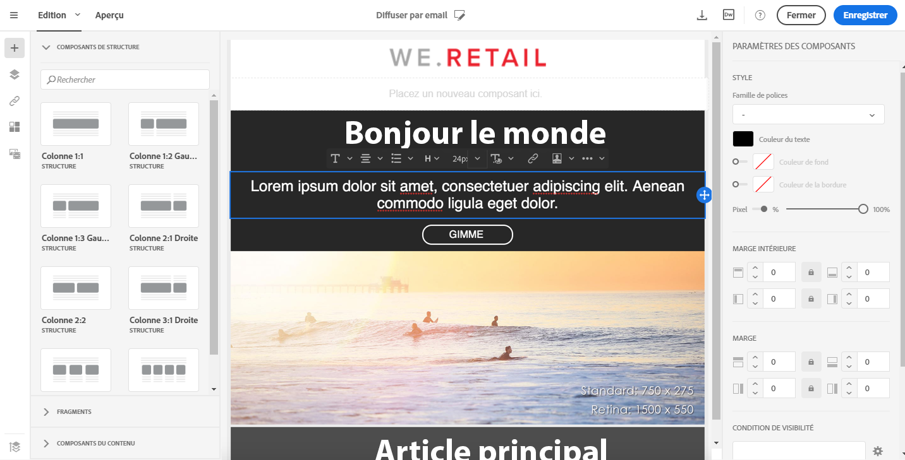

# Gestion des styles d&#39;email {#managing-styles}

Dans le Concepteur d&#39;email, lorsque vous sélectionnez un élément, plusieurs options spécifiques au type de contenu sélectionné s&#39;affichent dans le volet **[!UICONTROL Paramètres]**. Vous pouvez utiliser ces options pour changer facilement le style de votre email.

## Sélectionner un élément     {#selecting-an-element}

Pour sélectionner un élément dans l&#39;interface du Concepteur d&#39;email, vous pouvez :

* cliquer directement dans l&#39;email,
* ou parcourir l&#39;arborescence disponible depuis les options situées dans la **Palette** gauche.

Parcourir la structure permet d&#39;effectuer une sélection plus précise. Vous pouvez sélectionner :

* l&#39;ensemble du composant de structure,
* une des colonnes qui composent le composant de structure,
* ou un composant situé à l&#39;intérieur d&#39;une colonne.

Pour sélectionner une colonne, vous pouvez également procéder comme suit :

1. Sélectionnez un composant de structure (directement dans l&#39;email ou à l&#39;aide de l&#39;arborescence dans la **Palette** gauche).
1. Dans la **barre d&#39;outils contextuelle**, cliquez sur **[!UICONTROL Sélectionner une colonne]** pour choisir la colonne désirée.

Consultez un exemple dans [cette section](#example--adjusting-vertical-alignment-and-padding).

## Ajuster les paramètres de style     {#adjusting-style-settings}

1. Sélectionnez un élément dans votre email. Voir à ce propos la section [Sélectionner un élément](#selecting-an-element).
1. Ajustez les paramètres selon vos besoins. Chaque élément sélectionné offre un ensemble différent de paramètres.

   Vous pouvez insérer des arrière-plans, modifier les tailles, changer l&#39;alignement horizontal ou vertical, gérer les couleurs, ajouter une [marge ou une marge intérieure](#selecting-an-element), etc.

   Pour cela, utilisez les options affichées dans le volet **[!UICONTROL Paramètres]** ou [ajoutez des attributs de style intégré](#adding-inline-styling-attributes).

   

1. Enregistrez votre contenu.

## Ajustement de la marge et de la marge intérieure {#about-padding-and-margin}

L&#39;interface du Concepteur d&#39;email permet d&#39;ajuster rapidement les paramètres de marge et de marge intérieure.

**[!UICONTROL Marge intérieure]** : ce paramètre permet de gérer l&#39;espace situé à l&#39;intérieur de la bordure d&#39;un élément.

Par exemple :

* Utilisez la marge intérieure pour définir des marges à gauche et à droite d&#39;une image.
* Utilisez la marge intérieure du haut et du bas pour ajouter davantage d&#39;espace à un composant **[!UICONTROL Texte]** ou **[!UICONTROL Diviseur]**.
* Pour définir les bordures entre les colonnes au sein d&#39;un élément de structure, définissez la marge intérieure de chaque colonne.

**[!UICONTROL Marge]** : ce paramètre permet de gérer l&#39;espace entre la bordure de l&#39;élément et l&#39;élément suivant.

>[!NOTE]
>
>Selon votre sélection (composant de structure, de colonne ou de contenu), le résultat sera différent. Adobe vous recommande de définir les paramètres **[!UICONTROL Marge intérieure]** et **[!UICONTROL Marge]** au niveau des colonnes.

Pour la **[!UICONTROL marge]** et la **[!UICONTROL marge intérieure]**, cliquez sur l&#39;icône représentant un verrou pour rompre la synchronisation entre les paramètres supérieur et inférieur ou droite et gauche. Vous pouvez ainsi ajuster séparément chaque paramètre.

## Alignement du style {#about-alignment}

* **Alignement du texte** : placez le curseur de votre souris sur du texte et servez-vous de la barre d&#39;outils contextuelle pour l&#39;aligner.

   

* L&#39;**Alignement horizontal** peut être appliqué au texte, aux images et aux boutons, mais pas aux composants **[!UICONTROL Diviseur]** et **[!UICONTROL Social]** à l&#39;heure actuelle.

   

* Pour définir l&#39;**alignement vertical**, sélectionnez une colonne au sein d&#39;un composant de structure et choisissez une option dans le volet Paramètres.

   

## Définition des fonds {#about-backgrounds}

>[!CONTEXTUALHELP]
>id="ac_edition_backgroundimage"
>title="Paramètres d’arrière-plan"
>abstract="Le Concepteur d’email vous permet de personnaliser la couleur de fond ou l&#39;image d&#39;arrière-plan de votre contenu. Notez que l&#39;image d&#39;arrière-plan n&#39;est pas prise en charge par tous les clients de messagerie."
>additional-url="https://docs.google.com/spreadsheets/d/1TLo62YKm3tThUWDOIliCQFWs3dpNjpDfw6DdTr1oGOw/edit#gid=0" text="Informations supplémentaires"

Lorsqu&#39;il s&#39;agit de définir des fonds dans le Concepteur d&#39;email, Adobe a les recommandations suivantes :

1. Appliquez une couleur de fond au corps de votre email si votre design le requiert.
1. Dans la plupart des cas, définissez les couleurs de fond au niveau des colonnes.
1. Evitez d&#39;utiliser des couleurs de fond sur des composants d&#39;image ou de texte, car elles sont difficiles à gérer.

Vous trouverez ci-dessous les paramètres de fond disponibles.

* Définissez une **[!UICONTROL Couleur de fond]** pour l&#39;ensemble de l&#39;email. Assurez-vous de sélectionner les paramètres du corps dans l&#39;arborescence de navigation accessible à partir de la palette gauche.

   

* Définissez la même couleur de fond pour tous les composants de structure en sélectionnant **[!UICONTROL Couleur de fond de la fenêtre]**. Cette option vous permet de sélectionner un paramètre différent de la couleur de fond.

   

* Définissez une couleur de fond différente pour chaque composant de structure. Sélectionnez une structure dans l&#39;arborescence de navigation accessibles à partir de la palette gauche afin d&#39;appliquer une couleur de fond spécifique uniquement sur cette structure.

   

   Veillez à ne pas définir de couleur de fond de la fenêtre, car celle-ci peut masquer les couleurs de fond de la structure.

* Définissez une **[!UICONTROL Image de fond]** pour le contenu d&#39;un composant de structure.

   

   >[!NOTE]
   >
   >Certains programmes de messagerie ne prennent pas en charge les images de fond. Si ces images ne sont pas prises en charge, la couleur d’arrière-plan de la ligne est utilisée à la place. Assurez-vous de sélectionner une couleur de fond de secours appropriée dans le cas où l&#39;image ne pourrait s&#39;afficher.

* Définissez une couleur de fond au niveau des colonnes.

   

   >[!NOTE]
   >
   >Il s&#39;agit du cas pratique le plus courant. Adobe vous recommande de définir les couleur de fond au niveau des colonnes afin de profiter d&#39;une plus grande flexibilité lors de l&#39;édition de l&#39;ensemble du contenu d&#39;email.

   Vous pouvez également définir une image de fond au niveau des colonnes, mais cette option est rarement utilisée.

### Exemple : ajustement de la marge intérieure et de l&#39;alignement vertical {#example--adjusting-vertical-alignment-and-padding}

Vous souhaitez ajuster la marge intérieure et l&#39;alignement vertical à l&#39;intérieur d&#39;un composant de structure composé de trois colonnes. Pour cela, procédez comme suit :

1. Sélectionnez le composant de structure, directement dans l&#39;email ou à l&#39;aide de l&#39;arborescence dans la **Palette** gauche.
1. Dans la **barre d&#39;outils contextuelle**, cliquez sur **[!UICONTROL Sélectionner une colonne]** et choisissez celle à éditer. Vous pouvez également la sélectionner dans l&#39;arborescence.

   

   Les paramètres éditables pour cette colonne sont affichés dans le volet **[!UICONTROL Paramètres]** situé à droite.

1. Sous **[!UICONTROL Alignement vertical]**, sélectionnez **[!UICONTROL Monter]**.

   

   Le composant de contenu s&#39;affiche au-dessus de la colonne.

1. Sous **[!UICONTROL Marge intérieure]**, définissez la marge intérieure supérieure à l&#39;intérieur de la colonne. Cliquez sur l&#39;icône représentant un verrou pour rompre la synchronisation avec la marge intérieure inférieure.

   Définissez la marge intérieure droite et gauche de cette colonne.

   

1. Procédez de façon similaire pour ajuster l&#39;alignement et la marge intérieure des autres colonnes.

   

1. Enregistrez vos modifications.

## Style des liens {#about-styling-links}

Vous pouvez souligner un lien et sélectionner sa couleur et sa cible dans le Concepteur d&#39;email.

1. Dans un composant dans lequel un lien est inséré, sélectionnez le texte du libellé du lien.

1. Dans les paramètres du composant, cochez la case **[!UICONTROL Souligner le lien]** pour souligner le texte du libellé de votre lien.

   

1. Pour sélectionner le contexte de navigation dans lequel votre lien sera ouvert, sélectionnez une **[!UICONTROL Cible]**.

   

1. Pour changer la couleur de votre lien, cliquez sur **[!UICONTROL Couleur du lien]**.

   

1. Choisissez la couleur dont vous avez besoin.

   

1. Enregistrez vos modifications.

## Ajouter des attributs de style intégrés     {#adding-inline-styling-attributes}

Dans l&#39;interface du Concepteur d&#39;email, lorsque vous sélectionnez un élément et affichez ses paramètres dans le volet latéral, vous pouvez personnaliser les attributs intégrés et leur valeur pour cet élément spécifique.

1. Sélectionnez un élément de votre contenu.
1. Sur le panneau latéral, recherchez les paramètres de **[!UICONTROL styles intégrés]**.

   

1. Modifiez les valeurs des attributs existants, ou ajoutez-en de nouveaux à l&#39;aide du bouton **+**. Vous pouvez ajouter tout attribut et toute valeur compatible CSS.

Le style est ensuite appliqué à l&#39;élément sélectionné. Si aucun attribut de style spécifique n&#39;est défini pour les éléments enfants, ils héritent du style de l&#39;élément parent.
