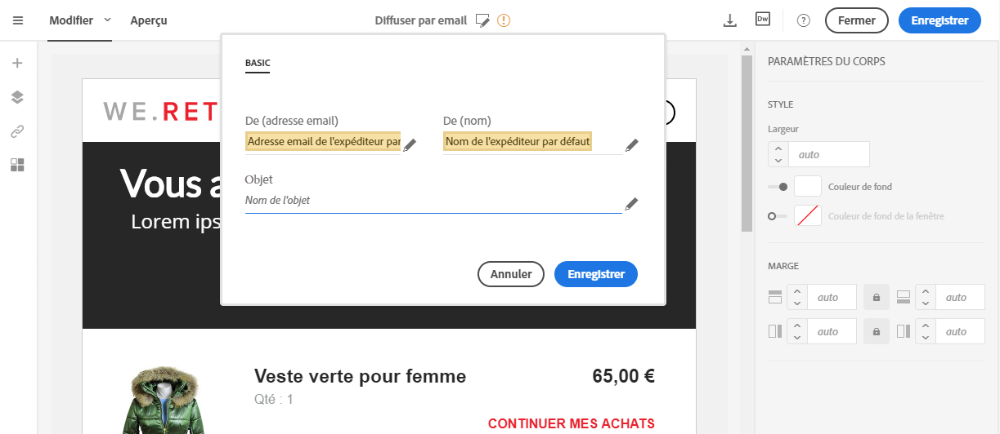

# Définition de l’objet et de l’expéditeur d’un email{#defining-the-subject-line-of-an-email}

## Définition de l’objet d’un email {#subject-line}

L’objet de l’email est obligatoire pour préparer et envoyer le message.

>[!NOTE]
>
>Si l’objet est vide, un avertissement apparaît dans le tableau de bord du message ainsi que dans le Concepteur d’email.

1. Créez un email.
1. Accédez à l’onglet **[!UICONTROL Propriétés]** de la page d’accueil du Concepteur d’email (accessible par le biais de l’icône Accueil).
1. Renseignez la section **[!UICONTROL Objet]**.

   

1. Vous pouvez également ajouter des champs de personnalisation, des blocs de contenu et du contenu dynamique à la ligne d’objet en cliquant sur les icônes correspondantes. Pour plus d’informations à ce sujet, voir [Personnalisation](../../designing/using/personalization.md).

## Définition de l’expéditeur d’un email{#email-sender}

Pour définir le nom de l’expéditeur qui apparaîtra dans l’en-tête des messages, accédez à l’onglet **[!UICONTROL Propriétés]** de la page d’accueil du Concepteur d’email (accessible par le biais de l’icône Accueil).

* Le champ **[!UICONTROL De : nom]** permet de saisir le nom de l’expéditeur. Par défaut, le bloc **Nom de l’expéditeur** par défaut est automatiquement inscrit dans le champ. L’adresse email de l’expéditeur et le nom de l’expéditeur par défaut sont définis dans **[!UICONTROL Marques]** et accessibles via le logo Adobe Campaign sous le menu avancé **[!UICONTROL Administration > Paramètres de l’instance > Paramétrage des marques]**.

   Vous pouvez changer le nom de l’expéditeur en cliquant sur le bloc **Nom de l’expéditeur**. Le champ devient éditable et vous pouvez y inscrire le nom que vous souhaitez.

   Le champ peut être personnalisé. Pour cela, vous pouvez ajouter des champs de personnalisation, des blocs de contenu et du contenu dynamique en cliquant sur les icônes situées sous le nom de l’expéditeur. Pour plus d’informations à ce sujet, voir [Personnalisation](../../designing/using/personalization.md).

* Le champ **[!UICONTROL De : adresse email]** n’est pas éditable depuis cette section. Vous pouvez le modifier en éditant les propriétés de l’email depuis son tableau de bord. Pour plus d’informations, voir [Liste des paramètres avancés des emails](../../administration/using/configuring-email-channel.md#advanced-parameters).

>[!NOTE]
>
>Les paramètres d’en-tête ne doivent pas être vides. L’adresse de l’expéditeur est obligatoire pour permettre l’envoi d’un email (norme RFC). Adobe Campaign effectue une vérification syntaxique des adresses email saisies.

**Rubriques connexes :**

* [Insertion d’un champ de personnalisation](../../designing/using/personalization.md#inserting-a-personalization-field)
* [Ajouter un bloc de contenu](../../designing/using/personalization.md#adding-a-content-block)
* [Définir du contenu dynamique dans un email](../../designing/using/personalization.md#defining-dynamic-content-in-an-email)
