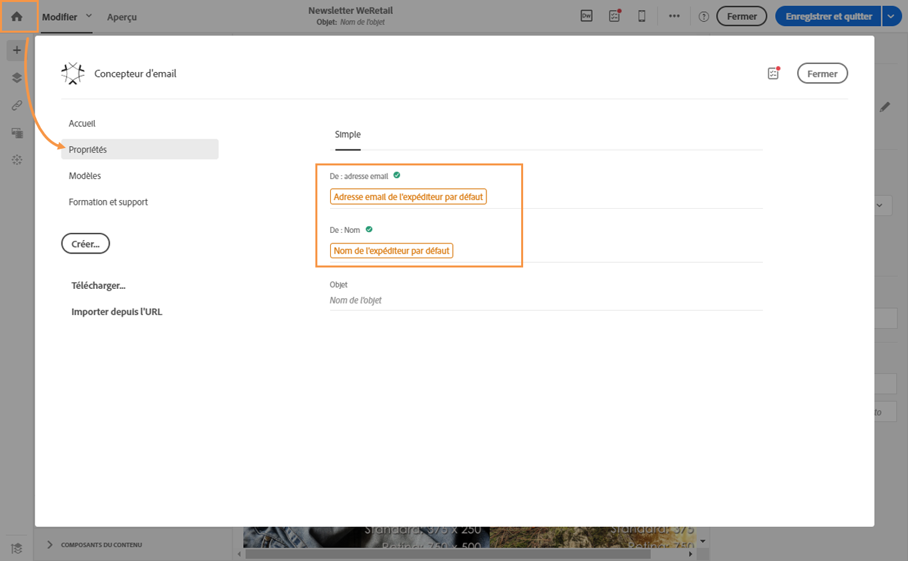

# Définition de l&#39;objet et de l&#39;expéditeur d&#39;un email{#defining-the-subject-line-of-an-email}

## Defining the subject line of an email {#subject-line}

L&#39;objet de l&#39;email est obligatoire pour préparer et envoyer le message.

>[!NOTE]
>
>Si l&#39;objet est vide, un avertissement apparaît dans le dashboard du message ainsi que dans le Concepteur d&#39;email.

1. Créez un email.
1. Accédez à l’ **[!UICONTROL Properties]** onglet du de concepteur de courrier électronique (accessible via l’icône d’accueil).
1. Renseignez la **[!UICONTROL Subject]** section.

   

1. Vous pouvez également ajouter des champs de personnalisation, des blocs de contenu et du contenu dynamique à la ligne d&#39;objet en cliquant sur les icônes correspondantes. For more on this, see [Personalization](../../designing/using/personalization.md).
1. Vous pouvez essayer différentes lignes de sujet afin d&#39;obtenir une estimation de votre taux d&#39;ouverture de courriel avant de l&#39;envoyer. Voir à ce propos la section [Test de l&#39;objet d&#39;un email](../../sending/using/testing-subject-line-email.md).

## Définition de l’expéditeur d’un email{#email-sender}

To define the name of the sender which will appear in the header of messages sent, go the **[!UICONTROL Properties]** tab of the Email Designer home page (accessible through the home icon).

* The **[!UICONTROL From: name]** field allows you to enter the sender name. Par défaut, le bloc **Nom de l&#39;expéditeur** par défaut est automatiquement inscrit dans le champ. The default sender email address and sender name are  defined in **[!UICONTROL Brands]** accessible via the Adobe Campaign logo under the advanced menu **[!UICONTROL Administration > Instance settings > Brand configuration]** .

   Vous pouvez changer le nom de l&#39;expéditeur en cliquant sur le bloc **Nom de l&#39;expéditeur**. Le champ devient éditable et vous pouvez y inscrire le nom que vous souhaitez.

   Le champ peut être personnalisé. Pour cela, vous pouvez ajouter des champs de personnalisation, des blocs de contenu et du contenu dynamique en cliquant sur les icônes situées sous le nom de l&#39;expéditeur. For more on this, see [Personalization](../../designing/using/personalization.md).

* Le **[!UICONTROL From: email address]** champ ne peut pas être modifié à partir de cette section. Vous pouvez le modifier en éditant les propriétés de l&#39;email depuis son tableau de bord. Pour plus d&#39;informations, voir [Liste des paramètres avancés des emails](../../administration/using/configuring-email-channel.md#advanced-parameters).

>[!NOTE]
>
>Les paramètres d&#39;en-tête ne doivent pas être vides. L&#39;adresse de l&#39;expéditeur est obligatoire pour permettre l&#39;envoi d&#39;un email (norme RFC). Adobe Campaign effectue une vérification syntaxique des adresses email saisies.

**Rubriques connexes :**

* [Insertion d&#39;un champ de personnalisation](../../designing/using/personalization.md#inserting-a-personalization-field)
* [Ajouter un bloc de contenu](../../designing/using/personalization.md#adding-a-content-block)
* [Définir du contenu dynamique dans un email](../../designing/using/personalization.md#defining-dynamic-content-in-an-email)
