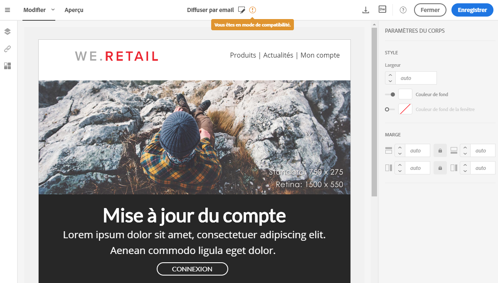

# Conception à l&#39;aide de contenu existant {#designing-using-existing-content}

## Sélectionner un contenu existant{#selecting-an-existing-content}

Un ensemble de contenus prédéfinis est fourni avec Adobe Campaign. Vous pouvez utiliser un de ces contenus ou, si le contenu du message que vous devez envoyer est préparé hors d&#39;Adobe Campaign, vous pouvez l&#39;importer depuis votre ordinateur ou une URL.

Lorsque vous créez un email ou une landing page, vous pouvez choisir de charger un contenu existant à partir d&#39;une autre source.

>[!NOTE]
>
>Les images ci-après illustrent le chargement d&#39;un contenu existant à l&#39;aide du [Concepteur d&#39;email](../../designing/using/designing-content-in-adobe-campaign.md).

1. Après la création de l&#39;email ou de la landing page, ouvrez son contenu.
1. Cliquez sur l&#39;icône Accueil pour accéder à la page d&#39;accueil du **[!UICONTROL concepteur d’e-mail]**.

   

1. Sélectionnez la source du contenu à charger :

   * [Modèles de contenu](../../designing/using/using-reusable-content.md#content-templates) : cliquez sur l&#39;onglet **[!UICONTROL Modèles]**.
   * [Contenu entièrement nouveau](../../designing/using/designing-from-scratch.md#designing-an-email-content-from-scratch) : cliquez sur le bouton **[!UICONTROL Créer]**.
   * [Contenu depuis votre ordinateur sous la forme d&#39;un fichier ZIP ou HTML](#importing-content-from-a-file) : cliquez sur le bouton **[!UICONTROL Télécharger]**.
   * [Contenu depuis une URL existante](#importing-content-from-a-url) (uniquement pour les emails) : cliquez sur le bouton **[!UICONTROL Importer depuis l&#39;URL]**.

   

1. Chargez le contenu. Le contenu sélectionné remplace le contenu actuel.

   Une fois importé, le contenu peut être édité et personnalisé.

   >[!NOTE]
   >
   >Le [concepteur d’e-mail](../../designing/using/designing-content-in-adobe-campaign.md) utilise un balisage spécifique. Le contenu HTML standard téléchargé dans Campaign doit correspondre au balisage attendu pour être entièrement compatible et éditable dans le concepteur d’e-mail. S&#39;il ne correspond pas, votre contenu est téléchargé en [mode de compatibilité](#compatibility-mode). Pour rendre compatibles les contenus existants, reportez-vous à [cette section](#editing-existing-contents-with-the-email-designer).

**Rubriques connexes :**

* [Créer un e-mail](../../channels/using/creating-an-email.md)
* [Gestion des landing pages](../../channels/using/getting-started-with-landing-pages.md)

## Editer des contenus existants avec le concepteur d’e-mail{#editing-existing-contents-with-the-email-designer}

Pour tirer pleinement parti des possibilités d&#39;édition du [Concepteur d&#39;email](../../designing/using/designing-content-in-adobe-campaign.md), votre code HTML importé doit contenir des balises spécifiques qui le rendent compatibles avec l&#39;éditeur WYSIWYG.

Si tout ou partie du code HTML ne contient pas ce balisage, le contenu est alors chargé en &#39;[mode de compatibilité](#compatibility-mode)&#39;.

Pour rendre du contenu externe existant entièrement éditable dans le Concepteur d&#39;email, voir la section [Concevoir un email à l&#39;aide d&#39;un contenu existant](../../designing/using/using-existing-content.md).

## Importer un contenu d&#39;email existant {#importing}

### Importer du contenu depuis un fichier {#importing-content-from-a-file}

Dans la page d&#39;accueil du concepteur d’e-mail, cliquez sur le bouton **[!UICONTROL Télécharger]** pour télécharger un fichier depuis votre ordinateur, puis confirmez l&#39;opération.

La structure du dossier compressé est libre. Toutefois, le référencement des fichiers en HTML doit être relatif et doit respecter l&#39;arborescence du dossier compressé.

Les formats supportés lors de l&#39;import sont les suivants :

* Un fichier HTML avec une feuille de style incorporée
* un dossier compressé (.zip) contenant le fichier HTML, la feuille de style (.CSS) et les images.

>[!NOTE]
>
>Pour le contenu des emails, il est recommandé d&#39;importer des fichiers HTML uniques avec une feuille de style incorporée.

#### Importer du contenu depuis une URL {#importing-content-from-a-url}

Avant d&#39;importer du contenu depuis une URL, vérifiez que les exigences suivantes sont respectées :

* Le contenu doit être publiquement disponible via cette URL.
* Pour des raisons de sécurité, seules les URL commençant par **[!UICONTROL https]** sont autorisées.
* Vérifiez que toutes les ressources (images, CSS) sont définies dans des liens absolus et HTTPS. Sinon, après l&#39;envoi de l&#39;email, la page miroir serait affichée sans ses ressources. Voici un exemple de définition d&#39;un lien absolu :

  ```
  <a href="https://www.mywebsite.com/images/myimage.png">
  ```

>[!NOTE]
>
>Le chargement de contenu depuis une URL n&#39;est possible que pour le canal email.

Pour récupérer du contenu existant depuis une URL, procédez comme suit :

1. Dans la page d&#39;accueil du concepteur d’e-mail, cliquez sur le bouton **[!UICONTROL Importer depuis l&#39;URL]**.

   

1. Définissez l&#39;URL à partir de laquelle le contenu sera récupéré.
1. Cliquez sur **[!UICONTROL Confirmer]**.

Découvrez cette fonctionnalité en vidéo.

>[!VIDEO](https://video.tv.adobe.com/v/25926?quality=12)

D’autres vidéos pratiques sur Campaign Standard sont disponibles [ici](https://experienceleague.adobe.com/docs/campaign-standard-learn/tutorials/overview.html?lang=fr).

### Récupérer automatiquement du contenu depuis une URL au moment de la préparation {#retrieving-content-from-a-url-automatically-at-preparation-time}

L&#39;import de contenu à partir d&#39;une URL lors de la préparation du message permet de récupérer le contenu HTML le plus récent à chaque préparation. Ainsi, le contenu des emails récurrents est toujours mis à jour au moment de l&#39;envoi. Cette fonctionnalité permet également de créer un message planifié à une date spécifique, même si le contenu n&#39;est pas encore prêt.

Pour récupérer du contenu au moment de la préparation d&#39;une diffusion, procédez comme suit :

1. Sélectionnez l&#39;option **[!UICONTROL Contenu importé lors de la préparation]**.

   

1. Le contenu de l&#39;URL s&#39;affiche en lecture seule dans l&#39;éditeur.

   >[!CAUTION]
   >
   >A ce stade, l&#39;affichage HTML dans l&#39;éditeur de contenu ne doit pas être pris en compte. Il sera récupéré pendant la phase de préparation.

1. Pour prévisualiser le contenu de l&#39;URL récupéré, ouvrez le message une fois qu&#39;il a été créé, puis cliquez sur le bouton **[!UICONTROL Prévisualiser]**.

Il est possible de personnaliser l&#39;URL distante à partir de laquelle le contenu sera récupéré. Pour cela, procédez comme suit :

1. Cliquez sur le libellé de l&#39;email en haut de l&#39;écran pour accéder à l&#39;onglet **[!UICONTROL Propriétés]** du concepteur d’e-mail.
1. Recherchez le champ **[!UICONTROL URL distante]**.

   

1. Insérez le champ de personnalisation, le bloc de contenu ou le texte dynamique de votre choix.

   Le bloc de contenu **[!UICONTROL Date actuelle - YYYYMMDD]**, par exemple, permet d&#39;insérer la date du jour.

   >[!NOTE]
   >
   >Les champs de personnalisation disponibles sont uniquement liés aux attributs de **diffusion** (date de création de l’e-mail, statut, libellé de la campagne, etc.).

Si le téléchargement de contenu échoue lors de la première tentative, une deuxième tentative est possible :

1. La seconde tentative démarre 50 ms après la première tentative.
1. Le troisième tentative commence 100 ms après la deuxième tentative.

Ces tentatives sont utiles dans les cas suivants :

* Une panne de service de courte durée sur un serveur distant
* Une défaillance du serveur sur un cluster, auquel cas les tentatives sont plus susceptibles de réussir grâce à l’équilibrage de charge sur un serveur opérationnel

### Mode de compatibilité {#compatibility-mode}

Lorsque vous téléchargez un contenu, il doit contenir des balises spécifiques pour être entièrement compatible et éditable à l&#39;aide de l&#39;éditeur WYSIWYG du concepteur d’e-mail.

Si tout ou partie du code HTML téléchargé n&#39;est pas conforme avec le balisage attendu, le contenu est alors chargé en &quot;mode de compatibilité&quot;, ce qui limite les possibilités d&#39;édition via l&#39;interface utilisateur.

Lorsqu&#39;un contenu est chargé en mode de compatibilité, vous pouvez toujours effectuer les modifications suivantes via l&#39;interface utilisateur (les actions indisponibles sont masquées) :

* changer le texte ou changer une image,
* insérer des liens et des champs de personnalisation,
* éditer quelques options de style dans le bloc HTML sélectionné
* Définir du contenu conditionnel



D&#39;autres modifications telles que l&#39;ajout de nouvelles sections à votre email ou des styles sophistiqués doivent être effectuées directement dans le code source de l&#39;email via le mode HTML.

Pour plus d&#39;informations sur la conversion d&#39;un email existant en email compatible avec le concepteur d’e-mail, voir [cette section](../../designing/using/using-existing-content.md).

**Rubrique connexe**:

* [Créer un e-mail](../../channels/using/creating-an-email.md)
* [Vidéo d&#39;introduction au concepteur d’e-mail](../../designing/using/designing-content-in-adobe-campaign.md#video)
* [Concevoir entièrement un contenu d&#39;email](../../designing/using/designing-from-scratch.md#designing-an-email-content-from-scratch)

## Conversion de contenu HTML {#converting-an-html-content}

Si vous voulez créer un framework de fragments et de modèles modulaires qui peuvent être associés afin d&#39;être réutilisés dans plusieurs emails, vous devriez envisager de convertir le code HTML de votre email en modèle de concepteur d’e-mail.

Ce cas pratique présente comment convertir rapidement un email HTML en composants du concepteur d’e-mail.

>[!CAUTION]
>
>Cette section est destinée aux utilisateurs avancés qui sont familiers avec le code HTML.

>[!NOTE]
>
>De la même manière que le mode de compatibilité, un composant HTML est éditable avec des options limitées : vous pouvez uniquement effectuer l&#39;édition locale.

En dehors du Concepteur d&#39;email, veillez à ce que le code HTML d&#39;origine soit divisé en sections réutilisables.

Si tel n&#39;est pas le cas, divisez les différents blocs de votre code HTML. Par exemple :

```
<!-- 3 COLUMN w/CTA (SCALED) -->
<table width="100%" align="center" cellspacing="0" cellpadding="0" border="0" role="presentation" style="max-width:680px;">
<tbody>
<tr>
<td class="padh10" align="center" valign="top" style="padding:0 5px 20px 5px;">
<table width="100%" cellspacing="0" cellpadding="0" border="0" role="presentation">
<tbody>
<tr>
...
</tr>
</tbody>
</table>
</td>
</tr>
</tbody>
</table>
<!-- //3 COLUMN w/CTA (SCALED) -->
```

Une fois tous vos blocs identifiés, répétez la procédure suivante dans le concepteur d’e-mail pour chaque section de votre email existant :

1. Ouvrez le concepteur d’e-mail pour créer un contenu d’email vide.
1. Définissez les attributs au niveau du corps : les couleurs de fond, la largeur, etc. Pour plus d&#39;informations, consultez la section [Modifier les styles d’un email](../../designing/using/styles.md).
1. Ajoutez un composant de structure. Pour plus d&#39;informations, consultez la section [Éditer la structure de l’email](../../designing/using/designing-from-scratch.md#defining-the-email-structure).
1. Ajoutez un composant HTML. Pour plus d&#39;informations, consultez la section [Ajouter des fragments et des composants de contenu](../../designing/using/designing-from-scratch.md#defining-the-email-structure).
1. Copiez votre code HTML et collez-le dans ce composant.
1. Passer en vue Mobile. Voir à ce propos [cette section](../../designing/using/plain-text-html-modes.md#switching-to-mobile-view).

   La vue en responsive design est endommagée, car il manque votre CSS.

1. Pour résoudre cela, passez en mode de code source, copiez votre section de style et collez-la dans une nouvelle section de style. Par exemple :

   ```
   <style type="text/css">
   a {text-decoration:none;}
   body {min-width:100% !important; margin:0 auto !important; padding:0 !important;}
   img {line-height:100%; text-decoration:none; -ms-interpolation-mode:bicubic;}
   ...
   </style>
   ```

   >[!NOTE]
   >
   >Veillez à ajouter votre style après cette opération dans une autre balise de style personnalisée.
   >
   >Ne modifiez pas le CSS généré par le concepteur d’e-mail :
   >
   >* `<style data-name="default" type="text/css">(##)</style>`
   >* `<style data-name="supportIOS10" type="text/css">(##)</style>`
   >* `<style data-name="mediaIOS8" type="text/css">(##)</style>`
   >* `<style data-name="media-default-max-width-500px" type="text/css">(##)</style>`
   >* `<style data-name="media-default--webkit-min-device-pixel-ratio-0" type="text/css">(##)</style>`

1. Revenez à la vue mobile pour vérifier que votre contenu s&#39;affiche correctement et enregistrez vos modifications.
