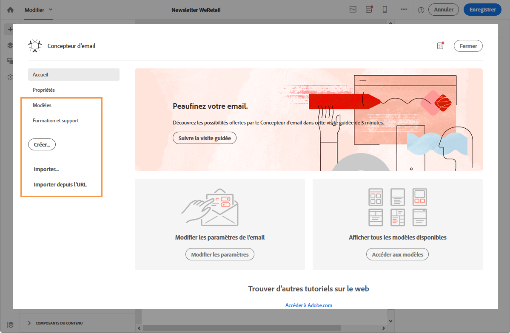
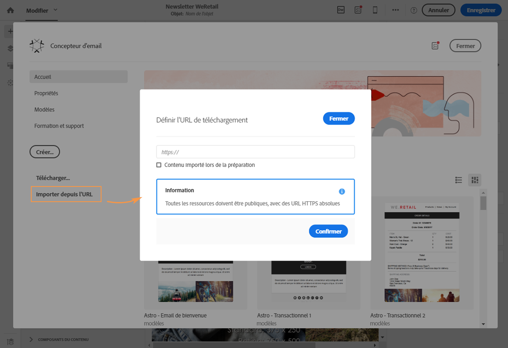
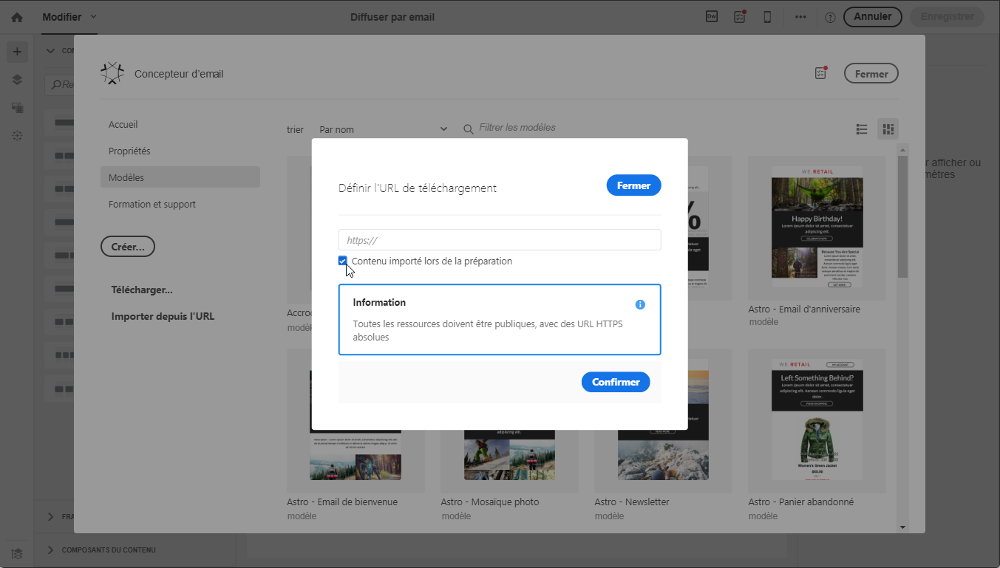

# Conception à l'aide de contenu existant {#designing-using-existing-content}

## Sélectionner un contenu existant{#selecting-an-existing-content}

Adobe Campaign est fourni avec un ensemble de contenus prédéfinis pour vous aider à démarrer. Vous pouvez utiliser l’une de ces méthodes ou, si le contenu du message que vous devez envoyer est en cours de préparation en dehors d’Adobe Campaign, vous pouvez l’importer à partir de votre ordinateur ou d’une URL.

Lors de la création d’un courrier électronique ou d’une page d’entrée, vous pouvez choisir de charger un contenu existant à partir d’une autre source.

>[!NOTE]
>
>Les images ci-dessous montrent comment charger un contenu existant à l’aide du Concepteur [de](../../designing/using/overview.md)messagerie.

1. Après avoir créé le courrier électronique ou la page d’entrée, ouvrez son contenu.
1. Cliquez sur l'icône Accueil pour accéder à la page d'accueil du **[!UICONTROL Concepteur d'email]**.

   

1. Sélectionnez la source du contenu à charger :

   * [Modèles de contenu](../../designing/using/using-reusable-content.md#content-templates) : cliquez sur l'onglet **[!UICONTROL Modèles]**.
   * [Contenu entièrement nouveau](../../designing/using/designing-from-scratch.md#designing-an-email-content-from-scratch) : cliquez sur le bouton **[!UICONTROL Créer]**.
   * [Contenu depuis votre ordinateur sous la forme d'un fichier ZIP ou HTML](#importing-content-from-a-file) : cliquez sur le bouton **[!UICONTROL Télécharger]**.
   * [Contenu depuis une URL existante](#importing-content-from-a-url) (uniquement pour les emails) : cliquez sur le bouton **[!UICONTROL Importer depuis l'URL]**.
   

1. Chargez le contenu. Le contenu sélectionné remplace le contenu actuel.

   Une fois importé, le contenu peut être modifié et personnalisé.

   >[!NOTE]
   >
   >Le [Concepteur d'email](../../designing/using/overview.md) utilise un balisage spécifique. Le contenu HTML standard téléchargé dans Campaign doit correspondre au balisage attendu pour être entièrement compatible et éditable dans le Concepteur d'email. Si le contenu ne correspond pas, il est téléchargé en mode [de](#compatibility-mode)compatibilité. Pour rendre le contenu existant compatible, consultez [cette section](#editing-existing-contents-with-the-email-designer).

**Rubriques connexes :**

* [Créer un email](../../channels/using/creating-an-email.md)
* [Gestion des pages d'entrée](../../channels/using/getting-started-with-landing-pages.md)

## Editer des contenus existants avec le Concepteur d'email{#editing-existing-contents-with-the-email-designer}

Pour tirer pleinement parti des possibilités d’édition du Concepteur [de](../../designing/using/overview.md)courriels, votre code HTML téléchargé doit contenir un balisage spécifique qui le rend conforme à l’éditeur WYSIWYG.

Si tout ou partie du code HTML ne comporte pas ce balisage, le contenu est alors chargé en mode [de](#compatibility-mode)compatibilité.

Pour rendre un contenu externe existant entièrement modifiable dans le concepteur de courrier électronique, voir la section [Conception d’un courrier électronique à l’aide de contenu](../../designing/using/using-existing-content.md) existant.

## Importation d’un contenu de courrier électronique existant {#importing}

### Importer du contenu depuis un fichier {#importing-content-from-a-file}

Dans la page d'accueil du Concepteur d'email, cliquez sur le bouton **[!UICONTROL Télécharger]** pour télécharger un fichier depuis votre ordinateur, puis confirmez l'opération.

Il n’existe aucune contrainte sur la structure du fichier zip. Cependant, le référencement des fichiers HTML doit être relatif et respecter la structure de l’arborescence du dossier zip.

Les formats suivants sont pris en charge pour l’importation :

* Un fichier HTML avec une feuille de style incorporée
* Dossier .zip contenant le fichier HTML, la feuille de style (.CSS) et les images

>[!NOTE]
>
>Pour le contenu du courrier électronique, nous vous recommandons d’importer des fichiers HTML uniques avec une feuille de style incorporée.

#### Importer du contenu depuis une URL {#importing-content-from-a-url}

Avant d’importer du contenu à partir d’une URL, assurez-vous qu’il respecte les conditions ci-dessous :

* Le contenu doit être accessible au public via cette URL.
* Pour des raisons de sécurité, seules les URL commençant par **[!UICONTROL https]** sont autorisées.
* Assurez-vous que toutes les ressources (images, CSS) sont définies dans des liens absolus et dans HTTPS. Sinon, après l’envoi du courrier électronique, la page miroir s’afficherait sans ses ressources. Voici un exemple de définition de lien absolu :

   ```
   <a href="https://www.mywebsite.com/images/myimage.png">
   ```

>[!NOTE]
>
>Le chargement de contenu à partir d’une URL est disponible uniquement pour le canal de courrier électronique.

Pour récupérer le contenu existant à partir d’une URL, procédez comme suit :

1. Dans la page d'accueil du Concepteur d'email, cliquez sur le bouton **[!UICONTROL Importer depuis l'URL]**.

   

1. Définissez l'URL à partir de laquelle le contenu sera récupéré.
1. Cliquez sur **[!UICONTROL Confirmer]**.

**Rubrique connexe :**

Vidéo [Importer du contenu depuis une URL](https://helpx.adobe.com/campaign/kt/acs/using/acs-email-designer-tutorial.html#Workingwithexistingcontent)

### Récupérer automatiquement du contenu depuis une URL au moment de la préparation {#retrieving-content-from-a-url-automatically-at-preparation-time}

L'import de contenu à partir d'une URL lors de la préparation du message permet de récupérer le contenu HTML le plus récent à chaque préparation. Ainsi, le contenu des emails récurrents est toujours mis à jour au moment de l'envoi. Cette fonctionnalité vous permet également de créer un message planifié à une date spécifique, même si le contenu n’est pas encore prêt.

Pour récupérer le contenu au moment de la préparation, procédez comme suit :

1. Sélectionnez l'option **[!UICONTROL Contenu importé lors de la préparation]**.

   

1. Le contenu de l’URL s’affiche dans l’éditeur en lecture seule.

   >[!CAUTION]
   >
   >A ce stade, l'affichage HTML dans l'éditeur de contenu ne doit pas être pris en compte. Il sera récupéré au cours de la phase de préparation.

1. Pour prévisualiser le contenu de l'URL récupéré, ouvrez le message une fois qu'il a été créé, puis cliquez sur le bouton **[!UICONTROL Prévisualiser]**.

Il est possible de personnaliser l'URL distante à partir de laquelle le contenu sera récupéré. Pour cela, procédez comme suit :

1. Cliquez sur le libellé de l'email en haut de l'écran pour accéder à l'onglet **[!UICONTROL Propriétés]** du Concepteur d'email.
1. Recherchez le champ **[!UICONTROL URL distante]**.

   

1. Insérez le champ de personnalisation, le bloc de contenu ou le texte dynamique de votre choix.

   Le bloc de contenu **[!UICONTROL Date actuelle - YYYYMMDD]**, par exemple, permet d'insérer la date du jour.

   >[!NOTE]
   >
   >Les champs de personnalisation disponibles sont uniquement liés aux attributs de **diffusion** (date de création de l'email, statut, libellé de la campagne, etc.).

### Mode de compatibilité {#compatibility-mode}

Lorsque vous téléchargez un contenu, il doit contenir un balisage spécifique pour être entièrement conforme et modifiable avec l’éditeur WYSIWYG du concepteur de courrier électronique.

Si tout ou partie du code HTML téléchargé n’est pas conforme au balisage attendu, le contenu est alors chargé en "mode de compatibilité", ce qui limite les possibilités d’édition dans l’interface utilisateur.

Lorsqu’un contenu est chargé en mode de compatibilité, vous pouvez toujours effectuer les modifications suivantes dans l’interface (les actions indisponibles sont masquées) :

* Modification du texte ou d’une image
* Insertion de liens et de champs de personnalisation
* Modifier certaines options de style sur le bloc HTML sélectionné
* Définir du contenu conditionnel


D'autres modifications telles que l'ajout de nouvelles sections à votre email ou des styles sophistiqués doivent être effectuées directement dans le code source de l'email via le mode HTML.

Pour plus d'informations sur la conversion d'un email existant en email compatible avec le Concepteur d'email, voir [cette section](../../designing/using/using-existing-content.md).

**Rubrique** connexe :

* [Créer un email](../../channels/using/creating-an-email.md)
* [Présentation vidéo du concepteur de courrier électronique](https://video.tv.adobe.com/v/22771/?autoplay=true&hidetitle=true&captions=fre_fr)
* [Concevoir entièrement un contenu d'email](../../designing/using/designing-from-scratch.md#designing-an-email-content-from-scratch)

## Convertir un contenu HTML {#converting-an-html-content}

Si vous voulez créer un framework de fragments et de modèles modulaires qui peuvent être associés afin d'être réutilisés dans plusieurs emails, vous devriez envisager de convertir le code HTML de votre email en modèle de Concepteur d'email.

Ce cas pratique présente comment convertir rapidement le code HTML d'un email en composants du Concepteur d'email.

>[!CAUTION]
>
>Cette section s’adresse aux utilisateurs expérimentés qui connaissent bien le code HTML.

>[!NOTE]
>
>Tout comme le mode de compatibilité, un composant HTML peut être modifié avec des options limitées : vous pouvez uniquement effectuer une édition statique.

En dehors du concepteur de courrier électronique, assurez-vous que le code HTML d’origine est divisé en sections réutilisables.

Si tel n'est pas le cas, divisez les différents blocs de votre code HTML. Par exemple :

```
<!-- 3 COLUMN w/CTA (SCALED) -->
<table width="100%" align="center" cellspacing="0" cellpadding="0" border="0" role="presentation" style="max-width:680px;">
<tbody>
<tr>
<td class="padh10" align="center" valign="top" style="padding:0 5px 20px 5px;">
<table width="100%" cellspacing="0" cellpadding="0" border="0" role="presentation">
<tbody>
<tr>
...
</tr>
</tbody>
</table>
</td>
</tr>
</tbody>
</table>
<!-- //3 COLUMN w/CTA (SCALED) -->
```

Une fois tous vos blocs identifiés, répétez la procédure suivante dans le Concepteur d'email pour chaque section de votre email existant :

1. Ouvrez le concepteur de courrier électronique pour créer un contenu de courrier électronique vide.
1. Définissez les attributs au niveau du corps : couleurs d’arrière-plan, largeur, etc. For more on this, see [Editing email styles](../../designing/using/styles.md).
1. Ajoutez un composant de structure. Pour plus d’informations sur ce sujet, voir [Modification de la structure](../../designing/using/designing-from-scratch.md#defining-the-email-structure)du courrier électronique.
1. Ajoutez un composant HTML. Pour plus d’informations à ce sujet, voir [Ajout de fragments et de composants](../../designing/using/designing-from-scratch.md#defining-the-email-structure).
1. Copiez-collez votre code HTML dans ce composant.
1. Passer en vue Mobile. For more on this, see [this section](../../designing/using/plain-text-html-modes.md#switching-to-mobile-view).

   L’affichage réactif est rompu, car votre page CSS est absente.

1. Pour corriger ce problème, passez en mode code source et copiez-collez votre section de style dans une nouvelle section de style. Par exemple :

   ```
   <style type="text/css">
   a {text-decoration:none;}
   body {min-width:100% !important; margin:0 auto !important; padding:0 !important;}
   img {line-height:100%; text-decoration:none; -ms-interpolation-mode:bicubic;}
   ...
   </style>
   ```

   >[!NOTE]
   >
   >Veillez à ajouter votre style après cette opération dans une autre balise de style personnalisée.
   >
   >Ne modifiez pas le CSS généré par le Concepteur d'email :
   >
   >* `<style data-name="default" type="text/css">(##)</style>`
   >* `<style data-name="supportIOS10" type="text/css">(##)</style>`
   >* `<style data-name="mediaIOS8" type="text/css">(##)</style>`
   >* `<style data-name="media-default-max-width-500px" type="text/css">(##)</style>`
   >* `<style data-name="media-default--webkit-min-device-pixel-ratio-0" type="text/css">(##)</style>`


1. Revenez à la vue mobile pour vérifier que votre contenu s'affiche correctement et enregistrez vos modifications.
