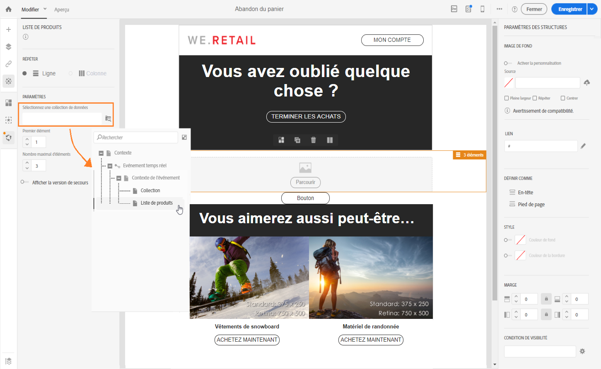

# Utiliser des listes de produits dans un message transactionnel      {#using-product-listings}

>[!IMPORTANT]
>
>Les listes de produits ne sont disponibles que pour les **messages d’email transactionnel** via l’interface du [Concepteur d’email](../../designing/using/designing-content-in-adobe-campaign.md#email-designer-interface).

Lors de la modification du contenu d’un email transactionnel, vous pouvez créer des listes de produits référençant une ou plusieurs collections de données. Par exemple, dans un email d’abandon de panier, vous pouvez inclure la liste de tous les produits figurant dans le panier de l’utilisateur au moment où il a quitté le site web, avec une image, le prix et un lien vers chaque produit.

Pour ajouter une liste de produits abandonnés dans un message transactionnel, suivez les étapes ci-dessous.

Vous pouvez également regarder [cette série de vidéos](https://experienceleague.adobe.com/docs/campaign-standard-learn/tutorials/designing-content/product-listings-in-transactional-email.html?lang=fr#configure-product-listings-in-transactional-emails) expliquant les étapes nécessaires à la configuration de listes de produits dans un email transactionnel.

>[!NOTE]
>
>Adobe Campaign ne prend pas en charge les listes de produits imbriquées, ce qui signifie que vous ne pouvez pas inclure une liste de produits dans une autre.

## Définir une liste de produits           {#defining-a-product-listing}

Avant de pouvoir utiliser une liste de produits dans un message transactionnel, vous devez définir au niveau de l’événement la liste des produits et les champs de chaque produit de la liste que vous souhaitez afficher. Voir à ce propos la section [Définir des collections de données](../../channels/using/configuring-transactional-event.md#defining-data-collections).

1. Dans le message transactionnel, cliquez sur le bloc **[!UICONTROL Contenu]** pour modifier le contenu de l’email.
1. Placez un composant de structure dans l’espace de travail. Voir à ce propos la section [Définir la structure de l&#39;email](../../designing/using/designing-from-scratch.md#defining-the-email-structure).

   Par exemple, sélectionnez un composant de structure à une colonne et ajoutez un composant de texte, un composant d’image et un composant de bouton. Voir à ce propos la section [Utiliser des composants de contenu](../../designing/using/designing-from-scratch.md#about-content-components).

1. Sélectionnez le composant de structure que vous venez de créer et cliquez sur l’icône **[!UICONTROL Activer la liste de produits]** dans la barre d’outils contextuelle.

   

   Le composant de structure est mis en surbrillance avec un cadre orange et les paramètres de **[!UICONTROL Liste de produits]** sont affichés dans la palette gauche.

   

1. Sélectionnez l’affichage des éléments de la collection :

   * **[!UICONTROL Ligne]** : horizontalement, c’est-à-dire que chaque élément se trouve sur une ligne.
   * **[!UICONTROL Colonne]** : verticalement, c’est-à-dire que les éléments sont côte à côte sur une même ligne.

   >[!NOTE]
   >
   >L’option **[!UICONTROL Colonne]** n’est disponible que lorsque vous utilisez un composant de structure multicolonne (**[!UICONTROL Colonne 2:2]**, **[!UICONTROL Colonne 3:3]** et **[!UICONTROL Colonne 4:4]** ). Lors de l’édition de la liste de produits, ne remplissez que la première colonne. Les autres colonnes ne seront pas prises en compte. Pour plus d’informations sur la sélection de composants de structure, voir [Définir la structure de l&#39;email](../../designing/using/designing-from-scratch.md#defining-the-email-structure).

1. Sélectionnez la collection de données que vous avez créée lors de la configuration de l’événement associé au message transactionnel. Elle se trouve sous le nœud **[!UICONTROL Contexte]** > **[!UICONTROL Evénement temps réel]** > **[!UICONTROL Contexte de l’événement]**.

   

   Pour plus d’informations sur la configuration de l’événement, consultez la section [Définir des collections de données](../../channels/using/configuring-transactional-event.md#defining-data-collections).

1. Utilisez la liste déroulante **[!UICONTROL Premier élément]** pour sélectionner l’élément qui sera au début de la liste affichée dans l’email.

   Par exemple, si vous sélectionnez 2, le premier élément de la collection ne sera pas affiché dans l’email. La liste de produits commencera sur le deuxième élément.

1. Sélectionnez le nombre maximal d’éléments à afficher dans la liste.

   >[!NOTE]
   >
   >Si vous souhaitez que les éléments de votre liste s’affichent verticalement (**[!UICONTROL Colonne]**), le nombre maximal d’éléments est limité en fonction du composant de structure sélectionné (2, 3 ou 4 colonnes). Pour plus d’informations sur la sélection de composants de structure, consultez la section [Editer la structure de l’email](../../designing/using/designing-from-scratch.md#defining-the-email-structure).

## Remplir la liste de produits           {#populating-the-product-listing}

Pour afficher une liste des produits provenant de l’événement associé à l’email transactionnel, suivez les étapes ci-dessous.

Pour plus d’informations sur la création d’une collection et de champs associés lors de la configuration de l’événement, consultez la section [Définir des collections de données](../../channels/using/configuring-transactional-event.md#defining-data-collections).

1. Choisissez le composant d’image que vous avez inséré, sélectionnez **[!UICONTROL Activer la personnalisation]** et cliquez sur le crayon dans le volet Paramètres.

   

1. Sélectionnez **[!UICONTROL Ajouter un champ de personnalisation]** dans la fenêtre **[!UICONTROL URL de la source de l’image]** qui s’affiche.

   Dans le nœud **[!UICONTROL Contexte]** > **[!UICONTROL Evénement temps réel]** > **[!UICONTROL Contexte de l’événement]**, ouvrez le nœud correspondant à la collection que vous avez créée (ici **[!UICONTROL Liste des produits]**) et sélectionnez le champ d’image que vous avez défini (ici **[!UICONTROL Image du produit]** ). Cliquez sur **[!UICONTROL Enregistrer]**.

   

   Le champ de personnalisation que vous avez sélectionné est maintenant affiché dans le volet Paramètres.

1. A l’emplacement désiré, sélectionnez **[!UICONTROL Insérer un champ de personnalisation]** dans la barre d’outils contextuelle.

   

1. Dans le nœud **[!UICONTROL Contexte]** > **[!UICONTROL Evénement temps réel]** > **[!UICONTROL Contexte de l’événement]**, ouvrez le nœud correspondant à la collection que vous avez créée (ici **[!UICONTROL Liste des produits]**) et sélectionnez le champ que vous avez créé (ici **[!UICONTROL Nom du produit]**). Cliquez sur **[!UICONTROL Confirmer]**.

   

   Le champ de personnalisation que vous avez sélectionné est maintenant affiché à l’emplacement voulu dans le contenu de l’email.

1. Procédez de la même manière pour insérer le prix.
1. Sélectionnez du texte et cliquez sur **[!UICONTROL Ajouter un lien]** dans la barre d’outils contextuelle.

   

1. Sélectionnez **[!UICONTROL Ajouter un champ de personnalisation]** dans la fenêtre **[!UICONTROL Ajouter un lien]** qui s’affiche.

   Dans le nœud **[!UICONTROL Contexte]** > **[!UICONTROL Evénement temps réel]** > **[!UICONTROL Contexte de l’événement]**, ouvrez le nœud correspondant à la collection que vous avez créée (ici **[!UICONTROL Liste des produits]**) et sélectionnez le champ d’URL que vous avez créé (ici **[!UICONTROL URL du produit]**). Cliquez sur **[!UICONTROL Enregistrer]**.

   >[!IMPORTANT]
   >
   >Pour des raisons de sécurité, veillez à insérer le champ de personnalisation dans un lien commençant par un nom de domaine statique approprié.

   

   Le champ de personnalisation que vous avez sélectionné est maintenant affiché dans le volet Paramètres.

1. Choisissez le composant de structure sur lequel la liste de produits est appliquée et sélectionnez **[!UICONTROL Afficher la version de secours]** pour définir un contenu par défaut.

   

1. Faites glisser un ou plusieurs composants de contenu et éditez-les si nécessaire.

   

   Le contenu de remplacement sera affiché si la collection est vide lorsque l’événement est déclenché, par exemple lorsqu’un client ne possède aucun produit dans son panier.

1. Dans le volet Paramètres, éditez les styles de la liste de produits. Voir à ce propos la section [Gérer les styles d&#39;email](../../designing/using/styles.md).
1. Prévisualisez l’email en utilisant un profil de test associé à l’événement transactionnel adéquat et pour lequel vous avez défini des données de collection. Par exemple, ajoutez les informations suivantes dans la section **[!UICONTROL Données de l’événement]** pour le profil de test que vous souhaitez utiliser :

   

   Pour plus d’informations sur la définition d’un profil de test dans un message transactionnel, consultez [cette section](../../channels/using/testing-transactional-message.md#defining-specific-test-profile).
