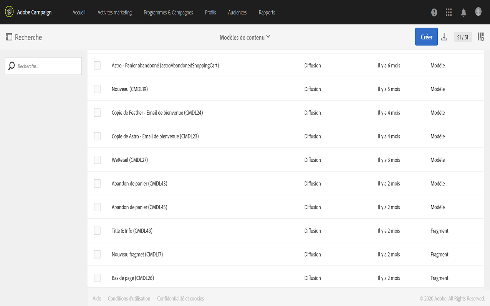
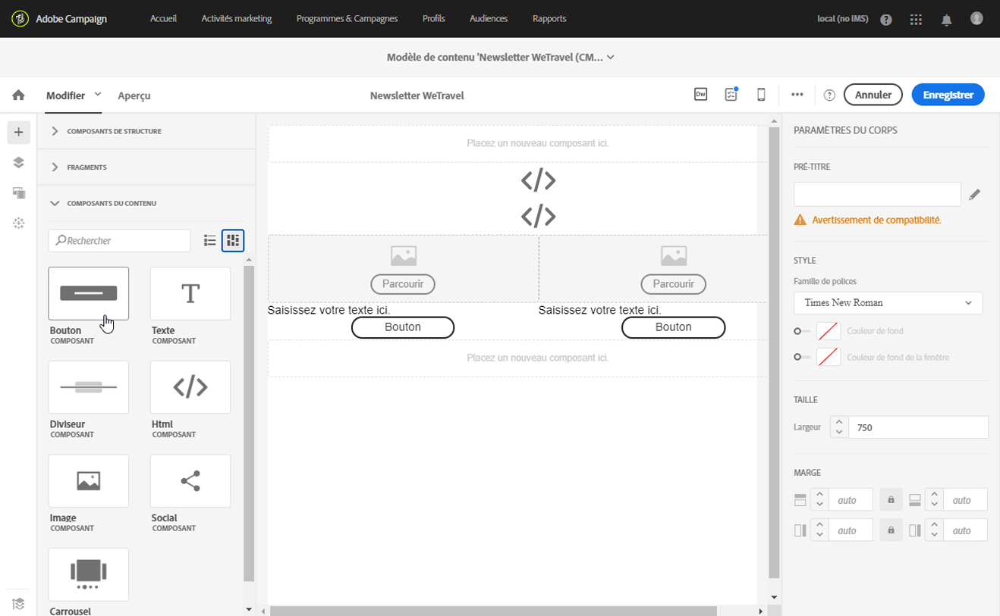
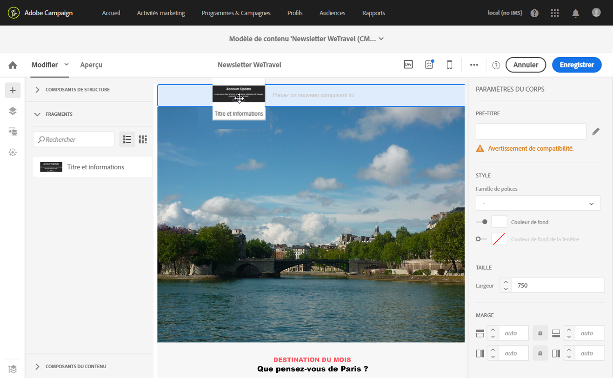
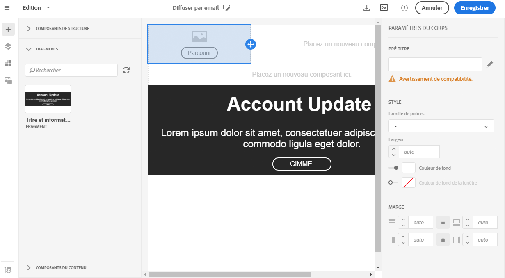
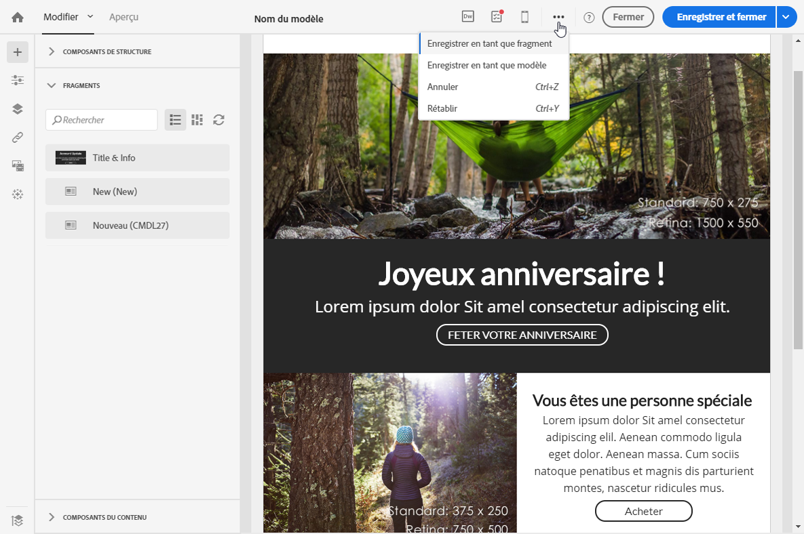
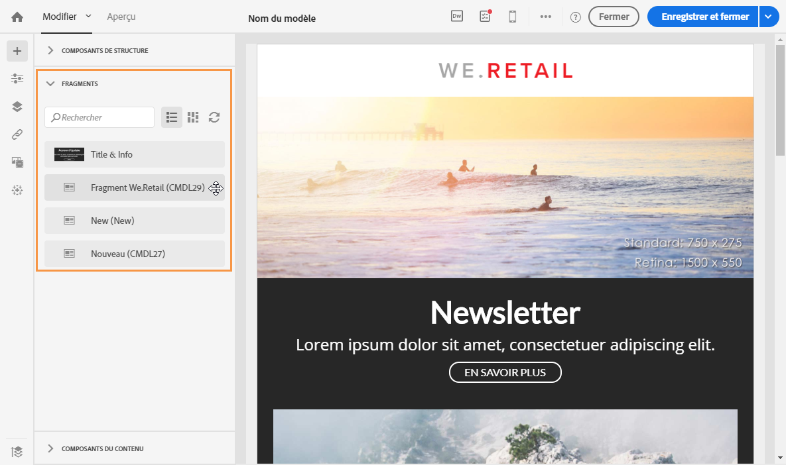

# Création et utilisation d&#39;un contenu réutilisable {#using-reusable-content}

Découvrez comment maîtriser l&#39;édition de contenu d&#39;email. Avec le Concepteur d&#39;email, vous pouvez créer des modèles et des fragments avec votre contenu prédéfini et les réutiliser pour les prochaines diffusions.

## Conception d&#39;emails à l&#39;aide de modèles {#designing-templates}

>[!NOTE]
>
> Dans Adobe Campaign Standard, vous pouvez créer différents types de modèles accessibles à partir du menu **Ressources** > **Modèles**. Les modèles utilisés dans le Concepteur d&#39;email sont des modèles de contenu. Pour plus d&#39;informations, voir [A propos des modèles](../../start/using/marketing-activity-templates.md).

### A propos des modèles de contenu {#content-templates}

Vous pouvez gérer les contenus HTML qui seront proposés dans l&#39;onglet **[!UICONTROL Modèles]** de la page d&#39;accueil du [Concepteur d&#39;email](../../designing/using/designing-content-in-adobe-campaign.md).

Les modèles de contenu d&#39;email d&#39;usine comprennent 18 mises en page optimisées pour les appareils mobiles et quatre modèles réactifs conçus par des artistes Behance. Ils correspondent aux utilisations les plus courantes : messages de bienvenue, newsletters, emails de réengagement, etc. Ils peuvent être facilement personnalisés avec le contenu de vos marques afin de faciliter la création des emails.

Les modèles de contenu HTML sont accessibles à partir de l&#39;écran **[!UICONTROL Ressources]** > **[!UICONTROL Modèles et fragments de contenu]** du [menu Avancé](../../start/using/interface-description.md#advanced-menu). Depuis cet emplacement, vous pouvez gérer les modèles de contenu de landing page et d&#39;email, ainsi que les fragments.

Les modèles de contenu d&#39;usine sont en lecture seule. Pour éditer l&#39;un des modèles, vous devez d&#39;abord le dupliquer.

Vous pouvez créer des modèles ou des fragments et définir vos propres contenus. Pour plus d&#39;informations, consultez [Création d&#39;un modèle de contenu](#creating-a-content-template) et [Création d&#39;un fragment de contenu](#creating-a-content-fragment).

Lors de l&#39;édition de contenu à l&#39;aide du Concepteur d&#39;email, vous pouvez également créer des modèles de contenu en enregistrant le contenu en tant que fragment ou modèle. Voir à ce propos [Enregistrer du contenu en tant que modèle](#saving-content-as-template) et [Enregistrer du contenu en tant que fragment](../../designing/using/using-reusable-content.md#saving-content-as-a-fragment).

**Rubriques connexes :**

* Découvrez comment personnaliser les modèles de contenu [dans cette vidéo](https://docs.adobe.com/content/help/en/campaign-learn/campaign-standard-tutorials/designing-content/email-designer/email-content-templates.html).
* Pour plus d&#39;informations sur l&#39;édition de contenu, voir [A propos de la conception du contenu d&#39;un email](../../designing/using/designing-content-in-adobe-campaign.md).

### Créer un modèle de contenu {#creating-a-content-template}

Vous pouvez créer vos propres modèles de contenu pour les utiliser autant de fois que nécessaire.

L&#39;exemple ci-dessous montre comment créer un modèle de contenu d&#39;email.

1. Accédez à **[!UICONTROL Ressources]** > **[!UICONTROL Modèles et fragments de contenu]**, puis cliquez sur **[!UICONTROL Créer]**.
1. Cliquez sur le libellé d&#39;email de façon à accéder à l&#39;onglet **[!UICONTROL Propriétés]** du Concepteur d&#39;email.
1. Spécifiez un libellé reconnaissable et sélectionnez les paramètres suivants afin d&#39;utiliser ce modèle dans les emails :

   * Sélectionnez **[!UICONTROL Partagé]** ou **[!UICONTROL Diffusion]** dans la liste déroulante **[!UICONTROL Type de contenu]**.
   * Sélectionnez **[!UICONTROL Modèle]** dans la liste déroulante **[!UICONTROL Type HTML]**.

   

1. Si nécessaire, vous pouvez définir une image qui sera utilisée comme miniature du modèle. Sélectionnez-la dans l&#39;onglet **[!UICONTROL Miniature]** des propriétés de modèle.

   

   Cette miniature sera affichée dans l&#39;onglet **[!UICONTROL Modèles]** de la page d&#39;accueil du [Concepteur d&#39;email](../../designing/using/designing-content-in-adobe-campaign.md).

1. Fermez l&#39;onglet **[!UICONTROL Propriétés]** pour retourner à l&#39;espace de travail principal.
1. Ajoutez des composants de structure et de contenu que vous pouvez personnaliser au besoin.
   >[!NOTE]
   >
   > Vous ne pouvez pas insérer des champs de personnalisation ni du contenu conditionnel dans un modèle de contenu.
1. Une fois le modèle édité, enregistrez-le.

Ce modèle peut à présent être utilisé dans n&#39;importe quel email créé avec le Concepteur d&#39;email. Sélectionnez-le dans l&#39;onglet **[!UICONTROL Modèles]** de la page d&#39;accueil du [Concepteur d&#39;email](../../designing/using/designing-content-in-adobe-campaign.md).

### Enregistrer du contenu en tant que modèle {#saving-content-as-template}

Lorsque vous éditez un email avec le Concepteur d&#39;email, vous ne pouvez pas enregistrer directement le contenu de cet email en tant que modèle.

<!--[!CAUTION]
>
>You cannot save as template a structure containing personalization fields or dynamic content.-->

1. Sélectionnez **[!UICONTROL Enregistrer en tant que modèle]** dans la barre d&#39;outils principale du Concepteur d&#39;email.

   

1. Ajoutez un libellé et une description en cas de besoin, puis cliquez sur **[!UICONTROL Enregistrer]**.

   

1. Pour retrouver le modèle que vous venez de créer, accédez à **[!UICONTROL Ressources]** > **[!UICONTROL Modèles et fragments de contenu]**.

1. Pour utiliser votre nouveau modèle, sélectionnez-le dans l&#39;onglet **[!UICONTROL Modèles]** de la page d&#39;accueil du [Concepteur d&#39;email](../../designing/using/designing-content-in-adobe-campaign.md).

   

### Création d&#39;un modèle avec des fragments et des composants {#template-fragments-components}

Vous pouvez maintenant créer un modèle d&#39;email à l&#39;aide du Concepteur d&#39;email. Utilisez des composants de contenu pour représenter les différentes sections de votre email et ajustez les paramètres pour qu&#39;ils ressemblent autant que possible à votre newsletter d&#39;origine. Insérez enfin les fragments que vous venez de créer.

1. A l&#39;aide du Concepteur d&#39;email, créez un modèle. Voir à ce propos la section [Modèles de contenu](#content-templates).
1. Insérez plusieurs composants de structure dans votre modèle, correspondant à l&#39;en-tête, au pied de page et au corps de votre email. Pour plus d&#39;informations sur l&#39;ajout de composants de structure, voir [Editer la structure d&#39;un email à l&#39;aide du Concepteur d&#39;email](../../designing/using/designing-from-scratch.md#defining-the-email-structure).
1. Insérez autant de composants de contenu que nécessaire pour créer le corps de votre newsletter. Il s&#39;agit du contenu éditable de l&#39;email que vous mettrez à jour tous les mois.

   

   Si vous maîtrisez le code HTML, Adobe recommande d&#39;utiliser les composants **[!UICONTROL Html]** dans lesquels vous pouvez copier-coller les éléments les plus complexes de l&#39;email d&#39;origine. Utilisez d&#39;autres composants comme **[!UICONTROL Button]**, **[!UICONTROL Image]** ou **[!UICONTROL Text]** pour le contenu restant. Voir à ce propos la section [A propos des composants de contenu](../../designing/using/designing-from-scratch.md#about-content-components).

   >[!NOTE]
   >
   >L&#39;utilisation du composant **[!UICONTROL Html]** entraîne la création de composants éditables avec des options limitées. Vous devez savoir gérer le code HTML pour sélectionner ce composant.

1. Ajustez les composants du contenu pour qu&#39;ils correspondent autant que possible à l&#39;email d&#39;origine.

   

   Pour plus d&#39;informations sur la gestion des paramètres de style et les attributs intégrés, voir [Editer les styles d&#39;un email](../../designing/using/styles.md).

1. Insérez les deux fragments (en-tête et pied de page) que vous avez précédemment créés dans les composants de structure de votre choix.

   

1. Enregistrez votre modèle.

Vous pouvez maintenant gérer entièrement ce modèle dans le Concepteur d&#39;email afin de créer et mettre à jour la newsletter que vous enverrez tous les mois à vos destinataires.

Pour l&#39;utiliser, créez un email et sélectionnez le modèle de contenu que vous venez de créer.

**Rubrique connexe**:

* [Créer un email](../../channels/using/creating-an-email.md)
* [Vidéo d&#39;introduction au Concepteur d&#39;email](https://video.tv.adobe.com/v/22771/?autoplay=true&hidetitle=true&captions=fre_fr)
* [Concevoir entièrement un contenu d&#39;email](../../designing/using/designing-from-scratch.md#designing-an-email-content-from-scratch)

## A propos des fragments     {#about-fragments}

>[!CONTEXTUALHELP]
>id="ac_fragments"
>title="A propos des fragments"
>abstract="Un fragment est un bloc de contenu réutilisable qui peut être référencé dans un ou plusieurs courriers électroniques."

Un fragment est un composant réutilisable pouvant être référencé dans un ou plusieurs emails.
Il se trouve dans l&#39;interface sous **Ressources** > **Contenu, fragments et modèles**.

Pour optimiser les fragments dans le Concepteur d&#39;email :

* Créez vos propres fragments. Voir [Créer un fragment de contenu](#creating-a-content-fragment) et [Enregistrer du contenu en tant que fragment](#saving-content-as-a-fragment).
* Utilisez-les autant de fois que nécessaire dans vos emails. Voir [Insérer des éléments dans un email](#inserting-elements-into-an-email).
* Lorsque vous éditez un fragment, les modifications sont synchronisées : elles sont automatiquement propagées à tous les emails (à condition qu&#39;ils n&#39;aient pas encore été préparés ou envoyés) contenant ce fragment.

Lorsqu&#39;ils sont ajoutés à un email, les fragments sont verrouillés par défaut. Si vous souhaitez modifier un fragment pour un email spécifique, vous pouvez arrêter la synchronisation avec le fragment d&#39;origine en le déverrouillant dans l&#39;email dans lequel il est utilisé. Les modifications ne seront plus synchronisées.

Pour déverrouiller un fragment dans un email, sélectionnez-le et cliquez sur l&#39;icône représentant un verrou dans la barre d&#39;outils contextuelle.

Ce fragment devient alors un composant autonome qui n&#39;est plus lié au fragment d&#39;origine. Il peut ensuite être édité comme n&#39;importe quel autre composant de contenu. Voir [A propos des composants de contenu](../../designing/using/designing-from-scratch.md#about-content-components).

### Insertion de fragments dans un email {#inserting-elements-into-an-email}

Pour définir le contenu de votre email, vous pouvez ajouter des éléments de contenu aux composants de structure que vous avez préalablement placés. Voir [Editer la structure de l&#39;email](../../designing/using/designing-from-scratch.md#defining-the-email-structure).

1. Accédez aux éléments de contenu en sélectionnant l&#39;icône **+** sur la gauche. Sélectionnez [Fragments](#about-fragments) ou [Composants du contenu](../../designing/using/designing-from-scratch.md#about-content-components).
1. Si vous connaissez déjà tout ou partie du libellé du fragment que vous souhaitez ajouter, vous pouvez le rechercher.

   

1. Déposez un composant de contenu ou un fragment depuis la palette dans un composant de structure de l&#39;email.

   

   Une fois un élément ajouté à l&#39;email, il peut être déplacé à l&#39;intérieur du composant de structure ou vers un autre composant de structure de l&#39;email.

   

1. Editez l&#39;élément pour répondre aux besoins de cet email. Vous pouvez ajouter du texte, des liens, des images, etc.

   >[!NOTE]
   >
   >Les fragments sont verrouillés par défaut lorsqu&#39;ils sont ajoutés à un email. Vous pouvez arrêter la synchronisation avec le fragment d&#39;origine si vous souhaitez modifier le fragment d&#39;un email spécifique. Vous pouvez aussi directement apporter votre modification dans le fragment. Voir [A propos des fragments](#about-fragments).

1. Répétez cette procédure pour tous les éléments que vous devez ajouter à votre email.
1. Enregistrez votre email.

Maintenant que la structure de l&#39;email est remplie, vous pouvez modifier le style de chaque élément de contenu. Voir [Editer un élément](../../designing/using/styles.md).

>[!NOTE]
>
>Si un fragment est modifié, les changements sont automatiquement propagés dans les emails dans lequel il est utilisé. Voir à ce propos la section [A propos des fragments](#about-fragments).

### Créer un fragment de contenu     {#creating-a-content-fragment}

Vous pouvez créer vos propres fragments de contenu pour les utiliser selon vos besoins dans un ou plusieurs emails.

1. Accédez à **[!UICONTROL Ressources]** > **[!UICONTROL Modèles et fragments de contenu]**, puis cliquez sur **[!UICONTROL Créer]**.
1. Cliquez sur le libellé d&#39;email de façon à accéder à l&#39;onglet **[!UICONTROL Propriétés]** du Concepteur d&#39;email.
1. Spécifiez un libellé reconnaissable et sélectionnez les paramètres suivants afin de retrouver le fragment lors de l&#39;édition d&#39;un contenu d&#39;email :

   * Les fragments étant uniquement compatibles avec les emails, sélectionnez **[!UICONTROL Diffusion]** dans la liste déroulante **[!UICONTROL Type de contenu]**.
   * Sélectionnez **[!UICONTROL Fragment]** dans la liste déroulante **[!UICONTROL Type HTML]** afin de pouvoir utiliser ce contenu en tant que fragment.

   

1. Si nécessaire, vous pouvez définir une image qui sera utilisée comme miniature du fragment. Sélectionnez-la dans l&#39;onglet **[!UICONTROL Miniature]** des propriétés de modèle.

   

   Cette miniature apparaîtra en regard du libellé du fragment lorsque vous éditez un email.

1. Fermez l&#39;onglet **[!UICONTROL Propriétés]** pour retourner à l&#39;espace de travail principal.
1. Ajoutez des composants de structure et de contenu que vous pouvez personnaliser au besoin.

   >[!CAUTION]
   >
   >Les fragments ne peuvent pas inclure des champs de personnalisation, un contenu dynamique ni un autre fragment.
   >
   >Evitez d&#39;enregistrer en tant que contenu de fragment avec des composants de structure vides. Une fois le fragment inséré, il ne sera plus modifiable.
   >
   >La [vue mobile](../../designing/using/plain-text-html-modes.md#switching-to-mobile-view) n&#39;est pas disponible dans les fragments.

1. Une fois le fragment édité, enregistrez-le.

Ce fragment peut à présent être utilisé dans n&#39;importe quel email créé avec le Concepteur d&#39;email. Il apparaît sous la section **[!UICONTROL Fragments]** de la palette.

>[!NOTE]
>
>Vous ne pouvez pas insérer de champs de personnalisation dans un fragment sauf s&#39;il est utilisé dans un email et qu&#39;il est déverrouillé. Voir [A propos des fragments](#about-fragments).

### Enregistrer du contenu en tant que fragment     {#saving-content-as-a-fragment}

Lorsque vous éditez un email avec le Concepteur d&#39;email, vous pouvez enregistrer directement une partie de cet email en tant que fragment.

* Vous ne pouvez pas enregistrer en tant que fragment une structure contenant des champs de personnalisation, du contenu dynamique ou un autre fragment.
* Vous pouvez uniquement sélectionner des structures adjacentes.
<!-- - You cannot select an empty structure.-->

1. Lors de l&#39;édition d&#39;un email dans le Concepteur d&#39;email, sélectionnez **[!UICONTROL Enregistrer en tant que fragment]** dans la barre d&#39;outils principale.

   

1. Dans l&#39;espace de travail, sélectionnez les structures qui composeront le fragment.

   

   >[!NOTE]
   >
   >Veillez à sélectionner des structures qui sont adjacentes et qui ne comprennent pas de champs de personnalisation, de contenu dynamique ni un autre fragment.
   <!--You cannot select an empty structure.-->

1. Cliquez sur **[!UICONTROL Créer]**.

1. Ajoutez un libellé et une description en cas de besoin, puis cliquez sur **[!UICONTROL Enregistrer]**.

   

1. Pour retrouver le fragment que vous venez de créer, accédez à **[!UICONTROL Ressources]** > **[!UICONTROL Modèles de contenu et fragments]**.

   

1. Pour utiliser le nouveau fragment, ouvrez n&#39;importe quel contenu d&#39;email et sélectionnez-le dans la liste des fragments.

>[!NOTE]
>La [vue mobile](../../designing/using/plain-text-html-modes.md#switching-to-mobile-view) n&#39;est pas disponible dans les fragments. Si vous souhaitez éditer la vue mobile d&#39;un email, faites-le avant d&#39;enregistrer votre contenu en tant que fragment.

<!--You need to copy-paste the HTML corresponding to the section that you want to save into a new fragment.

>[!NOTE]
>
>To do this, you need to be familiar with HTML code.

To save as a fragment some email content that you created, follow the steps below.

1. When editing an email in the Email Designer, select **[!UICONTROL Edit]** > **[!UICONTROL HTML]** to open the HTML version of that email.
1. Select and copy the HTML corresponding to the part that you want to save.
1. Go to **[!UICONTROL Resources]** > **[!UICONTROL Content templates & fragments]** and click **[!UICONTROL Create]**.
1. Click the email label to access the **[!UICONTROL Properties]** tab of the Email Designer and select **[!UICONTROL Fragment]** from the **[!UICONTROL HTML type]** drop-down list.
1. Select **[!UICONTROL Edit]** > **[!UICONTROL HTML]** to open the HTML version of the fragment.
1. Paste the HTML that you copied where appropriate.
1. Switch back to the **[!UICONTROL Edit]** view to check the result and save the new fragment.-->

## Création d&#39;en-têtes et de pieds de page réutilisables à l&#39;aide de fragments {#header-footer-fragments}

A l&#39;aide du Concepteur d&#39;email, créez un fragment pour chaque section réutilisable. Dans cet exemple, vous allez créer deux fragments : un pour l&#39;en-tête et un autre pour le pied de page. Vous pouvez ensuite copier les parties pertinentes de votre contenu existant dans ces fragments.

Pour cela, procédez comme suit :

1. Dans Adobe Campaign, accédez à **[!UICONTROL Ressources]** > **[!UICONTROL Modèles et fragments de contenu]**, puis créez un fragment pour votre en-tête. Voir à ce propos la section [Créer un fragment de contenu](#creating-a-content-fragment).
1. Ajoutez autant de composants de structure que vous le souhaitez à votre fragment.

   

1. Ajoutez des composants d&#39;image et de texte à votre structure.

   

1. Téléchargez l&#39;image correspondante, saisissez votre texte et ajustez les paramètres.

   

1. Enregistrez votre fragment.
1. Procédez de la même manière pour créer votre pied de page et enregistrez-le.

   

Vos fragments peuvent maintenant être utilisés dans un modèle.
