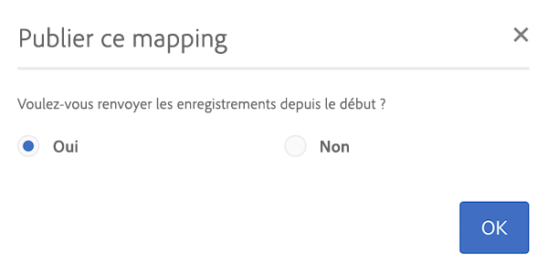
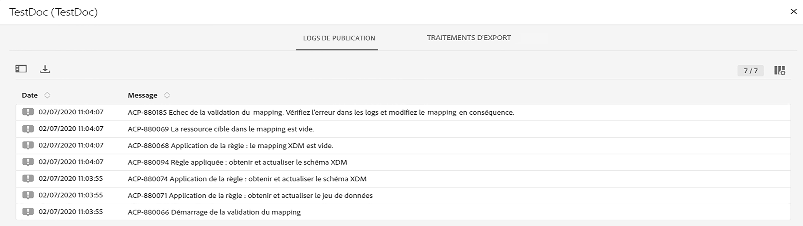
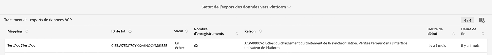
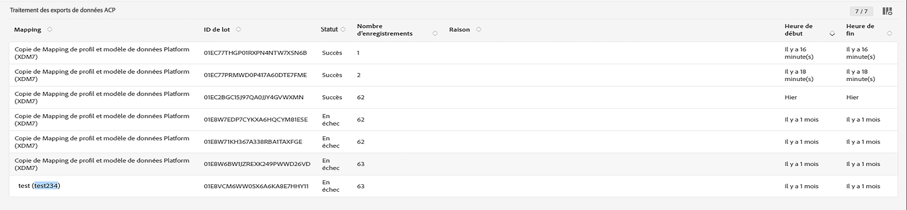
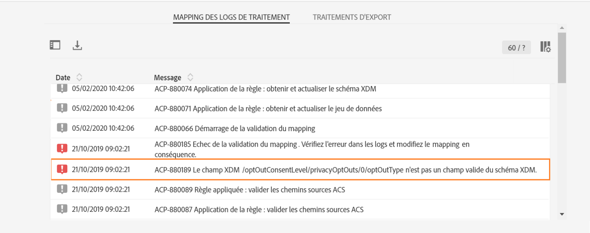
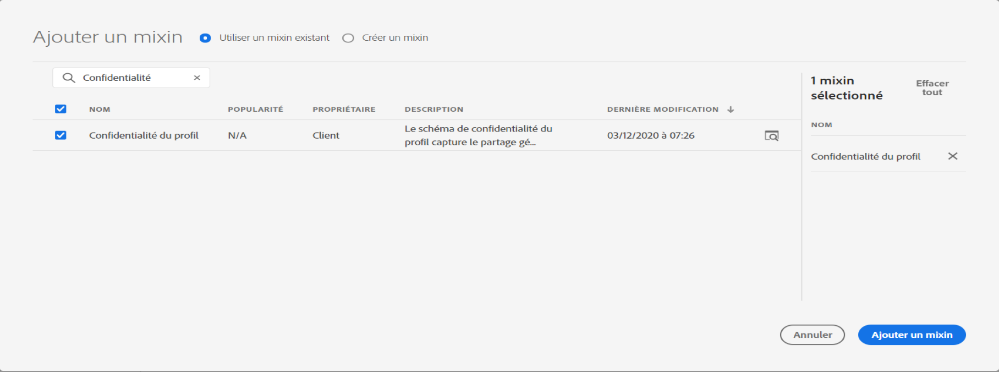
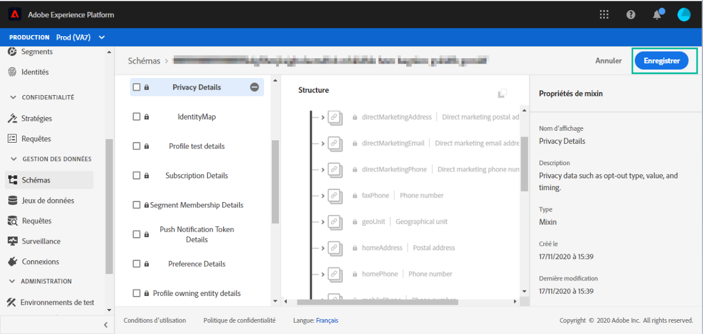

# Activation du mapping {#mapping-activation}

>[!IMPORTANT]
>
>Adobe Experience Platform Data Connector est actuellement en version bêta et peut être fréquemment mis à jour sans préavis. Les clients doivent être hébergés sur Azure (actuellement en version bêta en Amérique du Nord uniquement) pour accéder à ces fonctionnalités. Contactez l’Assistance clientèle d’Adobe si vous souhaitez y accéder.

Une fois la définition du mapping terminée, vous pouvez le publier. Après l’étape de déploiement, la réplication des données entre Campaign Standard et Adobe Experience Platform démarre automatiquement. Vous pouvez arrêter la réplication à tout moment en cliquant sur le bouton **[!UICONTROL Arrêter]**.

Selon les modifications apportées au mapping, vous pouvez choisir de renvoyer tous vos enregistrements vers Adobe Experience Platform.

Dans la vignette de déploiement, vous pouvez accéder aux logs de publication et d’export.

Dans l’onglet **[!UICONTROL Traitements d’exportation]**, vous pouvez surveiller le traitement d’export pour le mapping publié.

Si vous souhaitez surveiller tous les traitements d’export de données, accédez au menu **[!UICONTROL Administration]** > **[!UICONTROL Développement]** > **[!UICONTROL Plateforme]** > **[!UICONTROL Statut de l’export des données vers Platform.]**

Statuts du traitement d’ingestion des données :

* **[!UICONTROL Créé]** : un traitement d’ingestion des données est créé et l’ingestion des données est en cours.
* **[!UICONTROL Échec]** : un traitement d’ingestion des données a échoué. Le champ Raison décrit la cause de l’échec. Il peut être temporaire ou permanent. En cas d’échec temporaire, un nouveau traitement d’ingestion est créé après un intervalle configuré. Dans un premier temps, l’utilisateur peut vérifier la raison de l’échec pour résoudre le problème. Si la raison le renvoie vers l’interface utilisateur d’Adobe Experience Platform, il peut se connecter à cette plateforme et vérifier l’état du lot du jeu de données pour déterminer le motif exact de l’échec.
* **[!UICONTROL Transfert terminé]** : un lot est tout d’abord créé dans Adobe Experience Platform, puis les données sont ingérées dans le lot. Le champ ID de lot indique l’identifiant du lot dans Adobe Experience Platform. Adobe Experience Platform effectue également une post-validation du lot. Ce lot est d’abord marqué comme transféré jusqu’à ce qu’Adobe Experience Platform ait effectué l’étape de post-validation. Un traitement continue d’interroger Adobe Experience Platform pour connaître l’état du lot après transfert. Dans Adobe Experience Platform, un lot peut se trouver dans l’état Échec ou Succès après validation.
* **[!UICONTROL Succès]** : une fois un lot transféré vers Adobe Experience Platform, l’état du traitement (post-validation sur la plateforme) est vérifié après un intervalle configuré. Un état « Succès » indique une ingestion réussie des données dans Adobe Experience Platform.

Dans certains cas, vous pouvez obtenir l’erreur de validation ci-dessous lors de la publication de votre mapping.

Cela se produit lorsque le schéma XDM que vous utilisez n’a pas été mis à jour avec le dernier champ XDM relatif à la gestion de la confidentialité et qu’il contient toujours le champ XDM « ccpa » obsolète.

Pour mettre à jour le schéma XDM, procédez comme suit :

1. Accédez au jeu de données sur Adobe Experience Platform à l’aide du lien présent sur la page de mapping XDM.

1. Accédez à votre schéma XDM.

1. Ajoutez le mixin « Confidentialité du profil » au schéma.

   

1. Enregistrez le schéma, puis réessayez de publier le mapping. La publication devrait maintenant être approuvée.

   
