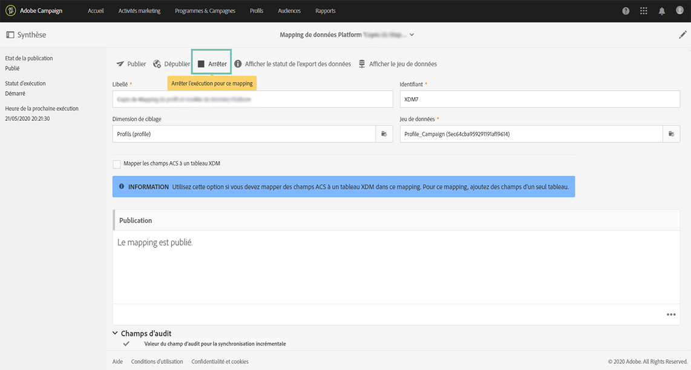

# Déclenchement de l’ingestion des données via les API {#triggering-data-ingestion-apis}

>[!IMPORTANT]
>
>Adobe Experience Platform Data Connector est actuellement en version bêta et peut être fréquemment mis à jour sans préavis. Les clients doivent être hébergés sur Azure (actuellement en version bêta en Amérique du Nord uniquement) pour accéder à ces fonctionnalités. Contactez l’Assistance clientèle d’Adobe si vous souhaitez y accéder.

Adobe Campaign Standard permet de déclencher l’ingestion immédiate des mappings de données par le biais des API et de récupérer le statut de vos demandes d’ingestion.

Cette page décrit comment déclencher et récupérer le statut de l’ingestion de vos mappings de données. Pour des informations globales sur les API de Campaign Standard, consultez [cette section](../../api/using/get-started-apis.md).

## Prérequis {#prerequisites}

Avant d’utiliser les API, le mapping de données doit avoir été configuré et publié dans l’interface de Campaign Standard. Voir à ce propos les sections suivantes :

* [Définition du mapping](../../developing/using/aep-mapping-definition.md)
* [Activation du mapping](../../developing/using/aep-mapping-activation.md)

Une fois le mapping de données créé, vous devez l’arrêter afin de pouvoir le déclencher à votre convenance depuis les API. Pour ce faire, procédez comme suit :

1. Dans Campaign Standard, accédez au menu **[!UICONTROL Administration]** > **[!UICONTROL Développement]** > **[!UICONTROL Plateforme]** > **[!UICONTROL Statut de l’export des données vers Platform.]**

1. Double-cliquez sur le mapping de données pour l’ouvrir, puis cliquez sur le bouton **[!UICONTROL Arrêter]**.

   

1. Enregistrez vos modifications

L’exécution du mapping de données est arrêtée. Vous pouvez utiliser les API de Campaign Standard pour le déclencher manuellement.

## Démarrage de l’ingestion immédiate des données {#starting-immediate-ingestion}

L’ingestion immédiate d’un mapping XDM dans Adobe Experience Platform est déclenchée par une opération POST :

`POST https://mc.adobe.io/<ORGANIZATION>/campaign/dataIngestion/xdmIngestion/<XDM Mapping ID>/ingest`

>[!NOTE]
>
>Pour exécuter l’appel d’API POST d’ingestion, l’utilisateur doit disposer d’un rôle d’**exécution de fonction SQL**. Ce rôle peut être attribué par un administrateur de Campaign Standard en exécutant le Script JS suivant :
>
>
```
>var sqlRoleObj = REST.head.roleBase.sql.get();
>REST.head.securityGroup.Administrators.roles.post(sqlRoleObj);
>```

L’opération POST renvoie des informations concernant le statut de la demande créée :

* Demande envoyée avec succès pour le mapping XDM :

```
{
"requestId": <value>,
"info": "Ingestion request submitted successfully for the Mapping ID: <value>",
"status":"Success"
}
```

* Demande déjà en cours pour le mapping XDM :

```
{
"requestId": <value>,
"info": "Ingestion request already in progress for the Mapping ID: <value>",
"status":"In Progress"
}
```

* Échec de la demande, car le mapping XDM n’est pas publié ou est arrêté :

```
{
"info": "Unable to submit data ingestion request, XDM Mapping ID: <value> is not stopped",
"status": "Failed"
}
{
"info": "Unable to submit data ingestion request, XDM Mapping ID: <value> is not published",
"status": "Failed"
}
```

## Récupération du statut d’une demande d’ingestion {#retrieving-status}

Il est possible de récupérer le statut d’une demande d’ingestion à l’aide d’une opération GET et de l’identifiant de la demande souhaitée dans les paramètres :

```
GET https://mc.adobe.io/<ORGANIZATION>/campaign/dataIngestion/xdmIngestion/<XDM Mapping ID>/ingest
{"requestId"="<value>"}
```

>[!NOTE]
>
>Des informations détaillées sur le statut de la demande de mapping XDM et ses traitements associés sont disponibles dans l’interface Campaign Standard, dans le menu **[!UICONTROL Statut de l’export des données vers Platform]** (voir [Activation du mapping](../../developing/using/aep-mapping-activation.md)).

L’opération GET renvoie les informations suivantes :

* **batchId** : ce champ n’est renseigné que si un échec s’est produit après la préparation et le transfert par lots.
* **info** : l’identifiant du mapping XDM.
* **numRecords** : nombre d’enregistrements ingérés (statut de succès uniquement).
* **status** : statut de la demande d’ingestion (succès/échec/en cours).

Les réponses possibles à l’opération GET sont les suivantes :

* Demande d’ingestion réussie :

   ```
   {
   "batchId": "",
   "info": "Mapping Id: <value>. ",
   "numRecords": 15,
   "requestId": 3520,
   "status": "Success"
   }
   ```

* Échec de la demande d’ingestion sans aucun enregistrement ingéré :

   ```
   {
   "batchId": "",
   "info": "Mapping Id: <value>. ACP-880056 Failed to fetch the record from the database.",
   "numRecords": 0,
   "requestId": 3520,
   "status": "Failed"
   }
   ```

* Échec de la demande d’ingestion, avec un enregistrement chargé dans un lot :

   ```
   {
   "batchId": "<value>",
   "info": "Mapping Id: <value>. ACP-880096 Sync Job failed to upload. Please check the error in the Platform UI.",
   "numRecords": 0,
   "requestId": <value>,
   "status": "Failed"
   }
   ```

* Demande d’ingestion abandonnée après ingestion de certains enregistrements (cette situation est possible en cas de blocage) :

   ```
   {
   "batchId": "",
   "info": "Mapping Id: <value>. Ingestion request aborted due to some issue with data ingestion service. Please submit a new request",
   "numRecords": 0,
   "requestId": <value>,
   "status": "Aborted"
   }
   ```

* Demande d’ingestion en cours (lorsque la demande a chargé les données dans un lot ou lorsque le lot est en cours de préparation pour la demande) :

   ```
   {
   "batchId": "",
   "info": "Mapping Id: <value>.",
   "numRecords": 0,
   "requestId": <value>,
   "status": "In Progress"
   }
   ```
