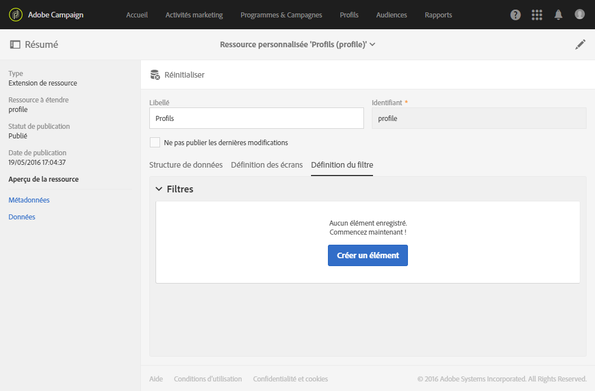
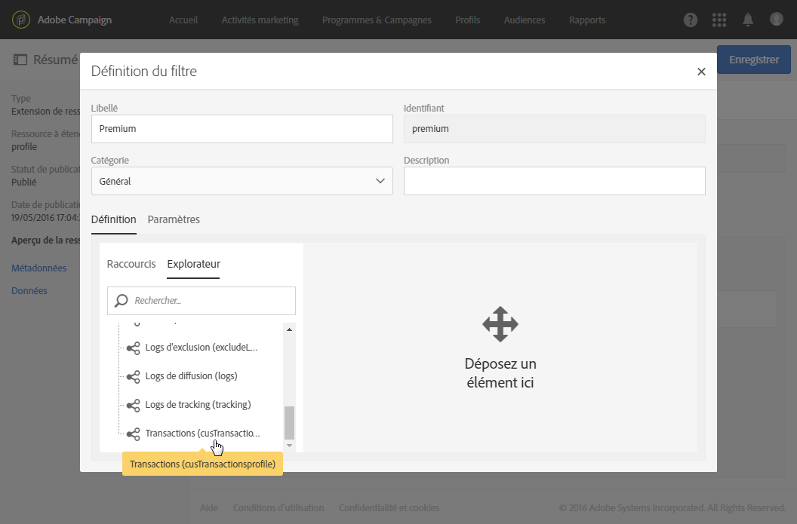
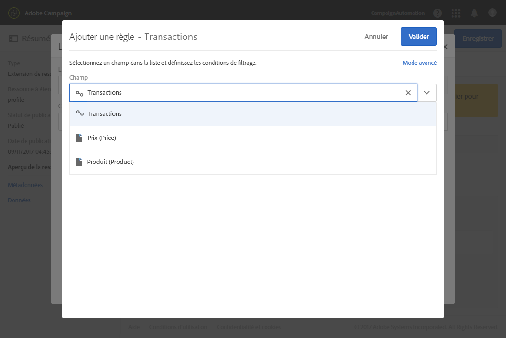
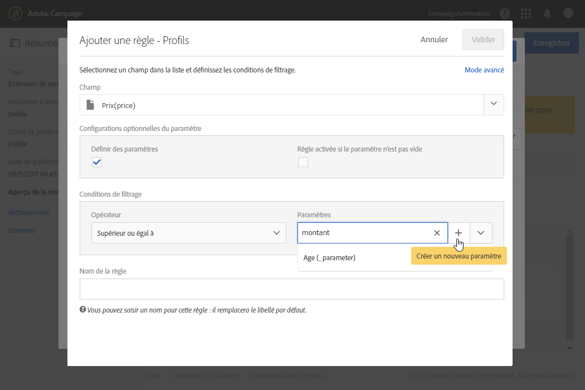
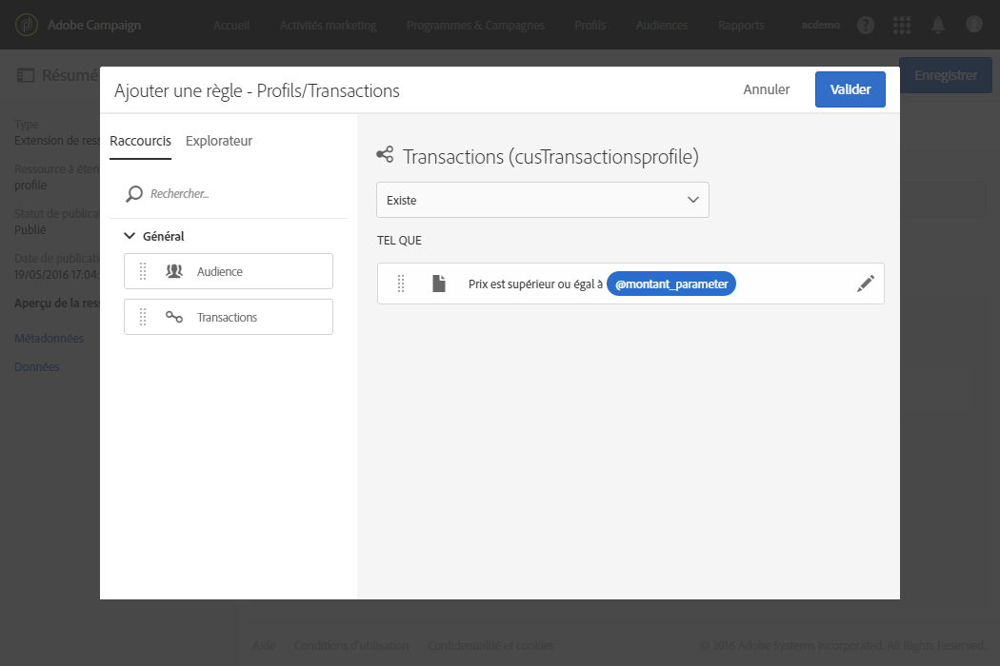
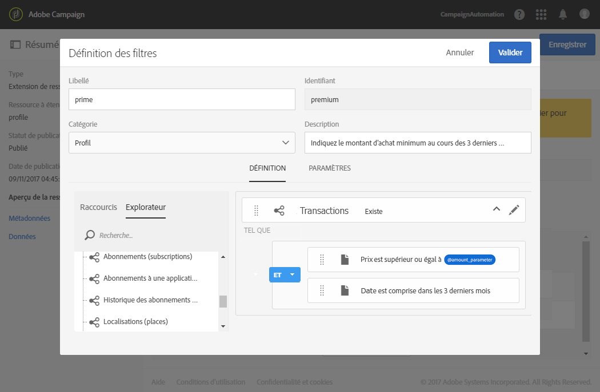
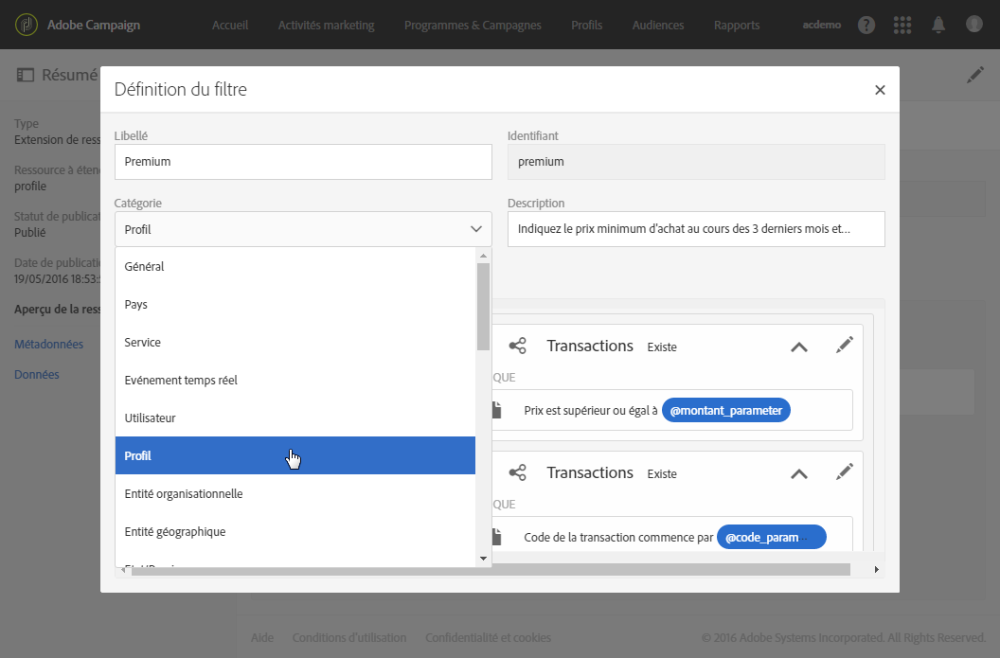
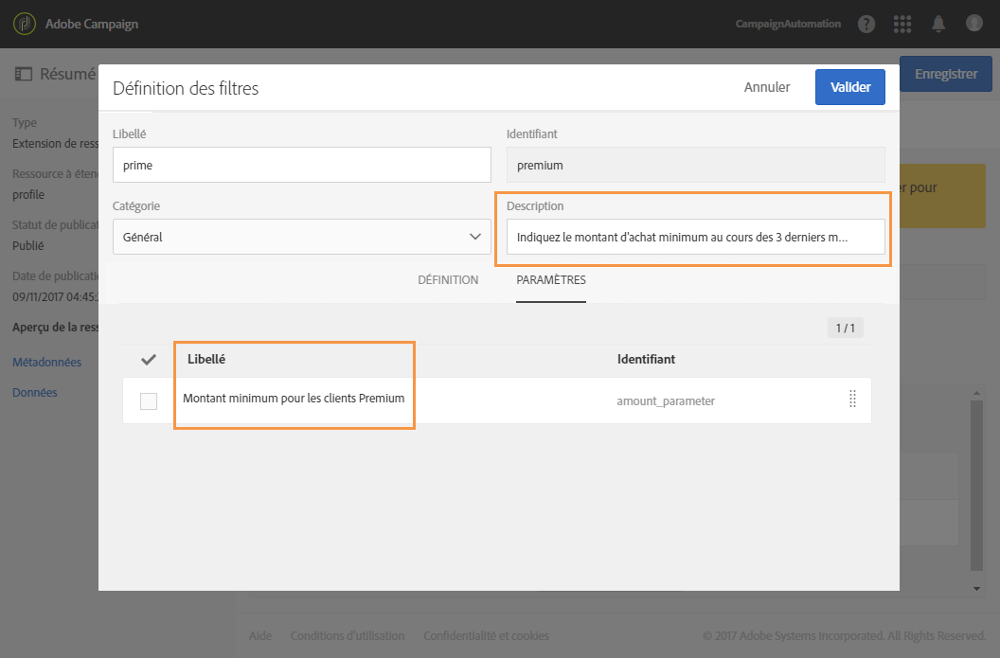
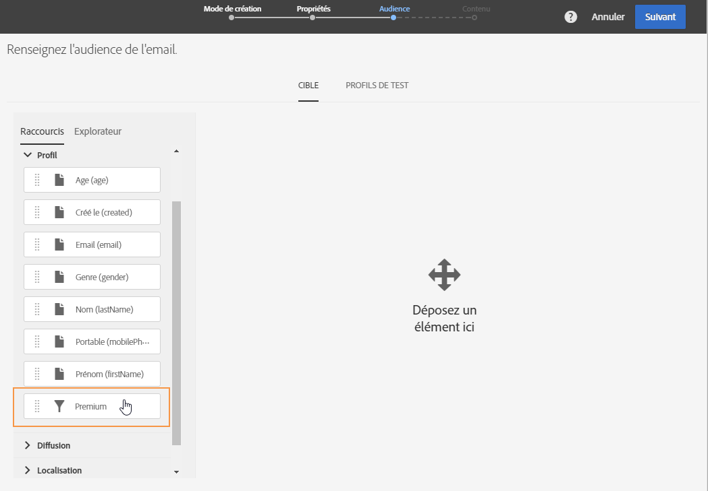
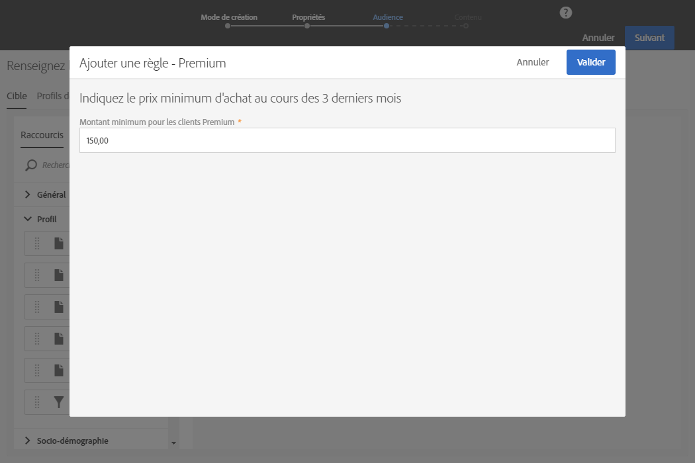

# Configuration de la définition des filtres{#configuring-filter-definition}

Dans l'onglet **[!UICONTROL Définition des filtres]**, vous pouvez créer des filtres avancés de sorte que les utilisateurs puissent directement y accéder lorsqu'ils élaborent des requêtes complexes, telles que la définition d'une audience.

Cette étape n'est pas obligatoire, car vous pourrez toujours renseigner votre ressource et accéder à ses données via les workflows, les audiences et l'API REST.

Ces filtres sont utilisés dans l'éditeur de requêtes sous la forme de règles pré-paramétrées. Ils permettent de limiter le nombre d'étapes à réaliser afin d'obtenir le paramétrage souhaité, ce qui est particulièrement intéressant dans le cas de segmentations répétitives.

Par exemple, vous pouvez créer un filtre permettant de sélectionner toutes les transactions supérieures à un montant donné au cours des trois derniers mois.

Pour cela, vous devez étendre la ressource **[!UICONTROL Profiles]** et définir une liaison de filtre vers une table des transactions (que vous aurez préalablement créées). Vous devez également définir une règle indiquant que le prix de la transaction doit être supérieur ou égal à un paramètre donné et que la date de transaction doit être comprise dans une plage correspondant aux trois derniers mois.

1. Veillez à créer et publier une table des transactions. Voir [Création ou extension de la ressource](../../developing/using/creating-or-extending-the-resource.md).

   >[!NOTE]
   >
   >Cette procédure utilise comme exemple une table personnalisée des transactions. Adaptez-la aux besoins de votre entreprise.

1. Avant de définir un filtre associé à la table des transactions dans la ressource **[!UICONTROL Profiles]**, assurez-vous de définir le lien vers cette table et de publier vos modifications. Voir [Définir les liens avec d'autres ressources](../../developing/using/configuring-the-resource-s-data-structure.md#defining-links-with-other-resources) et [Mettre à jour la structure de la base de données](../../developing/using/updating-the-database-structure.md).
1. Dans l'onglet **[!UICONTROL Définition]** de l'écran de définition de votre nouveau filtre, sélectionnez la table des transactions.

   

1. Dans la fenêtre **[!UICONTROL Ajouter une règle - Profils/Transactions]**, placez la table des transactions dans l'espace de travail. Dans la fenêtre suivante qui s'affiche, sélectionnez le champ que vous souhaitez utiliser.

   

1. Dans les **[!UICONTROL Configurations optionnelles du paramètre]** de la fenêtre **[!UICONTROL Ajouter une règle - Transactions]**, cochez la case **[!UICONTROL Définir des paramètres]**.

   Dans les **[!UICONTROL Conditions de filtrage]**, sélectionnez l'opérateur **[!UICONTROL Supérieur ou égal à]**. Dans le champ **[!UICONTROL Paramètres]**, saisissez un nom et cliquez sur le signe + pour créer le nouveau paramètre.

   

1. Validez vos modifications. Il s'agit du champ paramétrable que l'utilisateur devra renseigner pour effectuer sa requête.

   

1. Combinez cette règle à une autre règle précisant que la date doit être comprise dans une plage correspondant aux trois derniers mois.

   

1. Choisissez la catégorie dans laquelle figurera votre filtre.

   

1. Dans l'onglet **[!UICONTROL Paramètres]** de l'écran de définition du filtre, modifiez la description et le libellé pour indiquer clairement aux utilisateurs l'objet de votre filtre. Ces informations apparaîtront dans l'éditeur de requêtes.

   

   Si vous définissez plusieurs champs paramétrables, vous pouvez modifier leur ordre d'apparition dans l'interface.

1. Enregistrez vos modifications et publiez les ressources. Voir à ce sujet la section [Mettre à jour la structure de la base de données](../../developing/using/updating-the-database-structure.md).

Une fois l'extension de la ressource **[!UICONTROL Profiles]** publiée, les utilisateurs verront apparaître ce filtre dans l'onglet des raccourcis de l'interface de l'[éditeur de requêtes](../../automating/using/editing-queries.md).

Lors de la création d'un email, ils pourront ainsi facilement définir leur audience afin que le message soit envoyé à tous les clients ayant dépensé plus d'un certain montant au cours des trois derniers mois.

Il leur suffira de saisir le montant souhaité dans la boîte de dialogue qui s'affiche au lieu d'effectuer eux-mêmes le paramétrage.

