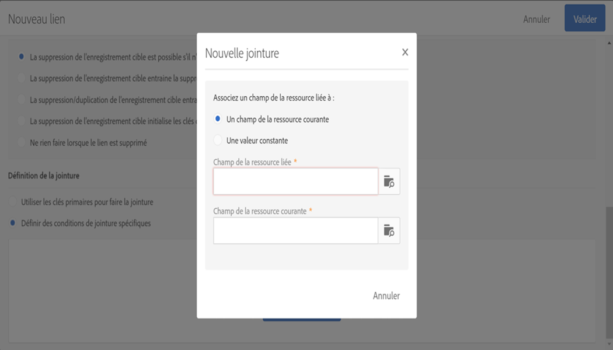

# Configuration de la structure de données de la ressource{#configuring-the-resource-s-data-structure}

Suite à la création d'une ressource personnalisée, vous devez paramétrer la structure de données.

Lors de l'édition de la ressource, dans l'onglet **[!UICONTROL Structure de données], il est possible d'ajouter :**

* [des champs ;](../../developing/using/configuring-the-resource-s-data-structure.md#adding-fields-to-a-resource)
* [des clés d'identification ;](../../developing/using/configuring-the-resource-s-data-structure.md#defining-identification-keys)
* [des index ;](../../developing/using/configuring-the-resource-s-data-structure.md#defining-indexes)
* [des liens.](../../developing/using/configuring-the-resource-s-data-structure.md#defining-links-with-other-resources)
* [Envois](../../developing/using/configuring-the-resource-s-data-structure.md#defining-sending-logs-extension)

## Ajouter des champs à une ressource {#adding-fields-to-a-resource}

Vous pouvez ajouter de nouveaux champs à une ressource pour stocker les données qui ne font pas partie du modèle de données d'usine.

1. Utilisez le bouton **[!UICONTROL Créer un élément]pour créer un champ.**
1. Indiquez un libellé, un identifiant, un type de champ et définissez la longueur maximale autorisée pour ce champ.

   Le champ **[!UICONTROL Identifiant]est obligatoire et doit être unique pour chaque champ ajouté.**

   >[!NOTE]
   >
   >Si vous laissez le champ **[!UICONTROL Libellé]vide, il sera automatiquement renseigné à partir de l'identifiant.**

   

1. Pour modifier l'un des champs, cliquez sur le bouton **[!UICONTROL Editer les propriétés].**

   

1. Dans l'écran **[!UICONTROL Définition du champ], vous pouvez définir une catégorie qui servira pour l'audience et le ciblage ou encore ajouter une description.**

   

1. Cochez la case **[!UICONTROL Définir une liste de valeurs autorisées]si vous devez spécifier les valeurs qui seront proposées à l'utilisateur (valeurs d'énumération).**

   Then, click **[!UICONTROL Create element]** and specify a **[!UICONTROL Label]** and **[!UICONTROL Value]**. Ajoutez autant de valeurs que nécessaire.

1. Cochez la case **[!UICONTROL Ajouter les champs d'audit]si vous souhaitez inclure les champs relatifs à la date de création, à l'utilisateur qui a créé la ressource, à la date et à l'auteur de la dernière modification.**
1. Cochez la case **[!UICONTROL Ajouter les champs de gestion des autorisations d'accès]si vous souhaitez inclure les champs indiquant qui a le droit d'accéder à cette ressource.**

   Ces champs figurent dans les données et les métadonnées que l'on peut afficher une fois la mise à jour de la base de données effectuée. Voir à ce sujet la section [Mettre à jour la structure de la base de données](../../developing/using/updating-the-database-structure.md).

1. Cochez l'option **[!UICONTROL Ajouter un champ d'identifiant automatique]pour générer automatiquement un identifiant.** Les entités existantes resteront vides.
1. Si vous souhaitez modifier la façon dont le nom des éléments de la ressource s'affichera dans les listes et les étapes de création, cochez la case **[!UICONTROL Personnaliser le titre de la ressource.]** Sélectionnez un champ parmi ceux que vous avez créés pour cette ressource.

   

Les champs de votre ressource sont maintenant définis.

## Définir les clés d'identification {#defining-identification-keys}

Chaque ressource doit posséder au moins une clé permettant de l'identifier de manière unique. Vous pouvez par exemple définir une clé pour que deux produits ne puissent pas avoir le même ID dans une table d'achats.

1. Si vous souhaitez obtenir une clé technique, qui sera automatiquement générée de manière incrémentale, définissez sa taille de stockage dans la section **[!UICONTROL Clé primaire automatique].**

   

1. Utilisez le bouton **[!UICONTROL Créer un élément]pour créer une clé.**

   Les champs **[!UICONTROL Libellé]** et **Identifiant]sont renseignés par défaut, mais ils peuvent être édités.[!UICONTROL **

1. Pour définir les éléments composant cette clé, cliquez sur **[!UICONTROL Créer un élément]et sélectionnez les champs que vous avez créés pour cette ressource.**

   

   Les clés créées s'affichent dans la section **[!UICONTROL Clés personnalisées].**

Les clés d'identification de la ressource sont maintenant créées.

## Définir les index {#defining-indexes}

Un index peut référencer un ou plusieurs champs de la ressource. Les index permettent à la base de données de trier les enregistrements afin de les retrouver plus facilement. Ils optimisent les performances des requêtes SQL.

La définition des index est recommandée mais elle n'est pas obligatoire.

1. Utilisez le bouton **[!UICONTROL Créer un élément]pour créer un index.**

   

1. Les champs **[!UICONTROL Libellé]** et **Identifiant]sont renseignés par défaut, mais vous pouvez les modifier.[!UICONTROL **
1. Pour définir les éléments composant cet index, sélectionnez les champs parmi ceux que vous avez créés pour cette ressource.

   

1. Cliquez sur **[!UICONTROL Confirmer]**.

Les index créés s'affichent dans la liste de la section **[!UICONTROL Index].**

## Définir les liens avec d'autres ressources {#defining-links-with-other-resources}

Un lien décrit l'association d'une table avec d'autres tables.

1. Utilisez le bouton **[!UICONTROL Créer un élément]pour créer un lien vers une ressource cible.**
1. Click **[!UICONTROL Select a target resource]**.

   

1. Les ressources s'affichent par ordre alphabétique et peuvent être filtrées par nom. Leur nom technique est indiqué entre parenthèses.

   Select an element from the list and click **[!UICONTROL Confirm]**.

   

1. Sélectionnez le **[!UICONTROL type de lien]en fonction de la cardinalité.** Selon le type de cardinalité choisi, le comportement en cas de suppression ou de duplication des enregistrements peut varier.

   Les différents types de liens sont les suivants :

   * **[!UICONTROL Lien simple de cardinalité 1]** : une occurrence de la table source peut avoir au plus une occurrence correspondante de la table cible.
   * **[!UICONTROL Lien de collection de cardinalité N]** : une occurrence de la table source peut avoir plusieurs occurrences correspondantes de la table cible, mais une occurrence de la table cible peut avoir au plus une occurrence correspondante de la table source.
   * **[!UICONTROL Lien simple de cardinalité 0 ou 1]** : une occurrence de la table source peut avoir au plus une occurrence correspondante de la table cible ou aucune. Ce **[!UICONTROL Type de lien]peut entraîner des problèmes de performances.**
   

1. Dans l'écran **[!UICONTROL Nouveau lien]**, les champs **[!UICONTROL Libellé]et** Identifiant] sont renseignés par défaut, mais vous pouvez les modifier.**[!UICONTROL **

   >[!CAUTION]
   >
   >Il n'est pas possible de renommer un lien après sa création. Pour renommer un lien, vous devez le supprimer et le recréer.

1. La liste **[!UICONTROL Catégorie pour l'audience et le ciblage]permet d'affecter ce lien à une catégorie, ce qui le rend plus visible dans l'outil d'édition de requête.**
1. Si nécessaire, la section **[!UICONTROL Définition du lien inverse]permet d'afficher le libellé et l'identifiant de la ressource dans la ressource ciblée.**
1. Définissez le comportement des enregistrements référencés par le lien dans la section **[!UICONTROL Comportement en cas de suppression/duplication].**

   Par défaut, la suppression de l'enregistrement cible est possible s'il n'est plus référencé par le lien.

   

1. Dans la section **[!UICONTROL Définition de la jointure]**, l'option par défaut **Utiliser les clés primaires pour faire la jointure]est sélectionnée, mais vous pouvez effectuer une sélection parmi deux options :[!UICONTROL **

   * **[!UICONTROL Utiliser les clés primaires pour faire la jointure]** : cette définition de jointure vous permet d'utiliser la clé primaire des profils pour effectuer une réconciliation avec la clé primaire des achats.
   * **[!UICONTROL Définir des conditions de jointure spécifiques]** : cette définition de jointure vous permet de sélectionner manuellement les champs qui effectuent une jointure entre les deux ressources. Si les données ne sont pas correctement configurées, l'enregistrement **Achat** ne sera pas visible.
   

Les liens créés s'affichent dans la liste de la section **[!UICONTROL Liens].**

**Exemple : lier une ressource créée à la ressource 'Profils'**

In this example, we want to link a new resource **Purchase** with the **Profiles **custom resource:

1. Créez la ressource **Achat**.
1. To link it with the **Profiles** custom resource, unfold the **[!UICONTROL Links]** section in the **[!UICONTROL Data structure]** tab and click **[!UICONTROL Create element]**.
1. Select the target resource, here **[!UICONTROL Profiles (profile)]**.
1. Dans cet exemple, conservez le type de lien sélectionné par défaut **[!UICONTROL Lien simple de cardinalité 1].**

   

1. Choose a join definition, here keep the default **[!UICONTROL Use the primary key to make the join]**.

   

1. Au besoin, vous pouvez définir un écran de détail pour pouvoir éditer la ressource **Achat** et la lier à un profil.

   Développez la section **[!UICONTROL Configuration de l'écran de détail]** et cochez la case **Définir un écran de détail]pour configurer l'écran correspondant à chaque élément de la ressource.[!UICONTROL ** Si vous ne cochez pas cette case, le détail des éléments de cette ressource ne sera pas accessible.

1. Click **[!UICONTROL Create element]**.
1. Select your linked resource and click **[!UICONTROL Add]**.

   Your new resource will then be available in the advanced menu by selecting **[!UICONTROL Client data]** &gt; **[!UICONTROL Purchase]**.

   

1. Once your configuration is done, click **[!UICONTROL Confirm]**.

   Vous pouvez maintenant publier la nouvelle ressource.

By adding this link, a **Purchase** tab is added to the profiles detail screen from the **[!UICONTROL Profiles &amp; audiences]** &gt; **[!UICONTROL Profiles]** menu. Cela est propre à la ressource **[!UICONTROL Profil].**

## Définition de l’extension des envois {#defining-sending-logs-extension}

L’extension des envois vous permet :

* d'étendre les capacités des rapports dynamiques en **ajoutant des champs de profil personnalisés** ;
* d’étendre les données des envois avec le **code segment et les données de profil.**

**Étendre avec le code segment**

L’utilisateur peut étendre les logs avec le code segment provenant du moteur du workflow.

Le code segment doit être défini dans le workflow.

Pour activer cette extension, cochez l’option **[!UICONTROL Ajouter un code segment]**.

Pour plus d'informations sur le code segment, voir la section [Segmentation](../../automating/using/segmentation.md).

**Étendre avec un champ de profil**

>[!NOTE]
>
>L’administrateur doit avoir étendu la ressource Profil avec un champ personnalisé.

Cliquez sur **[!UICONTROL Ajouter un champ]et sélectionnez un champ personnalisé dans la ressource de profil.**

Afin de générer une nouvelle sous-dimension liée à la dimension Profil, cochez l’option **[!UICONTROL Ajouter ce champ en tant que nouvelle dimension dans les rapports dynamiques].**

Dans Rapports dynamiques, vous pouvez glisser et déposer la dimension de champ personnalisé dans un tableau à structure libre.

Pour plus d’informations sur les rapports dynamiques, voir la [Liste des composants](../../reporting/using/list-of-components-.md).

>[!CAUTION]
>
>Le nombre de champs envoyés aux rapports dynamiques est limité à 20.

## Editer les propriétés d'une ressource {#editing-resource-properties}

Dans l'écran de la ressource personnalisée, le volet **[!UICONTROL Résumé]indique le statut de la ressource nouvellement créée.** Vous pouvez gérer son accès et ses propriétés générales.

1. Cliquez sur le bouton **[!UICONTROL Editer les propriétés]pour ajouter une description.**

   

1. Si besoin, modifiez le libellé et l'identifiant de la ressource.
1. Si vous devez restreindre l'accès de cette ressource à certaines entités organisationnelles, indiquez-les ici. Seuls les utilisateurs des entités autorisées pourront utiliser cette ressource dans l'application.
1. Enregistrez les modifications.

Vos modifications sont enregistrées. Pour les appliquer, vous devez republier la ressource.

## Générer un identifiant unique pour les profils et les ressources personnalisées {#generating-a-unique-id-for-profiles-and-custom-resources}

Par défaut, les profils et les ressources personnalisées ne sont pas associés à un identifiant d'entreprise lors de leur création. Vous pouvez activer une option qui génère automatiquement un identifiant unique lors de la création des éléments. Cet identifiant peut être utilisé pour :

* Identifier facilement les enregistrements exportés dans un outil externe.
* Réconcilier les enregistrements lors de l'import de données mises à jour traitées dans une autre application.

Il peut être activé uniquement pour les profils et les ressources personnalisées.

1. Créez une nouvelle ressource ou une extension à la ressource Profiles.
1. Dans la définition de la structure des données, cochez l'option **[!UICONTROL Ajouter un champ d'identifiant automatique]** dans la section **Champs[!UICONTROL .]**
1. Enregistrez et publiez la modification apportée à la ressource. Si vous souhaitez que ce mécanisme s'applique aux éléments créés via l'API, cochez l'option permettant d'étendre l'API.

Le champ **[!UICONTROL Identifiant ACS]est maintenant disponible et automatiquement renseigné lorsque de nouveaux éléments sont créés manuellement, depuis l'API, ou insérés à partir d'un workflow d'import.** Le champ d'identifiant ACS est un champ UUID et il est indexé.

Lors de l'export des profils ou des ressources personnalisées, vous pouvez désormais ajouter la colonne **[!UICONTROL Identifiant ACS]si cet identifiant a été activé pour cette ressource.** Vous pouvez réutiliser cet identifiant dans vos outils externes pour identifier les enregistrements.

Lors du nouvel import des données traitées/mises à jour dans une autre application (un système CRM, par exemple), vous pouvez facilement les réconcilier avec cet identifiant unique.

>[!NOTE]
>
>Le champ **[!UICONTROL Identifiant ACS]n'est pas mis à jour pour les profils ou les éléments créés avant l'activation de l'option.** Seuls les nouveaux enregistrements disposeront d'un identifiant ACS. Ce champ est en mode Lecture seule. Vous ne pouvez pas le modifier.

