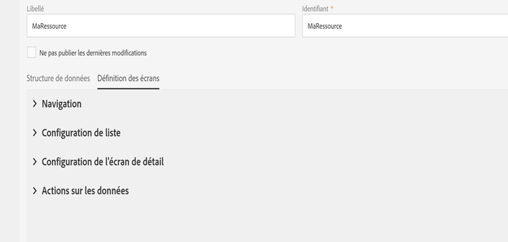
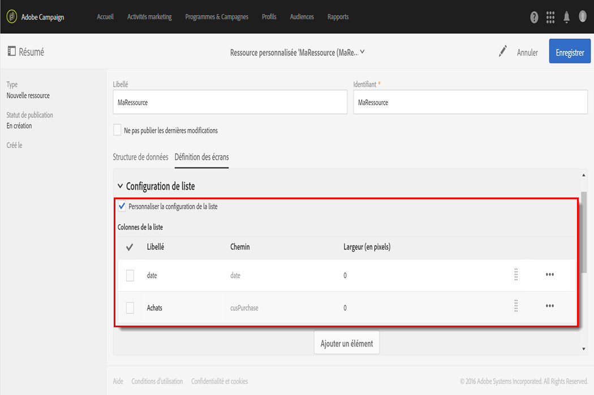
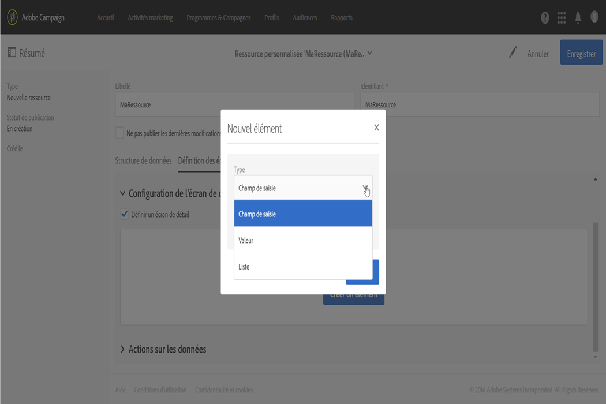
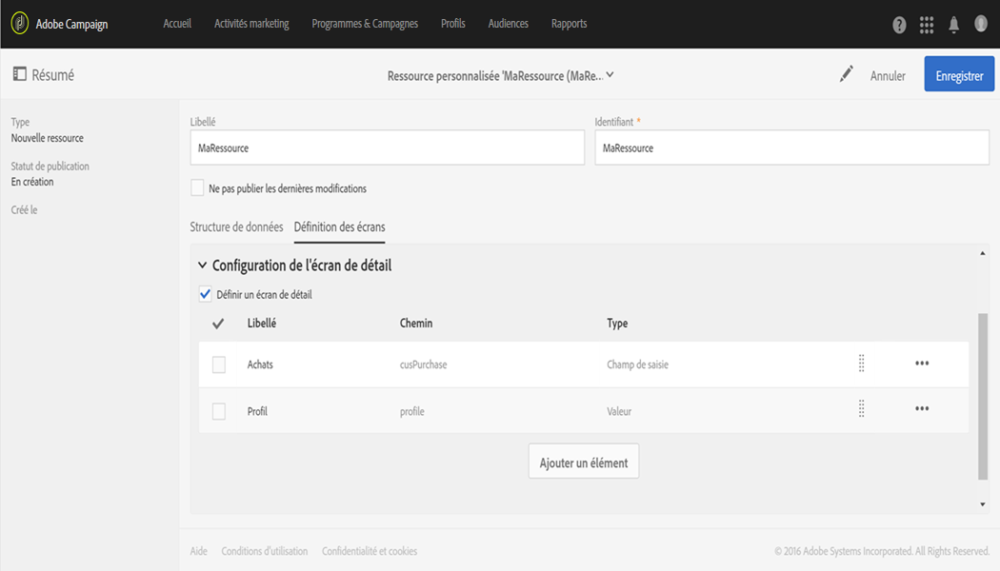
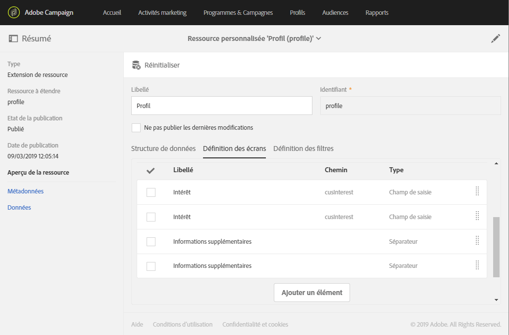
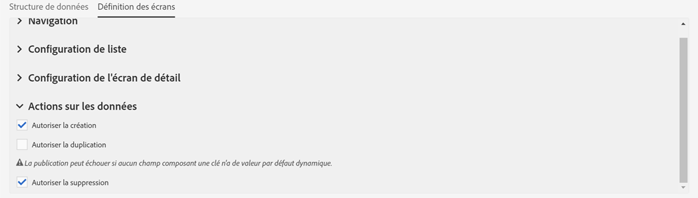

# Configuration de la définition d'écran{#configuring-the-screen-definition}

Lors de la création d'une ressource ou de l'ajout de nouveaux champs à une ressource existante, vous pouvez définir la façon dont ils doivent apparaître dans l'interface.

Cette étape n'est pas obligatoire, car vous pourrez toujours renseigner votre ressource et accéder à ses données via les workflows, les audiences et l'API REST.

Dans l'onglet **[!UICONTROL Définition des écrans], vous pouvez :**

* Ajouter l'accès à la ressource personnalisée dans le volet de navigation
* Personnaliser la manière dont sera présentée la liste des éléments constituant la ressource
* Définir l'affichage du détail de chaque élément de la ressource

## Permettre l'accès depuis le menu de navigation {#enabling-access-from-the-navigation-menu}

Si vous souhaitez que votre ressource dispose d'un écran dédié, vous pouvez la rendre accessible depuis le menu de navigation.

1. Depuis l'onglet **[!UICONTROL Définition des écrans]** de la ressource, développez la section **Navigation[!UICONTROL .]**
1. Cochez la case **[!UICONTROL Ajouter une entrée dans la section 'Données client']si vous souhaitez permettre l'accès à cette ressource depuis le volet de navigation.**

   

La ressource apparaîtra en tant que sous-entrée de la section **[!UICONTROL Données client].**

## Définir la configuration de liste par défaut {#defining-the-default-list-configuration}

La section **[!UICONTROL Configuration de liste]de la définition des écrans vous permet de définir les colonnes et informations qui s'afficheront par défaut dans l'aperçu d'une ressource.**

1. Cochez la case **[!UICONTROL Personnaliser la configuration de la liste]pour définir l'affichage des colonnes de la ressource.**
1. Utilisez le bouton **[!UICONTROL Créer un élément]pour sélectionner un champ parmi ceux que vous avez créés.**
1. Le champ ajouté s'affiche dans la liste. Vous pouvez modifier son libellé et sa largeur.

   

1. Dans la section **[!UICONTROL Recherche simple]**, cochez la case **Définir les champs pris en compte dans la recherche]pour spécifier les champs qui seront inclus dans la recherche.[!UICONTROL **

   >[!CAUTION]
   >
   >Cette configuration remplace les champs utilisés dans la recherche par défaut.

1. Dans la section **[!UICONTROL Filtrage avancé]**, cochez la case **Ajouter des champs de recherche]pour ajouter des champs supplémentaires en plus du champ de recherche simple.[!UICONTROL ** Par exemple, si vous sélectionnez le champ "date" parmi les champs que vous avez créés, l'utilisateur pourra effectuer une recherche ne portant que sur la date.
1. Vous pouvez modifier l'ordre des champs pour les deux types de recherche.
1. Dans le cas d'une recherche avancée, il est possible d'ajouter des champs de type liens vers une ressource liée. Ces filtres apparaissent dans le menu **[!UICONTROL Recherche]de l'écran généré.**

L'écran de présentation de la ressource est maintenant défini.

## Définir la configuration de l'écran de détail {#defining-the-detail-screen-configuration}

La section **[!UICONTROL Configuration de l'écran de détail]de la définition des écrans vous permet de définir les colonnes et les informations qui seront affichées dans l'écran de détail de chaque élément de la ressource.**

1. Développez la section **[!UICONTROL Configuration de l'écran de détail]** et cochez la case **Définir un écran de détail]pour configurer l'écran correspondant à chaque élément de la ressource.[!UICONTROL ** Si vous ne cochez pas cette case, le détail des éléments de cette ressource ne sera pas accessible.
1. Vous pouvez ajouter en un seul clic tous les champs de votre ressource personnalisée. Pour cela, cliquez sur l'icône  ou utilisez le bouton **Ajouter un élément[!UICONTROL .]**
1. Sélectionnez un élément parmi ceux créés pour cette ressource et indiquez un type de champ :

   * **[!UICONTROL Champ de saisie]** : il s'agira d'un champ éditable.
   * **[!UICONTROL Valeur]** : il s'agira d'un champ non modifiable.
   * **[!UICONTROL Liste]** : il s'agira d'un tableau.
   * **[!UICONTROL Séparateur]** : classe vos éléments dans des catégories.
   

1. L'élément ajouté s'affiche dans la liste. Vous pouvez modifier son libellé.

   

1. Ajoutez autant de **[!UICONTROL Séparateurs]que nécessaire pour classer vos éléments dans différentes catégories.**

   Vous pouvez ainsi afficher un séparateur pour que votre fenêtre soit mieux organisée.

   

L'écran de détail de la ressource est maintenant défini.

## Section Actions sur les données {#actions-on-data-section}

Ces paramètres permettent d'afficher une barre de contrôle dans l'écran de la ressource personnalisée. Trois options sont disponibles :

* **[!UICONTROL Autoriser la création]** : cette option permet d'activer la création d'éléments de la ressource. L'utilisateur peut donc ajouter des enregistrements supplémentaires.

   >[!NOTE]
   >
   >Vous devez activer l'écran de détail associé à la ressource pour rendre cette option accessible.

* **[!UICONTROL Autoriser la duplication]** : cette option permet d'activer la duplication d'enregistrements liés à la ressource personnalisée.
* **[!UICONTROL Autoriser la suppression]** : cette option permet d'activer la suppression d'enregistrements liés à la ressource personnalisée.

