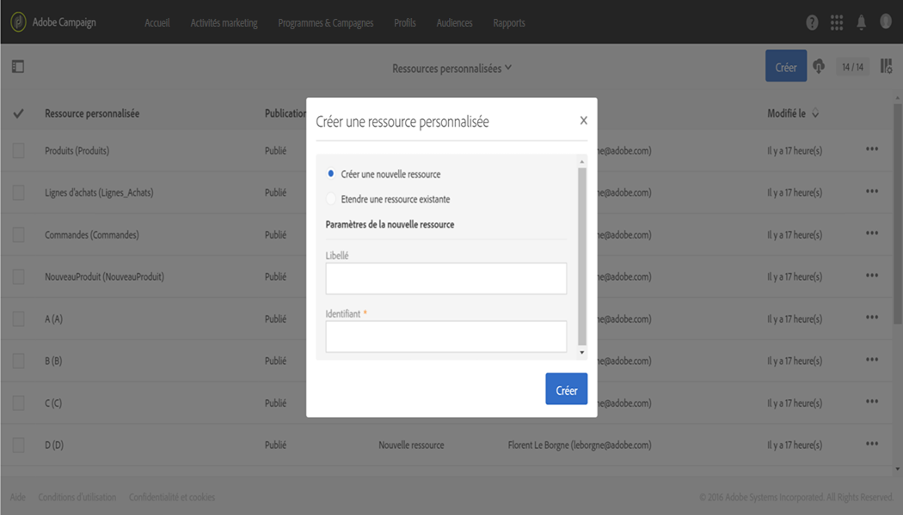
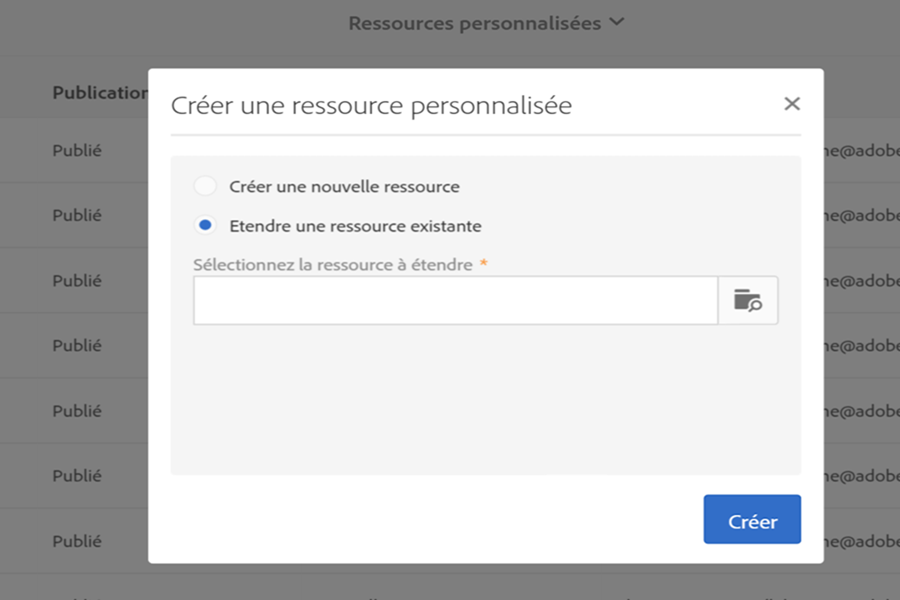

# Création ou extension de la ressource{#creating-or-extending-the-resource}

Les administrateurs peuvent créer une ressource ou une extension d'une ressource existante si vous avez besoin d'utiliser des données qui ne font pas partie du modèle de données d'usine.

Seules les ressources d'usine suivantes peuvent être étendues :

* **[!UICONTROL Campagne (campaign)]**
* **[!UICONTROL Diffusions (delivery)]**
* **[!UICONTROL Landing page (Landingpage)]**
* **[!UICONTROL Profils (profile)]**
* **[!UICONTROL Programme (program)]**
* **[!UICONTROL Service (service)]**
* **[!UICONTROL Abonnements à une application (appSubscriptionRcp)]**
* **[!UICONTROL Profils de test (seedMember)]**
* **[!UICONTROL Workflow (workflow)]**

Pour créer ou étendre une ressource :

1. Depuis **[!UICONTROL Administration]** &gt; **[!UICONTROL Développement]** &gt; **[!UICONTROL Ressources personnalisées]**, cliquez sur le bouton **[!UICONTROL Créer]**.
1. Sélectionnez l'action que vous souhaitez réaliser :

   * **[!UICONTROL Créer une nouvelle ressource]** : renseignez les champs **[!UICONTROL Libellé]** et **[!UICONTROL Identifiant]**. Le champ **[!UICONTROL Identifiant]** est obligatoire. Si vous laissez le champ Libellé vide, il sera automatiquement renseigné à partir de l'identifiant.

      

      >[!NOTE]
      >
      >Nous recommandons d'utiliser 30 caractères maximum.

   * **[!UICONTROL Etendre une ressource existante]** : sélectionnez la ressource que vous souhaitez étendre.

      

1. Cliquez sur **[!UICONTROL Créer]** pour créer la ressource. Celle-ci prend alors le statut **[!UICONTROL En création]** s'il s'agit d'une nouvelle ressource ou **[!UICONTROL En édition]** s'il s'agit d'une extension.

La nouvelle ressource est créée et peut être maintenant configurée. Pour plus d'informations sur la configuration d'une ressource, consultez la section [Configuration de la structure de données de la ressource](../../developing/using/configuring-the-resource-s-data-structure.md).
