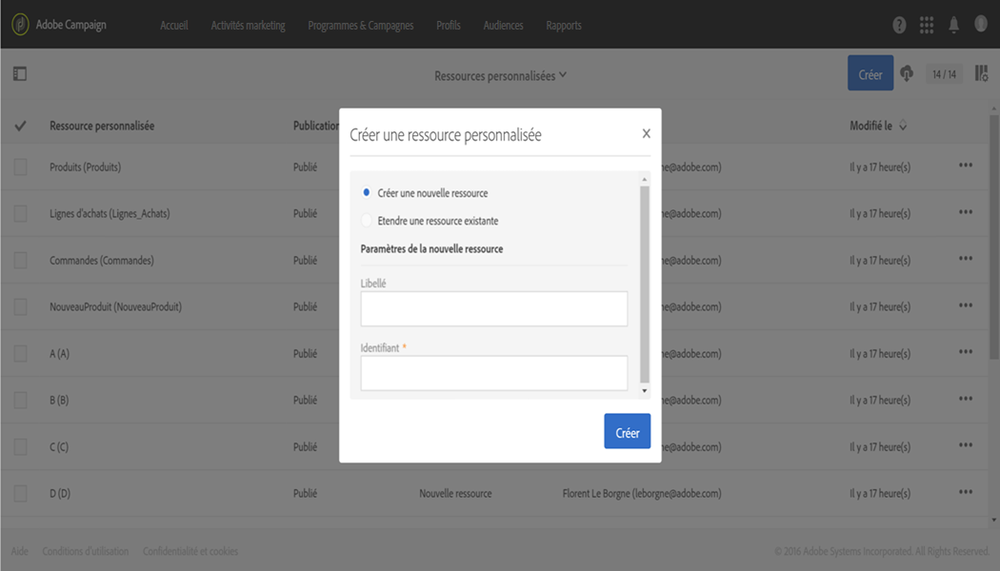
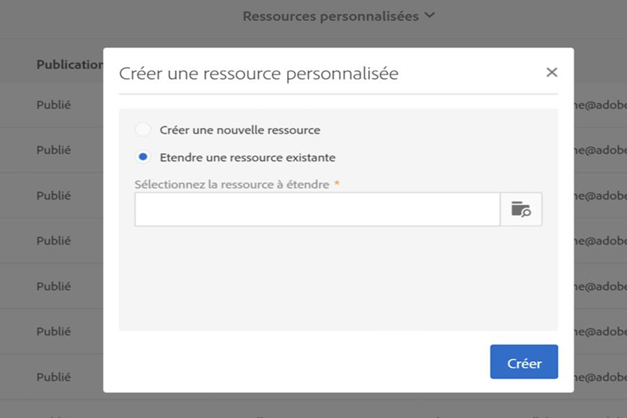

# Création ou extension de la ressource{#creating-or-extending-the-resource}

Les administrateurs peuvent créer une ressource ou une extension d&#39;une ressource existante si vous avez besoin d&#39;utiliser des données qui ne font pas partie du modèle de données natif.

Seules les ressources natives suivantes peuvent être étendues :

* **[!UICONTROL Campagne (campaign)]**
* **[!UICONTROL Diffusions (delivery)]**
* **[!UICONTROL Landing page (Landingpage)]**
* **[!UICONTROL Profils (profile)]**
* **[!UICONTROL Programme (program)]**
* **[!UICONTROL Service (service)]**
* **[!UICONTROL Abonnements à une application (appSubscriptionRcp)]**
* **[!UICONTROL Profils de test (seedMember)]**
* **[!UICONTROL Workflow (workflow)]**

Pour créer ou étendre une ressource :

1. Depuis **[!UICONTROL Administration]** > **[!UICONTROL Développement]** > **[!UICONTROL Ressources personnalisées]**, cliquez sur le bouton **[!UICONTROL Créer]**.
1. Sélectionnez l&#39;action que vous souhaitez réaliser :

   * **[!UICONTROL Créer une nouvelle ressource]** : renseignez les champs **[!UICONTROL Libellé]** et **[!UICONTROL Identifiant]**. Le champ **[!UICONTROL Identifiant]** est obligatoire. Si vous laissez le champ Libellé vide, il sera automatiquement renseigné à partir de l&#39;identifiant.

     

     >[!NOTE]
     >
     >Utilisez 30 caractères au maximum.

   * **[!UICONTROL Etendre une ressource existante]** : sélectionnez la ressource que vous souhaitez étendre.

     

1. Cliquez sur **[!UICONTROL Créer]** pour créer la ressource. Celle-ci prend alors le statut **[!UICONTROL En création]** s&#39;il s&#39;agit d&#39;une nouvelle ressource ou **[!UICONTROL En édition]** s&#39;il s&#39;agit d&#39;une extension.

La nouvelle ressource est créée et peut être maintenant configurée. Pour plus d&#39;informations sur la configuration d&#39;une ressource, consultez la section [Configuration de la structure de données de la ressource](../../developing/using/configuring-the-resource-s-data-structure.md).
