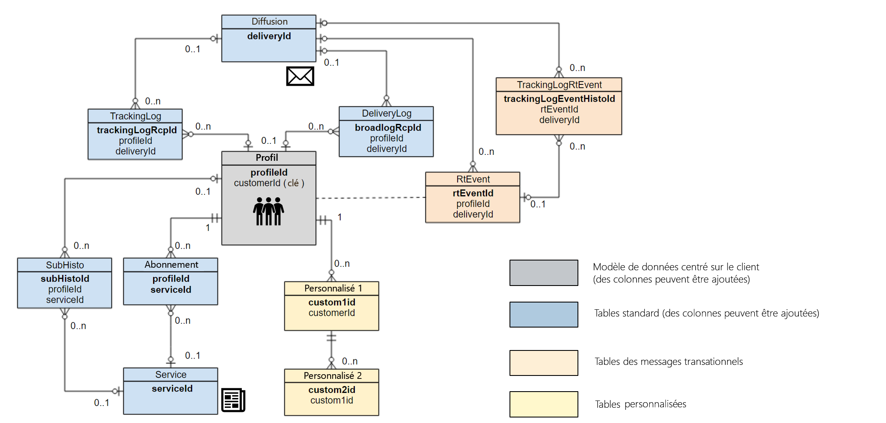

# Bonnes pratiques relatives au modèle de données{#data-model-best-practices}

Ce document présente les principales recommandations lors de la conception de votre modèle de données Adobe Campaign.

>[!NOTE]
>
>Pour créer et modifier des ressources afin d’étendre le modèle de données prédéfini d’Adobe Campaign, consultez [cette section](../../developing/using/key-steps-to-add-a-resource.md).
>
>Vous trouverez une représentation du modèle de données des ressources natives dans [cette page](../../developing/using/datamodel-introduction.md).

## Présentation {#overview}

Le système Adobe Campaign est extrêmement flexible et peut être étendu au-delà de l’implémentation initiale. Toutefois, même si les possibilités sont infinies, il est essentiel de prendre des décisions judicieuses et de construire des bases solides pour commencer à concevoir votre modèle de données.

Ce document présente des cas pratiques courants et des bonnes pratiques pour apprendre à concevoir correctement votre outil Adobe Campaign.

## Architecture du modèle de données {#data-model-architecture}

Adobe Campaign Standard est un puissant système de gestion de campagnes cross-canal. Il peut vous aider à aligner vos stratégies on-line et off-line pour créer des expériences client personnalisées.

### Approche axée sur le client {#customer-centric-approach}

Bien que la plupart des fournisseurs de services de messagerie communiquent avec les clients par le biais d’une approche centrée sur des listes, Adobe Campaign s’appuie sur une base de données relationnelle afin d’obtenir une vision plus large des clients et de leurs attributs.

Cette approche axée sur le client est présentée dans le graphique ci-dessous. La ressource **Profil** en gris représente la table client principale autour de laquelle tout est construit :

Le modèle de données par défaut d’Adobe Campaign est présenté dans cette [section](../../developing/using/datamodel-introduction.md).

<!--You can find a datamodel representation for the out-of-the-box resources [here](../../developing/using/datamodel-introduction.md).-->

<!--### What is a customer? {#customer-definition}

If you have customer data in more than one system, you need to determine which solution will allow you to identify records as one person. This work might require rules, eventually a match and merge processes to determine the primary record. This primary record should be the one sent to Adobe Campaign.

While some of this data cleansing might be performed in Adobe Campaign, the recommendation is to run these processes outside and only import clean data in Adobe Campaign. You should keep Campaign as a marketing solution more than a data cleansing tool.

Be able to provide a primary customer record which will be sent to Adobe Campaign.-->

### Données pour Adobe Campaign {#data-for-campaign}

Quelles données doivent être envoyées à Adobe Campaign ? Il est essentiel de déterminer les données requises pour vos activités marketing.

>[!NOTE]
>
>Adobe Campaign n’est pas un entrepôt de données. Par conséquent, n’essayez pas d’importer tous les clients possibles et les informations associées dans Adobe Campaign.

Pour décider si un attribut est nécessaire ou non dans Adobe Campaign, déterminez s’il appartient à l’une des catégories suivantes :
* Attribut utilisé pour la **segmentation**
* Attribut utilisé pour les **processus de gestion des données** (calcul agrégé, par exemple)
* Attribut utilisé pour la **personnalisation**
* Attribut utilisé pour le **reporting** (les rapports peuvent être créés à partir de données de profil personnalisées)

S’il n’appartient à aucune de ces catégories, il est probable que vous n’ayez pas besoin de cet attribut dans Adobe Campaign.

### Types de données {#data-types}

Pour optimiser l’architecture et les performances de votre système, appliquez les bonnes pratiques suivantes pour configurer les données dans Adobe Campaign :
* La longueur d’un champ de chaîne doit toujours être définie avec la colonne. Dans Adobe Campaign, la longueur maximale est de 255 caractères par défaut, mais Adobe recommande de raccourcir le champ si vous savez déjà que la taille ne dépassera pas une longueur inférieure.
* Dans Adobe Campaign, il est acceptable de disposer d’un champ plus court que dans le système source si vous êtes sûr que la taille du système source a été surestimée et ne sera pas atteinte. Cela peut signifier une chaîne plus courte ou un entier plus petit dans Adobe Campaign.

## Configuration de la structure des données {#configuring-data-structure}

Cette section présente les bonnes pratiques à suivre lors de la [configuration de la structure de données d’une ressource](../../developing/using/configuring-the-resource-s-data-structure.md).

### Identificateurs {#identifiers}

Les ressources Adobe Campaign ont trois identifiants et il est possible d’en ajouter un supplémentaire.

Le tableau ci-après décrit ces identifiants et leur finalité.

>[!NOTE]
>
>Le nom d’affichage correspond au nom du champ affiché pour l’utilisateur via l’interface utilisateur d’Adobe Campaign. Le nom technique correspond au nom actuel du champ dans la définition de la ressource (et le nom de la colonne de la table).

| Nom d’affichage | Nom technique | Description | Bonnes pratiques |
|--- |--- |--- |--- |
|  | PKey | <ul><li>La clé PKey est la clé primaire physique d’une table Adobe Campaign.</li><li>Cet identifiant est généralement unique pour une instance Adobe Campaign spécifique.</li><li>Dans Adobe Campaign Standard, cette valeur n’est pas visible par l’utilisateur final (sauf dans les URL).</li></ul> | <ul><li>Par le biais du [système API](../../api/using/get-started-apis.md), il est possible de récupérer une valeur PKey (qui est une valeur générée/hachée, et non la clé physique).</li><li>Il n’est pas recommandé de l’utiliser à d’autres fins que la récupération, la mise à jour ou la suppression d’enregistrements via l’API.</li></ul> |
| Identifiant | name ou internalName | <ul><li>Cette information est l’identifiant unique d’un enregistrement dans une table. Cette valeur peut être mise à jour manuellement.</li><li>Cet identifiant conserve sa valeur lorsqu’il est déployé dans une autre instance d’Adobe Campaign. Il doit avoir un nom différent de la valeur générée pour pouvoir être exporté via un package.</li><li>Il ne s’agit pas de la clé primaire actuelle de la table.</li></ul> | <ul><li>N’utilisez pas de caractères spéciaux tels que l’espace «  », le point-virgule « ; » ou le tiret « - ».</li><li>Tous ces caractères seront remplacés par un trait de soulignement « _ » (caractère autorisé). Par exemple, « abc-def » et « abc:def » seront stockés sous la forme de « abc_def » et s’écraseront mutuellement.</li></ul> |
| Libellé | label | <ul><li>Le libellé est l’identifiant d’entreprise d’un objet ou d’un enregistrement dans Adobe Campaign.</li><li>Cet objet autorise les espaces et les caractères spéciaux.</li><li>Il ne garantit pas le caractère unique d&#39;un enregistrement.</li></ul> | <ul><li>Il est recommandé de déterminer une structure pour les libellés de vos objets.</li><li>Il s’agit de la solution la plus conviviale pour identifier un enregistrement ou un objet pour un utilisateur d’Adobe Campaign.</li></ul> |
| Identifiant ACS | acsId | <ul><li>Un identifiant supplémentaire peut être généré : l’[identifiant ACS](../../developing/using/configuring-the-resource-s-data-structure.md#generating-a-unique-id-for-profiles-and-custom-resources).</li><li>Comme la clé PKey ne peut pas être utilisée dans l’interface utilisateur d’Adobe Campaign, il s’agit d’une solution permettant d’obtenir une valeur unique générée lors de l’insertion d’un enregistrement de profil.</li><li>La valeur ne peut être générée automatiquement que si l’option est activée dans la ressource avant qu’un enregistrement ne soit inséré dans Adobe Campaign.</li></ul> | <ul><li>Cet UUID peut être utilisé comme clé de réconciliation.</li><li>Un identifiant ACS généré automatiquement ne peut pas être utilisé comme référence dans un workflow ou dans une définition de package.</li><li>Cette valeur est spécifique à une instance Adobe Campaign.</li></ul> |

### Clés d’identification {#keys}

Chaque ressource créée dans Adobe Campaign doit avoir au moins une [clé d’identification](../../developing/using/configuring-the-resource-s-data-structure.md#defining-identification-keys) unique.

<!--Most organizations are importing records from external systems. While the physical key of a resource lies behind the PKey attribute, it is possible to determine a custom key in addition.

This custom key is the actual record primary key in the external system feeding Adobe Campaign.

When an out-of-the-box resource has both an internal auto-generated and an internal custom key, the internal key will be set as a unique index in the physical database table.-->

Lors de la création d’une ressource personnalisée, vous avez deux possibilités :

* Combinaison de clé générée automatiquement et de clé personnalisée interne. Cette option est intéressante si votre clé système est une clé composite ou n’est pas un entier. Les entiers offrent des performances supérieures dans les tables volumineuses et dans la jointure à d’autres tables.
* Utilisation de la clé primaire comme clé primaire du système externe. Cette solution est généralement préférable, car elle simplifie l’approche d’import et d’export des données, avec une clé cohérente entre les différents systèmes.

Les clés d’identification ne doivent pas être utilisées comme référence dans les workflows.

<!--For more on defining identification keys, see [this section](../../developing/using/configuring-the-resource-s-data-structure.md#defining-identification-keys).-->

### Index {#indexes}

Adobe Campaign ajoute automatiquement un [index](../../developing/using/configuring-the-resource-s-data-structure.md#defining-indexes) à toutes les clés primaires et internes définies dans une ressource.

* Adobe recommande de définir des index supplémentaires, car ils peuvent améliorer les performances.
* Toutefois, n’ajoutez pas trop d’index car ils utilisent de l’espace sur la base de données. Un nombre élevé d’index peut également avoir un impact négatif sur les performances.
* Sélectionnez soigneusement les index à définir.

<!--For more on defining indexes, see [this section](../../developing/using/configuring-the-resource-s-data-structure.md#defining-indexes).

When you are performing an initial import with very high volumes of data insert in Adobe Campaign database, it is recommended to run that import without custom indexes at first. It will allow to accelerate the insertion process. Once you’ve completed this important import, it is possible to enable the index(es).-->

### Liens {#links}

La définition de liens avec d’autres ressources est présentée dans [cette section](../../developing/using/configuring-the-resource-s-data-structure.md#defining-links-with-other-resources).

* Bien qu’il soit possible de joindre n’importe quelle table dans un workflow, Adobe recommande de définir des liens communs entre les ressources directement dans la définition de la structure de données.
* Le lien doit être défini en fonction des données réelles contenues dans vos tables. Une mauvaise définition peut avoir un impact sur les données récupérées via les liens, par exemple la duplication inattendue d’enregistrements.
* Attribuez au lien un nom cohérent avec celui de la ressource : le nom du lien doit permettre de comprendre à quoi correspond la table distante.
* N’utilisez pas un nom de lien comportant le suffixe « id ». Par exemple, appelez-le « transaction » plutôt que « transactionId ».

<!--For more on defining links with other resources, see [this section](../../developing/using/configuring-the-resource-s-data-structure.md#defining-links-with-other-resources).-->

## Performances {#performance}

Afin d’optimiser les performances à tout moment, suivez les bonnes pratiques ci-dessous.

### Recommandations générales {#general-recommendations}

* Évitez d’utiliser des opérations telles que « CONTAINS » dans les requêtes. Si vous savez ce qui est attendu et souhaitez appliquer un filtre, appliquez la même condition avec un opérateur « ÉGAL À » ou d’autres opérateurs de filtre spécifiques.
* Évitez toute jointure avec des champs non indexés lors de la création de données dans des workflows.
* Veillez à ce que les processus tels que l’import et l’export se produisent en dehors des heures de bureau.
* Vérifiez qu’il existe un planning pour toutes les activités quotidiennes et respectez-le.
* Si un ou plusieurs processus quotidiens échouent et s’ils doivent être exécutés le même jour, vérifiez que des processus en conflit ne sont pas en cours d’exécution lorsque le processus manuel est lancé, car cela peut avoir un impact sur les performances du système.
* Vérifiez qu’aucune campagne quotidienne n’est exécutée pendant le processus d’import ou lorsqu’un processus manuel est exécuté.
* Utilisez une ou plusieurs tables de référence plutôt que de dupliquer un champ dans chaque ligne. Lors de l’utilisation de paires clé/valeur, il est préférable de choisir une clé numérique.
* Une chaîne courte reste acceptable. Si des tables de références sont déjà en place dans un système externe, les réutiliser facilitera l’intégration des données avec Adobe Campaign.

### Relations de type « un à plusieurs » {#one-to-many-relationships}

* La conception des données a un impact sur la convivialité et les fonctionnalités. Si vous concevez votre modèle de données avec de nombreuses relations de type « un à plusieurs », il devient plus difficile pour les utilisateurs de construire une logique significative dans l’application. Il peut s’avérer difficile pour les marketeurs n’ayant pas de compétences techniques de construire et de comprendre correctement la logique.
* Qu’une table comporte tous les champs essentiels est une bonne chose car cela facilite la création de requêtes par les utilisateurs. Il est aussi parfois judicieux de dupliquer certains champs d’une table à l’autre si cela permet d’éviter une jointure.
* Certaines fonctionnalités intégrées ne pourront pas faire référence à des relations de type « un à plusieurs », par exemple la formule Pondération d’offre et Diffusions.

### Tables volumineuses {#large-tables}

Vous trouverez ci-dessous quelques bonnes pratiques à suivre lors de la conception de votre modèle de données à l’aide de tables volumineuses et de jointures complexes.

* Réduisez le nombre de colonnes, notamment en identifiant celles qui ne sont pas utilisées.
* Optimisez les relations du modèle de données en évitant les jointures complexes, notamment celles qui concernent plusieurs conditions et/ou colonnes.
* Pour les clés de jointure, préférez toujours les données numériques aux chaînes de caractères.
* Réduisez autant que possible la profondeur de conservation des logs. Si vous avez besoin d’un historique plus détaillé, vous pouvez agréger le calcul et/ou gérer des tables de journaux personnalisées pour stocker un historique plus volumineux.