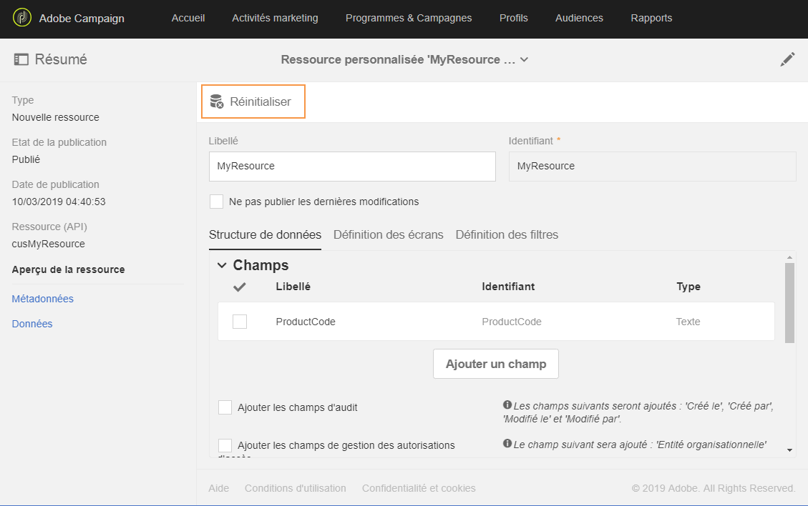
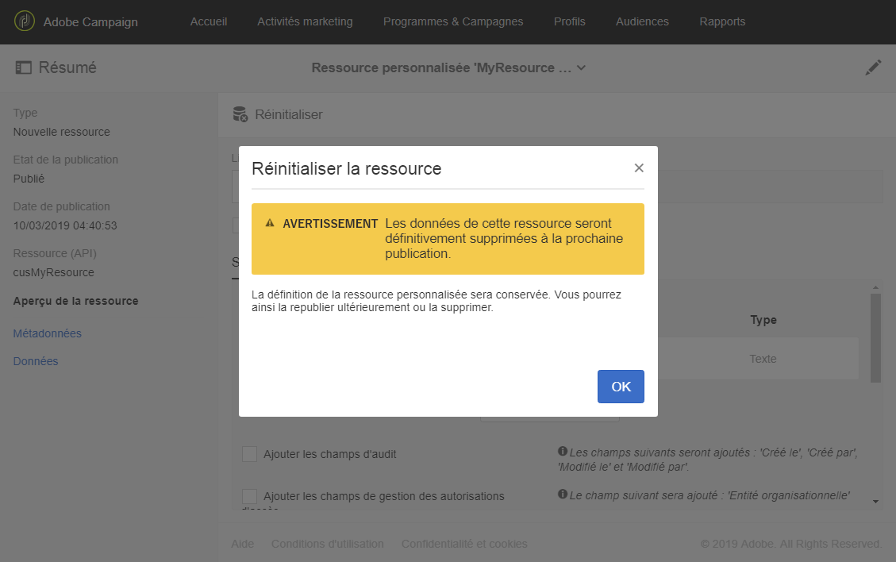
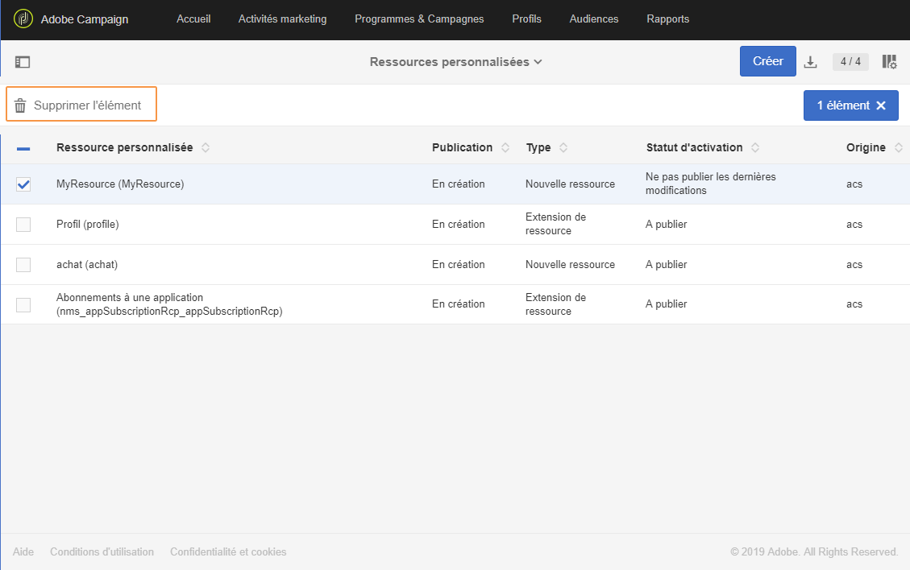

# Supprimer une ressource{#deleting-a-resource}

Pour supprimer une ressource, celle-ci doit être **[!UICONTROL En création]**. La ressource est **[!UICONTROL En création]si :**

* Elle vient d'être créée et n'est pas encore publiée.
* Si elle est déjà publiée, la ressource doit être réinitialisée.

>[!CAUTION]
>
>La réinitialisation et la suppression d'une ressource personnalisée sont des opérations sensibles pouvant avoir un impact sur d'autres ressources. Ces actions doivent être effectuées par un utilisateur expert uniquement.

Pour réinitialiser et supprimer une ressource publiée :

1. Sélectionnez la ressource que vous souhaitez réinitialiser.
1. Cliquez sur le bouton **[!UICONTROL Réinitialiser]disponible dans la barre d'actions.**

   

1. Cliquez sur **[!UICONTROL Ok]**.

   >[!CAUTION]
   >
   >Cette action est permanente : les colonnes ou la table de la base de données de la ressource et leurs données seront supprimés définitivement lors de la publication de la modification, ce qui peut entraîner la rupture des liens à partir d'autres ressources personnalisées. Seule la définition de la ressource restera disponible.

   

   >[!NOTE]
   >
   >Si vous réinitialisez une extension de la ressource d'usine **Profils (profile)**, vous devez également réinitialiser toute extension **Profil de test (seedMember)** que vous avez pu définir. Pour plus d'informations sur l'extension de la ressource de profil, voir [cette section](../../developing/using/extending-the-profile-resource-with-a-new-field.md).

1. Publiez la ressource. Pour obtenir des étapes plus détaillées, consultez la section [Publier une ressource personnalisée](../../developing/using/updating-the-database-structure.md#publishing-a-custom-resource).

   La ressource passe en mode **En création** et son statut d'activation est **[!UICONTROL Désactivé]**.

1. En mode **[!UICONTROL Liste]**, cochez la ressource à supprimer puis cliquez sur l'icône Supprimer l'élément **.**

   

Votre ressource est supprimée du modèle de données.

>[!NOTE]
>
>Si le champ d'une ressource personnalisée utilisée lors d'un événement est modifié ou supprimé, l'événement correspondant sera automatiquement dépublié. Voir [Configurer les messages transactionnels](../../administration/using/configuring-transactional-messaging.md).

