# Extension de la ressource Profil avec un nouveau champ{#extending-the-profile-resource-with-a-new-field}

## A propos de l'extension de profils {#about-extending-profiles}

Ce cas pratique présente l'extension d'un profil et d'un profil de test avec un champ dédié.

Nous souhaitons ici mettre à jour nos profils avec le nouveau champ à l'aide d'une landing page, puis cibler les profils avec une newsletter répondant à leurs centres d'intérêts.

Pour ce faire, procédez comme suit :

* [Etape 1 : Etendre la ressource Profil](../../developing/using/extending-the-profile-resource-with-a-new-field.md#step-1--extend-the-profile-resource)
* [Etape 2 : Etendre le profil de test](../../developing/using/extending-the-profile-resource-with-a-new-field.md#step-2--extend-the-test-profile)
* [Etape 3 : Publier votre ressource personnalisée](../../developing/using/extending-the-profile-resource-with-a-new-field.md#step-3--publish-your-custom-resource)
* [Etape 4 : Mettre à jour et cibler les profils avec un workflow](../../developing/using/extending-the-profile-resource-with-a-new-field.md#step-4--update-and-target-profiles-with-a-workflow)

Le champ suivant sera ensuite ajouté à nos profils et pourra être ciblé dans une diffusion :

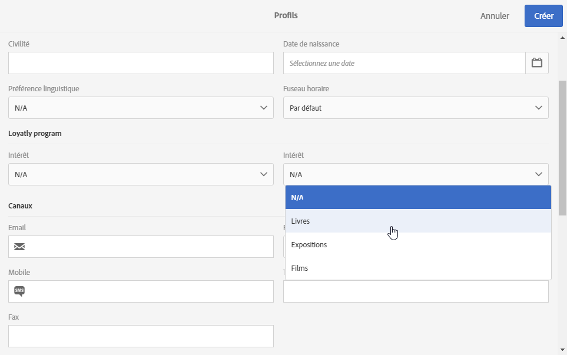

Rubriques connexes :

* [Ressources personnalisées](../../developing/using/data-model-concepts.md)
* [Gestion de profils](../../audiences/using/about-profiles.md)
* [Gestion des profils de test](../../sending/using/managing-test-profiles-and-sending-proofs.md#managing-test-profiles)

## Etape 1 : Etendre la ressource Profil {#step-1--extend-the-profile-resource}

Pour créer le champ **Centre d'intérêts** pour les profils, vous devez d'abord étendre la ressource d'usine **[!UICONTROL Profils (profile)].**

1. From the advanced menu, via the Adobe Campaign logo, select **[!UICONTROL Administration]** &gt; **[!UICONTROL Development]**, then **[!UICONTROL Custom resources]**.
1. If you have not extended the **[!UICONTROL Profiles]** resource yet, click **[!UICONTROL Create]**.
1. Choisissez l'option **[!UICONTROL Etendre une ressource existante].**
1. Sélectionnez la ressource **[!UICONTROL Profil (profile)].**
1. Cliquez sur **[!UICONTROL Créer]**.

   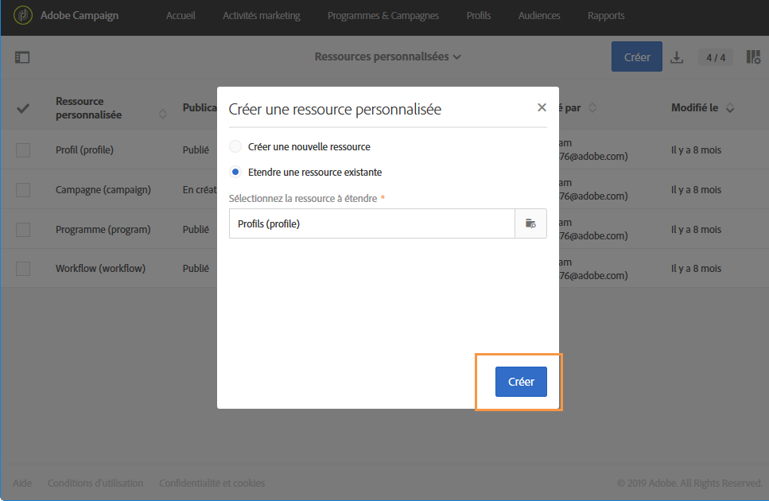

1. In the **[!UICONTROL Fields]** category of the **[!UICONTROL Data structure]** tab, click **[!UICONTROL Create element]**.

   >[!NOTE]
   >
   >Note that if you already extended the **[!UICONTROL Profile]** resource for previous purposes, you can start at this step by clicking **[!UICONTROL Add field]**.

   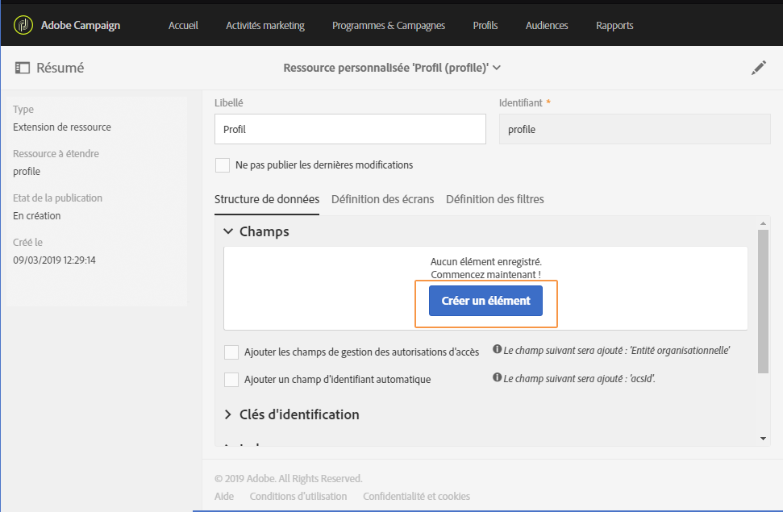

1. Add a **[!UICONTROL Label]** and an **[!UICONTROL ID]**. Select the **[!UICONTROL Text]** type and click **[!UICONTROL Add]**.

   

1. Pour configurer votre champ, dans l'onglet **[!UICONTROL Structure de données]**, sous la liste déroulante **[!UICONTROL Champs]**, cliquez sur , puis sur  depuis le champ précédemment créé.
1. In this example we want to add specific values, to do so click **[!UICONTROL Specify a list of authorized values]**.

   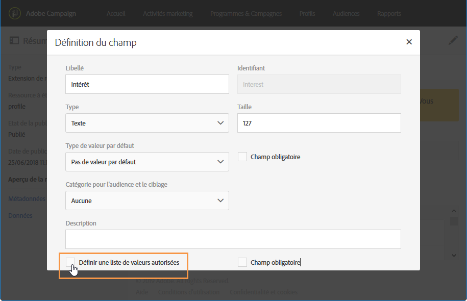

1. Click **[!UICONTROL Add an element]** then add as many value as needed by adding a **[!UICONTROL Label]** and an **[!UICONTROL ID]** and clicking **[!UICONTROL Add]**.

   Nous allons créer ici les valeurs Livres, Expositions, Films et N/A pour que les profils puissent effectuer un choix entre ces options.

   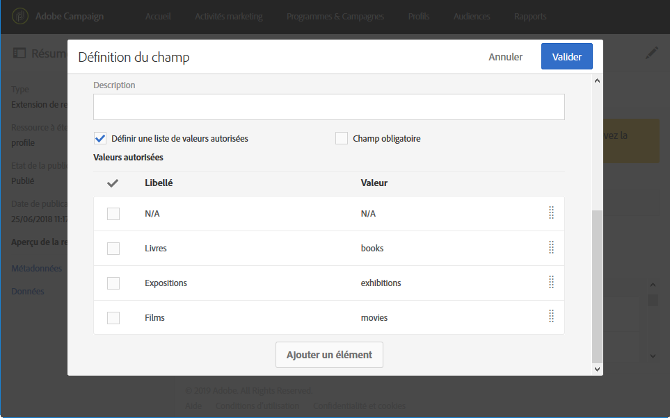

1. Pour ajouter ce champ dans l'écran **[!UICONTROL Profil]**, cliquez sur l'onglet **Définition des écrans[!UICONTROL .]**
1. In the **[!UICONTROL Detail screen configuration]** drop-down, click **[!UICONTROL Add a personalized fields section]** and click **[!UICONTROL Create element]**.

   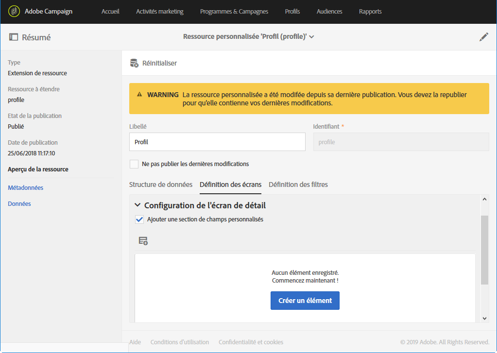

1. Select a **[!UICONTROL Type]**. Nous souhaitons ajouter ici un champ d'entrée : Then, select your previously created field and click **[!UICONTROL Add]**.

   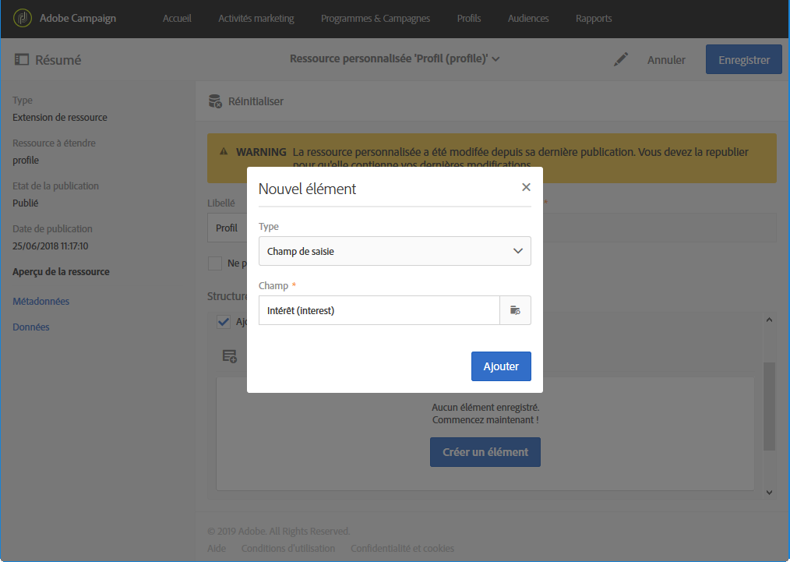

1. Pour ajouter un séparateur afin de mieux organiser la fenêtre de votre profil, cliquez sur **[!UICONTROL Créer un élément]** et sélectionnez **[!UICONTROL Séparateur]dans la liste déroulante** Type **.**

   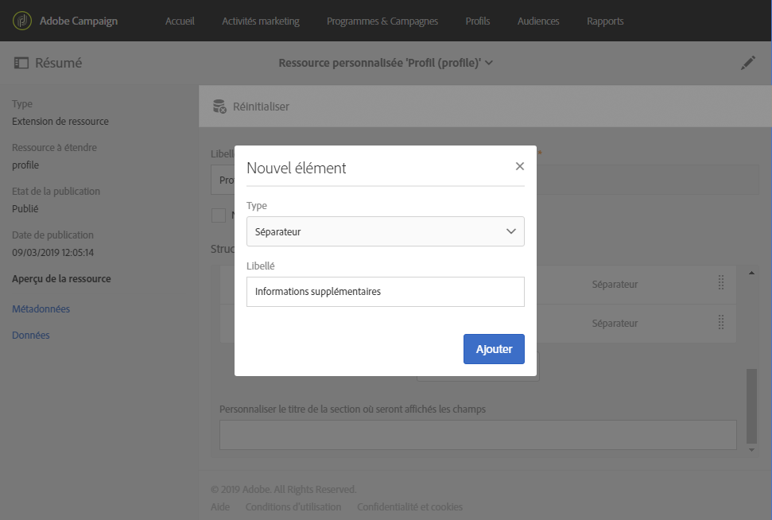

Votre champ est maintenant configuré. Nous devons maintenant l'étendre au profil de test.

>[!NOTE]
>
>Si vous n'avez pas besoin d'étendre la ressource de profil de test, vous pouvez passer à l'étape de publication.

## Etape 2 : Etendre le profil de test {#step-2--extend-the-test-profile}

Pour vérifier si le nouveau champ créé est correctement configuré, vous pouvez le tester en envoyant votre diffusion à vos profils de test. Tout d'abord, le nouveau champ doit également être créé pour les profils de test.

1. From the advanced menu, via the Adobe Campaign logo, select **[!UICONTROL Administration]** &gt; **[!UICONTROL Development]**, then **[!UICONTROL Custom resources]**.
1. If you have not extended the **[!UICONTROL Profiles]** resource yet, click **[!UICONTROL Create]**.
1. Choisissez l'option **[!UICONTROL Etendre une ressource existante].**
1. Sélectionnez la ressource **[!UICONTROL Profil de test (seedMember)].**
1. Cliquez sur **[!UICONTROL Créer]**.

   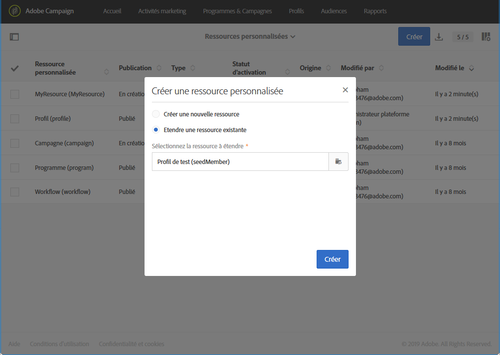

1. Dans l'onglet **[!UICONTROL Structure de données]**, cliquez sur **[!UICONTROL Créer un élément]**.

   

1. Select your previously created resource field and click **[!UICONTROL Add]**.

   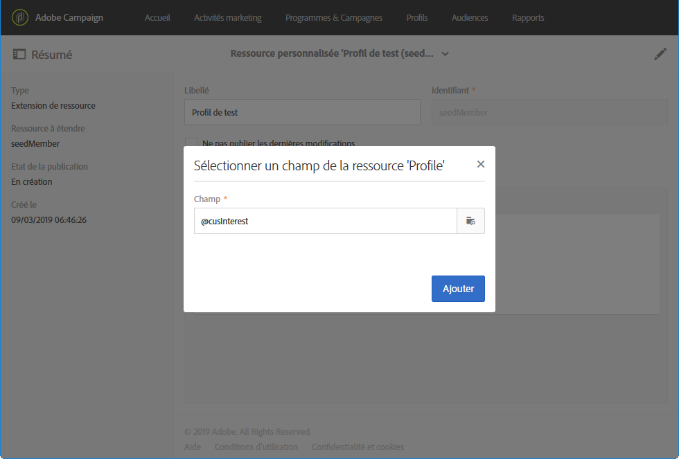

1. Suivez les étapes 11 à 13 de la procédure décrite ci-dessus pour ajouter ce champ à l'écran **[!UICONTROL Profil de test].**
1. Cliquez sur **[!UICONTROL Enregistrer]**.

Votre nouveau champ est maintenant disponible pour les profils et les profils de test. Pour qu'il soit correctement configuré, vous devez publier votre ressource personnalisée.

## Etape 3 : Publier votre ressource personnalisée {#step-3--publish-your-custom-resource}

Pour appliquer les modifications apportées aux ressources et les utiliser, vous devez effectuer une mise à jour de la base de données.

1. Dans le menu avancé, sélectionnez **Administration** &gt; **Développement**, puis **Publication**.
1. Par défaut, l'option **[!UICONTROL Déterminer les modifications depuis la dernière publication]est cochée, ce qui signifie que seuls les changements apportés depuis la dernière mise à jour seront appliqués.**

   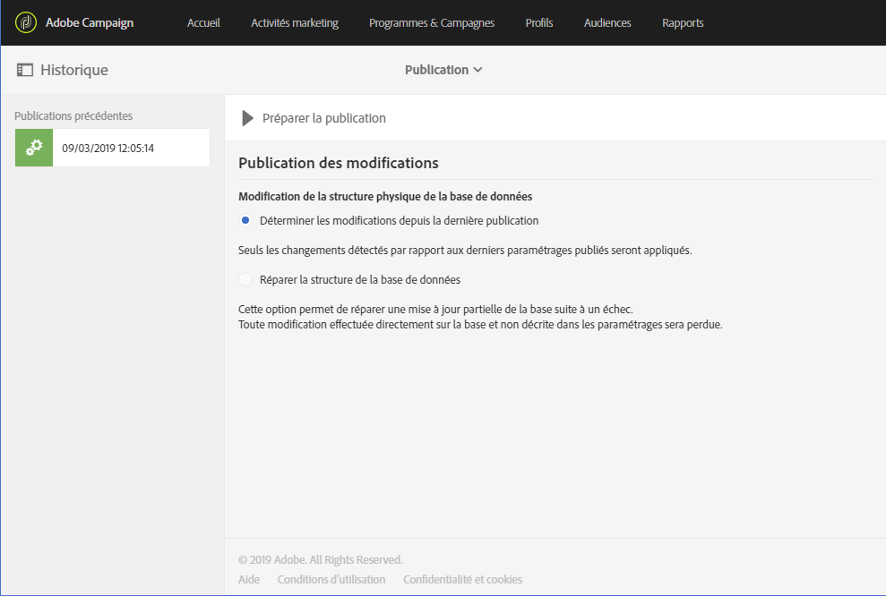

1. Cliquez sur **[!UICONTROL Préparer la publication]pour lancer l'analyse qui mettra à jour votre base de données.**
1. Une fois l'analyse effectuée, cliquez sur le bouton **Publier** pour appliquer vos nouveaux paramétrages.

   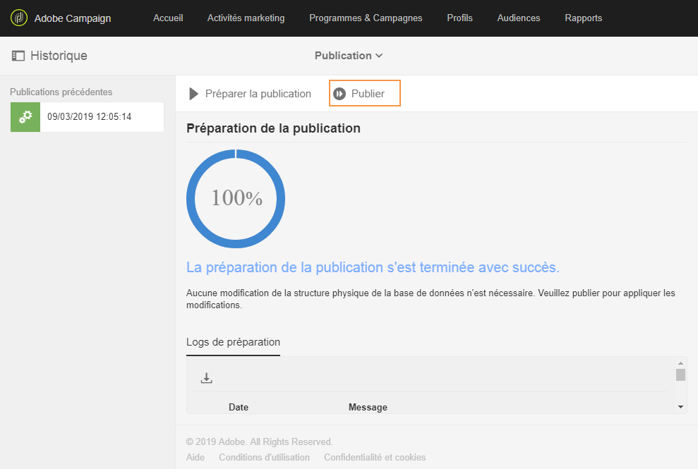

1. Une fois la publication effectuée, le volet **Résumé** de chaque ressource indique que le statut est désormais **Publié** et précise la date de la dernière publication.

   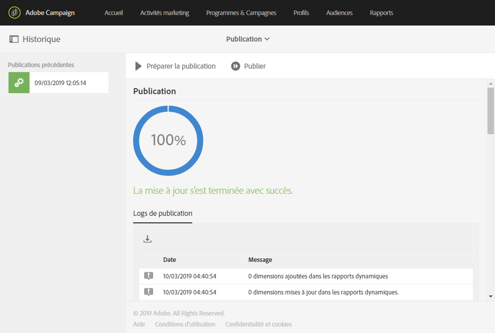

1. Pour déterminer si vos modifications ont été correctement implémentées, sélectionnez l'onglet **[!UICONTROL Profils]** et cliquez sur **Nouveau[!UICONTROL .]**

   

Votre nouveau champ de ressource est maintenant prêt à être utilisé et ciblé dans une diffusion, par exemple.

## Etape 4 : Mettre à jour et cibler les profils avec un workflow {#step-4--update-and-target-profiles-with-a-workflow}

Pour mettre à jour les profils avec les données du nouveau champ personnalisé, vous pouvez créer une landing page à l'aide du modèle **[!UICONTROL Acquisition de profils].** Pour plus d'informations sur les landing pages, consultez cette [page](../../channels/using/about-landing-pages.md).

Nous voulons ici cibler dans un workflow les profils qui ne renseignent pas ce champ. Ils recevront un email leur demandant de mettre à jour leur profil pour recevoir des newsletters et des offres personnalisées. Chaque profil recevra ensuite une newsletter personnalisée en fonction de ses centres d'intérêts.

Tout d'abord, nous devons créer une landing page qui mettra à jour les champs **Centres d'intérêts** des profils ciblés :

1. From the **[!UICONTROL Marketing activities]**, click **[!UICONTROL Create]** then select **[!UICONTROL Landing page]**.
1. Sélectionnez un type de landing page. Here, since we want to update our profiles, select **[!UICONTROL Profile acquisition]**.
1. Cliquez sur **[!UICONTROL Créer]**.
1. Cliquez sur le bloc **[!UICONTROL Contenu]pour commencer à éditer le contenu de votre landing page.**

   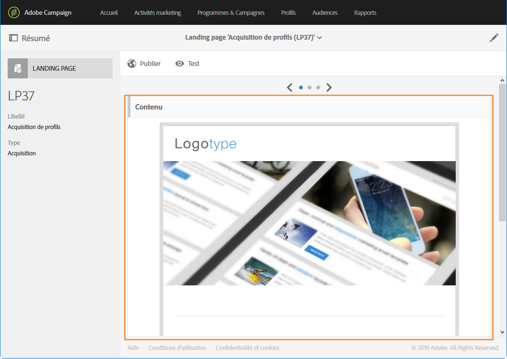

1. Personnalisez la landing page selon vos besoins.
1. Cliquez sur le champ configuré pour vos profils afin qu'ils effectuent un choix parmi les centres d'intérêts proposés. Dans le volet de gauche, sélectionnez votre ressource personnalisée **Centre d'intérêts** précédemment créée.

   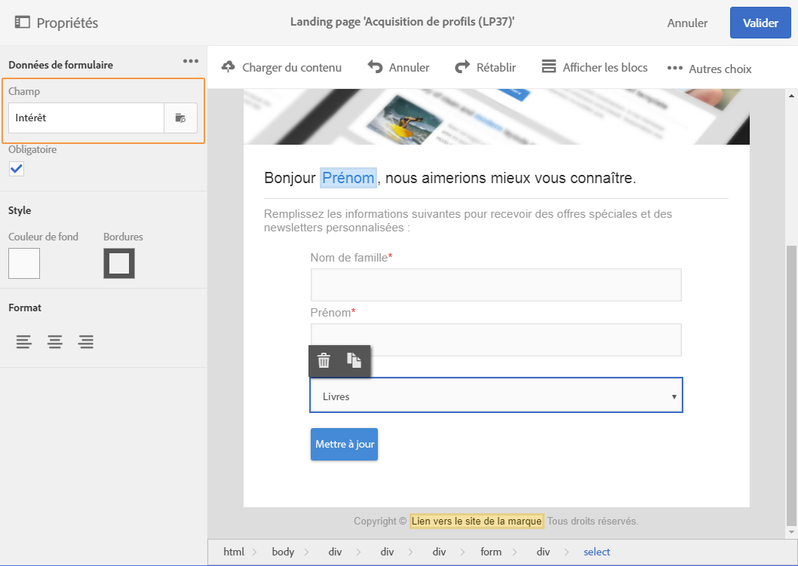

1. Enregistrez votre page de destination et testez-la pour vérifier que vos champs sont correctement configurés.
1. Cliquez sur **[!UICONTROL Publier]lorsque votre landing page est prête.**

Votre landing page est maintenant prête. Pour mettre à jour les profils, vous pouvez créer un workflow qui enverra une offre spéciale en fonction du centre d'intérêts choisi.

1. From the **[!UICONTROL Marketing activities]** tab, click **[!UICONTROL Create]** then select **[!UICONTROL Workflow]**.
1. Placez une activité **[!UICONTROL Requête]pour cibler les profils ou les audiences dont vous avez besoin.**
1. Placez une activité **[!UICONTROL Diffusion email]pour commencer à configurer votre email qui contiendra un lien vers la landing page.** Sélectionnez **[!UICONTROL Ajouter une transition sortante avec la population]**.

   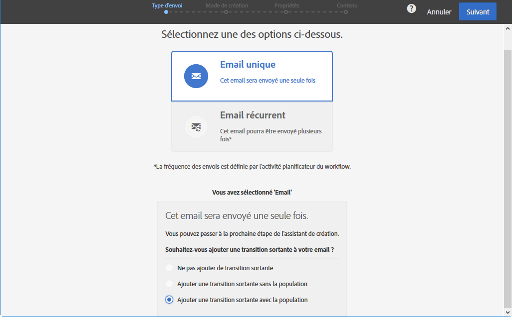

1. Créez votre email selon vos besoins. Pour plus d'informations sur la personnalisation des emails, consultez cette [page](../../designing/using/designing-content-in-adobe-campaign.md).
1. Ajoutez un bouton à votre email qui redirigera les profils vers votre landing page.
1. Sélectionnez le bouton ajouté et cliquez sur  dans la section **Lien]du volet gauche.[!UICONTROL **

   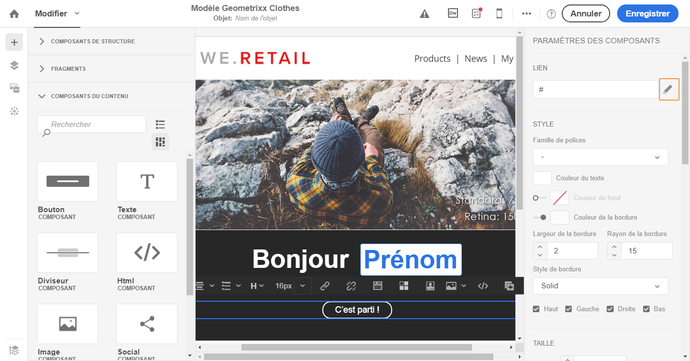

1. Dans la fenêtre **[!UICONTROL Insérer un lien]**, sélectionnez **[!UICONTROL Landing page]dans la liste déroulante** Type de lien], puis sélectionnez la landing page créée auparavant.**[!UICONTROL **

   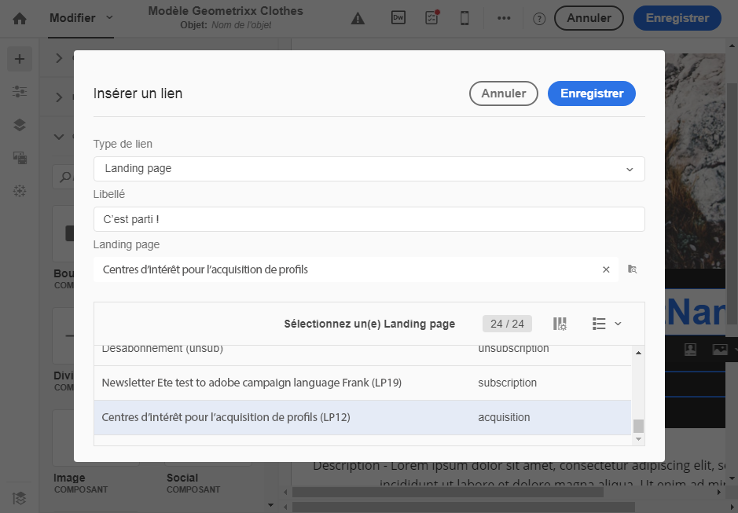

1. Cliquez sur **[!UICONTROL Enregistrer]**. Votre email est maintenant prêt. Vous pouvez revenir à votre workflow.
1. Ajoutez une activité **[!UICONTROL Attente]pour laisser un certain temps à vos profils pour qu'ils remplissent la landing page.**
1. Ajoutez une activité **[!UICONTROL Segmentation]** pour diviser la transition sortante en fonction de leurs **Centres d'intérêts**.
1. Créez un segment sortant pour chaque **Centre d'intérêt**.

   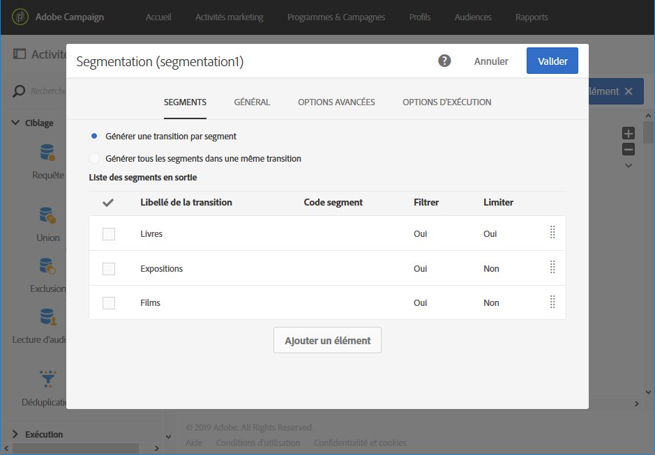

1. Ajoutez une activité **[!UICONTROL Diffusion email]** après chaque transition et créez un email personnalisé en fonction du **Centre d'intérêts** sélectionné.
1. Démarrez le workflow lorsque la configuration est terminée.

   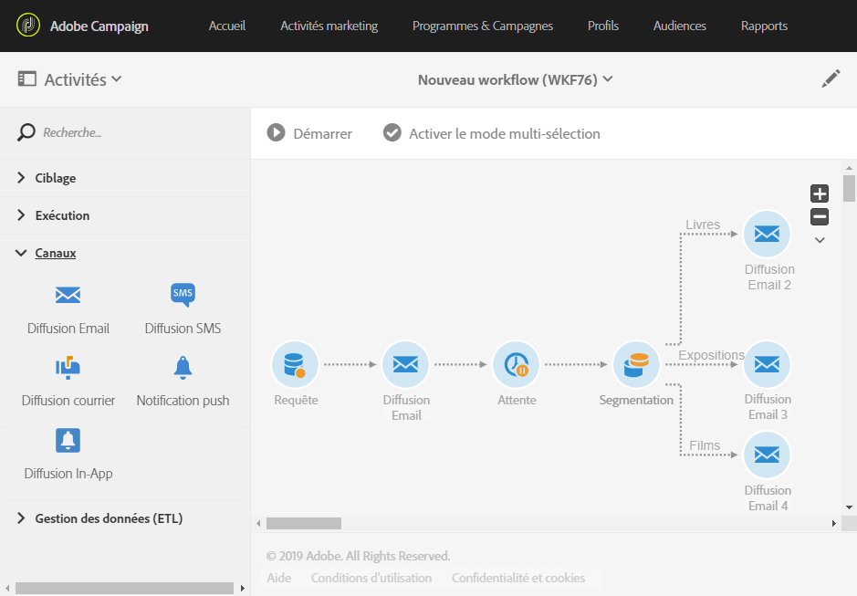

Les profils recevront désormais l'email leur demandant de remplir le champ Centre d'intérêts suivi d'un email personnalisé en fonction de la valeur choisie.
