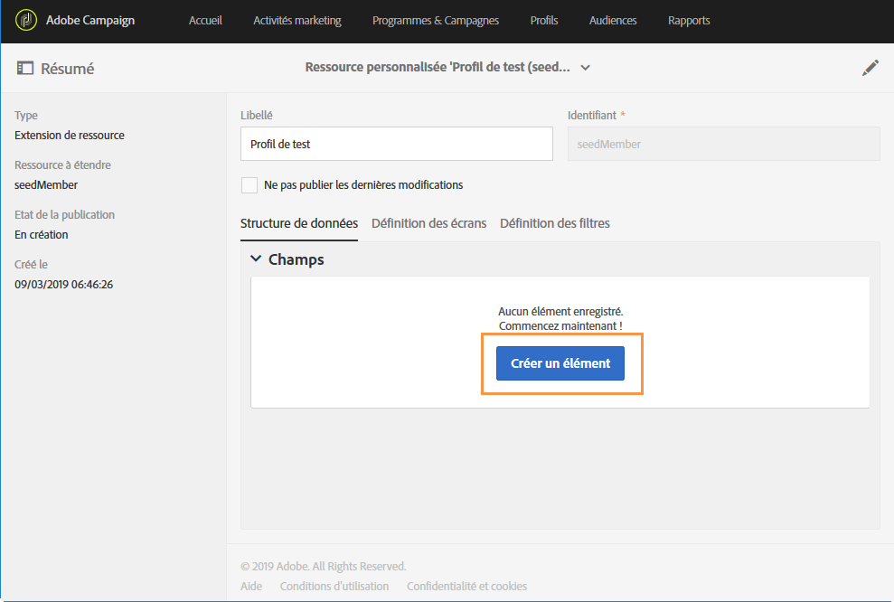

# Extension de la ressource Profil avec un nouveau champ{#extending-the-profile-resource-with-a-new-field}

## A propos de l&#39;extension de profils {#about-extending-profiles}

Ce cas pratique présente l&#39;extension d&#39;un profil et d&#39;un profil de test avec un champ dédié.

Nous souhaitons ici mettre à jour nos profils avec le nouveau champ à l&#39;aide d&#39;une landing page, puis cibler les profils avec une newsletter répondant à leurs centres d&#39;intérêts.

Pour ce faire, procédez comme suit :

* [Etape 1 : Etendre la ressource Profil ](#step-1--extend-the-profile-resource)
* [Etape 2 : Etendre le profil de test ](#step-2--extend-the-test-profile)
* [Etape 3 : Publier votre ressource personnalisée ](#step-3--publish-your-custom-resource)
* [Etape 4 : Mettre à jour et cibler les profils avec un workflow ](#step-4--update-and-target-profiles-with-a-workflow)

Le champ suivant sera ensuite ajouté à nos profils et pourra être ciblé dans une diffusion :

Rubriques connexes :

* [Ressources personnalisées](../../developing/using/data-model-concepts.md)
* [Gestion des profils](../../audiences/using/about-profiles.md)
* [Gestion des profils de test](../../audiences/using/managing-test-profiles.md)

## Etape 1 : Etendre la ressource Profil  {#step-1--extend-the-profile-resource}

To create the new **Interest** field for our profiles, you first need to extend the out-of-the-box **[!UICONTROL Profiles (profile)]** resource.

1. From the advanced menu, via the Adobe Campaign logo, select **[!UICONTROL Administration]** > **[!UICONTROL Development]**, then **[!UICONTROL Custom resources]**.
1. If you have not extended the **[!UICONTROL Profiles]** resource yet, click **[!UICONTROL Create]**.
1. Choisissez l’ **[!UICONTROL Extend an existing resource]** option.
1. Select the **[!UICONTROL Profile (profile)]** resource.
1. Clics **[!UICONTROL Create]**.

   

1. Dans la **[!UICONTROL Fields]** catégorie de l’ **[!UICONTROL Data structure]** onglet, cliquez sur **[!UICONTROL Create element]**.

   >[!NOTE]
   >
   >Note that if you already extended the **[!UICONTROL Profile]** resource for previous purposes, you can start at this step by clicking **[!UICONTROL Add field]**.

   

1. Ajoutez un **[!UICONTROL Label]** et un **[!UICONTROL ID]**. Sélectionnez le **[!UICONTROL Text]** type et cliquez sur **[!UICONTROL Add]**.

   

1. To configure your field, in the **[!UICONTROL Data structure]** tab under the **[!UICONTROL Fields]** drop-down, click  then  from your previously created field.
1. Dans cet exemple, nous souhaitons ajouter des valeurs spécifiques, pour ce faire cliquez sur **[!UICONTROL Specify a list of authorized values]**.

   

1. Cliquez sur **[!UICONTROL Add an element]** puis ajoutez autant de valeur que nécessaire en ajoutant un **[!UICONTROL Label]** et un **[!UICONTROL ID]** et en cliquant **[!UICONTROL Add]**.

   Nous allons créer ici les valeurs Livres, Expositions, Films et N/A pour que les profils puissent effectuer un choix entre ces options.

   

1. To add this field in the **[!UICONTROL Profile]** screen, click the **[!UICONTROL Screen definition]** tab.
1. Dans la **[!UICONTROL Detail screen configuration]** liste déroulante, cliquez sur **[!UICONTROL Add a personalized fields section]** , puis sur **[!UICONTROL Create element]**.

   

1. Select a **[!UICONTROL Type]**. Nous souhaitons ajouter ici un champ d&#39;entrée : Then, select your previously created field and click **[!UICONTROL Add]**.

   

1. To add a separator to better organize your profile window, click **[!UICONTROL Create an element]** and select **[!UICONTROL Separator]** from the **[!UICONTROL Type]** drop-down.

   

Votre champ est maintenant configuré. Nous devons maintenant l&#39;étendre au profil de test.

>[!NOTE]
>
>Si vous n&#39;avez pas besoin d&#39;étendre la ressource de profil de test, vous pouvez passer à l&#39;étape de publication.

## Etape 2 : Etendre le profil de test  {#step-2--extend-the-test-profile}

Pour vérifier si le nouveau champ créé est correctement configuré, vous pouvez le tester en envoyant votre diffusion à vos profils de test. Tout d&#39;abord, le nouveau champ doit également être créé pour les profils de test.

1. From the advanced menu, via the Adobe Campaign logo, select **[!UICONTROL Administration]** > **[!UICONTROL Development]**, then **[!UICONTROL Custom resources]**.
1. If you have not extended the **[!UICONTROL Profiles]** resource yet, click **[!UICONTROL Create]**.
1. Choisissez l’ **[!UICONTROL Extend an existing resource]** option.
1. Select the **[!UICONTROL Test profile (seedMember)]** resource.
1. Clics **[!UICONTROL Create]**.

   

1. Dans l’ **[!UICONTROL Data structure]** onglet, cliquez sur **[!UICONTROL Create element]**.

   

1. Select your previously created resource field and click **[!UICONTROL Add]**.

   

1. Carry out the same steps from step 11 to 13 as the extend profile walkthrough above to add this field in the **[!UICONTROL Test profile]** screen.
1. Clics **[!UICONTROL Save]**.

Votre nouveau champ est maintenant disponible pour les profils et les profils de test. Pour qu&#39;il soit correctement configuré, vous devez publier votre ressource personnalisée.

## Etape 3 : Publier votre ressource personnalisée  {#step-3--publish-your-custom-resource}

Pour appliquer les modifications apportées aux ressources et les utiliser, vous devez effectuer une mise à jour de la base de données.

1. Dans le menu avancé, sélectionnez **Administration** > **Développement**, puis **Publication**.
1. By default, the option **[!UICONTROL Determine modifications since the last publication]** is checked, which means that only the changes carried out since the last update will be applied.

   

1. Click **[!UICONTROL Prepare publication]** to start the analysis which will update your database.
1. Une fois l&#39;analyse effectuée, cliquez sur le bouton **Publier** pour appliquer vos nouvelles configurations.

   

1. Une fois la publication effectuée, le volet **Résumé** de chaque ressource indique que le statut est désormais **Publié** et précise la date de la dernière publication.

   

1. Select the **[!UICONTROL Profiles]** tab and click **[!UICONTROL New]** to see if your changes have been correctly implemented.

   

Votre nouveau champ de ressource est maintenant prêt à être utilisé et ciblé dans une diffusion, par exemple.

## Etape 4 : Mettre à jour et cibler les profils avec un workflow  {#step-4--update-and-target-profiles-with-a-workflow}

To update profiles with data for the new custom field, you can create a landing page using the **[!UICONTROL Profile acquisition]** template. Pour plus d&#39;informations sur les landing pages, consultez cette [page](../../channels/using/getting-started-with-landing-pages.md).

Nous voulons ici cibler dans un workflow les profils qui ne renseignent pas ce champ. Ils recevront un email leur demandant de mettre à jour leur profil pour recevoir des newsletters et des offres personnalisées. Chaque profil recevra ensuite une newsletter personnalisée en fonction de ses centres d&#39;intérêts.

Tout d&#39;abord, nous devons créer une landing page qui mettra à jour les champs **Centres d&#39;intérêts** des profils ciblés :

1. Dans la **[!UICONTROL Marketing activities]**, cliquez sur **[!UICONTROL Create]** puis sélectionnez **[!UICONTROL Landing page]**.
1. Sélectionnez un type de landing page. Here, since we want to update our profiles, select **[!UICONTROL Profile acquisition]**.
1. Clics **[!UICONTROL Create]**.
1. Click the **[!UICONTROL Content]** block to start editing the content of your landing page.

   

1. Personnalisez la landing page selon vos besoins.
1. Cliquez sur le champ configuré pour vos profils afin qu&#39;ils effectuent un choix parmi les centres d&#39;intérêts proposés. Dans le volet de gauche, sélectionnez votre ressource personnalisée **Centre d&#39;intérêts** précédemment créée.

   

1. Enregistrez votre page de destination et testez-la pour vérifier que vos champs sont correctement configurés.
1. Click **[!UICONTROL Publish]** when your landing page is ready.

Votre landing page est maintenant prête. Pour mettre à jour les profils, vous pouvez créer un workflow qui enverra une offre spéciale en fonction du centre d&#39;intérêts choisi.

1. Dans l’ **[!UICONTROL Marketing activities]** onglet, cliquez sur **[!UICONTROL Create]** puis sélectionnez **[!UICONTROL Workflow]**.
1. Drag and drop a **[!UICONTROL Query]** activity to target the profiles or audiences you need.
1. Drag and drop an **[!UICONTROL Email delivery]** activity to start configuring your email which will contain a link to the landing page. Select the **[!UICONTROL Add an outbound transition with the population]**.

   

1. Créez votre email selon vos besoins. Pour plus d&#39;informations sur la personnalisation des emails, consultez cette [page](../../designing/using/quick-start.md).
1. Ajoutez un bouton à votre email qui redirigera les profils vers votre landing page.
1. Select the added button and click  in the **[!UICONTROL Link]** section in the left pane.

   

1. Dans la **[!UICONTROL Insert link]** fenêtre, sélectionnez **[!UICONTROL Landing page]** dans la **[!UICONTROL Link type]** liste déroulante, puis sélectionnez la page d’entrée créée précédemment.

   

1. Clics **[!UICONTROL Save]**. Votre email est maintenant prêt. Vous pouvez revenir à votre workflow.
1. Add a **[!UICONTROL Wait]** activity to let some time for your profiles to fill the landing page.
1. Ajoutez une activité **[!UICONTROL Segmentation]** pour diviser la transition sortante en fonction de leurs **Centres d&#39;intérêts**.
1. Créez un segment sortant pour chaque **Centre d&#39;intérêt**.

   

1. Add an **[!UICONTROL Email delivery]** activity after each transition and create a personalized email depending on the chosen **Interest**.
1. Démarrez le workflow lorsque la configuration est terminée.

   

Les profils recevront désormais l&#39;email leur demandant de remplir le champ Centre d&#39;intérêts suivi d&#39;un email personnalisé en fonction de la valeur choisie.
