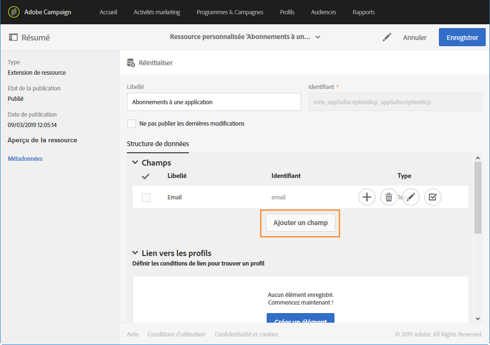
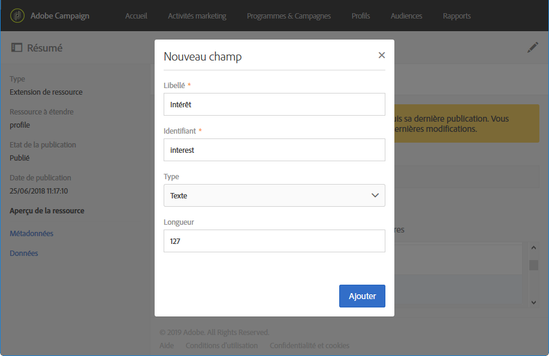
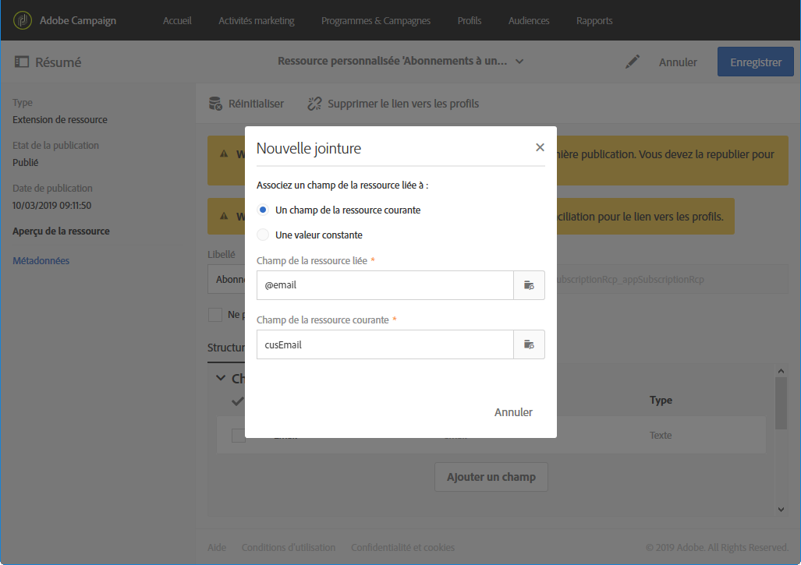

# Extension des abonnements à une ressource d'application{#extending-the-subscriptions-to-an-application-resource}

Dans Adobe Campaign, les données d'attributs de profil mobile envoyées depuis un appareil mobile sont stockées dans la ressource **[!UICONTROL Abonnements à une application (appSubscriptionRcp)]** qui permet de définir les données que vous souhaitez collecter auprès des abonnés de vos applications. Pour plus d'informations sur les ressources personnalisées, consultez cette [page](../../developing/using/key-steps-to-add-a-resource.md).

Cette ressource peut être étendue pour collecter les données que vous avez l'intention d'envoyer depuis d'appareil mobile vers Adobe Campaign.

1. From the advanced menu, via the Adobe Campaign logo, select **[!UICONTROL Administration]** &gt; **[!UICONTROL Development]**, then **[!UICONTROL Custom resources]**.
1. Cliquez sur **[!UICONTROL Créer]** et sélectionnez l'option **Etendre une ressource existante[!UICONTROL .]**
1. Select the **[!UICONTROL Subscriptions to an application (appSubscriptionRcp)]** resource and click **[!UICONTROL Create]**.

   

1. Dans la catégorie **[!UICONTROL Champs]** de l'onglet **[!UICONTROL Structure de données], définissez les données du client à récupérer de l'application mobile en cliquant sur le bouton** Ajouter un champ **.**

   >[!NOTE]
   >
   >Si vous gérez plusieurs applications mobiles, tous les champs utilisés par l'ensemble de vos applications doivent être répertoriés. C'est l'appel de collecte des PII Android ou iOS qui définit les champs capturés par chaque application.

   

1. Ajoutez un **[!UICONTROL Libellé]** et un **Identifiant]pour le nouveau champ.[!UICONTROL ** Select your field's **[!UICONTROL Type]**.

   

1. Dans la catégorie **[!UICONTROL Lien vers les profils], configurez la clé de réconciliation utilisée pour lier les profils de la base de données Adobe Campaign aux abonnés de vos applications (l'email, par exemple).**

   Pour les messages In-App, vous ne pouvez définir qu'une seule clé de réconciliation pour l'ensemble de vos applications mobiles.

   

1. **[!UICONTROL Enregistrez]** et publiez votre ressource personnalisée. Pour plus d'informations sur la publication des ressources personnalisées, consultez cette [page](../../developing/using/updating-the-database-structure.md#publishing-a-custom-resource).

