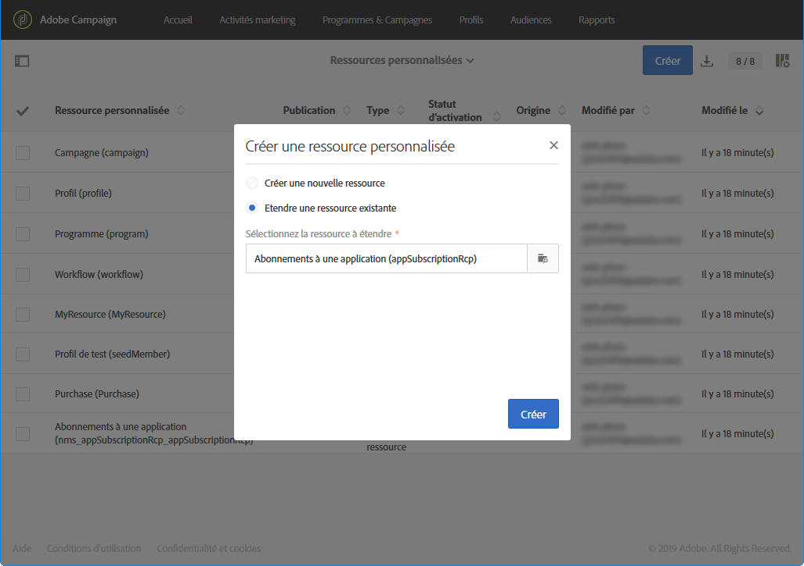

# Extension des abonnements à une ressource d&#39;application{#extending-the-subscriptions-to-an-application-resource}

In Adobe Campaign, mobile profile attributes data sent from mobile device are stored in **[!UICONTROL Subscriptions to an application (appSubscriptionRcp)]** resource which allows you to define the data that you want to collect from your applications&#39; subscribers. For more information on custom resources, refer to [this page](../../developing/using/key-steps-to-add-a-resource.md).

Cette ressource peut être étendue pour collecter les données que vous avez l&#39;intention d&#39;envoyer depuis d&#39;appareil mobile vers Adobe Campaign.

1. From the advanced menu, via the Adobe Campaign logo, select **[!UICONTROL Administration]** > **[!UICONTROL Development]**, then **[!UICONTROL Custom resources]**.
1. Cliquez sur **[!UICONTROL Create]** puis sélectionnez l’ **[!UICONTROL Extend an existing resource]** option.
1. Sélectionnez la **[!UICONTROL Subscriptions to an application (appSubscriptionRcp)]** ressource et cliquez sur **[!UICONTROL Create]**.

   

1. In the **[!UICONTROL Fields]** category of the **[!UICONTROL Data structure]** tab, define the customer data that you want to retrieve from your mobile application by clicking the **[!UICONTROL Add field]** button.

   >[!NOTE]
   >
   >Si vous gérez plusieurs applications mobiles, tous les champs utilisés par l&#39;ensemble de vos applications doivent être répertoriés. C&#39;est l&#39;appel de collecte des PII Android ou iOS qui définit les champs capturés par chaque application.

   

1. Add a **[!UICONTROL Label]** and an **[!UICONTROL ID]** to your new field. Select your field&#39;s **[!UICONTROL Type]**.

   

1. In the **[!UICONTROL Link to profiles]** category, configure the reconciliation key used to link the profiles from the Adobe Campaign database to your applications&#39; subscribers, such as the email.

   Pour les messages In-App, vous ne pouvez définir qu&#39;une seule clé de réconciliation pour l&#39;ensemble de vos applications mobiles.

   

1. **[!UICONTROL Save]** et publiez votre ressource personnalisée. Pour plus d&#39;informations sur la publication des ressources personnalisées, consultez cette [page](../../developing/using/updating-the-database-structure.md#publishing-a-custom-resource).

