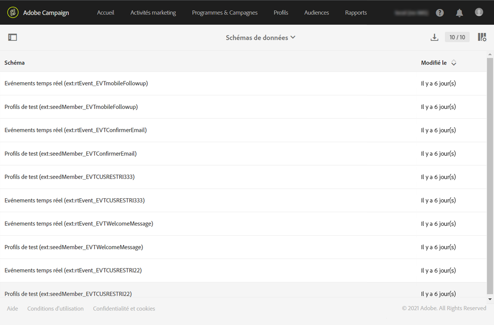

# Contrôle des modifications du modèle de données{#monitoring-data-model-changes}

Le menu **[!UICONTROL Diagnostic]vous permet de consulter les différents objets techniques générés par l'application, afin de les analyser.**

>[!NOTE]
>
>Les écrans de ce menu sont en lecture seule.

Vous pouvez visualiser les types d'objets suivants :

* Schémas de données
* Pages web
* Filtres
* Navigation
* Traitements batch

