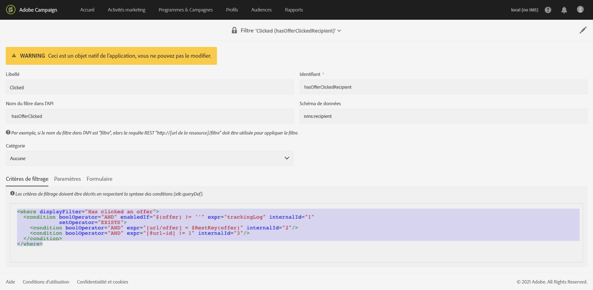

# Contrôle des modifications du modèle de données{#monitoring-data-model-changes}

Le menu **[!UICONTROL Diagnostics]** vous permet de consulter les différents objets techniques générés par l’application, afin de les analyser.

>[!NOTE]
>
>Les écrans de ce menu sont en lecture seule.


Vous pouvez visualiser les types d&#39;objets suivants :

* Schémas de données
* Pages web
* Filtres
* Navigation
* Composants
* Traitements par lot

Vous pouvez modifier la configuration de la liste :

* Vous pouvez ajouter et supprimer des colonnes.
* Vous pouvez définir des noms de colonne.
* Vous pouvez définir l’ordre d’affichage des colonnes dans la liste.
* Vous pouvez choisir l’ordre de tri des valeurs dans la liste.

Vous pouvez filtrer la liste :

* Vous pouvez inclure ou exclure des schémas de données natifs, des pages Web, des filtres et des objets de navigation.
* Vous pouvez rechercher des objets par leur nom.
* Vous pouvez filtrer les tâches par lots selon leur statut, leur date de début et leur date de fin.

Vous pouvez télécharger la liste affichée dans un fichier au format TXT avec des valeurs séparées par des virgules.

Vous pouvez consulter les détails de l’objet sélectionné.

Vous pouvez, par exemple, utiliser cette fonction pour consulter les critères de filtrage des filtres d’usine. Cet exemple illustre le code affiché pour les critères de filtrage d’un filtre d’usine :

```xml
<where displayFilter="Has clicked an offer">
  <condition boolOperator="AND" enabledIf="$(offer) != ''" expr="trackingLog" internalId="1" setOperator="EXISTS">
    <condition boolOperator="AND" expr="[url/offer] = $RestKey(offer)" internalId="2"/>
    <condition boolOperator="AND" expr="[@url-id] != 1" internalId="3"/>
  </condition>
</where>
```

