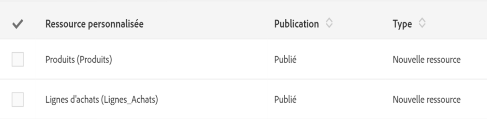

# Statuts des ressources{#resource-statuses}

Les ressources peuvent avoir différents statuts en fonction de leur état de publication ou d'activation.

Deux colonnes sont dédiées à l'affichage des statuts dans l'écran **[!UICONTROL Ressources personnalisées].**

**Publication :**

* **En création** : la ressource vient d'être créée ou bien la ressource a été réinitialisée. Une publication est nécessaire pour créer les tables ou champs de la base de données ainsi que les API correspondantes. Dans le cas d'une réinitialisation, la ressource est automatiquement désactivée suite à l'étape de publication.
* **En attente d'initialisation** : la ressource a été réinitialisée. Le processus de réinitialisation interviendra lors de la prochaine publication. La réinitialisation est irrévocable. Plusieurs messages d'avertissement préviennent l'utilisateur : lors de la réinitialisation puis suite à la préparation de la publication.

   Pour plus d'informations sur la réinitialisation, voir la section [Supprimer une ressource](../../developing/using/deleting-a-resource.md).

   >[!NOTE]
   >
   >L'option **[!UICONTROL Annuler la réinitialisation]est disponible lorsque la ressource que vous souhaitez réinitialiser contient toujours des liens vers d'autres ressources avec le statut « Publiée ».** Cette option permet de rétablir le processus de « réinitialisation ». Les statuts d'origine des ressources personnalisées sont alors rétablis.

* **Publiée** : la ressource a été publiée. Si la ressource est modifiée après la date de dernière publication, alors un message invite l'utilisateur à republier afin de prendre en compte les dernières modifications.

Le champ **[!UICONTROL Ne pas publier les dernières modifications]empêche les modifications d'être prises en compte lors des prochaines publications.**

Ce champ est configurable dans la définition de la ressource personnalisée.
