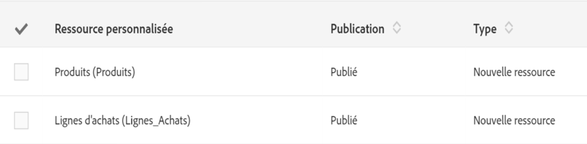

# Statuts des ressources{#resource-statuses}

En fonction de leur statut de publication ou d’activation, les ressources peuvent avoir des statuts différents.

Deux colonnes sont dédiées à l&#39;affichage des statuts dans l&#39;écran **[!UICONTROL Ressources personnalisées]**.

**Publication :**

* **En création** : la ressource vient d&#39;être créée ou bien la ressource a été réinitialisée. Il est nécessaire de publier à nouveau la ressource pour créer les tables ou champs de la base de données ainsi que les API correspondantes. Si une ressource est à nouveau mise en version préliminaire, elle devient automatiquement inactive après l’étape de publication.
* **En attente d&#39;initialisation** : la ressource a été réinitialisée. Le processus de réinitialisation interviendra lors de la prochaine publication. La réinitialisation est irrévocable. Plusieurs messages d’avertissement s’affichent pour informer l’utilisateur, à la fois lors d’une nouvelle version préliminaire et lors de la préparation de la publication.

  Pour plus d&#39;informations sur la réinitialisation, voir la section [Supprimer une ressource](../../developing/using/deleting-a-resource.md).

  >[!NOTE]
  >
  >L&#39;option **[!UICONTROL Annuler la réinitialisation]** est disponible lorsque la ressource que vous souhaitez réinitialiser contient toujours des liens vers d&#39;autres ressources avec le statut « Publiée ». Cette option permet de rétablir le processus de « réinitialisation ». Les statuts d&#39;origine des ressources personnalisées sont alors rétablis.

* **Publiée** : la ressource a été publiée. Si la ressource est modifiée après la date de dernière publication, alors un message invite la personne à la republier afin de prendre en compte les dernières modifications.

Le champ **[!UICONTROL Ne pas publier les dernières modifications]** empêche les modifications d&#39;être prises en compte lors des prochaines publications.

Ce champ est configurable dans la définition de la ressource personnalisée.
