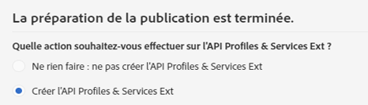

# Etape 2 : Publier l&#39;extension{#step-publish-the-extension}

1. Sélectionnez **[!UICONTROL Administration]** > **[!UICONTROL Développement]**, puis **[!UICONTROL Publication]** dans le menu avancé (via le logo Adobe Campaign).
1. Cliquez sur le bouton **[!UICONTROL Préparer la publication]**.
1. Sélectionnez l&#39;option **[!UICONTROL Créer l&#39;API Profiles &amp; Services Ext]**.

   

   >[!NOTE]
   >
   >Si l&#39;API a déjà été publiée (c&#39;est-à-dire si vous avez déjà coché cette option pour cette ressource ou une autre), la mise à jour de l&#39;API est forcée.

1. Cliquez sur l&#39;onglet **[!UICONTROL Aperçu de l&#39;API Profiles &amp; Services]**.

   Vous verrez ainsi les changements qui seront appliqués par la publication de l&#39;API à la version actuelle de l&#39;API profilesAndServicesExt.

   Ici, le champ Code Promotion (ID : cusBrand) sera inséré dans l&#39;API.

   

1. Cliquez sur le bouton **[!UICONTROL Publier]**.
