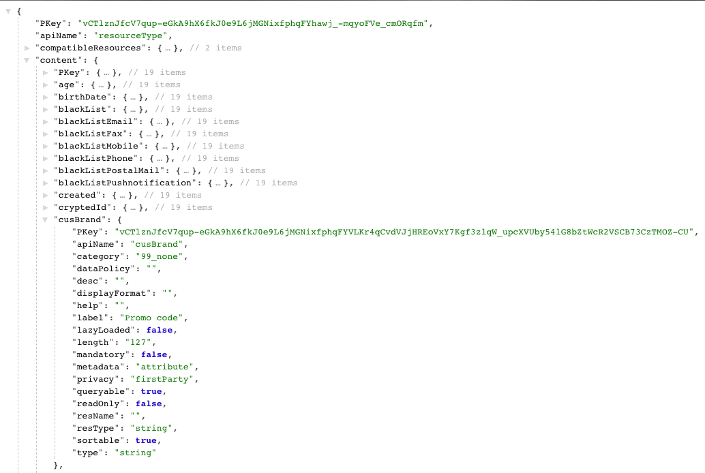

# Etape 3 : Vérifier l'extension{#step-verify-the-extension}

1. Effectuez une opération GET sur les métadonnées de l'API Profiles &amp; Services Extension afin de vérifier la disponibilité du champ ajouté à la ressource personnalisée Profiles.

   ```
   GET profileAndServicesExt/resourceType/profile
   ```

1. Elle renvoie :

   

   Le champ est désormais disponible pour d'autres développements et intégrations éventuels.

