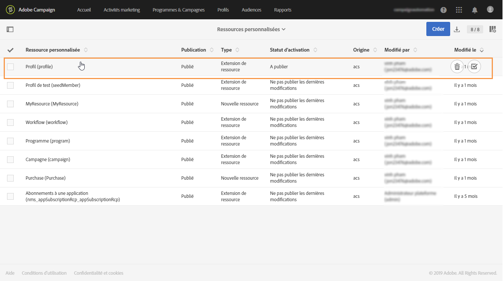
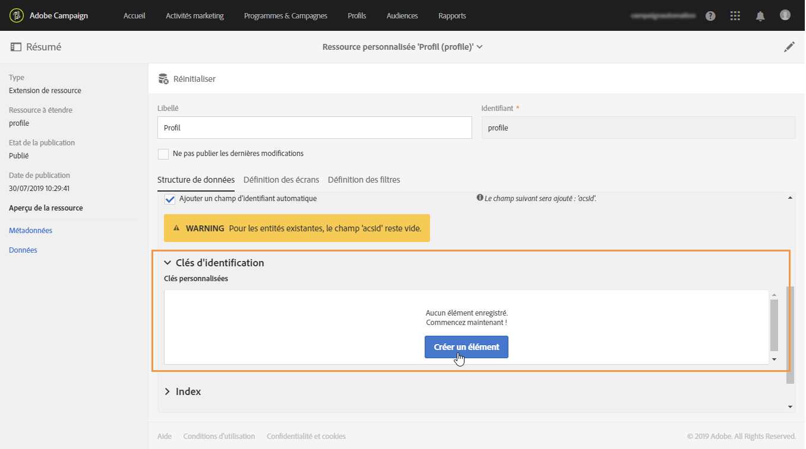
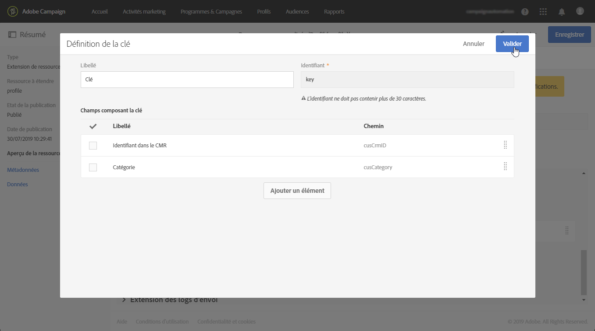
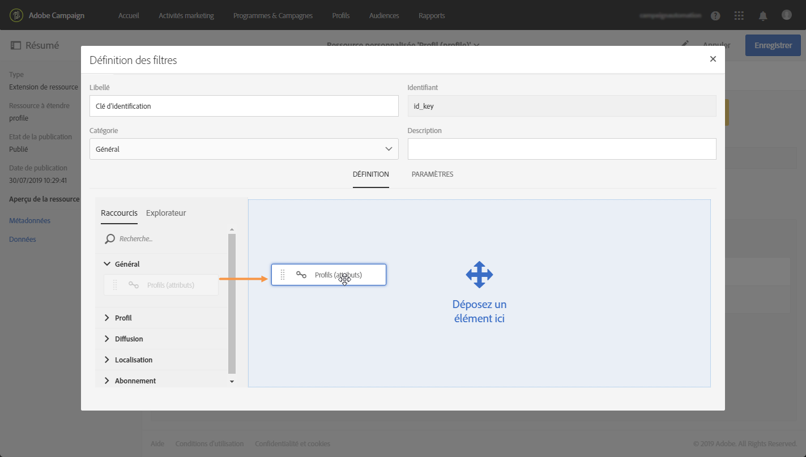
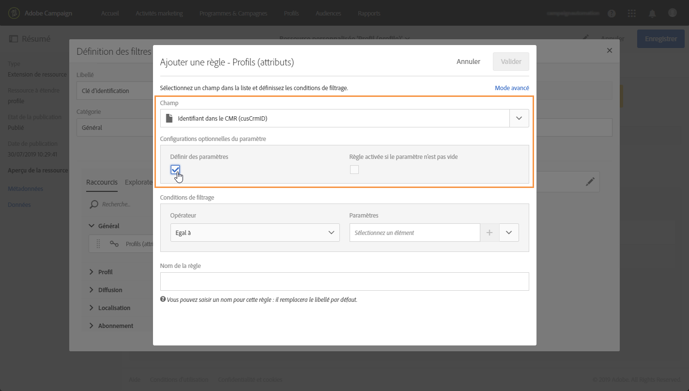
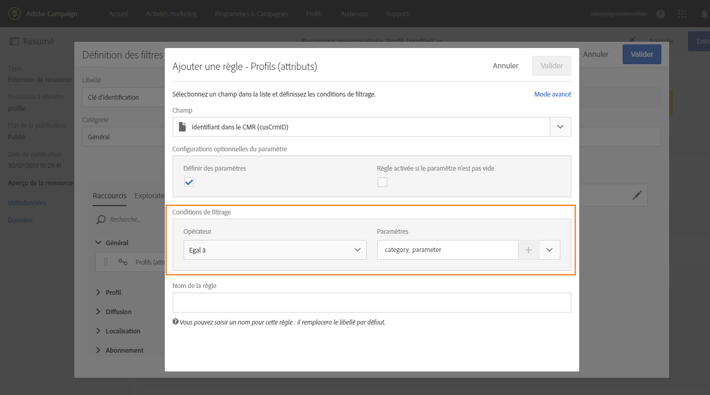
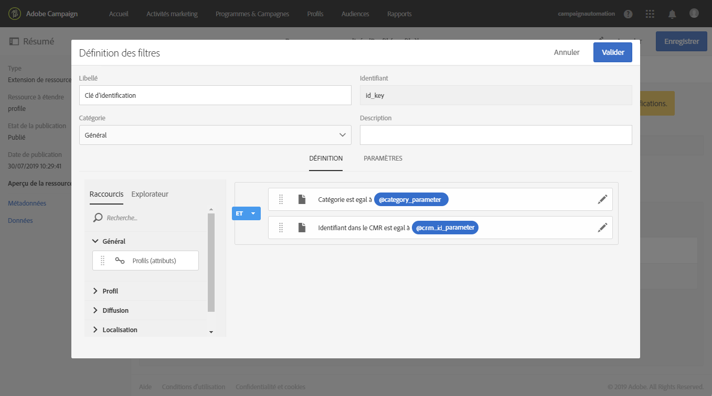
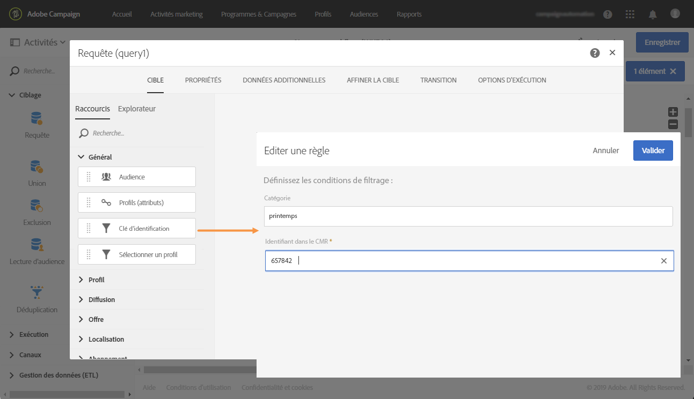

# Appel d'une ressource à l'aide d'une clé d'identification constituée de deux champs

Dans certains cas, vous devrez peut-être définir pour une ressource une clé d'identification constituée de deux champs. Une fois la clé d'identification configurée, vous devez configurer une définition de filtre afin de pouvoir appeler la ressource avec cette clé d'identification, soit à partir de l'interface de Campaign Standard, soit à partir des API.

In this use case, the **Profile** resource has been extended with custom **"CRM ID"** and **"category"** field. Nous allons créer une clé d'identification pour la ressource Profile, qui sera composée de ces deux champs. Nous configurerons ensuite une définition de filtre, de telle sorte que nous puissions accéder à la ressource Profil à l'aide de la clé d'identification.

Les étapes principales de ce cas d'utilisation sont les suivantes :

1. Configurez la clé d'identification pour la ressource Profile, en fonction des deux champs.
1. Configurez la définition du filtre pour pouvoir appeler la ressource du profil à l'aide de sa clé d'identification.
1. Appelez la ressource Profil depuis l'interface ou les API.

Rubriques connexes :

* [Création ou extension de la ressource](../../developing/using/creating-or-extending-the-resource.md)
* [Définir les clés d'identification](../../developing/using/configuring-the-resource-s-data-structure.md#defining-identification-keys)
* [API REST de Campaign Standard](https://docs.campaign.adobe.com/doc/standard/en/api/ACS_API.html)

## Étape 1 : Configuration de la clé d'identification

>[!NOTE]
> Global concepts when configuring identification keys are detailed in [this section](../../developing/using/configuring-the-resource-s-data-structure.md#defining-identification-keys).

1. Avant de configurer la clé d'identification, assurez-vous que la ressource a été étendue avec les champs souhaités et qu'elle a été publiée. Voir à ce propos [cette section](../../developing/using/creating-or-extending-the-resource.md).

1. Go to the **[!UICONTROL Administration]** / **[!UICONTROL Developement]** / **[!UICONTROL Custom resources]** menu, then open the **[!UICONTROL Profile]** resource.

   

1. In the **[UICONTROL Identification keys]** section, click the **[!UICONTROL Create element]** button.

   

1. Add the two custom "CRM ID" and "Category" fields, then click **[UICONTROL Confirm]**.

   

   >[!NOTE]
   > If you want to display the two custom fields in the profile's interface, configure the **[UICONTROL Screen definition]** tab. Voir à ce propos [cette section](../../developing/using/configuring-the-screen-definition.md).

1. Vous pouvez maintenant configurer la définition de filtre pour qu'elle puisse appeler la ressource à l'aide de sa clé d'identification.

## Étape 2 : Configuration de la définition de filtre

>[!NOTE]
> Global concepts when configuring filter definitions are detailed in [this section](../../developing/using/configuring-filter-definition.md).

1. In the **[UICONTROL Filter definition]** tab, click **[UICONTROL Add an element]**, then enter the filter definition's label and ID.

1. Modifiez les propriétés de la définition de filtre pour configurer ses règles.

   

1. Faites glisser et déposez dans l'espace de travail le tableau contenant les champs utilisés dans la clé d'identification.

   

1. Select the first field used in the identification key ("CRM ID"), then activate the **[UICONTROL Switch to parameters]** option.

   

1. In the **[UICONTROL Filter conditions]** section, keep the **[UICONTROL Equal]** operator, then define the parameter's name and click the plus sign to create it.

   

   >[!NOTE]
   > Une fois que vous avez cliqué sur le bouton Plus, le nom du paramètre est généré automatiquement. Notez ces informations, car vous devrez les utiliser pour utiliser le filtre des API.

1. Répétez les étapes ci-dessus avec tous les champs qui composent la clé d'identification (catégorie), puis enregistrez vos modifications.

   

1. La définition de filtre est maintenant configurée. Vous pouvez publier la ressource afin que le filtre soit disponible.

## Étape 3 : Appelez la ressource en fonction de sa clé d'identification

Une fois la clé d'identification configurée et sa définition de filtre, vous pouvez l'utiliser pour appeler la ressource, soit à partir de l'interface standard de Campaign, soit d'API REST.

To use the filter definition from the interface, use a **[UICONTROL Query]** activity in a workflow (see [this section](../../automating/using/query.md)). Le filtre est ensuite disponible dans le volet gauche.

Pour utiliser la définition de filtre des API REST de Campaign Standard, utilisez la syntaxe ci-dessous :

\ « GET /profileAndServicesExt/ &lt; resourcename &gt; &lt; filtername &gt; ? &lt; param 1_ parameter &gt; = &lt; value &gt; &amp; &lt; param 2_ parameter &gt; = &lt; value &gt;\ "

Dans notre cas, la syntaxe permettant de récupérer un profil de la catégorie « printemps » et l'identifiant CRM « 123456 » sont les suivantes :

\ « GET https://mc.adobe.io/ &lt; ORGANISATION &gt;/campaign/profileandservicesext/profile/identification_ key ? category_ parameter = spring &amp; crm_ id_ parameter = 123456\ "

For more details, refer to [Campaign Standard REST APIs documentation](https://docs.campaign.adobe.com/doc/standard/en/api/ACS_API.html#filtering).