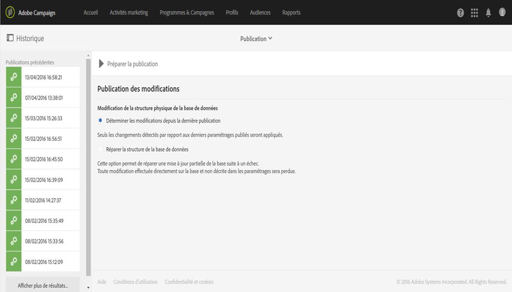
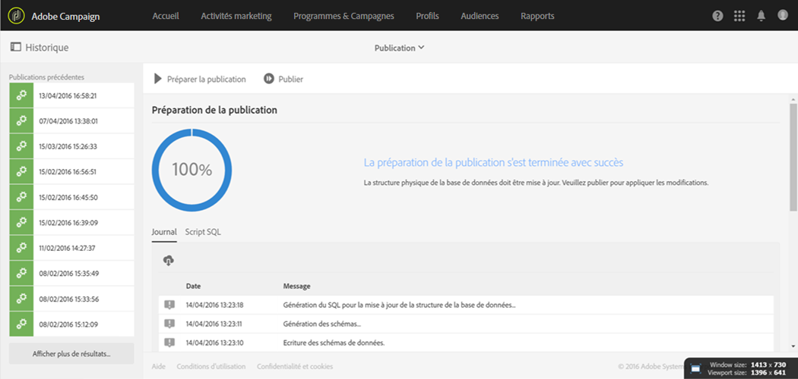
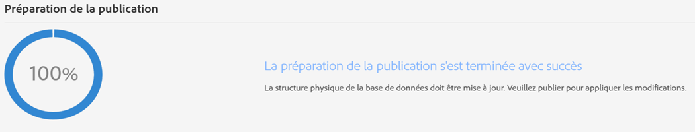
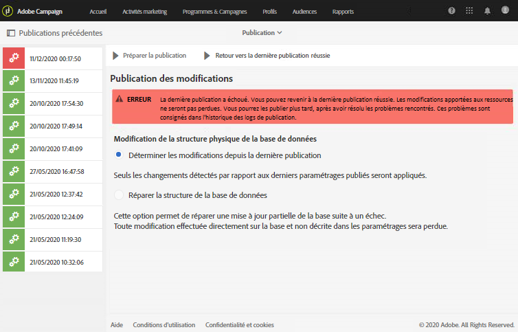
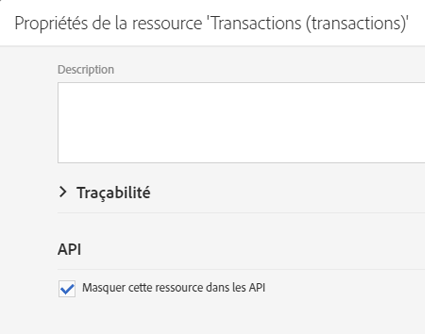
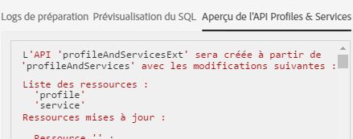

# Mettre à jour la structure de la base de données{#updating-the-database-structure}

Pour prendre en compte les modifications apportées au modèle de données et pour pouvoir les utiliser, la structure de la base de données doit être mise à jour.

>[!NOTE]
>
>Les ressources personnalisées sont automatiquement actualisées lors des mises à jour automatiques effectuées par Adobe.

## Publier une ressource personnalisée {#publishing-a-custom-resource}

Pour appliquer les modifications apportées aux ressources, vous devez effectuer une mise à jour de la base de données.

>[!NOTE]
>
>Si le champ d'une ressource personnalisée utilisée lors d'un événement est modifié ou supprimé, l'événement correspondant sera automatiquement dépublié. Consultez [Configuration des messages transactionnels](../../administration/using/configuring-transactional-messaging.md).

1. From the advanced menu, via the Adobe Campaign logo, select **[!UICONTROL Administration]** &gt; **[!UICONTROL Development]**, then **[!UICONTROL Publishing]**.
1. Par défaut, l'option **[!UICONTROL Déterminer les modifications depuis la dernière publication]est cochée, ce qui signifie que seuls les changements apportés depuis la dernière mise à jour seront appliqués.**

   >[!NOTE]
   >
   >L'option **[!UICONTROL Réparer la structure de la base de données]permet de rétablir une configuration correcte si la publication a échoué avant d'avoir pris fin.** Toute modification directement apportée à la base de données et non par le biais des ressources personnalisées sera supprimée.

   

1. Cliquez sur le bouton **[!UICONTROL Préparer la publication]pour lancer l'analyse.** Veuillez noter que les mises à jour importantes des tables devraient être réalisées lorsque l'instance ne fait pas l'objet d'une utilisation intense par les workflows.

   Pour plus d'informations sur l'action à réaliser sur l'API Profiles &amp; Services, consultez [Publier une ressource avec l'extension de l'API](../../developing/using/updating-the-database-structure.md#publishing-a-resource-with-api-extension).

   

1. Une fois l'analyse effectuée, cliquez sur le bouton **[!UICONTROL Publier]pour appliquer vos nouveaux paramétrages.**
1. Une fois la publication effectuée, le volet **[!UICONTROL Résumé]** de chaque ressource indique que le statut est désormais **Publié]et précise la date de la dernière publication.[!UICONTROL **

   >[!NOTE]
   >
   >Si vous apportez de nouvelles modifications à une ressource, vous devrez répéter cette opération afin de les appliquer.

   Si des ressources ont le statut **[!UICONTROL En attente d'initialisation]avant la publication, alors un message informatif supplémentaire apparaît, vous invitant à vérifier vos actions car la publication va entraîner des modifications définitives (suppression de colonnes, de tables...).** Pour vous aider à faire cette dernière modification, un onglet **[!UICONTROL Script SQL]est disponible.** Il fournit la commande SQL qui va être exécutée lors de la publication.

   

   >[!NOTE]
   >
   >Vous pouvez arrêter le processus de réinitialisation en cliquant sur le bouton **[!UICONTROL Annuler la réinitialisation.]** Cette action rétablit le statut d'origine de la ressource.

1. If your publication failed, you can always go back to the previous publication by clicking **[!UICONTROL Back to latest successful publication]**.

   Notez que si vous laissez votre publication dans un état d'échec, une fenêtre contextuelle s'ouvrira dès que vous vous connecterez à votre instance pour vous rappeler de corriger cette publication. Votre instance ne sera pas mise à niveau avec les nouvelles versions de produit tant que votre publication n'aura pas été corrigée.

   

## Publier une ressource avec l'extension de l'API {#publishing-a-resource-with-api-extension}

Vous pouvez créer l'API Profile and Services dans les cas suivants :

* When you extend the custom resources **[!UICONTROL Profiles]** or **[!UICONTROL Services]**, you can perform an update of the Profiles and Services API to integrate the fields declared in the custom resources extension.
* Lorsque vous définissez une ressource personnalisée et créez un lien entre les ressources **[!UICONTROL Profils]** ou **Services]et la ressource personnalisée, vous pouvez réaliser une mise à jour afin d'inclure la nouvelle ressource dans l'API.[!UICONTROL **

Vous pouvez sélectionner cette option dans l'écran de publication.

* Si l'API n'a pas encore été publiée (en d'autres termes, si vous n'avez jamais étendu la ressource ou si vous n'avez jamais coché cette option pour cette ressource ou une autre), vous avez le choix de la créer ou non.

   

* Si l'API a déjà été publiée (c'est-à-dire si vous avez étendu la ressource et coché cette option), la mise à jour de l'API est forcée.

   En effet, une fois créée, l'API est mise à jour automatiquement chaque fois que vous la publiez à nouveau. Cela permet d'éviter de rompre la ressource de profil ou de service de cette API et d'endommager votre instance.

Note that by default, the custom resource is integrated, but, for a specific behavior, if you don't want to publish this resource, you can select the option **[!UICONTROL Hide this resource from APIs]** available in the **[!UICONTROL Resource Properties]**.

Après l'étape **[!UICONTROL Préparer la publication]**, Adobe Campaign affiche les différences entre la version actuelle et la future version de l'API après publication dans l'onglet **[!UICONTROL Aperçu de l'API Profiles &amp; Services]**. Si vous étendez l'API pour la première fois, la définition d'usine de la ressource personnalisée est comparée à votre extension.

Les informations contenues dans l'onglet sont divisées en trois sections : éléments ajoutés, supprimés et modifiés.

L'analyse des différences est une étape obligatoire, car la publication modifiera le comportement de l'API et aura probablement un effet en cascade sur le développement environnant.

>[!NOTE]
>
>Cette publication met à jour l'API **[!UICONTROL profilesAndServicesExt.]** L'API **[!UICONTROL profilesAndServices]n'est pas mise à jour.**

Pour plus d'informations sur l'API Adobe Campaign, reportez-vous à la documentation Adobe Campaign dédiée sur [Adobe IO](https://docs.campaign.adobe.com/doc/standard/en/adobeio.html).
