# Cas pratiques Triggers d'abandon{#abandonment-triggers-use-cases}

Cette section détaille divers cas pratiques qui peuvent être implémentés via l'intégration entre Adobe Campaign et les Triggers Experience Cloud. Vous trouverez deux exemples de cas pratiques :

* [Trigger d'abandon de navigation](../../integrating/using/abandonment-triggers-use-cases.md#browse-abandonment-trigger) : envoyer une communication à des clients ayant abandonné leur visite sur votre site web.
* [Trigger d'abandon de recherche](../../integrating/using/abandonment-triggers-use-cases.md#search-abandonment-trigger) : reprendre le contact avec des visiteurs ayant effectué une recherche sur votre site web, mais sans faire d'achat.

>[!NOTE]
>
>Les cas pratiques décrits dans cette section sont basés sur l'Identifiant du visiteur Experience Cloud. Ils peuvent également être mis en œuvre avec le Declared ID Experience Cloud. Les identifiants de type Declared ID hachés et cryptés sont également pris en charge. Vous pouvez envoyer des emails/SMS à un profil qui n'existe pas dans Campaign en décryptant directement l'adresse email/le numéro de mobile cryptés. Dans ce cas, il n'est toutefois pas possible d'effectuer une personnalisation avec les données de profil.

## Conditions requises {#pre-requisites}

Afin de pouvoir mettre en œuvre ces cas pratiques, vous devez avoir accès aux solutions/Core Services suivants :

* Adobe Campaign
* Adobe Analytics Ultimate, Premium, Foundation, OD, Select, Prime, Mobile Apps, Select ou Standard.
* Core Service Triggers Experience Cloud
* Core Service DTM Experience Cloud
* Identifiant du visiteur Experience Cloud et Core Service People Experience Cloud

Il vous faudra également un site web opérationnel.

Pour plus d'informations, consultez [Configuration des solutions et services](../../integrating/using/configuring-triggers-in-experience-cloud.md#configuring-solutions-and-services).

## Trigger d'abandon de navigation {#browse-abandonment-trigger}

Dans ce cas pratique, nous allons créer un trigger simple qui se déclenchera à chaque fois qu'un client abandonnera sa visite sur le site Web. Cet exemple part du principe que vous avez configuré DTM pour collecter et envoyer des données vers Adobe Marketing, et que tous vos événements sont déjà créés.

### Création d'un trigger Experience Cloud {#creating-an-experience-cloud-trigger}

1. Sélectionnez **[!UICONTROL Gérer les triggers]dans le menu Experience Cloud Activation Core Service.**

   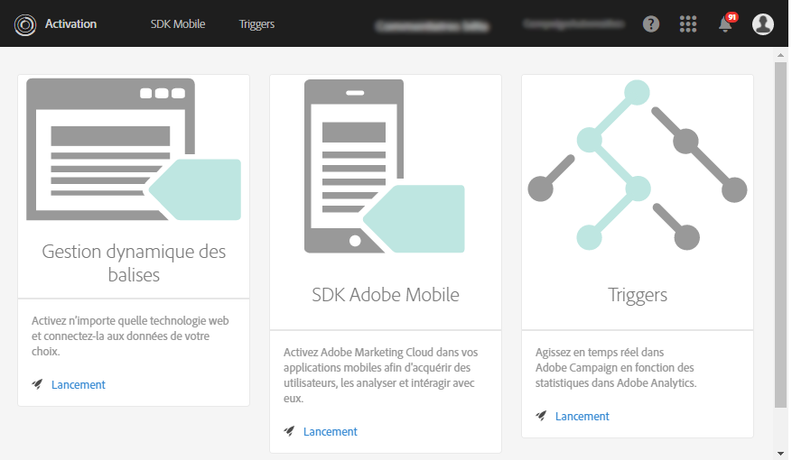

1. Choisissez un type de trigger (**[!UICONTROL Abandon], dans ce cas pratique).**

   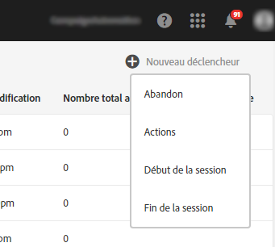

1. Pour ce cas pratique, il nous faut un trigger d'abandon simple. L'objectif métier est d'identifier les visiteurs qui naviguent sur notre site Web de réservation de voyages et qui consultent la page « Offres » sans faire de réservation. Une fois cette audience identifiée, nous voulons les contacter rapidement. Dans cet exemple, nous avons choisi d'envoyer le trigger après une période de 10 minutes.

   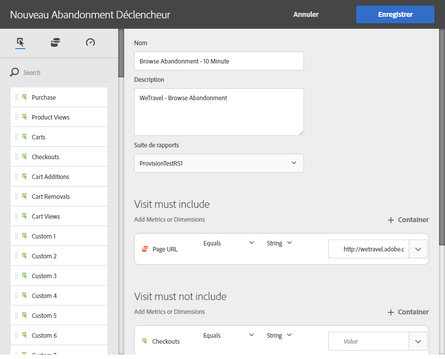

### Utiliser le trigger dans Adobe Campaign {#using-the-trigger-in-adobe-campaign}

Maintenant que nous avons créé un trigger Experience Cloud, nous allons l'utiliser dans Adobe Campaign.

Dans Adobe Campaign, vous devez créer un trigger lié à celui créé dans Experience Cloud.

1. To create the Trigger in Adobe Campaign, click the **[!UICONTROL Adobe Campaign]** logo, in the top left corner, then select **[!UICONTROL Marketing plans]** &gt; **[!UICONTROL Transactional messages]** &gt; **[!UICONTROL Experience Cloud triggers]**.

   

1. Cliquez sur **[!UICONTROL Créer]**.
1. Select the Trigger you created earlier and click **[!UICONTROL Next]**.

   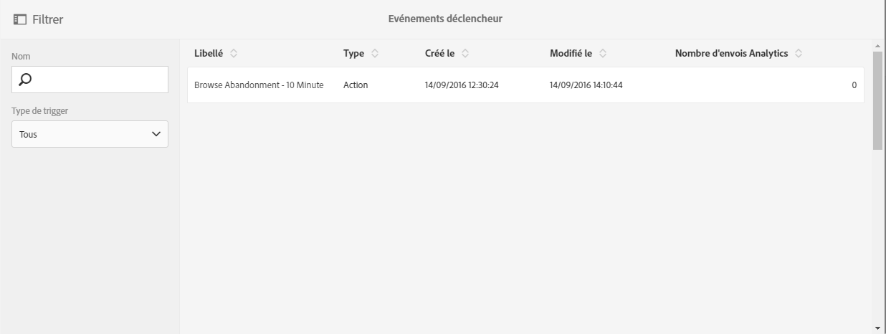

1. Select the **[!UICONTROL Email]** channel and the **[!UICONTROL Real-time event]** targeting dimension and click **[!UICONTROL Create]**.

   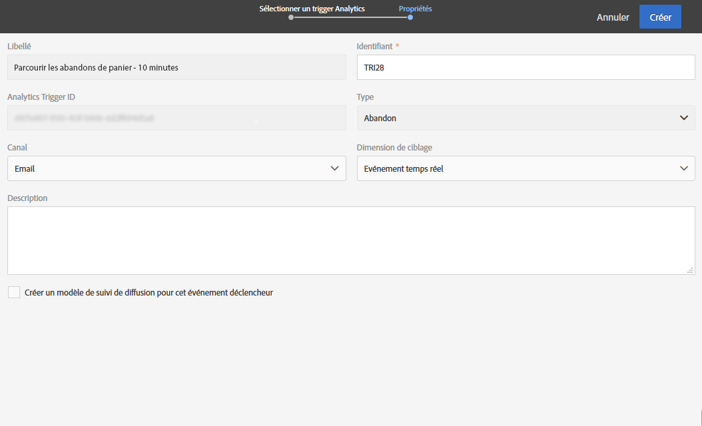

1. Publiez le Trigger dans Adobe Campaign. Ce processus créera toujours automatiquement un modèle de message transactionnel.

   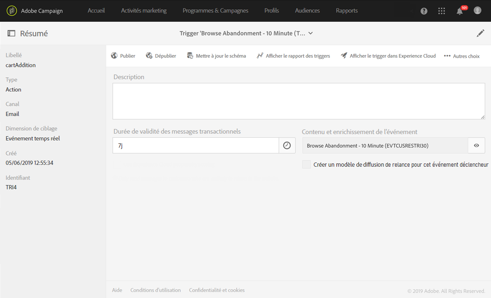

1. To dislay the message template, click the **[!UICONTROL More]** button, on the top right, then click **[!UICONTROL Trigger Transactional Template]**.
1. Personnalisez son contenu et les données expéditeur.

   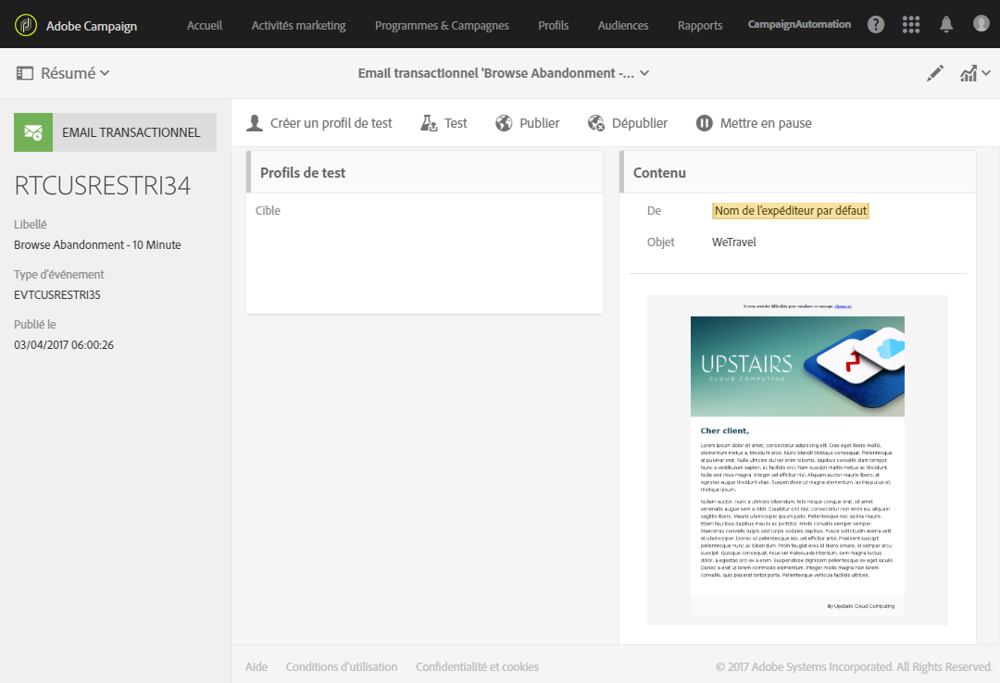

1. Publiez le modèle de message. Le trigger est maintenant en ligne et opérationnel.

   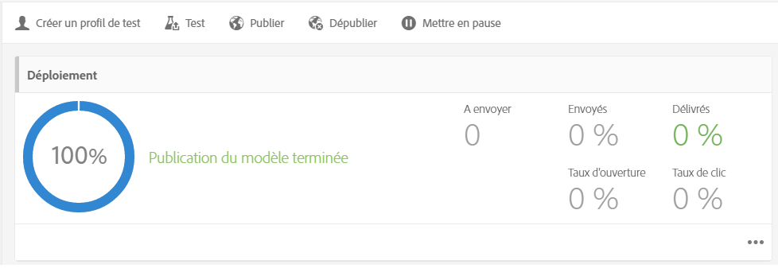

### Exécuter le scénario {#running-the-scenario}

1. Ce cas pratique commence par un email initial envoyé à votre audience avec Adobe Campaign.

   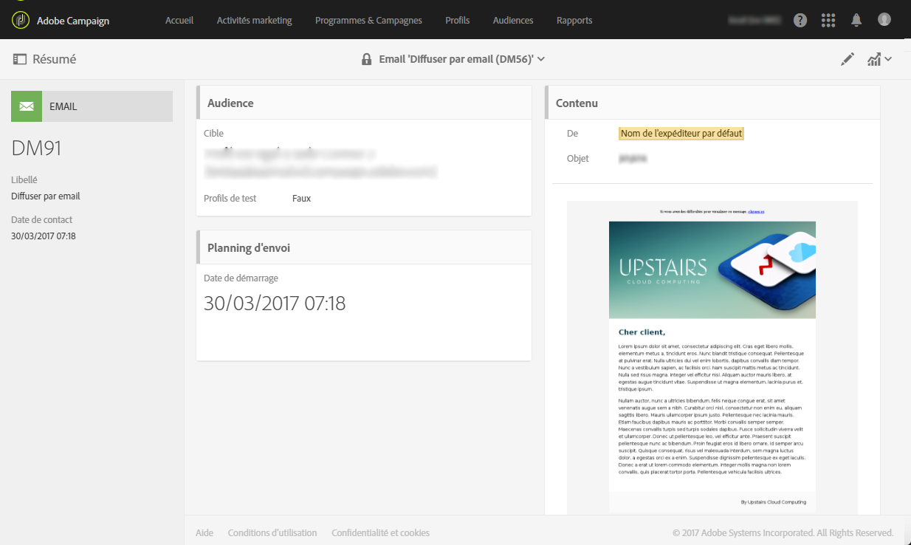

1. Le destinataire ouvre l'email.

   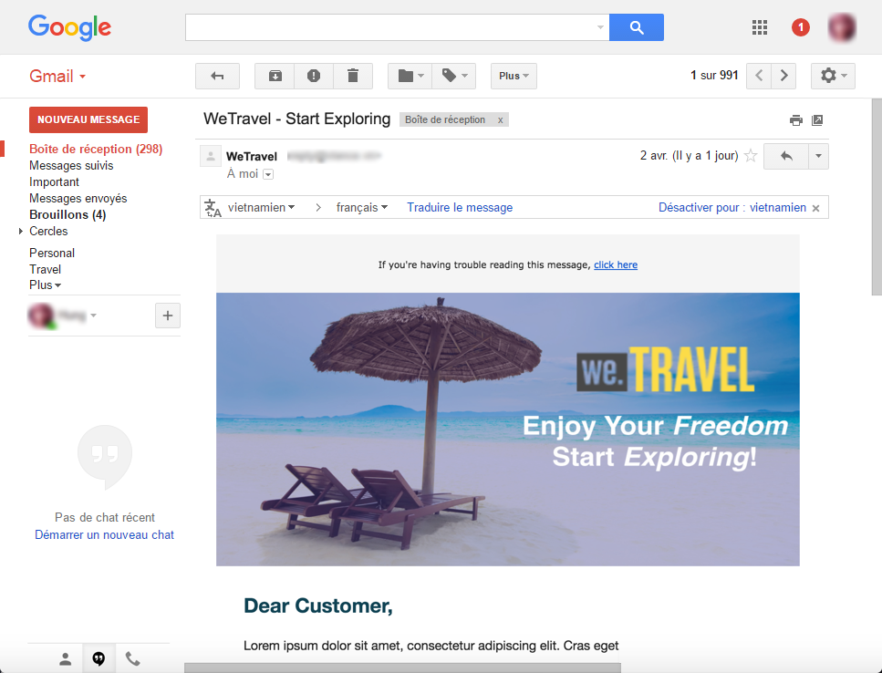

1. Il clique sur un lien qui ouvre une page de votre site Web. Dans cet exemple, la bannière dirige le destinataire vers la page d'accueil du site Web de réservation de voyages.

   

1. Le destinataire se rend sur la page « Offres » mais interrompt brusquement sa visite. Après un délai de 10 minutes, Adobe Campaign déclenche l'envoi du message transactionnel.

   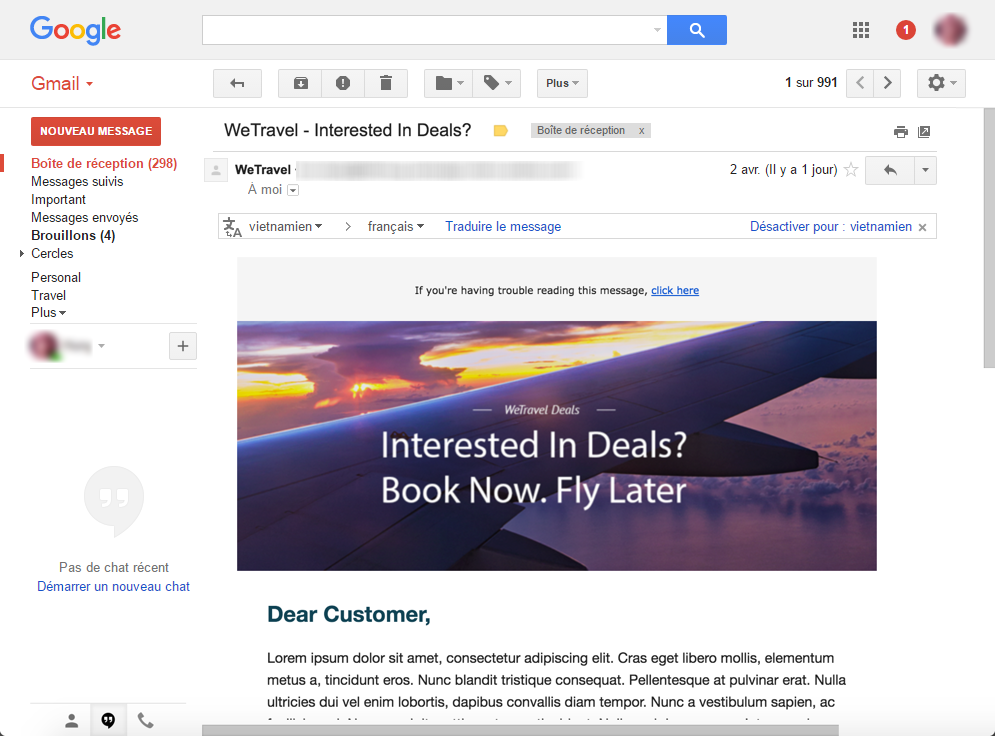

1. A tout moment, vous pouvez vérifier les logs Experience Cloud pour voir combien de fois le trigger s'est lancé.

   

1. Vous pouvez également afficher le rapport de trigger Adobe Campaign.

   

## Trigger d'abandon de recherche {#search-abandonment-trigger}

Dans ce cas pratique, nous allons créer un trigger pour reprendre contact avec des visiteurs ayant visité notre site Web de réservation de voyages et qui, ayant cherché une destination sans trouver de résultats pertinents, n'ont rien réservé. Le processus général est le même que pour le cas pratique précédent (voir [Trigger d'abandon de navigation](../../integrating/using/abandonment-triggers-use-cases.md#browse-abandonment-trigger)). Ici, nous allons nous focaliser sur la personnalisation de l'email de remarketing.

### Création d'un trigger Experience Cloud {#creating-an-experience-cloud-trigger-1}

Suivez les étapes décrites dans le cas pratique précédent pour créer le trigger Experience Cloud. Voir [Créer un Trigger Experience Cloud](../../integrating/using/abandonment-triggers-use-cases.md#creating-an-experience-cloud-trigger). La différence principale est la définition du trigger.

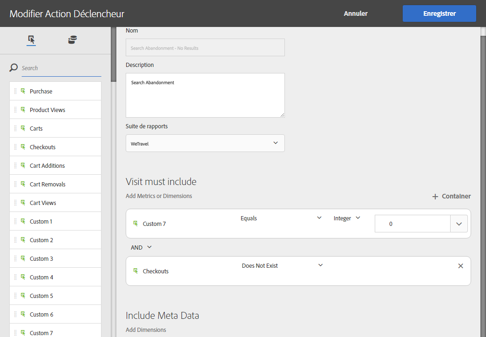

La section **[!UICONTROL Inclure les métadonnées]vous permet de transférer toutes les données collectées via Analytics vers la payload Trigger.** Dans cet exemple, nous allons créer un eVar personnalisé (eVar 3, par exemple) pour collecter le terme de recherche que le visiteur saisit. Ce terme sera ensuite utilisé dans l'email transactionnel envoyé à ce même visiteur.

### Utiliser le trigger dans Adobe Campaign {#using-the-trigger-in-adobe-campaign-1}

1. Suivez les étapes décrites dans le cas pratique précédent pour créer le trigger dans Adobe Campaign. Voir [Utiliser le trigger dans Adobe Campaign](../../integrating/using/abandonment-triggers-use-cases.md#using-the-trigger-in-adobe-campaign). La différence principale est la manière dont, dans Adobe Campaign, nous accédons et utilisons les métadonnées transmises dans la payload Trigger.
1. Dans le trigger d'abandon de recherche créé dans Adobe Campaign, cliquez sur l'icône **[!UICONTROL Contenu et enrichissement de l'événement]pour voir la payload transmise à Adobe Campaign.**

   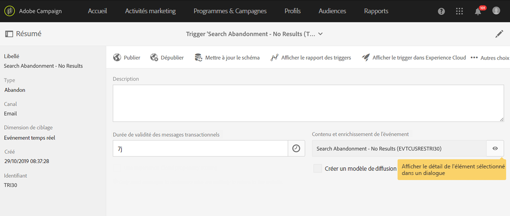

1. Nous voyons que l'eVar personnalisé est passé dans la payload Trigger et est associé à la table **Contexte de l'événement** (ctx). Nous pouvons à présent y accéder pour personnaliser le message transactionnel.

   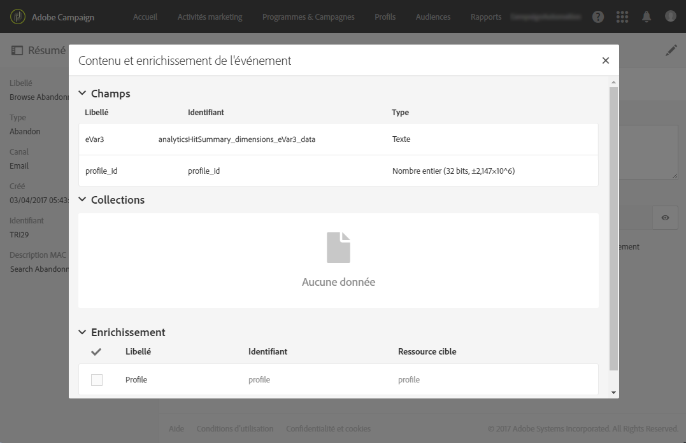

1. Dans cet exemple, nous avons choisi d'inclure le terme de recherche de la destination dans l'objet de l'email et dans le corps de l'émail.

   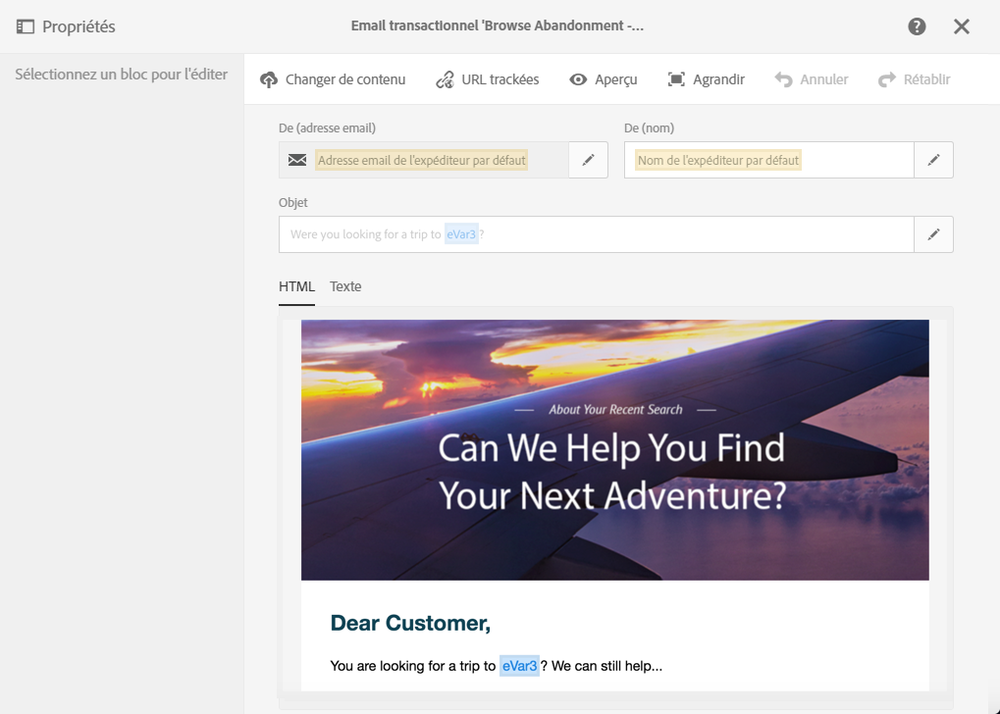

1. Lors de la sélection d'un champ de personnalisation, cherchez les métadonnées de la payload dans la table **Evénement transactionnel** (rtEvent) puis dans la sous-table **Contexte de l'événement** (ctx).

   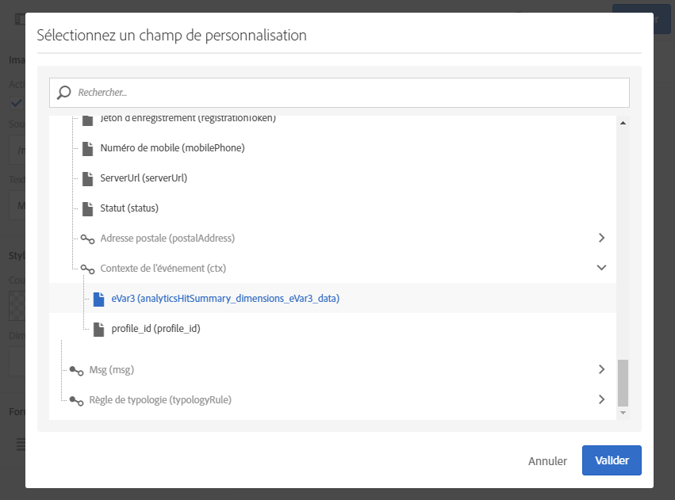

### Exécuter le scénario {#running-the-scenario-1}

1. Le visiteur se rend sur un site Web de réservation de voyages et lance une recherche pour une destination. Dans cet exemple, le visiteur cherche un voyage au Japon mais ne trouve aucun résultat. C'est pour nous l'occasion de contacter le visiteur pour lui recommander un projet de voyage alternatif.

   

   >[!NOTE]
   >
   >Dans ce cas pratique, nous partons de l'hypothèse selon laquelle le visiteur/destinataire a déjà ouvert et cliqué sur un email en provenance du même site Web. Cela nous permet d'utiliser et de collecter l'Identifiant du visiteur et de l'associer au destinataire. Cette étape n'est nécessaire qu'une seule fois.

1. Quelques minutes plus tard, le même visiteur/destinataire reçoit un message remarketing. Ce message comprend la destination recherchée récemment.

   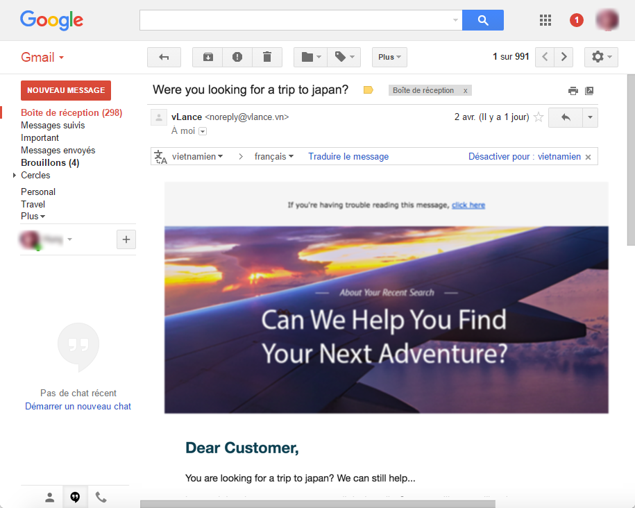

