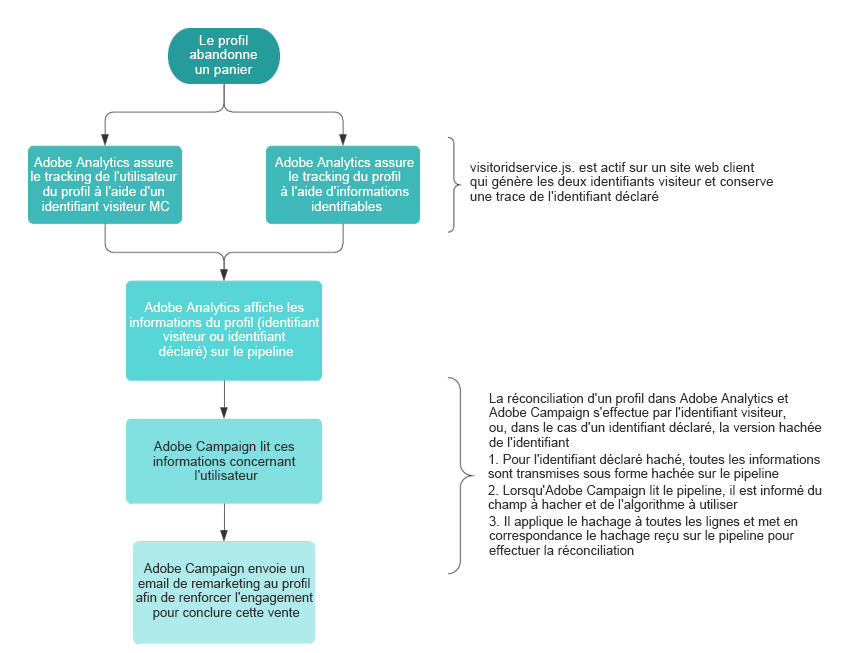

# À propos des Triggers Adobe Experience Cloud{#about-adobe-experience-cloud-triggers}

L&#39;intégration entre le core service Activation Experience Cloud **[!UICONTROL Triggers]** et Adobe Campaign permet d&#39;envoyer des emails personnalisés à vos clients en réaction à des comportements spécifiques trackés sur votre site web par Adobe Analytics (dans un délai de 15 minutes).

Dans Adobe Experience Cloud, vous définissez les différents déclencheurs, c&#39;est-à-dire les comportements des clients que vous souhaitez contrôler, comme tous les clients qui ont abandonné leur visite de votre site Web, effectué une recherche sur votre site Web, mais sans effectuer d&#39;achats, ou dont la session a expiré. Lors de la création d&#39;un trigger, vous définissez la condition du trigger et les données qui seront envoyées à Adobe Campaign dans l&#39;événement (pload). 

Dans Adobe Campaign, vous sélectionnez le déclencheur qui a été précédemment créé, vous enrichissez les données de l&#39;événement avec celles du datamart et vous définissez un modèle de message transactionnel lié au déclencheur. Par exemple, lorsqu’un client abandonne sa visite sur votre site Web, un événement est envoyé à Adobe Campaign, qui peut ensuite exploiter cet événement par le biais d’un e-mail de remarketing envoyé au client dans les 15 minutes.

Le diagramme suivant décrit le fonctionnement de cette intégration.

**Rubriques connexes :**

* Apprenez-en plus sur les différents types de déclencheurs : [documentation Adobe Experience Cloud](https://experienceleague.adobe.com/docs/core-services/interface/activation/triggers.html?lang=fr).
* Regardez la vidéo [Déclencher des messages de remarketing selon l&#39;activité du site](https://helpx.adobe.com/fr/marketing-cloud/how-to/email-marketing.html#step-two).
* Découvrez nos deux [cas pratiques de déclencheurs d&#39;abandon](../../integrating/using/abandonment-triggers-use-cases.md).

## Processus utilisateur de Triggers       {#triggers-user-process}

>[!CAUTION]
>
>Avant d&#39;effectuer les principales étapes utilisateur, la fonctionnalité doit être configurée. Pour plus d&#39;informations à ce sujet, consultez [Activation de la fonctionnalité](../../integrating/using/configuring-triggers-in-experience-cloud.md#activating-the-functionality), [Configuration des solutions et services](../../integrating/using/configuring-triggers-in-experience-cloud.md#configuring-solutions-and-services) et [Création d&#39;un déclencheur mappé dans Campaign](../../integrating/using/using-triggers-in-campaign.md#creating-a-mapped-trigger-in-campaign).

Dans Adobe Campaign, les étapes principales du processus utilisateur sont les suivantes :

1. Création d&#39;un événement déclencheur lié à un déclencheur Adobe Experience Cloud existant
1. Publication de l&#39;événement déclencheur.
1. Définition du contenu du modèle de message transactionnel.
1. Test du modèle (création d&#39;un profil de test et envoi d&#39;un BAT).
1. Publication du modèle de message transactionnel.

Des cas pratiques complets sont présentés dans [cette section](../../integrating/using/abandonment-triggers-use-cases.md).

## Remarques importantes {#important-notes}

Voici quelques remarques importantes à prendre en considération avant d&#39;utiliser l&#39;intégration Triggers - Campaign :

* Les notifications push ne sont pas prises en charge pour les déclencheurs. Seuls les emails et les SMS sont pris en charge.
* Vous pouvez enrichir le déclencheur à l&#39;aide de métadonnées récupérées par Analytics comme les ID d&#39;email, les noms de page, etc.
* Vous pouvez réconcilier le déclencheur à un profil enregistré dans Campaign Standard et utiliser les champs du profil pour personnaliser le message.
* Dès que le déclencheur est transmis, il est traité, réconcilié et renvoyé. Cette opération prend entre 5 et 15 minutes en fonction du volume des déclencheurs reçus et du nombre de champs de personnalisation utilisés dans le modèle.

>[!NOTE]
>
>Pour en savoir plus sur les bonnes pratiques et les limites techniques, consultez [Bonnes pratiques et limites des déclencheurs](../../integrating/using/configuring-triggers-in-experience-cloud.md#triggers-best-practices-and-limitations).
