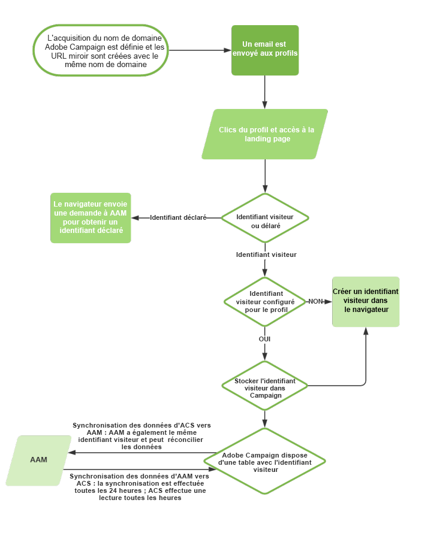

# À propos de l&#39;intégration Campaign-Audience Manager ou People core service{#about-campaign-audience-manager-or-people-core-service-integration}

>[!CAUTION]
>
>L’import d’audiences dans Adobe Campaign peut être soumis à des restrictions légales en fonction des données échangées.

Adobe Campaign vous permet d&#39;échanger et de partager des audiences/segments avec les autres applications d&#39;Adobe Experience Cloud. En intégrant **Adobe Campaign** à **People core service** (aussi appelé **Profiles &amp; Audiences core service**) ou Adobe Audience Manager, vous pouvez :

* importer dans Adobe Campaign des audiences/segments provenant de différentes solutions d&#39;Adobe Experience Cloud. L&#39;import d&#39;audiences peut être réalisé depuis le menu **[!UICONTROL Audiences]** dans Adobe Campaign.
* exporter des audiences en tant qu&#39;audiences/segments partagés. Ces audiences peuvent être exploitées dans les différentes solutions d’Adobe Experience Cloud que vous utilisez. L&#39;export d&#39;audiences peut être réalisé à la suite d&#39;un ciblage dans un workflow, à l&#39;aide de l&#39;activité **[!UICONTROL Sauvegarde d&#39;audience]**.

L&#39;intégration prend en charge deux types d&#39;identifiants Adobe Experience Cloud :

* **Visitor ID** : ce type d’identifiant permet de réconcilier des visiteurs Adobe Experience Cloud avec des profils Adobe Campaign. Dès qu’une connexion est activée via l’Adobe IMS, le service Marketing Cloud Visitor ID est activé, ce qui remplace le cookie permanent utilisé par Adobe Campaign. Vous pouvez ainsi identifier un visiteur, puis le lier à un profil.
   Un identifiant visiteur est associé à un profil dès le moment où le profil clique dans un email envoyé via Adobe Campaign :
   * Si le profil possède déjà un identifiant visiteur, les données du navigateur du profil permettent à Adobe Campaign de retrouver et d’associer automatiquement ce profil à l’identifiant visiteur.
   * Si aucun identifiant visiteur n’est trouvé, un nouvel ID est créé. Cet identifiant visiteur est stocké dans les logs de tracking du profil.

  L’identifiant sera ensuite reconnu par les autres applications Adobe Marketing Cloud partageant le même CNAME.

* **Declared ID** : ce type d’identifiant permet de réconcilier tout type de données provenant de la base de données Adobe Campaign. Dans Adobe Campaign, il est représenté sous la forme d’une clé de réconciliation prédéfinie. Lors de l’échange de données, les identifiants de la base de données Adobe Campaign sont hachés. Ces identifiants hachés sont ensuite comparés aux identifiants hachés de l’audience Adobe Marketing Cloud impliquée dans l’import ou l’export.
   Cette intégration prend en charge les identifiants Declared ID standard, hachés et chiffrés.

  >[!NOTE]
  >
  >Désormais, la source de données des ID déclarés peut également être utilisée avec l’intégration de People Core Service.
  >
  >Si vous utilisez l’intégration de People Core Service et que vous souhaitez ajouter l’intégration d’Audience Manager, vous aurez besoin de l’aide d’un consultant Adobe Audience Manager. Ce dernier vous aidera à éviter de perdre toutes les synchronisations d’ID collectées lors de la transition vers l’utilisation de cette source de données d’ID déclarés dans un contexte Adobe Audience Manager.

  Le chiffrement permet de partager des données chiffrées dans des sources de données (informations d&#39;identification personnelles, par exemple) à l&#39;aide de l&#39;identifiant Declared ID en spécifiant l&#39;algorithme de chiffrement.

  Par exemple, grâce à la possibilité de déchiffrer des adresses e-mail ou des numéros de SMS chiffrés, vous pouvez également envoyer des messages déclenchés à vos utilisateurs même si leur profil n&#39;existe pas dans la base de données Adobe Campaign.

Le diagramme suivant décrit le fonctionnement de cette intégration. Ici, AAM signifie Adobe Audience Manager, et ACS Adobe Campaign Standard.

