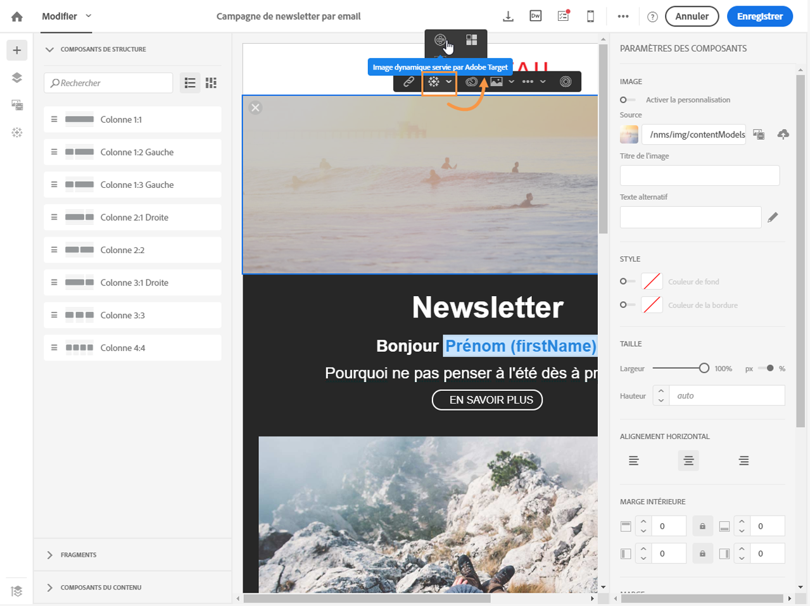
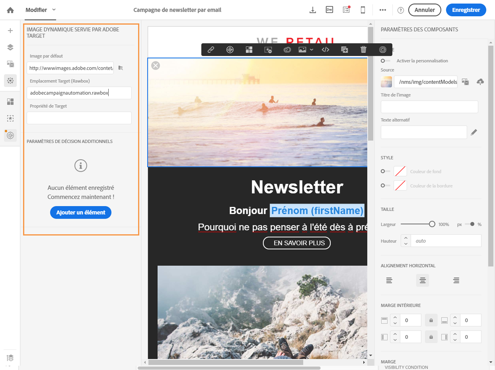

# Ajouter du contenu dynamique Target{#adding-target-dynamic-content}

Avec l'intégration avec Adobe Target, des images dynamiques peuvent être ajoutées dans une diffusion afin de personnaliser le contenu selon les expériences.

Pendant l'édition d'un email, vous pouvez insérer depuis Adobe Target une image dynamique qui changera en fonction des destinataires.

Avant d'accéder à l'image dans Adobe Campaign, les tâches suivantes doivent être réalisées dans Adobe Target :

* créer une ou plusieurs [offres de redirection](https://docs.adobe.com/content/help/en/target/using/experiences/offers/offer-redirect.html), dans lesquelles vous devez spécifier l'URL de l'image que vous souhaitez utiliser.
* créer une ou plusieurs [audiences](https://marketing.adobe.com/resources/help/en_US/target/ov/c_about_segments.html) pour définir la cible de l'activité.
* créer une activité de type [Compositeur d'expérience d'après les formulaires](https://marketing.adobe.com/resources/help/en_US/target/target/t_form_experience_composer.html), dans laquelle vous devez sélectionner un "rawbox" et définir plusieurs expériences, en fonction du nombre d'offres de redirection créées. Pour chaque expérience, vous devez sélectionner une des offres de redirection créées.
* créer des segments à l'aide des informations issues d'Adobe Campaign pour spécifier des expériences. Si vous souhaitez utiliser des données issues d'Adobe Campaign dans les règles de sélection de l'offre, vous devez les spécifier au niveau du "rawbox" dans Adobe Target.

1. Créez une diffusion email.
1. Lors de l'édition du contenu d'un email ou d'une landing page, placez-vous sur un bloc de type image, puis via le menu contextuel, sélectionnez **[!UICONTROL Image dynamique servie par Adobe Target].**

   

1. Sélectionnez l'image qui s'affichera par défaut dans l'email. Vous pouvez indiquer directement l'URL de l'image ou sélectionner une image partagée via [Assets](../../integrating/using/working-with-campaign-and-assets-core-service.md).

   L'intégration prend uniquement en charge les images statiques. Le reste du contenu n'est pas personnalisable.

1. Saisissez le nom du rawbox défini dans Adobe Target.
1. Dans Adobe Target, si vous utilisez les autorisations Enterprise, ajoutez la propriété correspondante dans ce champ. Pour plus d'informations sur les autorisations Enterprise Target, consultez [cette page](https://marketing.adobe.com/resources/help/en_US/target/target/properties-overview.html). Ce champ est facultatif et n'est pas obligatoire si vous n'utilisez pas les autorisations Enterprise dans Target.
1. In **[!UICONTROL Additional decision parameters]**, specify the mapping between the fields defined in the Adobe Target segments and the Adobe Campaign fields.

   Les champs d'Adobe Campaign utilisés doivent avoir été spécifiés au niveau du "rawbox". Vous allez définir ici différentes expériences en fonction du genre du destinataire.

   

1. Prévisualisez votre email pour voir si, lorsque vous sélectionnez différents profils, l'image insérée change en fonction des paramètres définis dans l'activité Adobe Target et dans Adobe Campaign.

La diffusion contenant l'image dynamique peut maintenant être envoyée. Ses résultats sont accessibles dans Adobe Target.

**Rubriques connexes :**

* [Portail d'Adobe Target](https://marketing.adobe.com/resources/help/en_US/target/a4t/c_campaign_and_target.html)
* [A propos de la conception du contenu d'un email](../../designing/using/about-email-content-design.md)
* Vidéo [Personnaliser des images d'email en temps réel](https://helpx.adobe.com/marketing-cloud/how-to/email-marketing.html)

