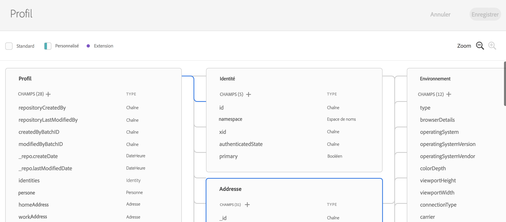

# Présentation d’Experience Data Model {#experience-data-model-overview}

>[!IMPORTANT]
>
>Adobe Experience Platform Data Connector est actuellement en version bêta et peut être fréquemment mis à jour sans préavis. Les clients doivent être hébergés sur Azure (actuellement en version bêta en Amérique du Nord uniquement) pour accéder à ces fonctionnalités. Contactez l&#39;Assistance clientèle d&#39;Adobe si vous souhaitez y accéder.

Experience Data Model (XDM) est un ensemble standard de schémas de données dans lesquels des données peuvent être ingérées afin d’être utilisées avec les solutions et produits Adobe Experience Platform.

La création et la gestion des schémas XDM sont possibles à l’aide d’une API dédiée ou de l’interface utilisateur XDM.

## Espace de travail XDM {#xdm-workspace}

L’espace de travail XDM permet d’afficher, de créer et d’étendre des schémas de données.

Pour accéder à l’interface utilisateur XDM, ouvrez Adobe Experience Platform. Accédez à la fenêtre Modèle de données pour créer ou étendre un schéma XDM.

Consultez la [documentation complète sur l’espace de travail XDM](https://experienceleague.adobe.com/docs/experience-platform/xdm/api/getting-started.html?lang=fr).

## API XDM {#xdm-api}

Vous pouvez effectuer les actions suivantes via l’API de schéma XDM :

* afficher la liste des schémas existants ;
* afficher un schéma spécifique et étendre un schéma existant ;
* ajouter des champs à une extension ;
* créer et mettre à jour un nouveau schéma ;
* afficher des descripteurs de schéma ;
* créer, mettre à jour et supprimer des descripteurs de schéma.

Tous les détails relatifs à la manipulation des appels d’API sont disponibles dans le [Guide du développeur](https://experienceleague.adobe.com/docs/experience-platform/xdm/api/getting-started.html?lang=fr).
