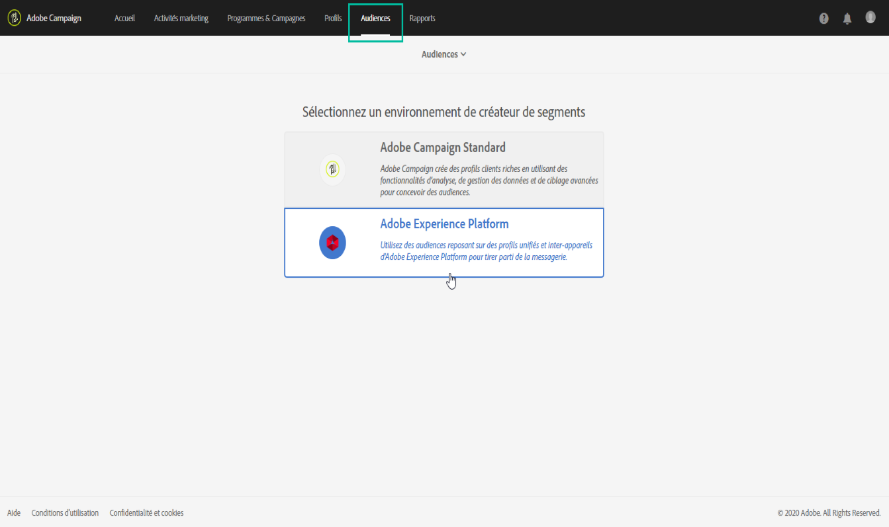
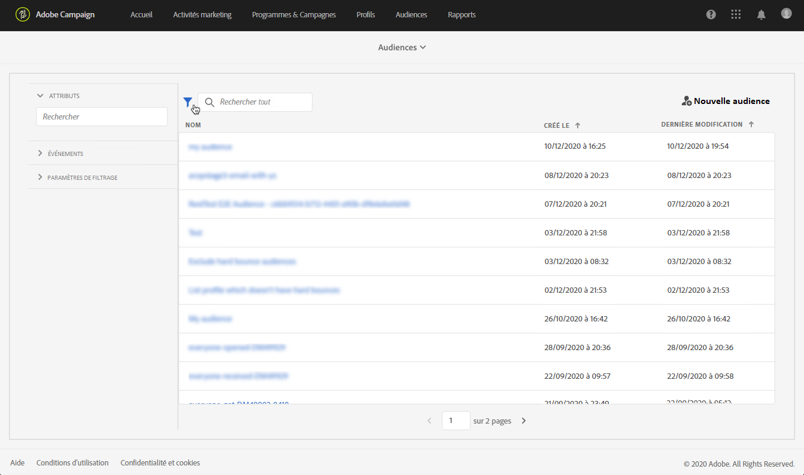
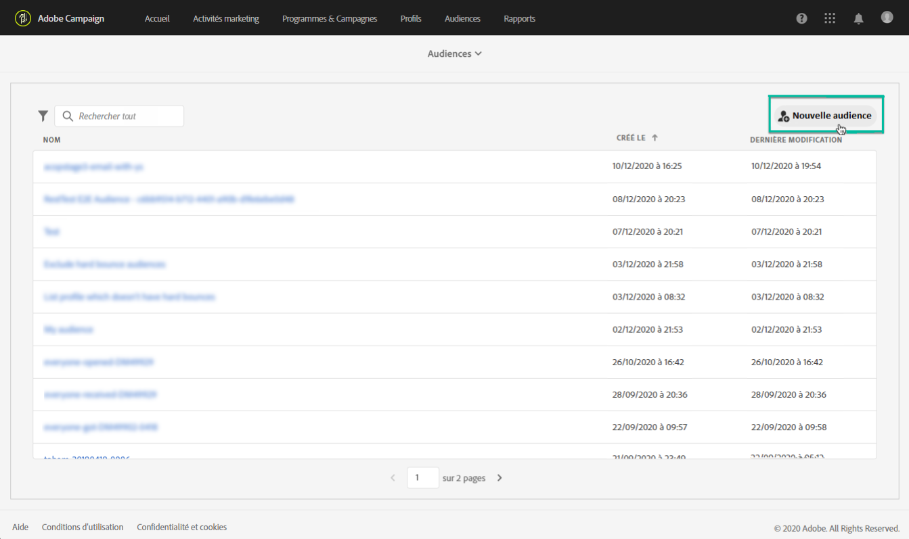
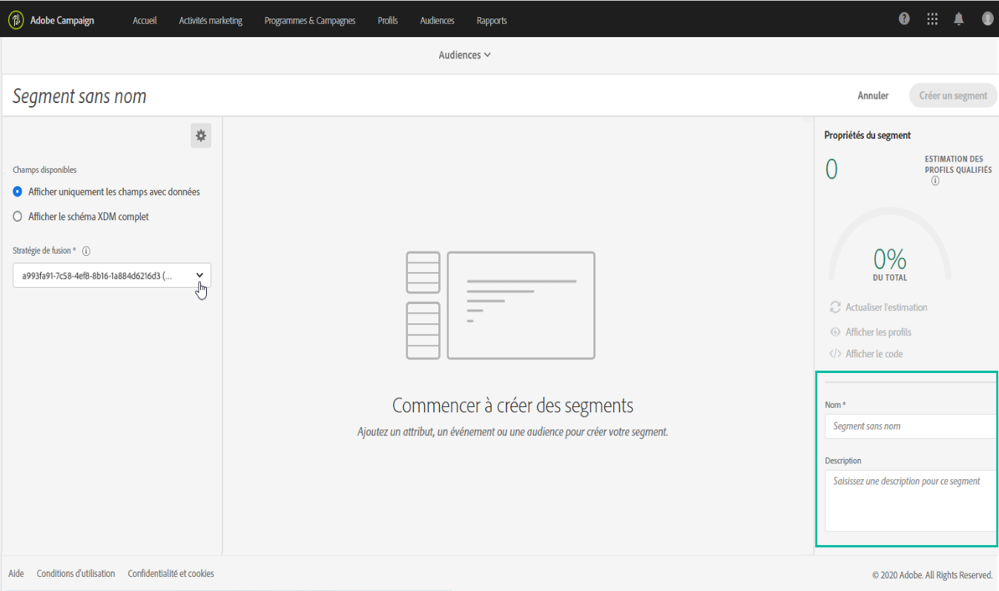
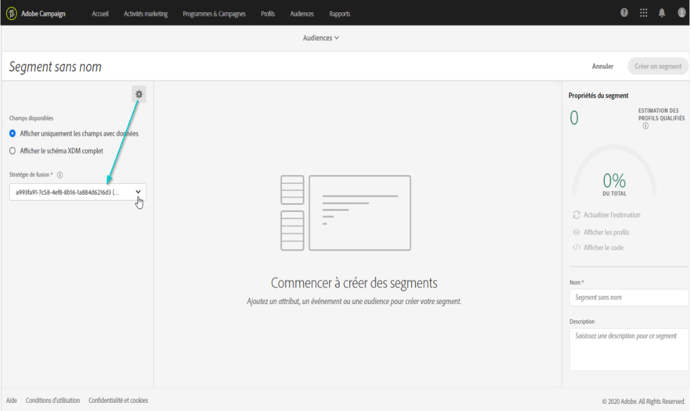
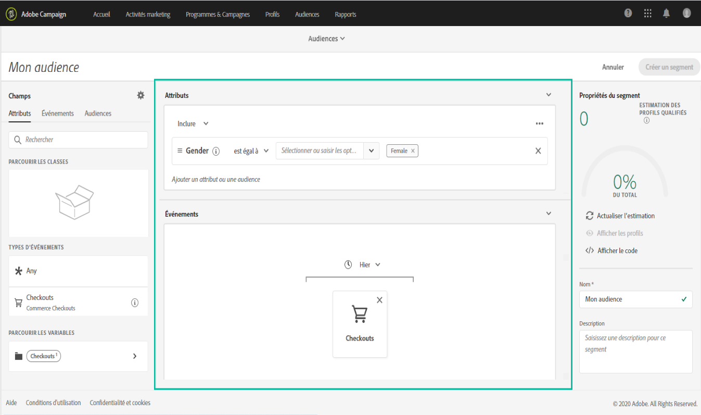
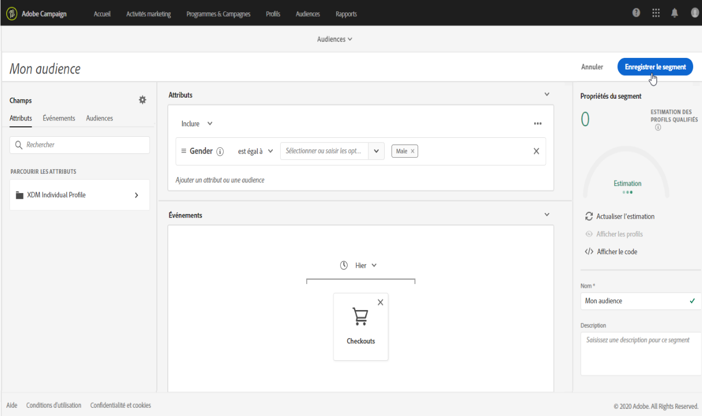

# Gestion des audiences Adobe Experience Platform {#about-audiences}

>[!IMPORTANT]
>
>Le service Audience Destinations est actuellement en version bêta et peut être fréquemment mis à jour sans préavis. Les clients doivent être hébergés sur Azure (actuellement en version bêta en Amérique du Nord uniquement) pour accéder à ces fonctionnalités. Contactez l’Assistance clientèle d’Adobe si vous souhaitez y accéder.

## Accès aux audiences Adobe Experience Platform

Pour accéder au créateur de segments d’Adobe Experience Platform, accédez à la carte **[!UICONTROL Audiences]** sur la page d’accueil de Campaign Standard (ou au lien **[!UICONTROL Audiences]** dans l’en-tête), puis sélectionnez l’environnement **[!UICONTROL Adobe Experience Platform]**.

Vous serez d’abord dirigé vers la page de liste de segments d’Adobe Experience Platform, où vous pourrez accéder aux segments existants de la plateforme Adobe Experience Platform pour les modifier davantage.

Une barre de recherche et un filtre sont disponibles pour vous aider à trouver le segment Adobe Experience Platform souhaité.

## Création d&#39;audiences Adobe Experience Platform

Pour créer une audience Adobe Experience Platform directement dans Campaign Standard, procédez comme suit :

1. Dans la page de liste de segments Adobe Experience Platform, cliquez sur le bouton **[!UICONTROL Nouvelle audience]** situé dans le coin droit.

   

1. Le créateur de segments doit désormais s’afficher dans votre espace de travail. Il vous permet de créer un segment à l’aide des données d’Adobe Experience Platform qui seront éventuellement utilisées pour créer votre audience.

1. Nommez le segment dans le volet de droite et entrez une description (facultatif).

   

1. Pour créer un segment, vous devez sélectionner une **stratégie de fusion** correspondant à votre objectif marketing pour ce segment.

   Dans le volet des paramètres, une stratégie de fusion Platform par défaut est sélectionnée. Pour plus d’informations sur les stratégies de fusion, reportez-vous à la section dédiée du [guide d’utilisation du créateur de segments](https://docs.adobe.com/content/help/fr-FR/experience-platform/segmentation/ui/overview.html).

   

1. Définissez les règles qui identifieront les profils à récupérer dans votre audience.

   Pour ce faire, faites glisser les attributs et/ou les événements de votre choix depuis le volet de gauche vers l’espace de travail, définissez les règles correspondantes, puis cliquez sur le bouton **[!UICONTROL Créer un segment]** pour enregistrer le segment (voir [Utilisation du créateur de segments](../../integrating/using/aep-using-segment-builder.md)).

   

L’audience est désormais prête à être activée. Vous pouvez l’utiliser comme cible pour vos campagnes (voir [Ciblage des audiences Adobe Experience Platform](../../integrating/using/aep-targeting-audiences.md)).

## Modifier une audience

Pour modifier une audience, ouvrez-la et modifiez les règles selon les besoins dans l’interface du créateur de segments (voir la section [Utilisation du créateur de segments](../../integrating/using/aep-using-segment-builder.md)).

Une fois les modifications terminées, cliquez sur le bouton **[!UICONTROL Enregistrer le segment]** pour mettre à jour votre audience.

