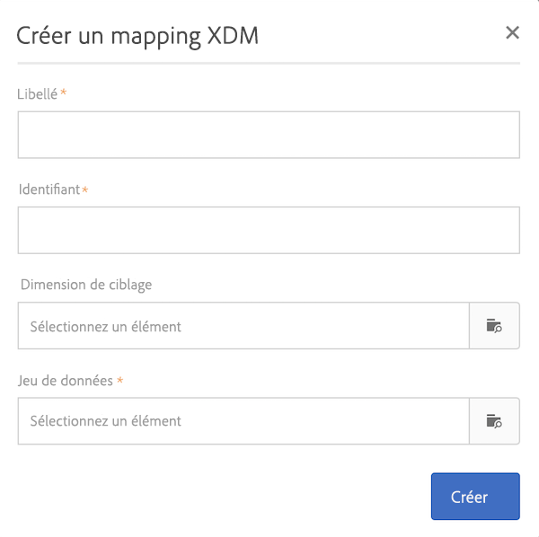
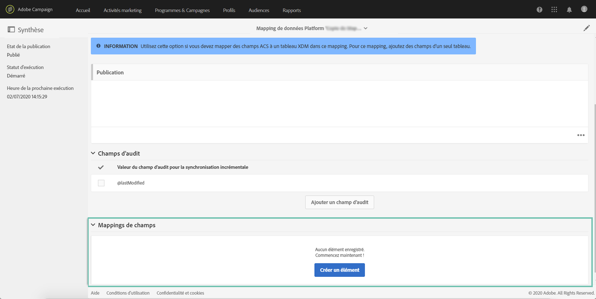
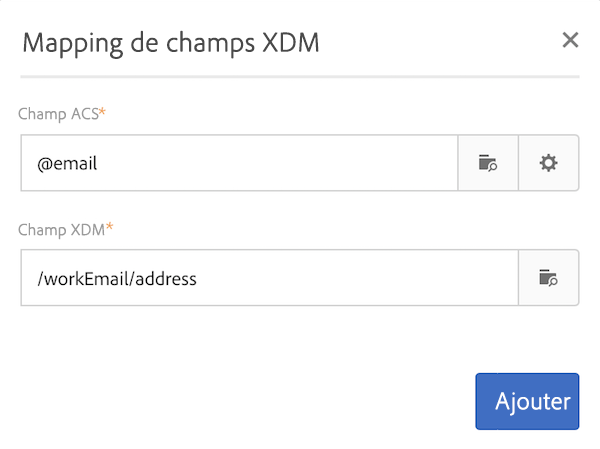
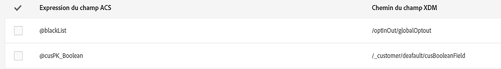
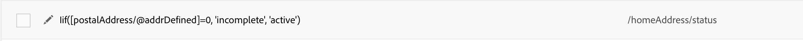
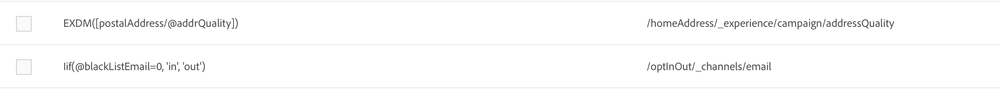
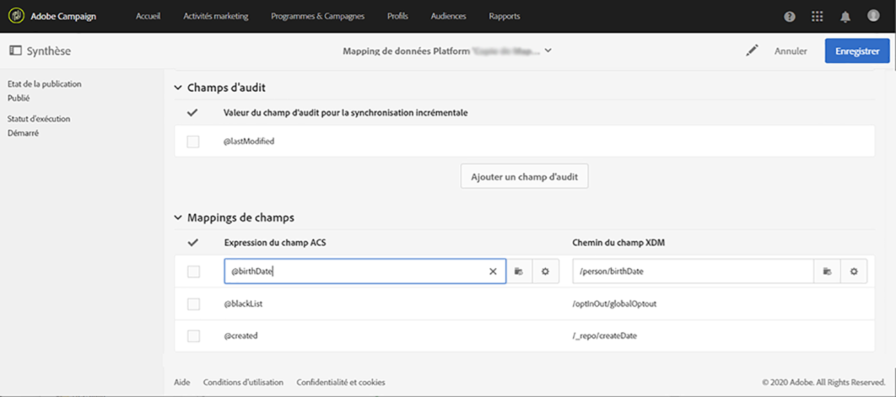

# Définition d’un mapping {#mapping-definition}

>[!IMPORTANT]
>
>Adobe Experience Platform Data Connector est actuellement en version bêta et peut être fréquemment mis à jour sans préavis. Les clients doivent être hébergés sur Azure (actuellement en version bêta en Amérique du Nord uniquement) pour accéder à ces fonctionnalités. Contactez l’Assistance clientèle d’Adobe si vous souhaitez y accéder.

Dans cette section, vous allez découvrir comment mapper un champ Campaign Standard avec un champ XDM (Experience Data Model).

Pour effectuer cette tâche, les prérequis sont les suivants :

* une définition de schéma XDM via l’interface ou en utilisant l’API REST associée à XDM ;
* la création d’un jeu de données en fonction de la définition de schéma XDM.

1. Accédez à **[!UICONTROL Administration]** > **[!UICONTROL Développement]** > **[!UICONTROL Plateforme]** et sélectionnez l’entrée **[!UICONTROL Mappings de données]**.

1. Cliquez sur **[!UICONTROL Créer]** pour commencer un nouveau mapping XDM.

   

1. Renseignez les champs obligatoires et sélectionnez :

   * une **dimension de ciblage** : il s’agit du schéma Campaign Standard à mapper ;
   * un **jeu de données** : il s’agit du package de données associé à un schéma XDM dans Adobe Experience Platform.

>[!NOTE]
>
>Pour qu’un lot soit ingéré dans Real-time Customer Profile ou Identity Service, le jeu de données doit être [activé pour Real-time Customer Profile](https://docs.adobe.com/content/help/fr-FR/experience-platform/rtcdp/intro/get-started.html).
>
>Si le jeu de données sélectionné est déjà utilisé dans un mapping de données existant, un avertissement s’affiche pour vous informer que vos données peuvent être remplacées dans Adobe Experience Platform. Cette situation peut se produire lorsqu’il existe des destinataires communs dans les mappings de données utilisant un même jeu de données.

L’écran ci-dessous présente la section **[!UICONTROL Mappings de champs]** dans laquelle vous pouvez créer un mapping pour chaque champ du schéma Campaign Standard.

Le bouton **[!UICONTROL Créer un mapping de champs]** permet de sélectionner le champ Campaign Standard et l’expression de chemin de champ correspondante dans le schéma XDM.

Si vous ne parvenez pas à trouver un champ Campaign Standard, vous pouvez utiliser le champ de recherche pour le rechercher. Actuellement, la recherche ne fonctionne que pour les champs ouverts dans la hiérarchie.

Les ressources étendues définies dans Campaign Standard sont mappées comme tous les champs natifs. Elles sont définies dans l’extension _customer/default dans XDM.

Vous pouvez personnaliser l’extension XDM via l’API et définir votre propre extension pour mieux contrôler le mapping.

Voir le [tutoriel relatif à l’API Schema Registry](https://docs.adobe.com/content/help/fr-FR/experience-platform/xdm/api/getting-started.html) pour en savoir plus.

Pour mapper un champ d’énumération, vous devez utiliser l’éditeur d’expression afin de définir chaque valeur d’énumération correspondant à la valeur XDM. Par exemple, postalAdressfield doit être défini comme suit :

Si la valeur XDM est définie sous la forme d’une énumération dans le schéma XDM, vous pouvez utiliser la fonction EXDM native qui remplacera automatiquement la syntaxe **lif**.

Pour éditer un mapping XDM, ouvrez-le, modifiez les informations souhaitées, puis enregistrez-le.

>[!IMPORTANT]
>
>Pour l’instant, si vous éditez une valeur dans la section **[!UICONTROL Mappings de champs]** et que vous cliquez ensuite en dehors du champ, la modification ne s’affiche pas dans l’interface tant que vous n’avez pas cliqué sur le bouton **[!UICONTROL Enregistrer]**. Ce comportement ne se produit qu’une fois, lorsque la modification des **[!UICONTROL mappings de champ]** est la première de la page.
