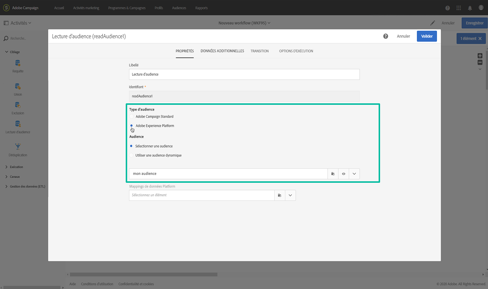
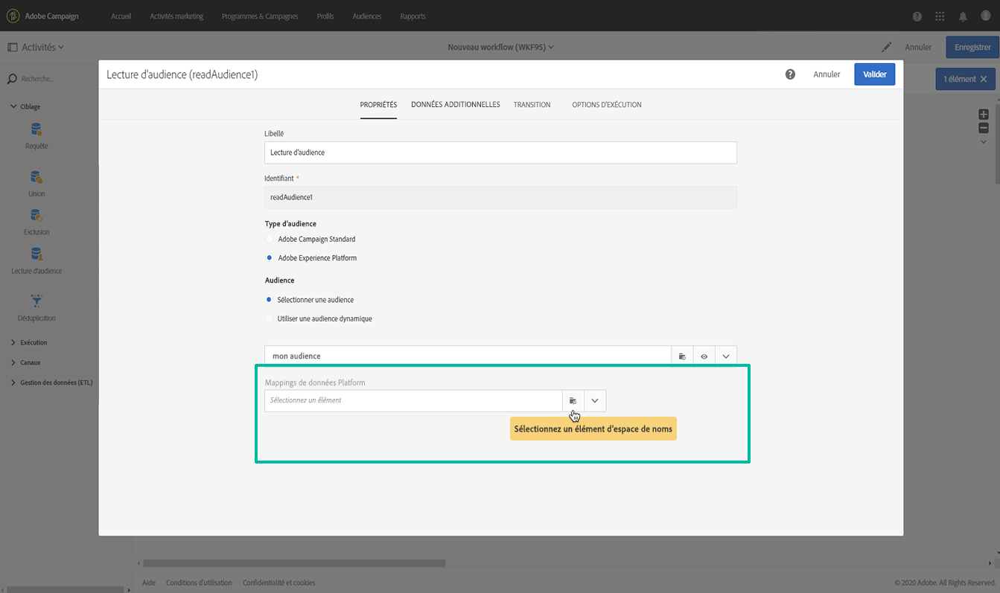
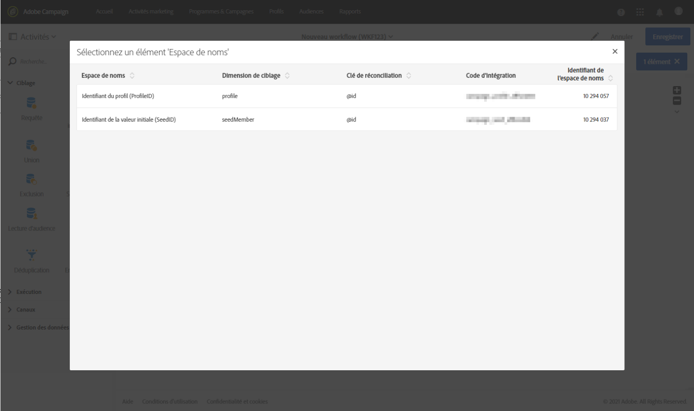
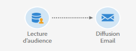

# Ciblage des audiences Adobe Experience Platform {#targeting-aep-audiences}

>[!IMPORTANT]
>
>Le service Audience Destinations est actuellement en version bêta et peut être fréquemment mis à jour sans préavis. Les clients doivent être hébergés sur Azure (actuellement en version bêta en Amérique du Nord uniquement) pour accéder à ces fonctionnalités. Contactez l’Assistance clientèle d’Adobe si vous souhaitez y accéder.

Une fois l’[audience Adobe Experience Platform](../../integrating/using/aep-about-audience-destinations-service.md) créée à l’aide du créateur de segments, vous pouvez l’utiliser de la même manière qu’une audience Campaign dans les workflows pour personnaliser et envoyer des messages.

Pour activer une audience Adobe Experience Platform dans vos workflows, procédez comme suit :

1. Ajoutez une activité **[!UICONTROL Lecture d’audience]** dans le workflow, puis ouvrez-la.

1. Sélectionnez l’option **[!UICONTROL Adobe Experience Platform]** sous **[!UICONTROL Type d’audience]**, puis ajoutez l’audience de votre choix.

   

1. (Facultatif) Une fois l’audience sélectionnée, vous pouvez cliquer sur le bouton en forme d’œil pour vérifier et/ou éditer la définition du segment (veillez à enregistrer à nouveau les modifications).

   En cliquant sur le bouton en forme d’œil, vous accédez simplement au créateur de segments (dans un autre onglet) associé à l’audience sélectionnée dans Campaign.

1. Sélectionnez un élément **[!UICONTROL Mapping de données Platform]** pour spécifier la dimension de ciblage souhaitée pour l’audience Adobe Experience Platform sélectionnée.

   Par défaut, la clé primaire (par exemple, iRecipientID pour la table Profil, iAppSubscriptionID pour la table AppSubscription) utilisée pour la réconciliation sera automatiquement disponible dans la liste déroulante. Pour effectuer un ciblage en dehors de la clé primaire, vous devez créer un **espace de noms** personnalisé.

   >[!NOTE]
   >
   >Pour les cibles en dehors de la clé primaire, vous devez également créer un mapping de ciblage personnalisé correspondant à l’espace de noms personnalisé. Pour plus d’informations sur le mapping de ciblage, consultez [cette section](../../administration/using/target-mappings-in-campaign.md).

   

   Cette liste contient tous les mappings XDM (Experience Data Model) configurés sur votre instance. Pour plus d’informations sur Adobe Experience Platform Data Connector, reportez-vous à [ce document dédié](../../integrating/using/aep-about-data-connector.md).

   

1. Une fois l’audience et les dimensions de ciblage correctement configurées, cliquez sur le bouton **[!UICONTROL Confirmer]** pour enregistrer les modifications.

Vous pouvez maintenant configurer le workflow avec d’autres activités. Vous pouvez, par exemple, lier une activité **[!UICONTROL Diffusion Email]** pour envoyer un email à l’audience sélectionnée.

>[!NOTE]
>
>Campaign Standard permet de cibler les audiences Adobe Experience Platform dans tous les canaux de diffusion : emails, SMS, courrier, notifications push et messages In-App.
>
>*Remarque : pour tous les messages push et In-App, Campaign Standard ne prend en charge les diffusions que pour les profils connus.

Pour plus d’informations sur l’utilisation des workflows et des diffusions, reportez-vous aux sections suivantes :

* [Présentation des workflows](../../automating/using/get-started-workflows.md)
* [Construire un workflow](../../automating/using/building-a-workflow.md)
* [Découvrir les canaux de communication](../../channels/using/get-started-communication-channels.md)
* [A propos des activités des canaux](../../automating/using/about-channel-activities.md)
