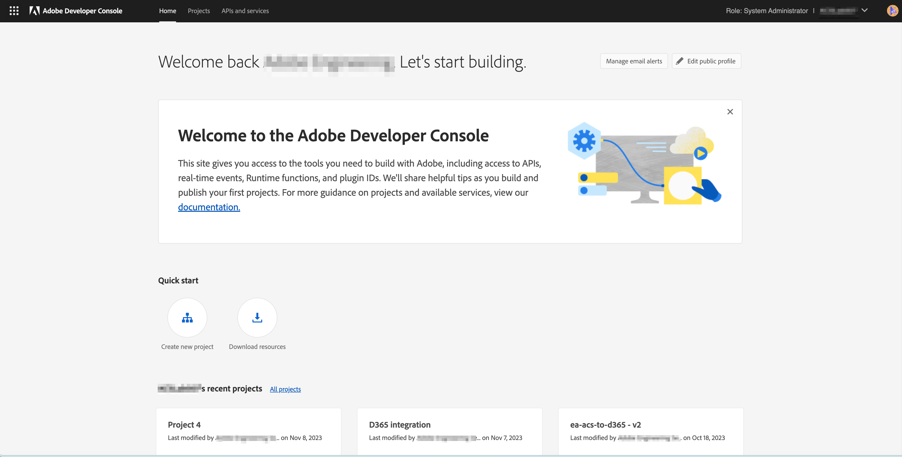

# Configuration de l’intégration d’Adobe IO pour Microsoft Dynamics 365

Activez vos données CRM lors de la communication cross-canal : découvrez les étapes requises lors de la configuration préalable à l’intégration pour créer un projet Adobe IO et le configurer pour l’intégration de Microsoft Dynamics 365.

## Présentation

 L’intégration Adobe Campaign Standard - Microsoft Dynamics 365 est décrite dans [cette page](../../integrating/using/working-with-campaign-standard-and-microsoft-dynamics-365.md).

Avant d’exécuter la configuration préalable à l’intégration décrite dans cet article, il est supposé que vous avez déjà été approvisionné et que vous disposez d’un accès administrateur à l’instance Campaign Standard de votre organisation.  Si ce n’est pas le cas, vous devrez contacter le service clientèle d’Adobe pour terminer l’approvisionnement de Campaign.

>[!CAUTION]
>
>Les étapes décrites ci-dessous doivent être exécutées par un administrateur.

## Configuration 

Vous devez créer un projet Adobe IO et le configurer pour l’intégration.

### Créer un projet

Pour ce faire, procédez comme suit :

1. Accédez à la [console d’Adobe IO](https://console.adobe.io/home#) et sélectionnez votre ID d’organisation Adobe IMS dans le menu déroulant de la partie supérieure droite de l’écran.

1. Cliquez ensuite sur **[!UICONTROL Créer un projet]** sous **[!UICONTROL Démarrage rapide]**.

   

1. Sous **[!UICONTROL Commencer votre projet]**, cliquez sur **[!UICONTROL Ajouter l’API]**.

   

1. Sélectionnez l’API Adobe Campaign (vous devrez peut-être faire défiler l’écran vers le bas) et cliquez sur **[!UICONTROL Suivant]**.

   

1. Sur l’écran suivant, vous aurez la possibilité de télécharger votre propre clé publique ou de laisser Adobe IO générer la paire de clés pour vous. Ces instructions suivront la deuxième option. Si vous décidez de laisser Adobe IO générer la paire de clés, cliquez sur l’option 1 ; cliquez ensuite sur le bouton **[!UICONTROL Générer la paire de clés]**.

   

1. Sur l’écran suivant, vous serez invité à attribuer un nom et à sélectionner l’emplacement de téléchargement du fichier zip de la paire de clés.

Une fois le fichier téléchargé, vous pouvez le décompresser pour afficher les clés publique et privée. Adobe IO aura déjà appliqué la clé publique à votre projet Adobe IO. Vous devrez conserver votre clé privée pour plus tard ; elle sera utilisée lors de la configuration préalable à l’intégration de l’outil d’intégration.

1. Cliquez sur **[!UICONTROL Suivant]** pour continuer

   

1. Sur l’écran suivant, vous devez sélectionner les profils de produits à associer à ce projet. Sélectionnez le profil de produits contenu dans le titre : Identifiant du tenant de votre instance Campaign - [!UICONTROL Administrateurs]

   Exemple : Campaign Standard - votre-identifiantdutenant-campaign - Administrateurs

1. Cliquez sur **[!UICONTROL Enregistrer l’API configurée]**.

   

1. Dans l’écran suivant, vous pouvez voir les détails de votre nouveau projet Adobe IO. Cliquez sur **[!UICONTROL Ajouter au projet]** dans la partie supérieure gauche de l’écran et sélectionnez **API** dans la liste déroulante.

   

1. Sur l’écran suivant, vous devez sélectionner l’API des événements I/O, puis cliquer sur **[!UICONTROL Suivant]**.

1. Sur l’écran suivant, cliquez sur **[!UICONTROL Enregistrer l’API configurée]**.  Vous serez redirigé vers l’écran des détails du projet.

1. Cliquez maintenant sur **[!UICONTROL Ajouter au projet]** dans la partie supérieure gauche de l’écran et sélectionnez **API** dans la liste déroulante, comme vous l’avez fait précédemment.

1. Sur l’écran suivant, vous devez sélectionner l’API de gestion I/O, puis cliquer sur **[!UICONTROL Suivant]**.

1. Sur l’écran suivant, cliquez sur **[!UICONTROL Enregistrer l’API configurée]**.

La configuration préalable à l’intégration dans Campaign est maintenant terminée.  Passez à la [configuration préalable à l’intégration pour Microsoft Dynamics 365](../../integrating/using/configure-microsoft-dynamics-365-for-campaign-integration.md).

**Rubriques connexes**

* [Adobe IO - Intégration de compte de service](https://www.adobe.io/authentication/auth-methods.html#!AdobeDocs/adobeio-auth/master/AuthenticationOverview/ServiceAccountIntegration.md)
* [Campaign Standard - Configuration de l’accès à l’API](../../api/using/setting-up-api-access.md)
* [Campaign Standard - Intégration de Dynamics 365](../../integrating/using/configure-microsoft-dynamics-365-for-campaign-integration.md)