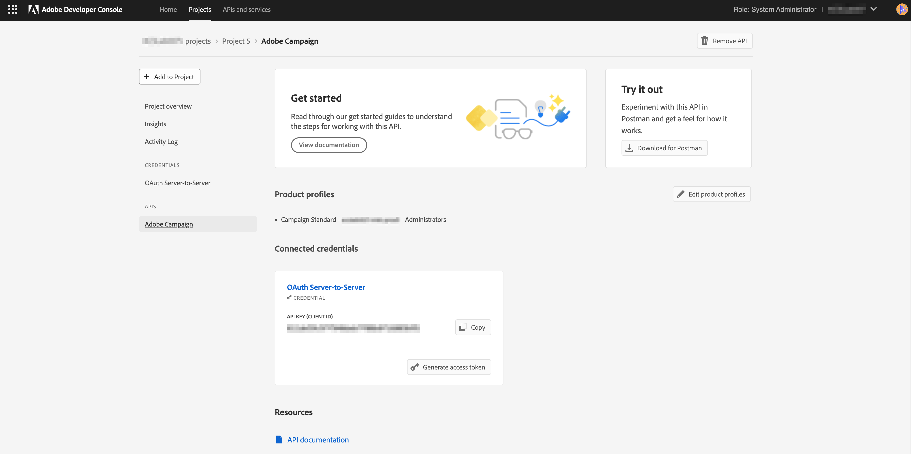

# Configuration de l’intégration d’Adobe IO pour Microsoft Dynamics 365

Activez vos données de gestion de la relation client lors de la communication entre canaux : découvrez les étapes requises lors de la configuration préalable à l&#39;intégration pour créer un projet d&#39;E/S d&#39;Adobe et le configurer pour l&#39;intégration Microsoft Dynamics 365.

## Présentation

 Adobe Campaign Standard - L&#39;intégration de Microsoft Dynamics 365 est décrite dans [cette page](../../integrating/using/working-with-campaign-standard-and-microsoft-dynamics-365.md).

Avant d’effectuer la configuration de pré-intégration dans cet article, on suppose que vous avez déjà été configuré et que vous disposez d’un accès administrateur à l’instance de Campaign Standard de votre organisation.  Si ce n’est pas le cas, vous devrez contacter le service clientèle d’Adobe pour terminer l’approvisionnement de Campaign.

>[!CAUTION]
>
>Les étapes décrites ci-dessous doivent être exécutées par un administrateur.

## Configuration 

Vous devez créer un nouveau projet d&#39;E/S d&#39;Adobe et le configurer pour l&#39;intégration.

### Créer un projet

Pour ce faire, procédez comme suit :

1. Navigate to [Adobe IO Console](https://console.adobe.io/home#) and select your Adobe IMS Organization ID from the drop-down menu at the top right of the screen.

1. Cliquez ensuite sur **[!UICONTROL Créer un nouveau projet]** sous Début **** rapide.

1. Sous **[!UICONTROL Commencer avec votre nouveau projet]**, cliquez sur **[!UICONTROL Ajouter l&#39;API]**.

1. Sélectionnez l&#39;API Adobe Campaign (vous devrez peut-être faire défiler l&#39;écran vers le bas) et cliquez sur &quot;Suivant&quot;.

1. Dans l&#39;écran suivant, vous aurez la possibilité de télécharger votre propre clé publique ou de laisser l&#39;Adobe E/S générer la paire de clés pour vous. Ces instructions suivront la dernière option. Si vous décidez de laisser l&#39;Adobe E/S générer la paire de clés, cliquez sur l&#39;option 1 ; Cliquez ensuite sur le bouton &quot;Générer la paire de clés&quot;.

1. Dans l’écran suivant, vous serez invité à nommer et à sélectionner l’emplacement de téléchargement du fichier zip de paire de clés.

Une fois le fichier téléchargé, vous pouvez le décompresser pour afficher les clés publique et privée. adobe IO a déjà appliqué la clé publique à votre projet d&#39;E/S Adobe. Vous devrez conserver votre clé privée pour plus tard ; la clé privée sera utilisée lors de la configuration préalable à l&#39;intégration de l&#39;outil d&#39;intégration.

1. Cliquez sur &quot;Suivant&quot; pour continuer

1. Dans l&#39;écran suivant, vous allez sélectionner les profils de produits à associer à ce projet.

1. Sélectionnez le profil de produits qui contient le titre : ID de client de votre instance Campaign - [!UICONTROL Administrateurs] - Exemple : Campaign Standard - votre-campaign-locataireID - Administrateurs

1. Cliquez sur [!UICONTROL Enregistrer l&#39;API]configurée.

1. Dans l&#39;écran suivant, vous verrez les détails de votre nouveau projet d&#39;E/S d&#39;Adobe.

1. Cliquez sur &quot;Ajouter au projet&quot; en haut à gauche de l&#39;écran et sélectionnez &quot;API&quot; dans la liste déroulante.

1. Dans l&#39;écran suivant, vous devrez sélectionner l&#39;API Événements d&#39;E/S, puis cliquer sur &quot;Suivant&quot;.

1. Dans l’écran suivant, cliquez sur &quot;Enregistrer l’API configurée&quot;.  Vous serez ramené à l’écran des détails du projet.

1. Cliquez maintenant sur &quot;Ajouter au projet&quot; en haut à gauche de l&#39;écran et sélectionnez &quot;API&quot; dans la liste déroulante, comme vous l&#39;avez fait précédemment.

1. Dans l&#39;écran suivant, vous devrez sélectionner l&#39;API de gestion des E/S et cliquer sur &quot;Suivant&quot;.

1. Dans l’écran suivant, cliquez sur &quot;Enregistrer l’API configurée&quot;.

La configuration préalable à l’intégration dans Campaign est maintenant terminée.  Passez à la configuration de [pré-intégration pour Microsoft Dynamics 365](../../integrating/using/configure-microsoft-dynamics-365-for-campaign-integration.md).

**Rubriques connexes**

* [Adobe IO - Intégration de compte de service](https://www.adobe.io/authentication/auth-methods.html#!AdobeDocs/adobeio-auth/master/AuthenticationOverview/ServiceAccountIntegration.md)
* [Campaign Standard - Configuration de l’accès à l’API](../../api/using/setting-up-api-access.md)
* [Campaign Standard - Intégration de Dynamics 365](../../integrating/using/configure-microsoft-dynamics-365-for-campaign-integration.md)