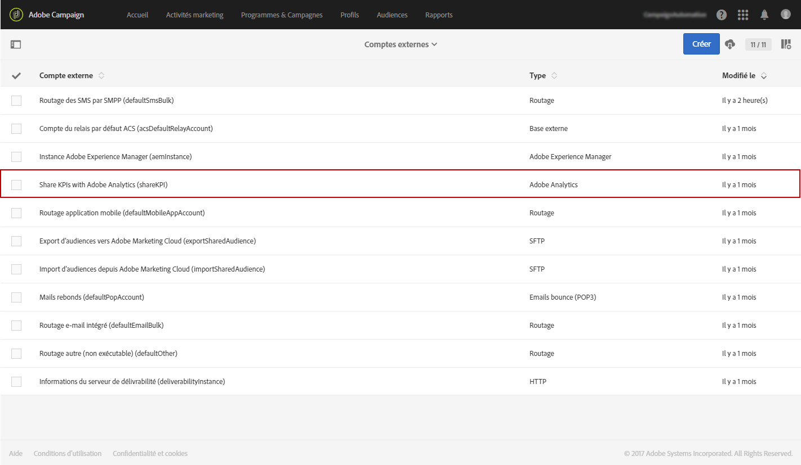
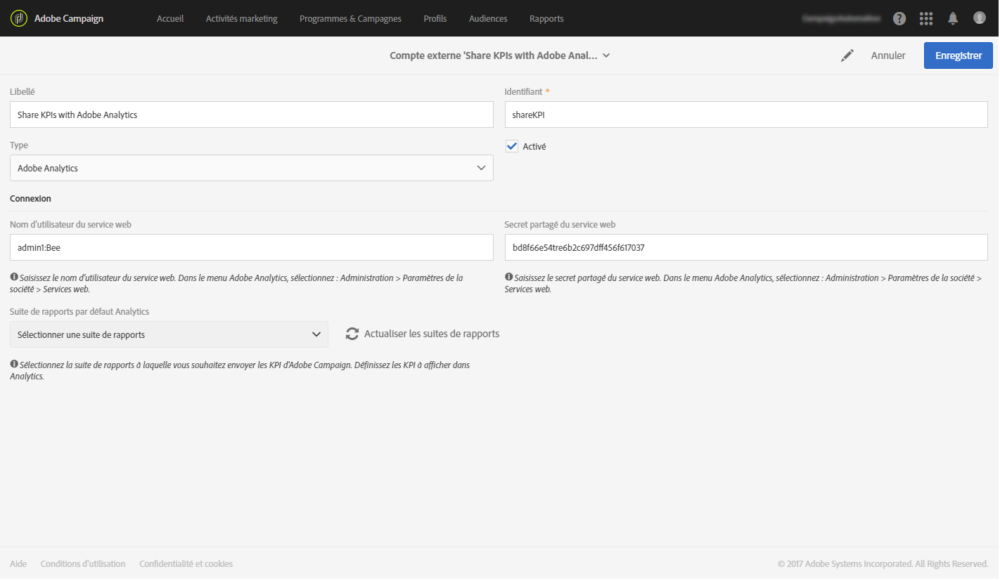
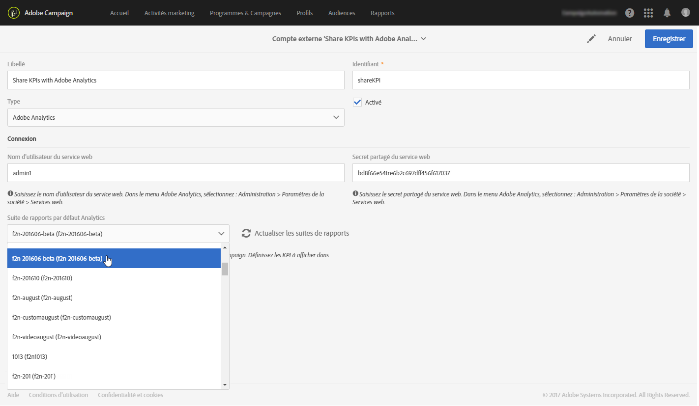
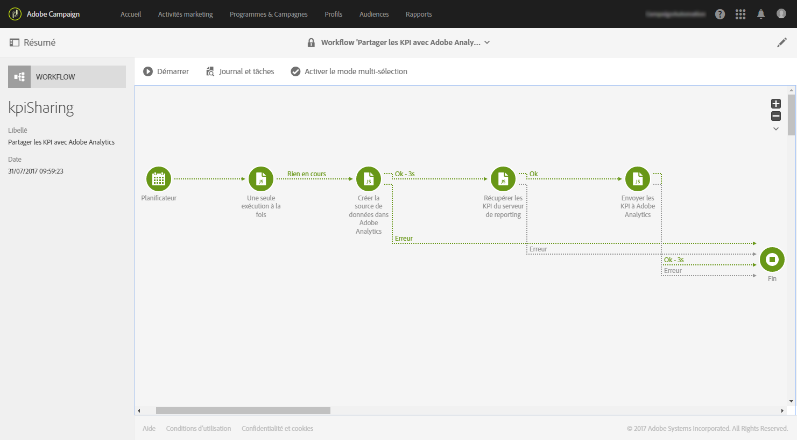

# Configurer l&#39;intégration Campaign-Analytics{#configure-campaign-analytics-integration}

Cette intégration vous permet de partager vos données de KPI (Key Performance Indicator) directement d&#39;Adobe Campaign vers Adobe Analytics Standard ou Premium.

Pour commencer l&#39;intégration entre Adobe Campaign Standard et Adobe Analytics, vous devez d&#39;abord configurer le compte externe associé à Adobe Analytics.

Les comptes externes et les workflows techniques peuvent uniquement être gérés par l&#39;administrateur fonctionnel de la plate-forme.

1. Dans le menu avancé, via le logo Adobe Campaign, sélectionnez **[!UICONTROL Administration > Paramétrage de l&#39;application > Comptes externes]**.
1. Sélectionnez le compte externe **[!UICONTROL Partager les KPI avec Adobe Analytics]**.

   

1. Renseignez le **[!UICONTROL Nom d&#39;utilisateur du service Web]** et le **[!UICONTROL Secret partagé du service Web]** dans le champ **[!UICONTROL Connexion]**.

   Ces paramètres sont accessibles dans Analytics en sélectionnant **[!UICONTROL Admin > Paramètres de la société > Services Web]**.

   

1. Cliquez sur le bouton **[!UICONTROL Actualiser les suites de rapports]**.
1. Dans la liste déroulante **[!UICONTROL Suite de rapports par défaut Analytics]**, sélectionnez la suite de rapports Adobe Analytics que vous souhaitez enrichir avec les données Adobe Campaign.

   Votre compte externe est maintenant prêt et associé à Adobe Analytics. Vous pouvez le désactiver à tout moment en cochant la case **[!UICONTROL Activé]**.

   

Le workflow technique **[!UICONTROL Partager les KPI avec Adobe Analytics]** va maintenant être lancé automatiquement. Il est consultable depuis le menu avancé en sélectionnant **[!UICONTROL Administration > Paramétrage de l&#39;application > Workflow]**. Ce workflow technique s&#39;exécutera automatiquement toutes les 15 minutes et transférera jusqu&#39;à 6 mois de données à Adobe Analytics.

Vos données sont à présent disponibles dans Adobe Analytics.

**Rubriques connexes :**

* [Comptes externes](../../administration/using/external-accounts.md)
* [Workflows techniques](../../administration/using/technical-workflows.md)
* Vidéo [Partager les KPI pour le reporting intégré de Campaign](https://helpx.adobe.com/fr/marketing-cloud/how-to/email-marketing.html)

