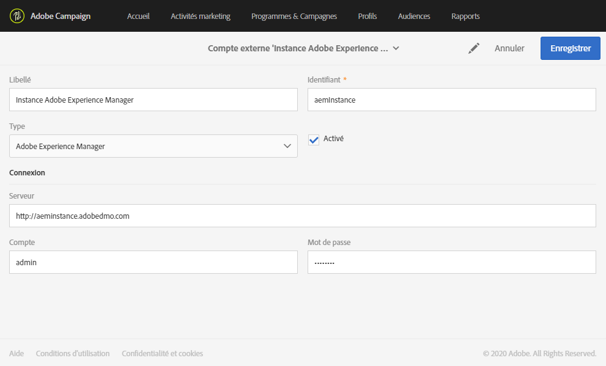
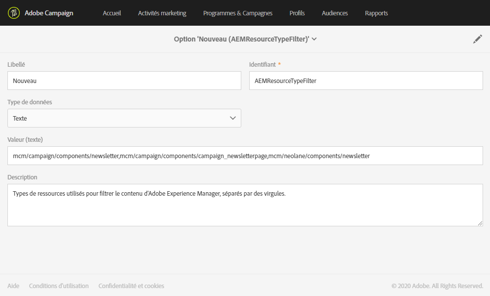
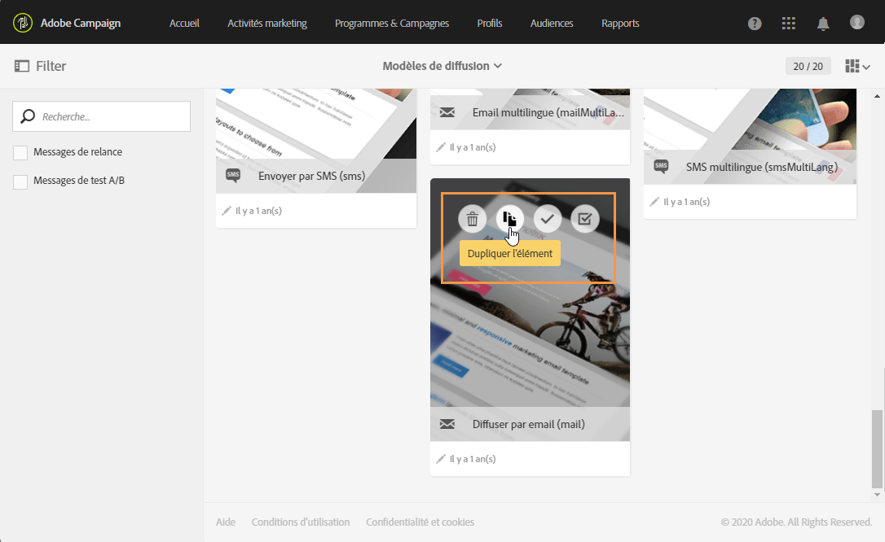
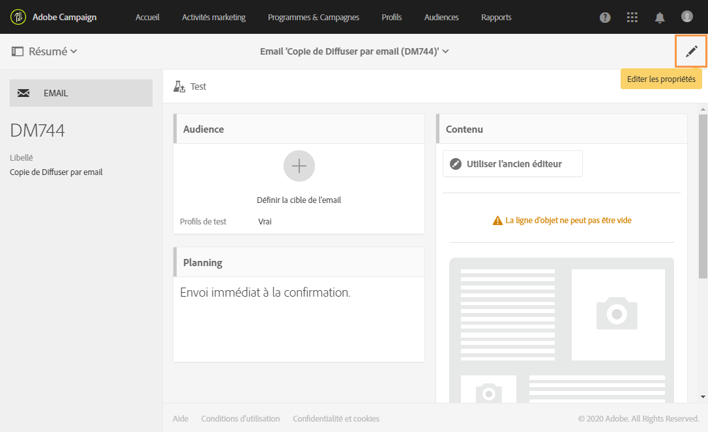

# Configuration de l’intégration Campaign-Experience Manager {#configuration-aem}

Cette intégration entre Adobe Campaign Standard et Experience Manager vous permet d&#39;utiliser du contenu créé dans Adobe Experience Manager dans vos emails Adobe Campaign.

À travers ce cas pratique vous apprendrez à créer et gérer des contenus d’email dans Adobe Experience Manager, puis à les utiliser pour vos campagnes marketing en les important dans vos emails Adobe Campaign Standard.

## Prérequis {#prerequisites}

Vous devez au préalable posséder les éléments suivants :

* Une instance Adobe Experience Manager de création (également appelée **authoring**).
* Une instance Adobe Experience Manager de publication (également appelée **publishing**).
* Une instance Adobe Campaign

## Configuration dans Adobe Campaign Standard {#config-acs}

Afin de pouvoir utiliser conjointement ces deux solutions, vous devez les paramétrer pour les connecter l&#39;une à l&#39;autre.
Les étapes de configuration d&#39;Adobe Campaign sont les suivants :

1. Vous devez d’abord configurer le compte externe de l’**[!UICONTROL instance Adobe Experience Manager]** sous **[!UICONTROL Administration]** > **[!UICONTROL Paramètres de l’application]** > **[!UICONTROL Comptes externes]**.

1. Configurez le compte externe de type Adobe Experience Manager avec l’URL de votre **[!UICONTROL serveur]** , le **[!UICONTROL compte]** et le **[!UICONTROL mot de passe]**.

   

1. Vérifiez que l’option **[!UICONTROL AEMResourceTypeFilter]** a été correctement configurée. Accédez au menu **[!UICONTROL Options]** sous **[!UICONTROL Administration]** > **[!UICONTROL Paramètres de l’application]** > **[!UICONTROL Options]**.

1. Dans le champ **[!UICONTROL Valeur (texte)]**, vérifiez que la syntaxe suivante est correcte :

   ```
   mcm/campaign/components/newsletter,mcm/campaign/components/campaign_newsletterpage,mcm/neolane/components/newsletter
   ```

   

1. Ensuite, dans le menu avancé sous **[!UICONTROL Ressources]** > **[!UICONTROL Modèles]** > **[!UICONTROL Modèles de diffusion]**, dupliquez l’un des modèles existants pour créer un modèle d’email spécifique à Adobe Experience Manager.

   

1. Cliquez sur l’icône **[!UICONTROL Editer les propriétés]**.

   

1. Dans la liste déroulante **[!UICONTROL Contenu]**, sélectionnez **[!UICONTROL Adobe Experience Manager]** dans le champ **[!UICONTROL Source de contenu]**, puis votre compte externe créé précédemment dans le **[!UICONTROL compte Adobe Experience Manager]**.

Vous devez maintenant configurer l’intégration dans Adobe Experience Manager.

## Configuration dans Adobe Experience Manager {#config-aem}

Pour configurer Adobe Experience Manager avec Adobe Campaign Standard, procédez comme suit :

1. Vous devez d’abord configurer la réplication entre les instances de création et de publication d’Adobe Experience Manager. Consultez cette [section](https://docs.adobe.com/content/help/fr/experience-manager-65/administering/integration/campaignstandard.html#configuring-adobe-experience-manager).

1. Ensuite, connectez Adobe Experience Manager à Adobe Campaign en configurant un **[!UICONTROL Cloud Service]** dédié. Consultez cette [section](https://docs.adobe.com/content/help/fr/experience-manager-65/administering/integration/campaignstandard.html#connecting-aem-to-adobe-campaign).

1. Vous devez maintenant configurer l’externalisateur dans Adobe Experience Manager sur votre instance d’auteur. Consultez cette [section](https://docs.adobe.com/content/help/fr/experience-manager-65/administering/integration/campaignstandard.html#configuring-the-externalizer).

